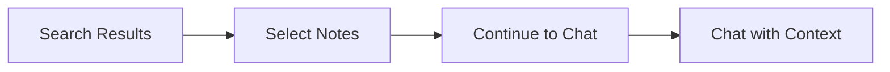

# API Changelog: Quick Reference System & Semantic Search Enhancement

**Version**: 1.5.0  
**Date**: 2026-01-03  
**Type**: Feature Addition + Enhancement

---

## Overview

This release introduces:
- **Semantic Search → Chatbot Export Flow** — Continue search results into chatbot
- **Explicit Reference System** — `@notes:` and `[[title]]` syntax support
- **Relevance Filtering Fix** — Semantic search uses config-based threshold
- **Namespace Separation** — Isolated orchestration for search and chatbot

---

## New Features

### 1. Export to Chatbot Flow

Users can now perform semantic search, select relevant results (max 5), and "continue" to chatbot with pre-loaded context.



### 2. Reference Syntax

| Syntax | Example | Behavior |
|--------|---------|----------|
| `@notes:uuid` | `@notes:abc-123` | Direct ID lookup |
| `@notes:"title"` | `@notes:"Meeting"` | Title fuzzy match |
| `[[title]]` | `[[Meeting Notes]]` | Power user syntax |
| Multiple | `@notes:a [[B]]` | Multi-reference (max 5) |

### 3. Improved Semantic Search Relevance

Semantic search now reads `rag_similarity_threshold` from `ai_configurations` table instead of hardcoded value.

| Setting | Before | After |
|---------|--------|-------|
| Threshold | 0.35 (hardcoded) | Config-based (default 0.5) |
| Irrelevant results | Common | Filtered |

---

## API Changes

### Modified: Send Chat

**Request** (enhanced):
```json
{
  "chat_session_id": "uuid",
  "chat": "Summarize these",
  "references": [
    {"note_id": "uuid", "source_type": "export"}
  ]
}
```

**Response** (enhanced):
```json
{
  "mode": "explicit_rag",
  "resolved_references": [
    {"note_id": "uuid", "title": "Note Title", "resolved": true}
  ]
}
```

### Modified: Semantic Search

**Response** (add score):
```json
{
  "data": [
    {
      "id": "uuid",
      "title": "...",
      "relevance_score": 0.89,
      "search_type": "semantic"
    }
  ]
}
```

---

## Architecture: Namespace Separation

| Namespace | Responsibility |
|-----------|---------------|
| **Semantic Search** | Query, filter, rank results |
| **Chatbot** | Session, RAG, generation |
| **Shared Contract** | DTOs for communication |

---

## Files Changed

### New Files
- `pkg/ai/router/reference_parser.go`
- `pkg/ai/router/reference_resolver.go`
- `pkg/rag/executor/explicit_pipeline.go`
- `internal/dto/export_dto.go`

### Modified Files
- `internal/service/note_service.go` — Config-based threshold
- `internal/dto/note_dto.go` — Add `relevance_score`
- `internal/dto/chatbot_dto.go` — Add `references` input
- `pkg/ai/router/router.go` — Handle pre-resolved refs
- `internal/service/chatbot_service.go` — Wire resolver

---

## Breaking Changes

**None** — All changes are additive.

---

## Configuration

Update `ai_configurations` to tune relevance:

```sql
UPDATE ai_configurations 
SET value = '0.5' 
WHERE key = 'rag_similarity_threshold';
```
