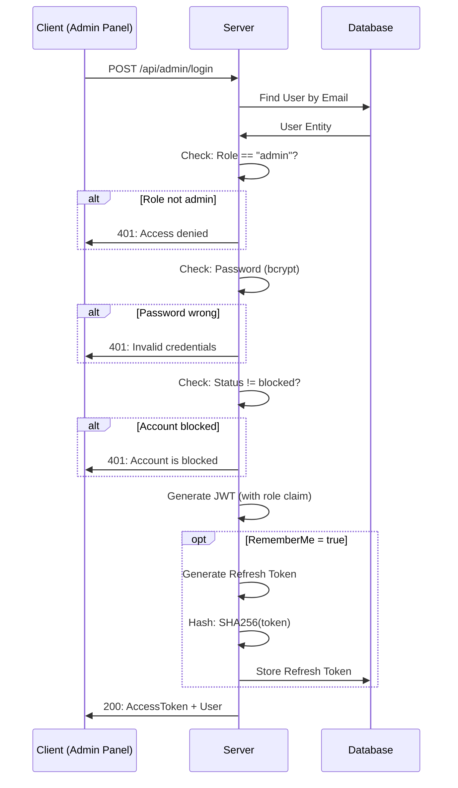
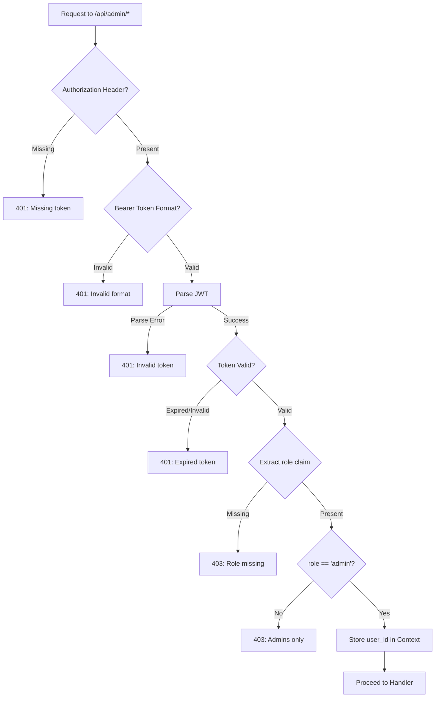

# Dokumentasi Fitur: Admin Authentication

> **Fokus Domain:** BACKEND  
> **Konteks:** Trace Upstream ke Downstream secara Semantik  
> **Scope:** Autentikasi khusus admin dengan role-based access control

---

## Alur Data Semantik (Scope: BACKEND)

```
=== ADMIN LOGIN ===
[HTTP POST /api/admin/login]  
    -> [Controller: Parse LoginRequest]  
    -> [Service: LoginAdmin]  
        -> [Repository: Find User by Email]  
        -> [Validate: Role == "admin"]  
        -> [Validate: Password (bcrypt)]  
        -> [Validate: Status != blocked]  
        -> [Generate: JWT with role claim]  
        -> [Optional: Create Refresh Token (SHA256)]  
    -> [HTTP Response dengan AccessToken + User]

=== ADMIN MIDDLEWARE (On Protected Routes) ===
[HTTP Request to /api/admin/*]  
    -> [Middleware: Extract Bearer Token]  
    -> [Middleware: Parse & Validate JWT]  
    -> [Middleware: Extract role claim]  
    -> [Validate: role == "admin"]  
    -> [Store: user_id in Context Locals]  
    -> [Proceed to Handler]

=== SESSION MANAGEMENT ===
[Refresh Token Flow]  
    -> [Store: SHA256(token) in Database]  
    -> [Associate: IP Address + User Agent]  
    -> [Expiry: 30 days for admin sessions]
```

---

## A. Laporan Implementasi Fitur Admin Authentication

### Deskripsi Fungsional

Fitur ini menyediakan autentikasi khusus untuk administrator dengan validasi role yang ketat. Berbeda dengan user login biasa, admin login memiliki layer keamanan tambahan:

1. **LoginAdmin**: Autentikasi dengan validasi role=admin sebelum issue token
2. **JWT with Role Claim**: Token menyertakan claim `role` untuk validasi middleware
3. **Admin Middleware**: Custom middleware untuk protect semua route admin
4. **Refresh Token Support**: Session persistence dengan hashing SHA256
5. **Status Check**: Admin yang di-block tidak dapat login

Sistem menggunakan **bcrypt** untuk password hashing dan **JWT HS256** untuk token signing.

### Visualisasi

**Login Request:**
```json
{
    "email": "admin@example.com",
    "password": "SecureAdminP@ss",
    "remember_me": true
}
```

**Login Response:**
```json
{
    "success": true,
    "code": 200,
    "message": "Admin login successful",
    "data": {
        "access_token": "eyJhbGciOiJIUzI1NiIsInR5cCI6IkpXVCJ9...",
        "refresh_token": "550e8400-e29b-41d4-a716-446655440000",
        "user": {
            "id": "660e8400-e29b-41d4-a716-446655440001",
            "email": "admin@example.com",
            "full_name": "System Admin",
            "role": "admin"
        }
    }
}
```

**JWT Payload (Decoded):**
```json
{
    "user_id": "660e8400-e29b-41d4-a716-446655440001",
    "role": "admin",
    "exp": 1735084800
}
```
*Caption: Gambar 1: Request/Response untuk Admin Login dengan JWT payload.*

---

## B. Bedah Arsitektur & Komponen

Berikut adalah rincian 14 komponen yang menyusun fitur ini di sisi BACKEND.

---

### [internal/server/server.go](file:///d:/notetaker/notefiber-BE/internal/server/server.go)
**Layer Terdeteksi:** `HTTP Server & Route Registration`

**Narasi Operasional:**
Server mendaftarkan [AdminController](file:///d:/notetaker/notefiber-BE/internal/controller/admin_controller.go#17-56) yang menangani login endpoint dan protected routes.

```go
func registerRoutes(app *fiber.App, c *bootstrap.Container) {
	api := app.Group("/api")
	c.AdminController.RegisterRoutes(api)
}
```
*Caption: Snippet 1: Registrasi AdminController.*

---

### [internal/bootstrap/container.go](file:///d:/notetaker/notefiber-BE/internal/bootstrap/container.go)
**Layer Terdeteksi:** `Dependency Injection Container`

**Narasi Operasional:**
[AdminController](file:///d:/notetaker/notefiber-BE/internal/controller/admin_controller.go#17-56) diinisialisasi dengan dua services: [AdminService](file:///d:/notetaker/notefiber-BE/internal/service/admin_service.go#25-72) untuk operasi CRUD dan [AuthService](file:///d:/notetaker/notefiber-BE/internal/service/auth_service.go#26-35) untuk login. Ini memungkinkan separation of concerns antara authentication dan authorization.

```go
func NewContainer(db *gorm.DB, cfg *config.Config) *Container {
	uowFactory := unitofwork.NewRepositoryFactory(db)

	// Auth Service
	authService := service.NewAuthService(uowFactory, emailService)
	
	// Admin Service
	adminService := service.NewAdminService(uowFactory, logger)

	return &Container{
		AdminController: controller.NewAdminController(adminService, authService),
	}
}
```
*Caption: Snippet 2: Konstruksi AdminController dengan AuthService.*

---

### [internal/dto/auth_payment_dto.go](file:///d:/notetaker/notefiber-BE/internal/dto/auth_payment_dto.go)
**Layer Terdeteksi:** `Data Transfer Object (DTO)`

**Narasi Operasional:**
File ini mendefinisikan kontrak data untuk login. [LoginRequest](file:///d:/notetaker/notefiber-BE/internal/dto/auth_payment_dto.go#26-31) menyertakan `remember_me` untuk optional refresh token. [LoginResponse](file:///d:/notetaker/notefiber-BE/internal/dto/auth_payment_dto.go#32-37) mengembalikan access token dan user info dengan role.

```go
type LoginRequest struct {
	Email      string `json:"email" validate:"required,email"`
	Password   string `json:"password" validate:"required,min=6"`
	RememberMe bool   `json:"remember_me"`
}

type LoginResponse struct {
	AccessToken  string  `json:"access_token"`
	RefreshToken string  `json:"refresh_token,omitempty"`
	User         UserDTO `json:"user"`
}

type UserDTO struct {
	Id       uuid.UUID `json:"id"`
	Email    string    `json:"email"`
	FullName string    `json:"full_name"`
	Role     string    `json:"role"`
}
```
*Caption: Snippet 3: DTO untuk Admin Login request dan response.*

---

### [internal/controller/admin_controller.go](file:///d:/notetaker/notefiber-BE/internal/controller/admin_controller.go)
**Layer Terdeteksi:** `Interface / Controller Layer`

**Narasi Operasional:**
Komponen ini menangani login endpoint (public) dan mendefinisikan [adminMiddleware](file:///d:/notetaker/notefiber-BE/internal/controller/admin_controller.go#69-116) untuk route protection. Login handler memanggil `AuthService.LoginAdmin` yang berbeda dari user login biasa.

```go
type adminController struct {
	service     service.IAdminService
	authService service.IAuthService // For login
}

func NewAdminController(service service.IAdminService, authService service.IAuthService) IAdminController {
	return &adminController{
		service:     service,
		authService: authService,
	}
}

func (c *adminController) RegisterRoutes(r fiber.Router) {
	h := r.Group("/admin")

	// Public Route - Login
	h.Post("/login", c.Login)

	// Protected Routes - All routes below require admin auth
	h.Use(c.adminMiddleware)
	h.Get("/dashboard", c.GetDashboardStats)
	h.Get("/users", c.GetAllUsers)
	// ... other protected routes
}

// Login Handler - Public endpoint
func (c *adminController) Login(ctx *fiber.Ctx) error {
	var req dto.LoginRequest
	if err := ctx.BodyParser(&req); err != nil {
		return ctx.Status(fiber.StatusBadRequest).JSON(serverutils.ErrorResponse(400, "Invalid request body"))
	}

	ipAddress := ctx.IP()
	userAgent := ctx.Get("User-Agent")

	res, err := c.authService.LoginAdmin(ctx.Context(), &req, ipAddress, userAgent)
	if err != nil {
		// Generic error for security (don't leak specific failure reason)
		return ctx.Status(fiber.StatusUnauthorized).JSON(serverutils.ErrorResponse(401, err.Error()))
	}

	return ctx.JSON(serverutils.SuccessResponse("Admin login successful", res))
}
```
*Caption: Snippet 4: Controller dengan Login handler dan route registration.*

---

### [internal/controller/admin_controller.go](file:///d:/notetaker/notefiber-BE/internal/controller/admin_controller.go) (Middleware)
**Layer Terdeteksi:** `Custom Admin Middleware`

**Narasi Operasional:**
Middleware ini memvalidasi JWT token dan memastikan claim `role` bernilai `"admin"`. Jika validasi gagal, request ditolak dengan status 401 atau 403. User ID disimpan di Context Locals untuk digunakan handler.

```go
// adminMiddleware validates JWT and checks for admin role
func (c *adminController) adminMiddleware(ctx *fiber.Ctx) error {
	// 1. Extract Authorization header
	authHeader := ctx.Get("Authorization")
	if len(authHeader) < 7 || authHeader[:7] != "Bearer " {
		return ctx.Status(fiber.StatusUnauthorized).JSON(
			serverutils.ErrorResponse(401, "Missing or invalid authorization header"))
	}
	tokenStr := authHeader[7:]

	// 2. Get JWT secret
	secret := os.Getenv("JWT_SECRET")
	if secret == "" {
		secret = "default_secret"
	}

	// 3. Parse and validate token
	token, err := jwt.Parse(tokenStr, func(t *jwt.Token) (interface{}, error) {
		return []byte(secret), nil
	})

	if err != nil || token == nil || !token.Valid {
		return ctx.Status(fiber.StatusUnauthorized).JSON(
			serverutils.ErrorResponse(401, "Invalid or expired token"))
	}

	// 4. Extract claims
	claims, ok := token.Claims.(jwt.MapClaims)
	if !ok {
		return ctx.Status(fiber.StatusUnauthorized).JSON(
			serverutils.ErrorResponse(401, "Invalid token claims"))
	}

	// 5. Check admin role - CRITICAL VALIDATION
	role, ok := claims["role"].(string)
	if !ok {
		return ctx.Status(fiber.StatusForbidden).JSON(
			serverutils.ErrorResponse(403, "Access denied: Role missing"))
	}
	if role != "admin" {
		return ctx.Status(fiber.StatusForbidden).JSON(
			serverutils.ErrorResponse(403, "Access denied: Admins only"))
	}

	// 6. Store user_id in context for handlers
	if userId, exists := claims["user_id"]; exists {
		ctx.Locals("user_id", userId)
	}

	return ctx.Next()
}
```
*Caption: Snippet 5: Admin Middleware dengan role validation.*

---

### [internal/service/auth_service.go](file:///d:/notetaker/notefiber-BE/internal/service/auth_service.go)
**Layer Terdeteksi:** `Business Logic / Service Layer`

**Narasi Operasional:**
Metode [LoginAdmin](file:///d:/notetaker/notefiber-BE/internal/service/auth_service.go#262-352) implementasi lengkap autentikasi admin dengan validasi berlapis:

1. **User Lookup**: Cari user berdasarkan email
2. **Role Check**: Pastikan `role == "admin"` (strict)
3. **Password Check**: Verifikasi dengan bcrypt
4. **Status Check**: Pastikan akun tidak di-block
5. **Token Generation**: JWT dengan claim `role` untuk middleware
6. **Refresh Token**: Optional, SHA256 hashed, stored dengan IP/UserAgent

```go
func (s *authService) LoginAdmin(ctx context.Context, req *dto.LoginRequest, ipAddress, userAgent string) (*dto.LoginResponse, error) {
	uow := s.uowFactory.NewUnitOfWork(ctx)

	// 1. Find user by email
	user, err := uow.UserRepository().FindOne(ctx, specification.ByEmail{Email: req.Email})
	if err != nil || user == nil {
		return nil, errors.New("invalid credentials")
	}

	// 2. STRICT ROLE CHECK - Admin only
	if user.Role != entity.UserRoleAdmin {
		return nil, errors.New("access denied: admins only")
	}

	// 3. Password verification (OAuth users can't login as admin)
	if user.PasswordHash == nil {
		return nil, errors.New("user registered via OAuth")
	}
	err = bcrypt.CompareHashAndPassword([]byte(*user.PasswordHash), []byte(req.Password))
	if err != nil {
		return nil, errors.New("invalid credentials")
	}

	// 4. Account status check
	if user.Status == entity.UserStatusBlocked {
		return nil, errors.New("admin account is blocked")
	}

	// 5. Generate JWT with role claim
	accessTokenExpiry := time.Hour * 24

	claims := jwt.MapClaims{
		"user_id": user.Id.String(),
		"role":    user.Role, // CRITICAL: Include role for middleware
		"exp":     time.Now().Add(accessTokenExpiry).Unix(),
	}
	token := jwt.NewWithClaims(jwt.SigningMethodHS256, claims)
	
	secret := os.Getenv("JWT_SECRET")
	signedToken, err := token.SignedString([]byte(secret))
	if err != nil {
		return nil, err
	}

	// 6. Optional: Create Refresh Token for "Remember Me"
	var rawRefreshToken string
	if req.RememberMe {
		rawRefreshToken = uuid.New().String()
		
		// Hash token before storing
		hasher := sha256.New()
		hasher.Write([]byte(rawRefreshToken))
		tokenHash := hex.EncodeToString(hasher.Sum(nil))

		refreshTokenEntity := &entity.UserRefreshToken{
			Id:        uuid.New(),
			UserId:    user.Id,
			TokenHash: tokenHash,
			ExpiresAt: time.Now().Add(time.Hour * 24 * 30), // 30 days
			Revoked:   false,
			CreatedAt: time.Now(),
			IpAddress: ipAddress,
			UserAgent: userAgent,
		}

		err = uow.UserRepository().CreateRefreshToken(ctx, refreshTokenEntity)
		if err != nil {
			return nil, fmt.Errorf("failed to create admin session: %v", err)
		}
	}

	return &dto.LoginResponse{
		AccessToken:  signedToken,
		RefreshToken: rawRefreshToken,
		User: dto.UserDTO{
			Id:       user.Id,
			Email:    user.Email,
			FullName: user.FullName,
			Role:     string(user.Role),
		},
	}, nil
}
```
*Caption: Snippet 6: LoginAdmin dengan role validation dan JWT generation.*

---

### [internal/repository/contract/user_repository.go](file:///d:/notetaker/notefiber-BE/internal/repository/contract/user_repository.go)
**Layer Terdeteksi:** `Repository Interface / Contract`

**Narasi Operasional:**
Kontrak ini mendefinisikan metode yang digunakan untuk admin authentication: [FindOne](file:///d:/notetaker/notefiber-BE/internal/repository/contract/note_repository.go#16-17) untuk lookup user, [CreateRefreshToken](file:///d:/notetaker/notefiber-BE/internal/repository/contract/user_repository.go#31-32) untuk session persistence.

```go
type UserRepository interface {
	FindOne(ctx context.Context, specs ...specification.Specification) (*entity.User, error)
	CreateRefreshToken(ctx context.Context, token *entity.UserRefreshToken) error
	RevokeRefreshToken(ctx context.Context, tokenHash string) error
	// ...
}
```
*Caption: Snippet 7: Kontrak repository untuk authentication.*

---

### [internal/repository/specification/user_specifications.go](file:///d:/notetaker/notefiber-BE/internal/repository/specification/user_specifications.go)
**Layer Terdeteksi:** `Specification Implementation`

**Narasi Operasional:**
Specification [ByEmail](file:///d:/notetaker/notefiber-BE/internal/repository/specification/user_specifications.go#9-12) digunakan untuk lookup user saat login.

```go
type ByEmail struct {
	Email string
}

func (s ByEmail) Apply(db *gorm.DB) *gorm.DB {
	return db.Where("email = ?", s.Email)
}
```
*Caption: Snippet 8: Specification untuk email lookup.*

---

### [internal/repository/implementation/user_repository_impl.go](file:///d:/notetaker/notefiber-BE/internal/repository/implementation/user_repository_impl.go)
**Layer Terdeteksi:** `Repository Implementation`

**Narasi Operasional:**
Implementasi [CreateRefreshToken](file:///d:/notetaker/notefiber-BE/internal/repository/contract/user_repository.go#31-32) menyimpan session dengan hash token. [FindOne](file:///d:/notetaker/notefiber-BE/internal/repository/contract/note_repository.go#16-17) menggunakan specifications untuk query.

```go
func (r *UserRepositoryImpl) CreateRefreshToken(ctx context.Context, token *entity.UserRefreshToken) error {
	model := r.mapper.RefreshTokenToModel(token)
	return r.db.WithContext(ctx).Create(model).Error
}

func (r *UserRepositoryImpl) FindOne(ctx context.Context, specs ...specification.Specification) (*entity.User, error) {
	var userModel model.User
	query := r.applySpecifications(r.db.WithContext(ctx), specs...)
	
	if err := query.First(&userModel).Error; err != nil {
		if errors.Is(err, gorm.ErrRecordNotFound) {
			return nil, nil
		}
		return nil, err
	}
	
	return r.mapper.ToEntity(&userModel), nil
}
```
*Caption: Snippet 9: Implementasi repository untuk refresh token dan user lookup.*

---

### [internal/entity/user_entity.go](file:///d:/notetaker/notefiber-BE/internal/entity/user_entity.go)
**Layer Terdeteksi:** `Domain Entity`

**Narasi Operasional:**
Entity [User](file:///d:/notetaker/notefiber-BE/internal/model/user_model.go#10-26) mendefinisikan [UserRole](file:///d:/notetaker/notefiber-BE/internal/entity/user_entity.go#10-11) enum dengan nilai [user](file:///d:/notetaker/notefiber-BE/internal/service/user_service.go#29-32) dan [admin](file:///d:/notetaker/notefiber-BE/internal/service/admin_service.go#73-77). Entity [UserRefreshToken](file:///d:/notetaker/notefiber-BE/internal/entity/user_entity.go#66-76) menyimpan session dengan metadata (IP, UserAgent).

```go
type UserRole string

const (
	UserRoleUser  UserRole = "user"
	UserRoleAdmin UserRole = "admin"
)

type UserStatus string

const (
	UserStatusPending UserStatus = "pending"
	UserStatusActive  UserStatus = "active"
	UserStatusBlocked UserStatus = "blocked"
)

type User struct {
	Id            uuid.UUID
	Email         string
	PasswordHash  *string
	FullName      string
	Role          UserRole   // Admin check uses this
	Status        UserStatus // Blocked check uses this
	EmailVerified bool
	CreatedAt     time.Time
	UpdatedAt     *time.Time
}

type UserRefreshToken struct {
	Id        uuid.UUID
	UserId    uuid.UUID
	TokenHash string    // SHA256 of raw token
	ExpiresAt time.Time
	Revoked   bool
	CreatedAt time.Time
	IpAddress string    // For audit
	UserAgent string    // For audit
}
```
*Caption: Snippet 10: Entity domain dengan Role enum dan RefreshToken.*

---

## C. Ringkasan Layer Arsitektur

| No | Layer | File | Tanggung Jawab |
|----|-------|------|----------------|
| 1 | HTTP Server | [server/server.go](file:///d:/notetaker/notefiber-BE/internal/server/server.go) | Route registration |
| 2 | DI Container | [bootstrap/container.go](file:///d:/notetaker/notefiber-BE/internal/bootstrap/container.go) | Dependency wiring |
| 3 | DTO | [dto/auth_payment_dto.go](file:///d:/notetaker/notefiber-BE/internal/dto/auth_payment_dto.go) | Login request/response |
| 4 | Controller | [controller/admin_controller.go](file:///d:/notetaker/notefiber-BE/internal/controller/admin_controller.go) | Login handler |
| 5 | Middleware | [controller/admin_controller.go](file:///d:/notetaker/notefiber-BE/internal/controller/admin_controller.go) | **Role-based access control** |
| 6 | Auth Service | [service/auth_service.go](file:///d:/notetaker/notefiber-BE/internal/service/auth_service.go) | **LoginAdmin logic** |
| 7 | Factory Interface | [unitofwork/repository_factory.go](file:///d:/notetaker/notefiber-BE/internal/repository/unitofwork/repository_factory.go) | UoW factory |
| 8 | UoW Interface | [unitofwork/unit_of_work.go](file:///d:/notetaker/notefiber-BE/internal/repository/unitofwork/unit_of_work.go) | Repository access |
| 9 | UoW Impl | [unitofwork/unit_of_work_impl.go](file:///d:/notetaker/notefiber-BE/internal/repository/unitofwork/unit_of_work_impl.go) | Transaction management |
| 10 | User Contract | [contract/user_repository.go](file:///d:/notetaker/notefiber-BE/internal/repository/contract/user_repository.go) | Interface |
| 11 | Specifications | [specification/user_specifications.go](file:///d:/notetaker/notefiber-BE/internal/repository/specification/user_specifications.go) | [ByEmail](file:///d:/notetaker/notefiber-BE/internal/repository/specification/user_specifications.go#9-12) |
| 12 | User Impl | [implementation/user_repository_impl.go](file:///d:/notetaker/notefiber-BE/internal/repository/implementation/user_repository_impl.go) | GORM queries |
| 13 | Entity | [entity/user_entity.go](file:///d:/notetaker/notefiber-BE/internal/entity/user_entity.go) | Domain objects |
| 14 | Model | [model/user_model.go](file:///d:/notetaker/notefiber-BE/internal/model/user_model.go) | Database mapping |

---

## D. Endpoint API Reference

| Method | Endpoint | Deskripsi | Auth |
|--------|----------|-----------|------|
| `POST` | `/api/admin/login` | Admin authentication | Public |

### Request Body

| Field | Type | Required | Deskripsi |
|-------|------|----------|-----------|
| [email](file:///d:/notetaker/notefiber-BE/internal/pkg/mailer/email_service.go#16-21) | string | Yes | Admin email |
| `password` | string | Yes | Password (min 6 chars) |
| `remember_me` | bool | No | Generate refresh token |

### Response Codes

| Status | Deskripsi |
|--------|-----------|
| 200 | Login successful |
| 400 | Invalid request body |
| 401 | Invalid credentials / Access denied |

---

## E. Authentication Flow


*Caption: Diagram 1: Complete Admin Login Flow.*

---

## F. Admin Middleware Flow


*Caption: Diagram 2: Admin Middleware Validation Flow.*

---

## G. JWT Token Structure

| Claim | Type | Deskripsi | Contoh |
|-------|------|-----------|--------|
| `user_id` | string | UUID user | `"660e8400-..."` |
| `role` | string | User role | `"admin"` |
| `exp` | int64 | Expiry timestamp | `1735084800` |

### Token Expiry

| Token Type | Expiry | Deskripsi |
|------------|--------|-----------|
| Access Token | 24 hours | Short-lived for API access |
| Refresh Token | 30 days | Optional, for session persistence |

---

## H. Security Measures

| Aspek | Implementasi |
|-------|--------------|
| **Password Hashing** | bcrypt (cost=10 default) |
| **JWT Signing** | HS256 with `JWT_SECRET` |
| **Token Hashing** | SHA256 for refresh tokens |
| **Role Validation** | Strict check `role == "admin"` |
| **Status Check** | Blocked admins cannot login |
| **Session Audit** | IP Address + User Agent stored |
| **Generic Errors** | Don't leak specific failure reasons |

---

## I. Error Messages

| Error | Condition | HTTP Status |
|-------|-----------|-------------|
| `invalid credentials` | User not found / Wrong password | 401 |
| `access denied: admins only` | User role is not admin | 401 |
| `user registered via OAuth` | Admin has no password (OAuth) | 401 |
| `admin account is blocked` | User status is blocked | 401 |
| `Missing or invalid authorization header` | No Bearer token | 401 |
| `Invalid or expired token` | JWT parse/validation failed | 401 |
| `Access denied: Role missing` | No role claim in JWT | 403 |
| `Access denied: Admins only` | Role claim != "admin" | 403 |

---

## J. Environment Variables

| Variable | Deskripsi | Default |
|----------|-----------|---------|
| `JWT_SECRET` | Secret key for JWT signing | `"default_secret"` |

> [!WARNING]
> Pastikan `JWT_SECRET` di-set dengan nilai yang kuat di production!

---

*Dokumen ini di-generate dalam mode READ-ONLY tanpa modifikasi terhadap kode sumber.*
