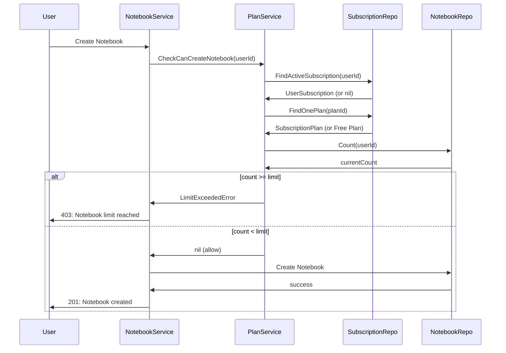

# Dokumentasi Fitur: Admin Limitations & AI Feature Management (CRUD)

> **Fokus Domain:** BACKEND  
> **Konteks:** Trace Upstream ke Downstream secara Semantik  
> **Scope:** Admin CRUD untuk konfigurasi limits dan AI features pada subscription plans

---

## Alur Data Semantik (Scope: BACKEND)

```
=== CREATE PLAN WITH LIMITS ===
[HTTP POST /api/admin/plans]  
    -> [Admin Middleware: Validate JWT + Admin Role]  
    -> [Controller: Parse Request with PlanFeaturesDTO]  
    -> [Service: CreatePlan]  
        -> [Map: DTO Features -> Entity Limits]  
        -> [Repository: CreatePlan]  
    -> [HTTP Response dengan Plan + Features]

=== UPDATE PLAN LIMITS ===
[HTTP PUT /api/admin/plans/:id]  
    -> [Admin Middleware: Validate JWT + Admin Role]  
    -> [Controller: Parse Request]  
    -> [Service: UpdatePlan]  
        -> [Repository: FindOnePlan]  
        -> [Update: Limit fields from Request.Features]  
        -> [Repository: UpdatePlan]  
    -> [HTTP Response dengan Updated Plan]

=== LIMIT ENFORCEMENT (User Side) ===
[User: Create Notebook/Note]  
    -> [NoteService/NotebookService: Call PlanService.CheckCanCreate*]  
        -> [PlanService: Get User's Active Plan]  
        -> [PlanService: Compare Usage vs Limit]  
        -> [If Exceeded: Return LimitExceededError]  
    -> [Response: Allow or Reject]

=== AI USAGE TRACKING ===
[User: Use AI Chat]  
    -> [ChatService: Increment user.AiDailyUsage]  
    -> [Check: Usage vs plan.AiChatDailyLimit]  
    -> [If Exceeded: Return Error]  
    -> [Daily Reset: Midnight via AiDailyUsageLastReset]
```

---

## A. Laporan Implementasi Fitur Limitations Management

### Deskripsi Fungsional

Fitur ini menyediakan kemampuan admin untuk mengkonfigurasi **limits** dan **AI features** pada subscription plans. Sistem mengimplementasikan model **freemium** dengan batasan yang dapat dikonfigurasi:

**Storage Limits (Cumulative):**
1. **MaxNotebooks**: Jumlah maksimum notebooks per user
2. **MaxNotesPerNotebook**: Jumlah maksimum notes per notebook

**Daily Usage Limits (Reset at Midnight):**
3. **AiChatDailyLimit**: Jumlah maksimum AI chat per hari
4. **SemanticSearchDailyLimit**: Jumlah maksimum semantic search per hari

**Feature Flags:**
5. **AiChatEnabled**: Toggle fitur AI Chat
6. **SemanticSearchEnabled**: Toggle fitur Semantic Search

**Special Values:**
- `-1` = Unlimited (tidak ada batasan)
- `0` = Disabled (fitur dinonaktifkan)

### Visualisasi

**Create Plan Request dengan Limits:**
```json
{
    "name": "Pro Plan",
    "slug": "pro",
    "price": 9.99,
    "billing_period": "monthly",
    "features": {
        "max_notebooks": -1,
        "max_notes_per_notebook": -1,
        "semantic_search": true,
        "ai_chat": true,
        "ai_chat_daily_limit": 100,
        "semantic_search_daily_limit": 50
    }
}
```

**Update Plan Limits Request:**
```json
{
    "features": {
        "max_notebooks": 10,
        "max_notes_per_notebook": 100,
        "ai_chat_daily_limit": 200,
        "semantic_search_daily_limit": 100
    }
}
```

**Limit Exceeded Error Response:**
```json
{
    "success": false,
    "code": 403,
    "message": "Notebook limit reached",
    "data": {
        "limit": 3,
        "used": 3,
        "upgrade_available": true
    }
}
```
*Caption: Gambar 1: Request/Response untuk Limit Management.*

---

## B. Bedah Arsitektur & Komponen

Berikut adalah rincian 14 komponen yang menyusun fitur ini di sisi BACKEND.

---

### [internal/server/server.go](file:///d:/notetaker/notefiber-BE/internal/server/server.go)
**Layer Terdeteksi:** `HTTP Server & Route Registration`

**Narasi Operasional:**
Server mendaftarkan [AdminController](file:///d:/notetaker/notefiber-BE/internal/controller/admin_controller.go#17-56) untuk plan CRUD dengan limits configuration.

```go
func registerRoutes(app *fiber.App, c *bootstrap.Container) {
	api := app.Group("/api")
	c.AdminController.RegisterRoutes(api)
}
```
*Caption: Snippet 1: Registrasi AdminController.*

---

### [internal/bootstrap/container.go](file:///d:/notetaker/notefiber-BE/internal/bootstrap/container.go)
**Layer Terdeteksi:** `Dependency Injection Container`

**Narasi Operasional:**
[AdminService](file:///d:/notetaker/notefiber-BE/internal/service/admin_service.go#25-72) dan [PlanService](file:///d:/notetaker/notefiber-BE/internal/service/plan_service.go#17-26) diinisialisasi. AdminService untuk CRUD limits, PlanService untuk enforcement.

```go
func NewContainer(db *gorm.DB, cfg *config.Config) *Container {
	uowFactory := unitofwork.NewRepositoryFactory(db)

	adminService := service.NewAdminService(uowFactory, logger)
	planService := service.NewPlanService(uowFactory)

	return &Container{
		AdminController: controller.NewAdminController(adminService, authService),
		PlanController:  controller.NewPlanController(planService),
	}
}
```
*Caption: Snippet 2: Konstruksi AdminService dan PlanService.*

---

### [internal/dto/admin_dto.go](file:///d:/notetaker/notefiber-BE/internal/dto/admin_dto.go)
**Layer Terdeteksi:** `Data Transfer Object (DTO)`

**Narasi Operasional:**
[PlanFeaturesDTO](file:///d:/notetaker/notefiber-BE/internal/dto/admin_dto.go#101-109) mendefinisikan struktur nested untuk limits dan feature flags. Digunakan dalam create dan update plan requests.

```go
type PlanFeaturesDTO struct {
	MaxNotebooks             int  `json:"max_notebooks"`              // -1 = unlimited
	MaxNotesPerNotebook      int  `json:"max_notes_per_notebook"`     // -1 = unlimited
	SemanticSearch           bool `json:"semantic_search"`            // Feature toggle
	AiChat                   bool `json:"ai_chat"`                    // Feature toggle
	AiChatDailyLimit         int  `json:"ai_chat_daily_limit"`        // 0 = disabled, -1 = unlimited
	SemanticSearchDailyLimit int  `json:"semantic_search_daily_limit"` // 0 = disabled, -1 = unlimited
}

type AdminCreatePlanRequest struct {
	Name          string          `json:"name" validate:"required"`
	Slug          string          `json:"slug" validate:"required"`
	Price         float64         `json:"price" validate:"gte=0"`
	BillingPeriod string          `json:"billing_period" validate:"required,oneof=monthly yearly"`
	Features      PlanFeaturesDTO `json:"features"` // Limits configuration
}

type AdminUpdatePlanRequest struct {
	Name          string           `json:"name,omitempty"`
	Price         *float64         `json:"price,omitempty"`
	Features      *PlanFeaturesDTO `json:"features,omitempty"` // Partial update supported
	// ... other fields
}

type AdminPlanResponse struct {
	Id            uuid.UUID       `json:"id"`
	Name          string          `json:"name"`
	Slug          string          `json:"slug"`
	Price         float64         `json:"price"`
	BillingPeriod string          `json:"billing_period"`
	Features      PlanFeaturesDTO `json:"features"` // Limits included in response
}
```
*Caption: Snippet 3: DTO untuk Plan dengan Limits configuration.*

---

### [internal/dto/usage_dto.go](file:///d:/notetaker/notefiber-BE/internal/dto/usage_dto.go)
**Layer Terdeteksi:** `Data Transfer Object (DTO) - Limit Error`

**Narasi Operasional:**
`LimitExceededError` digunakan untuk mengembalikan informasi limit saat user exceeds limit.

```go
type LimitExceededError struct {
	Limit int
	Used  int
}

func (e *LimitExceededError) Error() string {
	return fmt.Sprintf("limit exceeded: %d/%d", e.Used, e.Limit)
}

// Limit Type Constants
const (
	LimitTypeNotebooks      = "notebooks"
	LimitTypeNotes          = "notes"
	LimitTypeAiChat         = "ai_chat"
	LimitTypeSemanticSearch = "semantic_search"
)
```
*Caption: Snippet 4: LimitExceededError untuk enforcement.*

---

### [internal/controller/admin_controller.go](file:///d:/notetaker/notefiber-BE/internal/controller/admin_controller.go)
**Layer Terdeteksi:** `Interface / Controller Layer`

**Narasi Operasional:**
Controller menangani plan CRUD dengan limits dalam `features` field.

```go
func (c *adminController) RegisterRoutes(r fiber.Router) {
	h := r.Group("/admin")
	h.Use(c.adminMiddleware)

	// Plan Management (includes limits)
	h.Post("/plans", c.CreatePlan)
	h.Get("/plans", c.GetAllPlans)
	h.Put("/plans/:id", c.UpdatePlan)
	h.Delete("/plans/:id", c.DeletePlan)
}

func (c *adminController) CreatePlan(ctx *fiber.Ctx) error {
	var req dto.AdminCreatePlanRequest
	if err := ctx.BodyParser(&req); err != nil {
		return ctx.Status(fiber.StatusBadRequest).JSON(serverutils.ErrorResponse(400, "Invalid request body"))
	}

	result, err := c.service.CreatePlan(ctx.Context(), req)
	if err != nil {
		return ctx.Status(fiber.StatusInternalServerError).JSON(serverutils.ErrorResponse(500, err.Error()))
	}
	return ctx.JSON(serverutils.SuccessResponse("Plan created", result))
}

func (c *adminController) UpdatePlan(ctx *fiber.Ctx) error {
	planId, _ := uuid.Parse(ctx.Params("id"))

	var req dto.AdminUpdatePlanRequest
	if err := ctx.BodyParser(&req); err != nil {
		return ctx.Status(fiber.StatusBadRequest).JSON(serverutils.ErrorResponse(400, "Invalid request body"))
	}

	result, err := c.service.UpdatePlan(ctx.Context(), planId, req)
	if err != nil {
		return ctx.Status(fiber.StatusInternalServerError).JSON(serverutils.ErrorResponse(500, err.Error()))
	}
	return ctx.JSON(serverutils.SuccessResponse("Plan updated", result))
}
```
*Caption: Snippet 5: Controller untuk Plan CRUD dengan limits.*

---

### [internal/service/admin_service.go](file:///d:/notetaker/notefiber-BE/internal/service/admin_service.go)
**Layer Terdeteksi:** `Business Logic / Service Layer - Admin`

**Narasi Operasional:**
[CreatePlan](file:///d:/notetaker/notefiber-BE/internal/repository/contract/subscription_repository.go#13-15) dan [UpdatePlan](file:///d:/notetaker/notefiber-BE/internal/service/admin_service.go#53-54) mengambil nilai dari [PlanFeaturesDTO](file:///d:/notetaker/notefiber-BE/internal/dto/admin_dto.go#101-109) dan mapping ke entity fields.

```go
func (s *adminService) CreatePlan(ctx context.Context, req dto.AdminCreatePlanRequest) (*dto.AdminPlanResponse, error) {
	uow := s.uowFactory.NewUnitOfWork(ctx)

	newPlan := &entity.SubscriptionPlan{
		Name:          req.Name,
		Slug:          req.Slug,
		Price:         req.Price,
		BillingPeriod: entity.BillingPeriod(req.BillingPeriod),
		// Storage Limits
		MaxNotebooks:        req.Features.MaxNotebooks,
		MaxNotesPerNotebook: req.Features.MaxNotesPerNotebook,
		// AI Feature Flags
		SemanticSearchEnabled: req.Features.SemanticSearch,
		AiChatEnabled:         req.Features.AiChat,
		// Daily Usage Limits
		AiChatDailyLimit:         req.Features.AiChatDailyLimit,
		SemanticSearchDailyLimit: req.Features.SemanticSearchDailyLimit,
		IsActive:                 true,
	}

	if err := uow.SubscriptionRepository().CreatePlan(ctx, newPlan); err != nil {
		return nil, err
	}

	return &dto.AdminPlanResponse{
		Id: newPlan.Id, Name: newPlan.Name, Slug: newPlan.Slug,
		Price: newPlan.Price, BillingPeriod: string(newPlan.BillingPeriod),
		Features: req.Features,
	}, nil
}

func (s *adminService) UpdatePlan(ctx context.Context, id uuid.UUID, req dto.AdminUpdatePlanRequest) (*dto.AdminPlanResponse, error) {
	uow := s.uowFactory.NewUnitOfWork(ctx)

	plan, _ := uow.SubscriptionRepository().FindOnePlan(ctx, specification.ByID{ID: id})
	if plan == nil {
		return nil, fmt.Errorf("plan not found")
	}

	// Update Limits if provided
	if req.Features != nil {
		plan.MaxNotebooks = req.Features.MaxNotebooks
		plan.MaxNotesPerNotebook = req.Features.MaxNotesPerNotebook
		plan.SemanticSearchEnabled = req.Features.SemanticSearch
		plan.AiChatEnabled = req.Features.AiChat
		plan.AiChatDailyLimit = req.Features.AiChatDailyLimit
		plan.SemanticSearchDailyLimit = req.Features.SemanticSearchDailyLimit
	}

	if err := uow.SubscriptionRepository().UpdatePlan(ctx, plan); err != nil {
		return nil, err
	}

	return &dto.AdminPlanResponse{
		Id: plan.Id, Name: plan.Name, Slug: plan.Slug,
		Price: plan.Price, BillingPeriod: string(plan.BillingPeriod),
		Features: dto.PlanFeaturesDTO{
			MaxNotebooks:             plan.MaxNotebooks,
			MaxNotesPerNotebook:      plan.MaxNotesPerNotebook,
			SemanticSearch:           plan.SemanticSearchEnabled,
			AiChat:                   plan.AiChatEnabled,
			AiChatDailyLimit:         plan.AiChatDailyLimit,
			SemanticSearchDailyLimit: plan.SemanticSearchDailyLimit,
		},
	}, nil
}
```
*Caption: Snippet 6: AdminService dengan limit configuration.*

---

### [internal/service/plan_service.go](file:///d:/notetaker/notefiber-BE/internal/service/plan_service.go)
**Layer Terdeteksi:** `Business Logic / Service Layer - Enforcement`

**Narasi Operasional:**
[PlanService](file:///d:/notetaker/notefiber-BE/internal/service/plan_service.go#17-26) menyediakan guard functions untuk limit enforcement. Dipanggil oleh Note/Notebook services sebelum create.

```go
type PlanService interface {
	CheckCanCreateNotebook(ctx context.Context, userId uuid.UUID) error
	CheckCanCreateNote(ctx context.Context, userId uuid.UUID, notebookId uuid.UUID) error
	GetUserUsageStatus(ctx context.Context, userId uuid.UUID) (*dto.UsageStatusResponse, error)
}

// CheckCanCreateNotebook checks if user can create a new notebook
func (s *planService) CheckCanCreateNotebook(ctx context.Context, userId uuid.UUID) error {
	uow := s.uowFactory.NewUnitOfWork(ctx)
	plan, _ := s.getUserPlan(ctx, uow, userId)

	// -1 means unlimited
	if plan.MaxNotebooks < 0 {
		return nil
	}

	count, _ := uow.NotebookRepository().Count(ctx, specification.UserOwnedBy{UserID: userId})

	if int(count) >= plan.MaxNotebooks {
		return &dto.LimitExceededError{
			Limit: plan.MaxNotebooks,
			Used:  int(count),
		}
	}

	return nil
}

// CheckCanCreateNote checks if user can create a note in a notebook
func (s *planService) CheckCanCreateNote(ctx context.Context, userId uuid.UUID, notebookId uuid.UUID) error {
	uow := s.uowFactory.NewUnitOfWork(ctx)
	plan, _ := s.getUserPlan(ctx, uow, userId)

	// -1 means unlimited
	if plan.MaxNotesPerNotebook < 0 {
		return nil
	}

	count, _ := uow.NoteRepository().Count(ctx,
		specification.UserOwnedBy{UserID: userId},
		specification.ByNotebookID{NotebookID: notebookId},
	)

	if int(count) >= plan.MaxNotesPerNotebook {
		return &dto.LimitExceededError{
			Limit: plan.MaxNotesPerNotebook,
			Used:  int(count),
		}
	}

	return nil
}

// getUserPlan returns user's active plan or Free Plan defaults
func (s *planService) getUserPlan(ctx context.Context, uow unitofwork.UnitOfWork, userId uuid.UUID) (*entity.SubscriptionPlan, error) {
	subs, _ := uow.SubscriptionRepository().FindAllSubscriptions(ctx,
		specification.UserOwnedBy{UserID: userId},
		specification.Filter("status", "active"),
	)

	if len(subs) > 0 {
		plan, _ := uow.SubscriptionRepository().FindOnePlan(ctx, specification.ByID{ID: subs[0].PlanId})
		if plan != nil {
			return plan, nil
		}
	}

	// Free Plan defaults
	return &entity.SubscriptionPlan{
		Name:                     "Free Plan",
		Slug:                     "free",
		MaxNotebooks:             3,
		MaxNotesPerNotebook:      10,
		AiChatDailyLimit:         0,  // Disabled
		SemanticSearchDailyLimit: 0,  // Disabled
		AiChatEnabled:            false,
		SemanticSearchEnabled:    false,
	}, nil
}
```
*Caption: Snippet 7: PlanService dengan limit enforcement.*

---

### [internal/entity/subscription_entity.go](file:///d:/notetaker/notefiber-BE/internal/entity/subscription_entity.go)
**Layer Terdeteksi:** `Domain Entity`

**Narasi Operasional:**
Entity [SubscriptionPlan](file:///d:/notetaker/notefiber-BE/internal/entity/subscription_entity.go#27-53) menyimpan semua limit dan feature flag fields.

```go
type SubscriptionPlan struct {
	Id            uuid.UUID
	Name          string
	Slug          string
	Price         float64
	TaxRate       float64
	BillingPeriod BillingPeriod

	// Storage Limits (cumulative)
	MaxNotebooks        int // Max folders allowed, -1 = unlimited
	MaxNotesPerNotebook int // Max notes per folder, -1 = unlimited
	
	// Daily Usage Limits (reset daily)
	AiChatDailyLimit         int // Max AI chat messages per day, 0 = disabled, -1 = unlimited
	SemanticSearchDailyLimit int // Max semantic searches per day, 0 = disabled, -1 = unlimited
	
	// Feature Flags (kept for backward compatibility)
	SemanticSearchEnabled bool
	AiChatEnabled         bool
	
	// Display Settings
	IsMostPopular bool
	IsActive      bool
	SortOrder     int
}
```
*Caption: Snippet 8: Entity dengan limit fields.*

---

### [internal/entity/user_entity.go](file:///d:/notetaker/notefiber-BE/internal/entity/user_entity.go)
**Layer Terdeteksi:** `Domain Entity - User Usage`

**Narasi Operasional:**
Entity [User](file:///d:/notetaker/notefiber-BE/internal/model/user_model.go#10-26) menyimpan AI usage tracking untuk daily limits.

```go
type User struct {
	Id                    uuid.UUID
	Email                 string
	FullName              string
	// ...
	AiDailyUsage          int       // Current day's AI chat count
	AiDailyUsageLastReset time.Time // Last reset timestamp
}
```
*Caption: Snippet 9: User entity dengan AI usage tracking.*

---

## C. Ringkasan Layer Arsitektur

| No | Layer | File | Tanggung Jawab |
|----|-------|------|----------------|
| 1 | HTTP Server | [server/server.go](file:///d:/notetaker/notefiber-BE/internal/server/server.go) | Route registration |
| 2 | DI Container | [bootstrap/container.go](file:///d:/notetaker/notefiber-BE/internal/bootstrap/container.go) | Dependency wiring |
| 3 | Admin DTO | [dto/admin_dto.go](file:///d:/notetaker/notefiber-BE/internal/dto/admin_dto.go) | PlanFeaturesDTO |
| 4 | Usage DTO | [dto/usage_dto.go](file:///d:/notetaker/notefiber-BE/internal/dto/usage_dto.go) | LimitExceededError |
| 5 | Admin Controller | [controller/admin_controller.go](file:///d:/notetaker/notefiber-BE/internal/controller/admin_controller.go) | Plan CRUD handlers |
| 6 | Admin Service | [service/admin_service.go](file:///d:/notetaker/notefiber-BE/internal/service/admin_service.go) | Limit configuration |
| 7 | **Plan Service** | [service/plan_service.go](file:///d:/notetaker/notefiber-BE/internal/service/plan_service.go) | **Limit enforcement** |
| 8 | Factory Interface | [unitofwork/repository_factory.go](file:///d:/notetaker/notefiber-BE/internal/repository/unitofwork/repository_factory.go) | UoW factory |
| 9 | UoW Interface | [unitofwork/unit_of_work.go](file:///d:/notetaker/notefiber-BE/internal/repository/unitofwork/unit_of_work.go) | Repository access |
| 10 | Subscription Contract | [contract/subscription_repository.go](file:///d:/notetaker/notefiber-BE/internal/repository/contract/subscription_repository.go) | Plan CRUD |
| 11 | Subscription Impl | [implementation/subscription_repository_impl.go](file:///d:/notetaker/notefiber-BE/internal/repository/implementation/subscription_repository_impl.go) | GORM |
| 12 | Plan Entity | [entity/subscription_entity.go](file:///d:/notetaker/notefiber-BE/internal/entity/subscription_entity.go) | Limit fields |
| 13 | User Entity | [entity/user_entity.go](file:///d:/notetaker/notefiber-BE/internal/entity/user_entity.go) | Usage tracking |
| 14 | Model | [model/subscription_model.go](file:///d:/notetaker/notefiber-BE/internal/model/subscription_model.go) | DB mapping |

---

## D. Endpoint API Reference

### Admin Endpoints (Limit Configuration)

| Method | Endpoint | Deskripsi | Auth |
|--------|----------|-----------|------|
| `POST` | `/api/admin/plans` | Create plan with limits | Admin JWT |
| `PUT` | `/api/admin/plans/:id` | Update plan limits | Admin JWT |
| `GET` | `/api/admin/plans` | List all plans | Admin JWT |

### User Endpoints (Limit Check)

| Method | Endpoint | Deskripsi | Auth |
|--------|----------|-----------|------|
| `GET` | `/api/user/usage-status` | Current usage vs limits | User JWT |

---

## E. Limit Special Values

| Value | Meaning | Example Use |
|-------|---------|-------------|
| `-1` | **Unlimited** | Pro Plan: unlimited notebooks |
| `0` | **Disabled** | Free Plan: AI chat disabled |
| `> 0` | **Limited** | 3 notebooks, 100 AI chats/day |

```go
// Check logic
if plan.MaxNotebooks < 0 {
    return nil // Unlimited - allow
}
if plan.AiChatDailyLimit == 0 {
    return errors.New("AI chat is disabled for this plan")
}
if count >= plan.MaxNotebooks {
    return &LimitExceededError{Limit: plan.MaxNotebooks, Used: count}
}
```

---

## F. Free Plan Default Limits

| Limit Type | Default Value | Meaning |
|------------|---------------|---------|
| `MaxNotebooks` | 3 | Max 3 notebooks |
| `MaxNotesPerNotebook` | 10 | Max 10 notes per notebook |
| `AiChatDailyLimit` | 0 | AI Chat disabled |
| `SemanticSearchDailyLimit` | 0 | Semantic Search disabled |
| `AiChatEnabled` | false | Feature disabled |
| `SemanticSearchEnabled` | false | Feature disabled |

> [!NOTE]
> Free Plan defaults are hardcoded in [getUserPlan()](file:///d:/notetaker/notefiber-BE/internal/service/plan_service.go#215-249) and returned when user has no active subscription.

---

## G. Limit Enforcement Flow


*Caption: Diagram 1: Limit enforcement flow saat create notebook.*

---

## H. AI Daily Usage Reset

| Field | Deskripsi |
|-------|-----------|
| `User.AiDailyUsage` | Counter AI chat penggunaan hari ini |
| `User.AiDailyUsageLastReset` | Timestamp terakhir reset |

**Reset Logic:**
```go
// In chat service before incrementing
now := time.Now()
if user.AiDailyUsageLastReset.Day() != now.Day() {
    user.AiDailyUsage = 0
    user.AiDailyUsageLastReset = now
}

// Check limit
if plan.AiChatDailyLimit > 0 && user.AiDailyUsage >= plan.AiChatDailyLimit {
    return errors.New("daily AI chat limit reached")
}

// Increment
user.AiDailyUsage++
```

---

## I. Plan Comparison Table

| Feature | Free | Pro | Business |
|---------|------|-----|----------|
| MaxNotebooks | 3 | -1 (unlimited) | -1 |
| MaxNotesPerNotebook | 10 | -1 | -1 |
| AiChatDailyLimit | 0 (disabled) | 100 | -1 (unlimited) |
| SemanticSearchDailyLimit | 0 (disabled) | 50 | -1 |
| AiChatEnabled | false | true | true |
| SemanticSearchEnabled | false | true | true |

---

## J. Error Responses

| Error | Condition | HTTP Status |
|-------|-----------|-------------|
| `Notebook limit reached` | count >= MaxNotebooks | 403 |
| `Note limit reached` | count >= MaxNotesPerNotebook | 403 |
| `Daily AI chat limit reached` | usage >= AiChatDailyLimit | 429 |
| `AI chat is disabled` | AiChatDailyLimit == 0 | 403 |
| `Semantic search is disabled` | SemanticSearchDailyLimit == 0 | 403 |

---

*Dokumen ini di-generate dalam mode READ-ONLY tanpa modifikasi terhadap kode sumber.*
