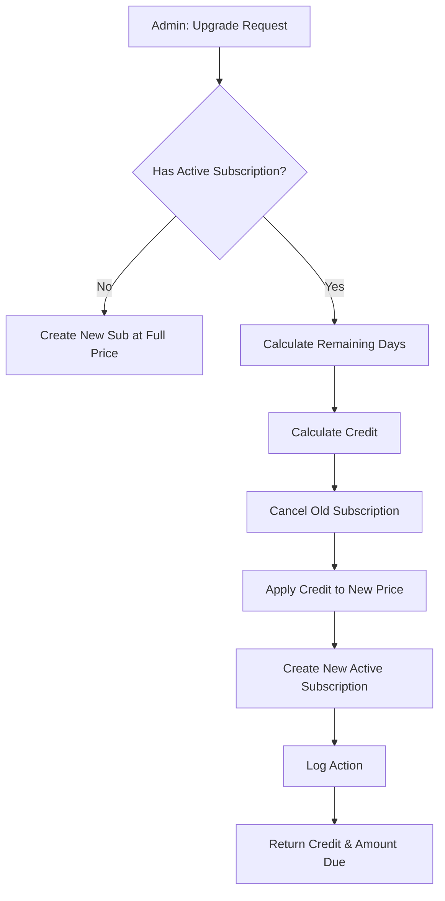
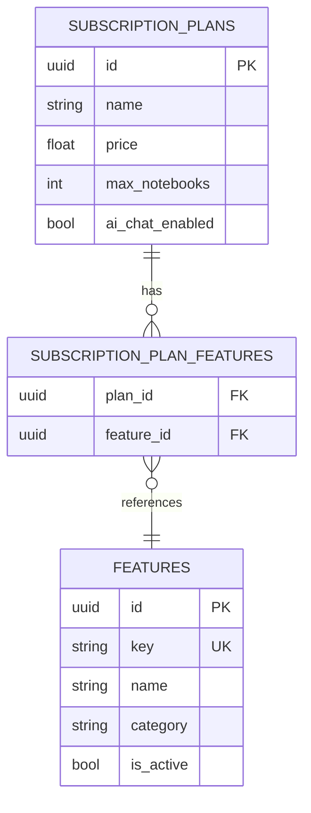

# Dokumentasi Fitur: Admin Subscription Management

> **Fokus Domain:** BACKEND  
> **Konteks:** Trace Upstream ke Downstream secara Semantik  
> **Scope:** Admin operations untuk manajemen subscription, plans, dan features

---

## Alur Data Semantik (Scope: BACKEND)

```
=== PLAN CRUD ===
[HTTP POST/PUT/DELETE /api/admin/plans]  
    -> [Admin Middleware: Validate JWT + Admin Role]  
    -> [Controller: Parse Request]  
    -> [Service: Create/Update/Delete Plan]  
        -> [Repository: CRUD Operations]  
    -> [HTTP Response]

=== FEATURE CATALOG CRUD ===
[HTTP POST/PUT/DELETE /api/admin/features]  
    -> [Admin Middleware: Validate JWT + Admin Role]  
    -> [Controller: Parse Request]  
    -> [Service: CRUD Feature in Master Catalog]  
        -> [Repository: Feature CRUD]  
    -> [HTTP Response]

=== PLAN-FEATURE ASSIGNMENT ===
[HTTP POST /api/admin/plans/:id/features]  
    -> [Admin Middleware: Validate JWT + Admin Role]  
    -> [Controller: Parse Plan ID + Feature Key]  
    -> [Service: CreatePlanFeature]  
        -> [Repository: Find Plan]  
        -> [Repository: Find Feature by Key]  
        -> [Repository: AddFeatureToPlan (many-to-many)]  
    -> [HTTP Response]

=== UPGRADE SUBSCRIPTION ===
[HTTP POST /api/admin/subscriptions/upgrade]  
    -> [Admin Middleware: Validate JWT + Admin Role]  
    -> [Controller: Parse Request]  
    -> [Service: UpgradeSubscription]  
        -> [Transaction Begin]  
        -> [Calculate Proration Credit]  
        -> [Cancel Old Subscription]  
        -> [Create New Subscription (Active)]  
        -> [Logger: Audit]  
        -> [Transaction Commit]  
    -> [HTTP Response dengan Credit & Amount Due]

=== APPROVE REFUND REQUEST ===
[HTTP POST /api/admin/refunds/:id/approve]  
    -> [Admin Middleware: Validate JWT + Admin Role]  
    -> [Controller: Parse Refund ID]  
    -> [Service: ApproveRefund]  
        -> [Transaction Begin]  
        -> [Update Refund Status → Approved]  
        -> [Cancel Subscription + Set Refunded]  
        -> [Logger: Audit]  
        -> [Transaction Commit]  
    -> [HTTP Response]
```

---

## A. Laporan Implementasi Fitur Admin Subscription Management

### Deskripsi Fungsional

Fitur ini menyediakan kemampuan pengelolaan subscription system untuk administrator. Sistem mengimplementasikan:

**Plan Management:**
1. **CreatePlan**: Membuat paket langganan baru dengan limits dan pricing
2. **UpdatePlan**: Modifikasi plan (nama, harga, limits, display settings)
3. **DeletePlan**: Soft-delete plan (tidak menghapus subscriptions existing)
4. **GetAllPlans**: List semua plans dengan features dan limits

**Feature Catalog Management:**
5. **CreateFeature**: Menambah feature ke master catalog
6. **UpdateFeature**: Modifikasi feature (nama, kategori, status)
7. **DeleteFeature**: Hapus feature dari catalog
8. **GetAllFeatures**: List semua features dalam catalog

**Plan-Feature Assignment:**
9. **GetPlanFeatures**: List features yang di-assign ke plan
10. **CreatePlanFeature**: Assign feature dari catalog ke plan
11. **DeletePlanFeature**: Remove feature dari plan

**Subscription Operations:**
12. **UpgradeSubscription**: Upgrade user ke plan baru dengan proration
13. **RefundSubscription**: Direct refund oleh admin
14. **ApproveRefund**: Approve user refund request
15. **GetRefunds**: List user refund requests
16. **GetTransactions**: List semua transaksi subscription
17. **GetTokenUsage**: Monitoring AI usage per user

Semua endpoint dilindungi oleh admin middleware dan dicatat untuk audit trail.

### Visualisasi

**Plan Response:**
```json
{
    "id": "550e8400-e29b-41d4-a716-446655440000",
    "name": "Pro Plan",
    "slug": "pro",
    "description": "For power users",
    "tagline": "Unlock AI Chat and Semantic Search",
    "price": 9.99,
    "tax_rate": 0.1,
    "billing_period": "monthly",
    "is_most_popular": true,
    "is_active": true,
    "sort_order": 2,
    "features": {
        "max_notebooks": -1,
        "max_notes_per_notebook": -1,
        "semantic_search": true,
        "ai_chat": true,
        "ai_chat_daily_limit": 100,
        "semantic_search_daily_limit": 50
    }
}
```

**Feature Catalog Response:**
```json
{
    "id": "660e8400-e29b-41d4-a716-446655440000",
    "key": "ai_chat",
    "name": "AI Chat Assistant",
    "description": "Chat with AI to get help with your notes",
    "category": "ai",
    "is_active": true,
    "sort_order": 1
}
```
*Caption: Gambar 1: Response struktur untuk Plan dan Feature.*

---

## B. Bedah Arsitektur & Komponen

Berikut adalah rincian 17 komponen yang menyusun fitur ini di sisi BACKEND.

---

### [internal/server/server.go](file:///d:/notetaker/notefiber-BE/internal/server/server.go)
**Layer Terdeteksi:** `HTTP Server & Route Registration`

**Narasi Operasional:**
Server mendaftarkan [AdminController](file:///d:/notetaker/notefiber-BE/internal/controller/admin_controller.go#17-56) yang menangani semua endpoints subscription management di bawah prefix `/api/admin`.

```go
func registerRoutes(app *fiber.App, c *bootstrap.Container) {
	api := app.Group("/api")
	c.AdminController.RegisterRoutes(api)
}
```
*Caption: Snippet 1: Registrasi AdminController.*

---

### [internal/bootstrap/container.go](file:///d:/notetaker/notefiber-BE/internal/bootstrap/container.go)
**Layer Terdeteksi:** `Dependency Injection Container`

**Narasi Operasional:**
[AdminService](file:///d:/notetaker/notefiber-BE/internal/service/admin_service.go#25-72) diinisialisasi dengan `uowFactory` untuk akses ke multiple repositories dan `logger` untuk audit trail.

```go
func NewContainer(db *gorm.DB, cfg *config.Config) *Container {
	uowFactory := unitofwork.NewRepositoryFactory(db)
	logger := logger.NewLogger()

	adminService := service.NewAdminService(uowFactory, logger)

	return &Container{
		AdminController: controller.NewAdminController(adminService, authService),
	}
}
```
*Caption: Snippet 2: Konstruksi AdminService.*

---

### [internal/dto/admin_dto.go](file:///d:/notetaker/notefiber-BE/internal/dto/admin_dto.go)
**Layer Terdeteksi:** `Data Transfer Object (DTO) - Plan`

**Narasi Operasional:**
File ini mendefinisikan kontrak data untuk Plan CRUD. [PlanFeaturesDTO](file:///d:/notetaker/notefiber-BE/internal/dto/admin_dto.go#101-109) menyediakan struktur nested untuk limits dan feature flags.

```go
type AdminCreatePlanRequest struct {
	Name          string          `json:"name" validate:"required"`
	Slug          string          `json:"slug" validate:"required"`
	Price         float64         `json:"price" validate:"gte=0"`
	TaxRate       float64         `json:"tax_rate"`
	BillingPeriod string          `json:"billing_period" validate:"required,oneof=monthly yearly"`
	Features      PlanFeaturesDTO `json:"features"`
}

type AdminUpdatePlanRequest struct {
	Name          string           `json:"name,omitempty"`
	Description   *string          `json:"description,omitempty"`
	Tagline       *string          `json:"tagline,omitempty"`
	Price         *float64         `json:"price,omitempty"`
	TaxRate       *float64         `json:"tax_rate,omitempty"`
	IsMostPopular *bool            `json:"is_most_popular,omitempty"`
	IsActive      *bool            `json:"is_active,omitempty"`
	SortOrder     *int             `json:"sort_order,omitempty"`
	Features      *PlanFeaturesDTO `json:"features,omitempty"`
}

type PlanFeaturesDTO struct {
	MaxNotebooks             int  `json:"max_notebooks"`
	MaxNotesPerNotebook      int  `json:"max_notes_per_notebook"`
	SemanticSearch           bool `json:"semantic_search"`
	AiChat                   bool `json:"ai_chat"`
	AiChatDailyLimit         int  `json:"ai_chat_daily_limit"`
	SemanticSearchDailyLimit int  `json:"semantic_search_daily_limit"`
}

type AdminPlanResponse struct {
	Id            uuid.UUID       `json:"id"`
	Name          string          `json:"name"`
	Slug          string          `json:"slug"`
	Description   string          `json:"description"`
	Tagline       string          `json:"tagline"`
	Price         float64         `json:"price"`
	TaxRate       float64         `json:"tax_rate"`
	BillingPeriod string          `json:"billing_period"`
	IsMostPopular bool            `json:"is_most_popular"`
	IsActive      bool            `json:"is_active"`
	SortOrder     int             `json:"sort_order"`
	Features      PlanFeaturesDTO `json:"features"`
}
```
*Caption: Snippet 3: DTO untuk Plan CRUD dengan nested features.*

---

### [internal/dto/feature_dto.go](file:///d:/notetaker/notefiber-BE/internal/dto/feature_dto.go)
**Layer Terdeteksi:** `Data Transfer Object (DTO) - Feature`

**Narasi Operasional:**
File ini mendefinisikan kontrak data untuk Feature Catalog. Features dikelompokkan berdasarkan `category` (ai, storage, support).

```go
type CreateFeatureRequest struct {
	Key         string `json:"key" validate:"required"`
	Name        string `json:"name" validate:"required"`
	Description string `json:"description,omitempty"`
	Category    string `json:"category,omitempty"` // ai, storage, support, export
	IsActive    bool   `json:"is_active"`
	SortOrder   int    `json:"sort_order"`
}

type UpdateFeatureRequest struct {
	Name        *string `json:"name,omitempty"`
	Description *string `json:"description,omitempty"`
	Category    *string `json:"category,omitempty"`
	IsActive    *bool   `json:"is_active,omitempty"`
	SortOrder   *int    `json:"sort_order,omitempty"`
}

type FeatureResponse struct {
	Id          uuid.UUID `json:"id"`
	Key         string    `json:"key"`
	Name        string    `json:"name"`
	Description string    `json:"description"`
	Category    string    `json:"category"`
	IsActive    bool      `json:"is_active"`
	SortOrder   int       `json:"sort_order"`
}

type CreatePlanFeatureRequest struct {
	FeatureKey string `json:"feature_key" validate:"required"`
}

type PlanFeatureResponse struct {
	Id          uuid.UUID `json:"id"`
	Key         string    `json:"key"`
	Name        string    `json:"name"`
	Description string    `json:"description"`
}
```
*Caption: Snippet 4: DTO untuk Feature Catalog dan Plan-Feature assignment.*

---

### [internal/controller/admin_controller.go](file:///d:/notetaker/notefiber-BE/internal/controller/admin_controller.go)
**Layer Terdeteksi:** `Interface / Controller Layer`

**Narasi Operasional:**
Komponen ini menangani semua endpoints subscription management dengan admin middleware protection.

```go
func (c *adminController) RegisterRoutes(r fiber.Router) {
	h := r.Group("/admin")
	h.Use(c.adminMiddleware)

	// Dashboard
	h.Get("/dashboard", c.GetDashboardStats)
	h.Get("/growth", c.GetUserGrowth)

	// Plan Management
	h.Post("/plans", c.CreatePlan)
	h.Get("/plans", c.GetAllPlans)
	h.Put("/plans/:id", c.UpdatePlan)
	h.Delete("/plans/:id", c.DeletePlan)

	// Plan Feature Management
	h.Get("/plans/:id/features", c.GetPlanFeatures)
	h.Post("/plans/:id/features", c.CreatePlanFeature)
	h.Delete("/plans/:id/features/:featureId", c.DeletePlanFeature)

	// Feature Catalog Management
	h.Get("/features", c.GetAllFeatures)
	h.Post("/features", c.CreateFeature)
	h.Put("/features/:id", c.UpdateFeature)
	h.Delete("/features/:id", c.DeleteFeature)

	// Subscription Actions
	h.Post("/subscriptions/upgrade", c.UpgradeSubscription)
	h.Post("/subscriptions/refund", c.RefundSubscription)

	// Refund Management
	h.Get("/refunds", c.GetRefunds)
	h.Post("/refunds/:id/approve", c.ApproveRefund)

	// Transactions & Usage
	h.Get("/transactions", c.GetTransactions)
	h.Get("/token-usage", c.GetTokenUsage)
}

func (c *adminController) CreatePlan(ctx *fiber.Ctx) error {
	var req dto.AdminCreatePlanRequest
	if err := ctx.BodyParser(&req); err != nil {
		return ctx.Status(fiber.StatusBadRequest).JSON(serverutils.ErrorResponse(400, "Invalid request body"))
	}

	result, err := c.service.CreatePlan(ctx.Context(), req)
	if err != nil {
		return ctx.Status(fiber.StatusInternalServerError).JSON(serverutils.ErrorResponse(500, err.Error()))
	}
	return ctx.JSON(serverutils.SuccessResponse("Plan created", result))
}

func (c *adminController) CreatePlanFeature(ctx *fiber.Ctx) error {
	planId, _ := uuid.Parse(ctx.Params("id"))

	var req dto.CreatePlanFeatureRequest
	if err := ctx.BodyParser(&req); err != nil {
		return ctx.Status(fiber.StatusBadRequest).JSON(serverutils.ErrorResponse(400, "Invalid request body"))
	}

	feature, err := c.service.CreatePlanFeature(ctx.Context(), planId, req)
	if err != nil {
		if err.Error() == "plan not found" {
			return ctx.Status(fiber.StatusNotFound).JSON(serverutils.ErrorResponse(404, err.Error()))
		}
		return ctx.Status(fiber.StatusInternalServerError).JSON(serverutils.ErrorResponse(500, err.Error()))
	}
	return ctx.Status(fiber.StatusCreated).JSON(serverutils.SuccessResponse("Feature created", feature))
}

func (c *adminController) UpgradeSubscription(ctx *fiber.Ctx) error {
	var req dto.AdminSubscriptionUpgradeRequest
	if err := ctx.BodyParser(&req); err != nil {
		return ctx.Status(fiber.StatusBadRequest).JSON(serverutils.ErrorResponse(400, "Invalid request body"))
	}

	if req.UserId == uuid.Nil || req.NewPlanId == uuid.Nil {
		return ctx.Status(fiber.StatusBadRequest).JSON(serverutils.ErrorResponse(400, "user_id and new_plan_id are required"))
	}

	resp, err := c.service.UpgradeSubscription(ctx.Context(), req)
	if err != nil {
		return ctx.Status(fiber.StatusInternalServerError).JSON(serverutils.ErrorResponse(500, err.Error()))
	}
	return ctx.JSON(serverutils.SuccessResponse("Subscription upgraded", resp))
}

func (c *adminController) ApproveRefund(ctx *fiber.Ctx) error {
	refundId, _ := uuid.Parse(ctx.Params("id"))

	var req dto.AdminApproveRefundRequest
	_ = ctx.BodyParser(&req)

	resp, err := c.service.ApproveRefund(ctx.Context(), refundId, req)
	if err != nil {
		errMsg := err.Error()
		if errMsg == "refund request not found" {
			return ctx.Status(fiber.StatusNotFound).JSON(serverutils.ErrorResponse(404, errMsg))
		}
		if errMsg == "refund already processed" {
			return ctx.Status(fiber.StatusBadRequest).JSON(serverutils.ErrorResponse(400, errMsg))
		}
		return ctx.Status(fiber.StatusInternalServerError).JSON(serverutils.ErrorResponse(500, err.Error()))
	}
	return ctx.JSON(serverutils.SuccessResponse("Refund approved", resp))
}
```
*Caption: Snippet 5: Controller dengan Plan, Feature, dan Subscription handlers.*

---

### [internal/service/admin_service.go](file:///d:/notetaker/notefiber-BE/internal/service/admin_service.go)
**Layer Terdeteksi:** `Business Logic / Service Layer`

**Narasi Operasional:**
Komponen ini mengenkapsulasi logika bisnis untuk subscription management.

**CreatePlan/UpdatePlan**: CRUD plan dengan validasi dan mapping features.

**CreatePlanFeature**: Lookup feature dari catalog by key, lalu link ke plan via many-to-many.

**UpgradeSubscription**: Kompleks proration logic—cancel old subscription, calculate unused credit, create new subscription dengan credit applied.

**ApproveRefund**: Update refund status, cancel subscription, set payment status to refunded.

```go
func (s *adminService) CreatePlan(ctx context.Context, req dto.AdminCreatePlanRequest) (*dto.AdminPlanResponse, error) {
	uow := s.uowFactory.NewUnitOfWork(ctx)

	newPlan := &entity.SubscriptionPlan{
		Name:                     req.Name,
		Slug:                     req.Slug,
		Price:                    req.Price,
		TaxRate:                  req.TaxRate,
		BillingPeriod:            entity.BillingPeriod(req.BillingPeriod),
		MaxNotebooks:             req.Features.MaxNotebooks,
		MaxNotesPerNotebook:      req.Features.MaxNotesPerNotebook,
		SemanticSearchEnabled:    req.Features.SemanticSearch,
		AiChatEnabled:            req.Features.AiChat,
		AiChatDailyLimit:         req.Features.AiChatDailyLimit,
		SemanticSearchDailyLimit: req.Features.SemanticSearchDailyLimit,
		IsActive:                 true,
	}

	if err := uow.SubscriptionRepository().CreatePlan(ctx, newPlan); err != nil {
		return nil, err
	}

	return &dto.AdminPlanResponse{
		Id: newPlan.Id, Name: newPlan.Name, Slug: newPlan.Slug,
		Price: newPlan.Price, BillingPeriod: string(newPlan.BillingPeriod),
		Features: req.Features,
	}, nil
}

func (s *adminService) CreatePlanFeature(ctx context.Context, planId uuid.UUID, req dto.CreatePlanFeatureRequest) (*dto.PlanFeatureResponse, error) {
	uow := s.uowFactory.NewUnitOfWork(ctx)

	// Check if plan exists
	plan, err := uow.SubscriptionRepository().FindOnePlan(ctx, specification.ByID{ID: planId})
	if plan == nil {
		return nil, fmt.Errorf("plan not found")
	}

	// Check if feature exists in master catalog
	feature, err := uow.FeatureRepository().FindByKey(ctx, req.FeatureKey)
	if feature == nil {
		return nil, fmt.Errorf("feature with key '%s' not found in catalog", req.FeatureKey)
	}

	// Link feature to plan (many-to-many)
	if err := uow.SubscriptionRepository().AddFeatureToPlan(ctx, planId, feature.Id); err != nil {
		return nil, err
	}

	return &dto.PlanFeatureResponse{
		Id: feature.Id, Key: feature.Key, Name: feature.Name, Description: feature.Description,
	}, nil
}

func (s *adminService) UpgradeSubscription(ctx context.Context, req dto.AdminSubscriptionUpgradeRequest) (*dto.AdminSubscriptionUpgradeResponse, error) {
	uow := s.uowFactory.NewUnitOfWork(ctx)

	// Validate User & Plan
	user, _ := uow.UserRepository().FindOne(ctx, specification.ByID{ID: req.UserId})
	if user == nil {
		return nil, fmt.Errorf("user not found")
	}

	newPlan, _ := uow.SubscriptionRepository().FindOnePlan(ctx, specification.ByID{ID: req.NewPlanId})
	if newPlan == nil {
		return nil, fmt.Errorf("target plan not found")
	}

	// Find Active Subscription
	currentSub, _ := uow.SubscriptionRepository().FindOneSubscription(ctx,
		specification.Filter("user_id", req.UserId),
		specification.Filter("status", "active"),
	)

	// Transaction
	uow.Begin(ctx)
	defer uow.Rollback()

	var credit float64 = 0
	var amountDue float64 = newPlan.Price

	// Proration Logic
	if currentSub != nil {
		totalDuration := currentSub.CurrentPeriodEnd.Sub(currentSub.CurrentPeriodStart)
		usedDuration := time.Since(currentSub.CurrentPeriodStart)
		remainingDuration := totalDuration - usedDuration

		if remainingDuration > 0 {
			oldPlan, _ := uow.SubscriptionRepository().FindOnePlan(ctx, specification.ByID{ID: currentSub.PlanId})
			if oldPlan != nil {
				percentRemaining := remainingDuration.Hours() / totalDuration.Hours()
				credit = oldPlan.Price * percentRemaining
			}
		}

		currentSub.Status = "canceled"
		uow.SubscriptionRepository().UpdateSubscription(ctx, currentSub)
	}

	// Apply Credit
	if credit > amountDue {
		credit = amountDue
	}
	amountDue -= credit

	// Create New Subscription
	newSub := &entity.UserSubscription{
		UserId: req.UserId, PlanId: newPlan.Id,
		Status: "active", PaymentStatus: "paid",
		CurrentPeriodStart: time.Now(),
		CurrentPeriodEnd:   time.Now().AddDate(0, 1, 0),
	}
	uow.SubscriptionRepository().CreateSubscription(ctx, newSub)

	s.logger.Info("ADMIN", "Upgraded User Subscription", map[string]interface{}{
		"userId": req.UserId.String(), "newPlan": newPlan.Name, "credit": credit,
	})

	uow.Commit()

	return &dto.AdminSubscriptionUpgradeResponse{
		OldSubscriptionId: currentSub.Id,
		NewSubscriptionId: newSub.Id,
		CreditApplied:     credit,
		AmountDue:         amountDue,
		Status:            "success",
	}, nil
}

func (s *adminService) ApproveRefund(ctx context.Context, refundId uuid.UUID, req dto.AdminApproveRefundRequest) (*dto.AdminApproveRefundResponse, error) {
	uow := s.uowFactory.NewUnitOfWork(ctx)

	// Find refund
	refund, _ := uow.RefundRepository().FindOne(ctx, specification.ByID{ID: refundId})
	if refund == nil {
		return nil, fmt.Errorf("refund request not found")
	}

	if refund.Status != string(entity.RefundStatusPending) {
		return nil, fmt.Errorf("refund already processed")
	}

	uow.Begin(ctx)
	defer uow.Rollback()

	// Update refund
	now := time.Now()
	refund.Status = string(entity.RefundStatusApproved)
	refund.AdminNotes = req.AdminNotes
	refund.ProcessedAt = &now
	uow.RefundRepository().Update(ctx, refund)

	// Cancel subscription
	sub, _ := uow.SubscriptionRepository().FindOneSubscription(ctx, specification.ByID{ID: refund.SubscriptionID})
	if sub != nil {
		sub.Status = "canceled"
		sub.PaymentStatus = "refunded"
		sub.CurrentPeriodEnd = now
		uow.SubscriptionRepository().UpdateSubscription(ctx, sub)
	}

	s.logger.Info("ADMIN", "Approved Refund Request", map[string]interface{}{
		"refundId": refundId.String(), "subscriptionId": refund.SubscriptionID.String(),
		"amount": refund.Amount, "adminNotes": req.AdminNotes,
	})

	uow.Commit()

	return &dto.AdminApproveRefundResponse{
		RefundId: refundId.String(), Status: "approved",
		RefundedAmount: refund.Amount, ProcessedAt: now,
	}, nil
}

func (s *adminService) GetTokenUsage(ctx context.Context, page, limit int) ([]*dto.TokenUsageResponse, error) {
	uow := s.uowFactory.NewUnitOfWork(ctx)
	offset := (page - 1) * limit

	// Get users ordered by AI usage
	users, _ := uow.UserRepository().FindAll(ctx,
		specification.Pagination{Limit: limit, Offset: offset},
		specification.OrderBy{Field: "ai_daily_usage", Desc: true},
	)

	var res []*dto.TokenUsageResponse
	for _, user := range users {
		subs, _ := uow.SubscriptionRepository().FindAllSubscriptions(ctx,
			specification.UserOwnedBy{UserID: user.Id},
			specification.Filter("status", "active"),
		)

		planName := "Free Plan"
		creditLimit := 0

		if len(subs) > 0 {
			plan, _ := uow.SubscriptionRepository().FindOnePlan(ctx, specification.ByID{ID: subs[0].PlanId})
			if plan != nil {
				planName = plan.Name
				creditLimit = plan.AiChatDailyLimit
			}
		}

		res = append(res, &dto.TokenUsageResponse{
			UserId: user.Id, Email: user.Email, FullName: user.FullName,
			PlanName: planName, AiDailyUsage: user.AiDailyUsage,
			AiDailyCreditLimit: creditLimit,
		})
	}

	return res, nil
}
```
*Caption: Snippet 6: Service dengan Plan CRUD, Upgrade, dan Refund approval.*

---

### [internal/repository/contract/subscription_repository.go](file:///d:/notetaker/notefiber-BE/internal/repository/contract/subscription_repository.go)
**Layer Terdeteksi:** `Repository Interface / Contract`

**Narasi Operasional:**
Kontrak ini mendefinisikan operasi untuk Plans dan Subscriptions dengan metode khusus untuk feature assignment.

```go
type SubscriptionRepository interface {
	// Plans
	CreatePlan(ctx context.Context, plan *entity.SubscriptionPlan) error
	UpdatePlan(ctx context.Context, plan *entity.SubscriptionPlan) error
	DeletePlan(ctx context.Context, id uuid.UUID) error
	FindOnePlan(ctx context.Context, specs ...specification.Specification) (*entity.SubscriptionPlan, error)
	FindAllPlans(ctx context.Context, specs ...specification.Specification) ([]*entity.SubscriptionPlan, error)

	// Subscriptions
	CreateSubscription(ctx context.Context, subscription *entity.UserSubscription) error
	UpdateSubscription(ctx context.Context, subscription *entity.UserSubscription) error
	DeleteSubscription(ctx context.Context, id uuid.UUID) error
	FindOneSubscription(ctx context.Context, specs ...specification.Specification) (*entity.UserSubscription, error)
	FindAllSubscriptions(ctx context.Context, specs ...specification.Specification) ([]*entity.UserSubscription, error)

	// Feature Management (Many-to-Many)
	AddFeatureToPlan(ctx context.Context, planId uuid.UUID, featureId uuid.UUID) error
	RemoveFeatureFromPlan(ctx context.Context, planId uuid.UUID, featureId uuid.UUID) error

	// Admin Stats
	GetTotalRevenue(ctx context.Context) (float64, error)
	CountActiveSubscribers(ctx context.Context) (int, error)
	GetTransactions(ctx context.Context, status string, limit, offset int) ([]*entity.SubscriptionTransaction, error)
}
```
*Caption: Snippet 7: Kontrak repository dengan feature management.*

---

### [internal/repository/contract/feature_repository.go](file:///d:/notetaker/notefiber-BE/internal/repository/contract/feature_repository.go)
**Layer Terdeteksi:** `Repository Interface / Contract - Feature`

**Narasi Operasional:**
Kontrak ini mendefinisikan operasi untuk Feature Catalog dengan metode `FindByKey` untuk lookup berdasarkan unique key.

```go
type FeatureRepository interface {
	Create(ctx context.Context, feature *entity.Feature) error
	Update(ctx context.Context, feature *entity.Feature) error
	Delete(ctx context.Context, id uuid.UUID) error
	FindOne(ctx context.Context, specs ...specification.Specification) (*entity.Feature, error)
	FindAll(ctx context.Context, specs ...specification.Specification) ([]*entity.Feature, error)
	FindByKey(ctx context.Context, key string) (*entity.Feature, error)
}
```
*Caption: Snippet 8: Kontrak repository untuk Feature Catalog.*

---

### [internal/entity/subscription_entity.go](file:///d:/notetaker/notefiber-BE/internal/entity/subscription_entity.go)
**Layer Terdeteksi:** `Domain Entity - Plan`

**Narasi Operasional:**
Entity [SubscriptionPlan](file:///d:/notetaker/notefiber-BE/internal/entity/subscription_entity.go#27-53) mendefinisikan limits, feature flags, dan display settings. Relasi many-to-many dengan [Feature](file:///d:/notetaker/notefiber-BE/internal/entity/feature_entity.go#12-23) untuk pricing modal display.

```go
type SubscriptionPlan struct {
	Id            uuid.UUID
	Name          string
	Slug          string
	Description   string
	Tagline       string
	Price         float64
	TaxRate       float64
	BillingPeriod BillingPeriod
	// Storage Limits
	MaxNotebooks        int // -1 = unlimited
	MaxNotesPerNotebook int // -1 = unlimited
	// Daily Usage Limits
	AiChatDailyLimit         int // 0 = disabled, -1 = unlimited
	SemanticSearchDailyLimit int
	// Feature Flags
	SemanticSearchEnabled bool
	AiChatEnabled         bool
	// Display Settings
	IsMostPopular bool
	IsActive      bool
	SortOrder     int
	// Relations (Many-to-Many)
	Features []Feature
}
```
*Caption: Snippet 9: Entity domain Plan dengan Feature relation.*

---

### [internal/entity/feature_entity.go](file:///d:/notetaker/notefiber-BE/internal/entity/feature_entity.go)
**Layer Terdeteksi:** `Domain Entity - Feature`

**Narasi Operasional:**
Entity [Feature](file:///d:/notetaker/notefiber-BE/internal/entity/feature_entity.go#12-23) merepresentasikan item dalam master catalog yang dapat di-assign ke plans. Key bersifat unique untuk lookup.

```go
type Feature struct {
	Id          uuid.UUID
	Key         string // Unique: ai_chat, semantic_search, etc.
	Name        string // Display: "AI Chat Assistant"
	Description string
	Category    string // ai, storage, support, export
	IsActive    bool
	SortOrder   int
	CreatedAt   time.Time
	UpdatedAt   time.Time
}
```
*Caption: Snippet 10: Entity domain Feature untuk catalog.*

---

## C. Ringkasan Layer Arsitektur

| No | Layer | File | Tanggung Jawab |
|----|-------|------|----------------|
| 1 | HTTP Server | [server/server.go](file:///d:/notetaker/notefiber-BE/internal/server/server.go) | Route registration |
| 2 | DI Container | [bootstrap/container.go](file:///d:/notetaker/notefiber-BE/internal/bootstrap/container.go) | Dependency wiring |
| 3 | Admin DTO | [dto/admin_dto.go](file:///d:/notetaker/notefiber-BE/internal/dto/admin_dto.go) | Plan CRUD DTOs |
| 4 | Feature DTO | [dto/feature_dto.go](file:///d:/notetaker/notefiber-BE/internal/dto/feature_dto.go) | Feature Catalog DTOs |
| 5 | Refund DTO | [dto/refund_dto.go](file:///d:/notetaker/notefiber-BE/internal/dto/refund_dto.go) | Refund Management DTOs |
| 6 | Admin Controller | [controller/admin_controller.go](file:///d:/notetaker/notefiber-BE/internal/controller/admin_controller.go) | All admin handlers |
| 7 | Admin Service | [service/admin_service.go](file:///d:/notetaker/notefiber-BE/internal/service/admin_service.go) | Business logic |
| 8 | Factory Interface | [unitofwork/repository_factory.go](file:///d:/notetaker/notefiber-BE/internal/repository/unitofwork/repository_factory.go) | UoW factory |
| 9 | UoW Interface | [unitofwork/unit_of_work.go](file:///d:/notetaker/notefiber-BE/internal/repository/unitofwork/unit_of_work.go) | Multi-repository access |
| 10 | UoW Impl | [unitofwork/unit_of_work_impl.go](file:///d:/notetaker/notefiber-BE/internal/repository/unitofwork/unit_of_work_impl.go) | Transaction management |
| 11 | Subscription Contract | [contract/subscription_repository.go](file:///d:/notetaker/notefiber-BE/internal/repository/contract/subscription_repository.go) | Plan & Subscription ops |
| 12 | Feature Contract | [contract/feature_repository.go](file:///d:/notetaker/notefiber-BE/internal/repository/contract/feature_repository.go) | Feature catalog ops |
| 13 | Refund Contract | [contract/refund_repository.go](file:///d:/notetaker/notefiber-BE/internal/repository/contract/refund_repository.go) | Refund ops |
| 14 | Subscription Impl | [implementation/subscription_repository_impl.go](file:///d:/notetaker/notefiber-BE/internal/repository/implementation/subscription_repository_impl.go) | GORM implementation |
| 15 | Feature Impl | [implementation/feature_repository_impl.go](file:///d:/notetaker/notefiber-BE/internal/repository/implementation/feature_repository_impl.go) | GORM implementation |
| 16 | Entity | `entity/*.go` | Domain objects |
| 17 | Logger | `pkg/logger/logger.go` | Audit trail |

---

## D. Endpoint API Reference

### Plan Management

| Method | Endpoint | Deskripsi |
|--------|----------|-----------|
| `POST` | `/api/admin/plans` | Create new plan |
| `GET` | `/api/admin/plans` | List all plans |
| `PUT` | `/api/admin/plans/:id` | Update plan |
| `DELETE` | `/api/admin/plans/:id` | Delete plan |

### Feature Catalog

| Method | Endpoint | Deskripsi |
|--------|----------|-----------|
| `POST` | `/api/admin/features` | Create feature in catalog |
| `GET` | `/api/admin/features` | List all features |
| `PUT` | `/api/admin/features/:id` | Update feature |
| `DELETE` | `/api/admin/features/:id` | Delete feature |

### Plan-Feature Assignment

| Method | Endpoint | Deskripsi |
|--------|----------|-----------|
| `GET` | `/api/admin/plans/:id/features` | Get features of a plan |
| `POST` | `/api/admin/plans/:id/features` | Assign feature to plan |
| `DELETE` | `/api/admin/plans/:id/features/:featureId` | Remove feature from plan |

### Subscription Operations

| Method | Endpoint | Deskripsi |
|--------|----------|-----------|
| `POST` | `/api/admin/subscriptions/upgrade` | Upgrade user subscription |
| `POST` | `/api/admin/subscriptions/refund` | Direct refund by admin |
| `GET` | `/api/admin/refunds` | List user refund requests |
| `POST` | `/api/admin/refunds/:id/approve` | Approve refund request |

### Dashboard & Monitoring

| Method | Endpoint | Deskripsi |
|--------|----------|-----------|
| `GET` | `/api/admin/dashboard` | Dashboard statistics |
| `GET` | `/api/admin/growth` | User growth data |
| `GET` | `/api/admin/transactions` | Transaction list |
| `GET` | `/api/admin/token-usage` | AI token usage per user |

---

## E. Subscription Upgrade Proration



**Proration Formula:**
```
remainingDays = currentPeriodEnd - today
totalDays = currentPeriodEnd - currentPeriodStart
percentRemaining = remainingDays / totalDays
credit = oldPlanPrice * percentRemaining
amountDue = newPlanPrice - credit
```
*Caption: Diagram 1: Alur proration untuk subscription upgrade.*

---

## F. Feature Assignment Model


*Caption: Diagram 2: Model relasi Plan-Feature (Many-to-Many).*

---

## G. Refund Workflow

| Step | Status | Action |
|------|--------|--------|
| 1 | User requests refund | Status: `pending` |
| 2 | Admin reviews request | View in `/api/admin/refunds` |
| 3 | Admin approves | Status: `approved`, Subscription: `canceled`, PaymentStatus: `refunded` |
| 4 | Manual bank transfer | Admin performs manual transfer |

> [!NOTE]
> Midtrans tidak support automated refund. Admin harus melakukan transfer manual setelah approval.

---

## H. Dashboard Statistics

| Metric | Source |
|--------|--------|
| `total_users` | `UserRepository.Count()` |
| `active_users` | `UserRepository.CountByStatus("active")` |
| `total_revenue` | `SubscriptionRepository.GetTotalRevenue()` |
| `active_subscribers` | `SubscriptionRepository.CountActiveSubscribers()` |
| `recent_transactions` | `SubscriptionRepository.GetTransactions(limit=5)` |

---

## I. Audit Logging

| Aksi | Log Content |
|------|-------------|
| Upgrade Subscription | userId, newPlan, credit |
| Refund Subscription | subscriptionId, refundId, amount, reason |
| Approve Refund | refundId, subscriptionId, amount, adminNotes |

---

*Dokumen ini di-generate dalam mode READ-ONLY tanpa modifikasi terhadap kode sumber.*
