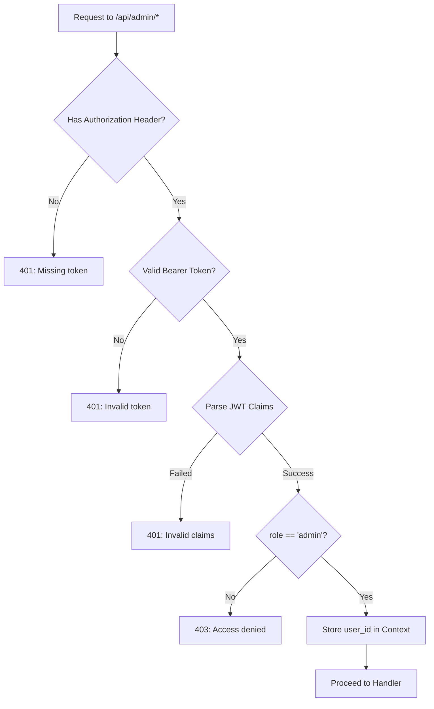

# Dokumentasi Fitur: Admin User Management

> **Fokus Domain:** BACKEND  
> **Konteks:** Trace Upstream ke Downstream secara Semantik  
> **Scope:** Admin operations untuk manajemen pengguna

---

## Alur Data Semantik (Scope: BACKEND)

```
=== ADMIN LOGIN ===
[HTTP POST /api/admin/login]  
    -> [Controller: Parse Credentials]  
    -> [AuthService: LoginAdmin]  
        -> [Repository: Find User by Email]  
        -> [Validate: Password + Role = Admin]  
        -> [Generate: JWT with role=admin claim]  
    -> [HTTP Response dengan Token]

=== GET ALL USERS (Protected) ===
[HTTP GET /api/admin/users]  
    -> [Admin Middleware: Validate JWT + Admin Role]  
    -> [Controller: Parse Query Params]  
    -> [Service: GetAllUsers]  
        -> [Repository: FindAll/SearchUsers]  
            -> [Specifications: Pagination + OrderBy]  
        -> [Map: Entity -> DTO]  
    -> [HTTP Response dengan Paginated Users]

=== UPDATE USER (Protected) ===
[HTTP PUT /api/admin/users/:id]  
    -> [Admin Middleware: Validate JWT + Admin Role]  
    -> [Controller: Parse ID + Body]  
    -> [Service: UpdateUser]  
        -> [Repository: FindOne by ID]  
        -> [Update: Fields from Request]  
        -> [Repository: Save Changes]  
        -> [Logger: Audit Log]  
    -> [HTTP Response dengan Updated User]

=== DELETE USER (Protected) ===
[HTTP DELETE /api/admin/users/:id]  
    -> [Admin Middleware: Validate JWT + Admin Role]  
    -> [Controller: Parse ID]  
    -> [Service: DeleteUser]  
        -> [Repository: Soft Delete]  
        -> [Logger: Audit Log]  
    -> [HTTP Response Success]
```

---

## A. Laporan Implementasi Fitur Admin User Management

### Deskripsi Fungsional

Fitur ini menyediakan kemampuan manajemen pengguna untuk administrator. Semua endpoint dilindungi oleh **custom admin middleware** yang memvalidasi JWT token dan memastikan claim `role=admin`. Sistem mengimplementasikan:

1. **Admin Login**: Autentikasi khusus admin dengan validasi role
2. **GetAllUsers**: List semua user dengan pagination, sorting, dan search
3. **GetUserDetail**: Detail profil user termasuk usage statistics
4. **UpdateUser**: Modifikasi data user (nama, email, role, status, avatar)
5. **UpdateUserStatus**: Quick action untuk update status saja
6. **DeleteUser**: Soft-delete user dengan audit logging

Semua operasi sensitif dicatat ke sistem logging untuk audit trail.

### Visualisasi

**User List Response:**
```json
{
    "success": true,
    "code": 200,
    "message": "User list",
    "data": [
        {
            "id": "550e8400-e29b-41d4-a716-446655440000",
            "email": "john.doe@example.com",
            "full_name": "John Doe",
            "role": "user",
            "status": "active",
            "created_at": "2024-01-15T10:00:00Z"
        },
        {
            "id": "660e8400-e29b-41d4-a716-446655440001",
            "email": "jane.smith@example.com",
            "full_name": "Jane Smith",
            "role": "admin",
            "status": "active",
            "created_at": "2024-02-20T14:30:00Z"
        }
    ]
}
```

**User Detail Response:**
```json
{
    "success": true,
    "code": 200,
    "message": "User detail",
    "data": {
        "id": "550e8400-e29b-41d4-a716-446655440000",
        "email": "john.doe@example.com",
        "full_name": "John Doe",
        "role": "user",
        "status": "active",
        "avatar_url": "http://localhost:3000/uploads/avatars/john.jpg",
        "ai_daily_usage": 5,
        "created_at": "2024-01-15T10:00:00Z"
    }
}
```
*Caption: Gambar 1: Response untuk User List dan User Detail.*

---

## B. Bedah Arsitektur & Komponen

Berikut adalah rincian 15 komponen yang menyusun fitur ini di sisi BACKEND.

---

### [internal/server/server.go](file:///d:/notetaker/notefiber-BE/internal/server/server.go)
**Layer Terdeteksi:** `HTTP Server & Route Registration`

**Narasi Operasional:**
Komponen ini menginisialisasi server dan mendaftarkan [AdminController](file:///d:/notetaker/notefiber-BE/internal/controller/admin_controller.go#17-56). Semua route admin dikelompokkan di bawah prefix `/api/admin` dengan custom admin middleware untuk validasi role.

```go
func registerRoutes(app *fiber.App, c *bootstrap.Container) {
	api := app.Group("/api")

	c.AdminController.RegisterRoutes(api)
	// ... other controllers
}
```
*Caption: Snippet 1: Registrasi AdminController ke grup API.*

---

### [internal/bootstrap/container.go](file:///d:/notetaker/notefiber-BE/internal/bootstrap/container.go)
**Layer Terdeteksi:** `Dependency Injection Container`

**Narasi Operasional:**
[AdminController](file:///d:/notetaker/notefiber-BE/internal/controller/admin_controller.go#17-56) diinisialisasi dengan dua dependensi: [AdminService](file:///d:/notetaker/notefiber-BE/internal/service/admin_service.go#25-72) untuk operasi CRUD dan [AuthService](file:///d:/notetaker/notefiber-BE/internal/service/auth_service.go#26-35) untuk login admin. [AdminService](file:///d:/notetaker/notefiber-BE/internal/service/admin_service.go#25-72) menerima `uowFactory` dan `logger` untuk audit trail.

```go
func NewContainer(db *gorm.DB, cfg *config.Config) *Container {
	// 1. Core Facades
	uowFactory := unitofwork.NewRepositoryFactory(db)
	logger := logger.NewLogger()

	// 3. Services
	authService := service.NewAuthService(uowFactory, emailService)
	adminService := service.NewAdminService(uowFactory, logger)

	// 4. Controllers
	return &Container{
		AdminController: controller.NewAdminController(adminService, authService),
		// ...
	}
}
```
*Caption: Snippet 2: Konstruksi AdminController dengan AdminService dan AuthService.*

---

### [internal/dto/admin_dto.go](file:///d:/notetaker/notefiber-BE/internal/dto/admin_dto.go)
**Layer Terdeteksi:** `Data Transfer Object (DTO)`

**Narasi Operasional:**
File ini mendefinisikan kontrak data untuk operasi admin. [UserListResponse](file:///d:/notetaker/notefiber-BE/internal/dto/admin_dto.go#19-27) untuk list view, [AdminUpdateUserRequest](file:///d:/notetaker/notefiber-BE/internal/dto/admin_dto.go#33-40) untuk update dengan validasi role dan status, dan [UpdateUserStatusRequest](file:///d:/notetaker/notefiber-BE/internal/dto/admin_dto.go#28-32) untuk quick status change.

```go
type UserListResponse struct {
	Id        uuid.UUID `json:"id"`
	Email     string    `json:"email"`
	FullName  string    `json:"full_name"`
	Role      string    `json:"role"`
	Status    string    `json:"status"`
	CreatedAt time.Time `json:"created_at"`
}

type AdminUpdateUserRequest struct {
	FullName string `json:"full_name"`
	Email    string `json:"email" validate:"omitempty,email"`
	Role     string `json:"role" validate:"omitempty,oneof=user admin"`
	Status   string `json:"status" validate:"omitempty,oneof=active pending banned"`
	Avatar   string `json:"avatar"`
}

type UpdateUserStatusRequest struct {
	Status string `json:"status" validate:"required,oneof=active pending banned"`
	Reason string `json:"reason,omitempty"`
}
```
*Caption: Snippet 3: DTO untuk User Management operations.*

---

### [internal/controller/admin_controller.go](file:///d:/notetaker/notefiber-BE/internal/controller/admin_controller.go)
**Layer Terdeteksi:** `Interface / Controller Layer`

**Narasi Operasional:**
Komponen ini menangani semua endpoints admin dengan custom [adminMiddleware](file:///d:/notetaker/notefiber-BE/internal/controller/admin_controller.go#69-116) yang memvalidasi JWT dan role. Middleware mengekstrak `role` dari claims dan memastikan nilainya adalah `"admin"`. Handler menggunakan pagination dari query params dan path params untuk user ID.

```go
// Custom Admin Middleware
func (c *adminController) adminMiddleware(ctx *fiber.Ctx) error {
	authHeader := ctx.Get("Authorization")
	if len(authHeader) < 7 || authHeader[:7] != "Bearer " {
		return ctx.Status(fiber.StatusUnauthorized).JSON(serverutils.ErrorResponse(401, "Missing or invalid authorization header"))
	}
	tokenStr := authHeader[7:]

	token, err := jwt.Parse(tokenStr, func(t *jwt.Token) (interface{}, error) {
		return []byte(os.Getenv("JWT_SECRET")), nil
	})

	if err != nil || token == nil || !token.Valid {
		return ctx.Status(fiber.StatusUnauthorized).JSON(serverutils.ErrorResponse(401, "Invalid or expired token"))
	}

	claims, ok := token.Claims.(jwt.MapClaims)
	if !ok {
		return ctx.Status(fiber.StatusUnauthorized).JSON(serverutils.ErrorResponse(401, "Invalid token claims"))
	}

	// Check admin role
	role, ok := claims["role"].(string)
	if !ok || role != "admin" {
		return ctx.Status(fiber.StatusForbidden).JSON(serverutils.ErrorResponse(403, "Access denied: Admins only"))
	}

	// Store user_id in context
	if userId, exists := claims["user_id"]; exists {
		ctx.Locals("user_id", userId)
	}

	return ctx.Next()
}

func (c *adminController) RegisterRoutes(r fiber.Router) {
	h := r.Group("/admin")

	// Public Admin Route (Login)
	h.Post("/login", c.Login)

	// Protected Routes
	h.Use(c.adminMiddleware)

	// Users
	h.Get("/users", c.GetAllUsers)
	h.Get("/users/:id", c.GetUserDetail)
	h.Put("/users/:id", c.UpdateUser)
	h.Put("/users/:id/status", c.UpdateUserStatus)
	h.Delete("/users/:id", c.DeleteUser)
}

func (c *adminController) GetAllUsers(ctx *fiber.Ctx) error {
	page, _ := strconv.Atoi(ctx.Query("page", "1"))
	limit, _ := strconv.Atoi(ctx.Query("limit", "10"))
	search := ctx.Query("q", "")

	users, err := c.service.GetAllUsers(ctx.Context(), page, limit, search)
	if err != nil {
		return ctx.Status(fiber.StatusInternalServerError).JSON(serverutils.ErrorResponse(500, err.Error()))
	}
	return ctx.JSON(serverutils.SuccessResponse("User list", users))
}

func (c *adminController) UpdateUser(ctx *fiber.Ctx) error {
	idParam := ctx.Params("id")
	userId, err := uuid.Parse(idParam)
	if err != nil {
		return ctx.Status(fiber.StatusBadRequest).JSON(serverutils.ErrorResponse(400, "Invalid User ID"))
	}

	var req dto.AdminUpdateUserRequest
	if err := ctx.BodyParser(&req); err != nil {
		return ctx.Status(fiber.StatusBadRequest).JSON(serverutils.ErrorResponse(400, "Invalid request body"))
	}

	res, err := c.service.UpdateUser(ctx.Context(), userId, req)
	if err != nil {
		return ctx.Status(fiber.StatusInternalServerError).JSON(serverutils.ErrorResponse(500, err.Error()))
	}
	return ctx.JSON(serverutils.SuccessResponse("User updated", res))
}

func (c *adminController) DeleteUser(ctx *fiber.Ctx) error {
	idParam := ctx.Params("id")
	userId, _ := uuid.Parse(idParam)

	if err := c.service.DeleteUser(ctx.Context(), userId); err != nil {
		return ctx.Status(fiber.StatusInternalServerError).JSON(serverutils.ErrorResponse(500, err.Error()))
	}
	return ctx.JSON(serverutils.SuccessResponse[any]("User deleted", nil))
}
```
*Caption: Snippet 4: Controller dengan admin middleware dan CRUD handlers.*

---

### [internal/service/admin_service.go](file:///d:/notetaker/notefiber-BE/internal/service/admin_service.go)
**Layer Terdeteksi:** `Business Logic / Service Layer`

**Narasi Operasional:**
Komponen ini mengenkapsulasi logika bisnis untuk admin operations.

**GetAllUsers**: Mendukung pagination dan search. Jika search query ada, menggunakan [SearchUsers](file:///d:/notetaker/notefiber-BE/internal/repository/contract/user_repository.go#44-46), otherwise [FindAll](file:///d:/notetaker/notefiber-BE/internal/repository/contract/notebook_repository.go#17-18) dengan specifications.

**UpdateUser**: Fetch user, partial update berdasarkan field yang ada di request, dan persist.

**UpdateUserStatus**: Quick action untuk update status saja dengan logging.

**DeleteUser**: Soft-delete user dengan audit logging.

```go
func (s *adminService) GetAllUsers(ctx context.Context, page, limit int, search string) ([]*dto.UserListResponse, error) {
	if page < 1 {
		page = 1
	}
	if limit < 1 {
		limit = 10
	}
	offset := (page - 1) * limit

	uow := s.uowFactory.NewUnitOfWork(ctx)
	var users []*entity.User
	var err error

	if search != "" {
		users, err = uow.UserRepository().SearchUsers(ctx, search, limit, offset)
	} else {
		users, err = uow.UserRepository().FindAll(ctx,
			specification.Pagination{Limit: limit, Offset: offset},
			specification.OrderBy{Field: "created_at", Desc: true},
		)
	}

	if err != nil {
		return nil, err
	}

	var res []*dto.UserListResponse
	for _, u := range users {
		res = append(res, &dto.UserListResponse{
			Id:        u.Id,
			Email:     u.Email,
			FullName:  u.FullName,
			Role:      string(u.Role),
			Status:    string(u.Status),
			CreatedAt: u.CreatedAt,
		})
	}
	return res, nil
}

func (s *adminService) GetUserDetail(ctx context.Context, userId uuid.UUID) (*dto.UserProfileResponse, error) {
	uow := s.uowFactory.NewUnitOfWork(ctx)
	user, err := uow.UserRepository().FindOne(ctx, specification.ByID{ID: userId})
	if err != nil || user == nil {
		return nil, err
	}

	return &dto.UserProfileResponse{
		Id:           user.Id,
		Email:        user.Email,
		FullName:     user.FullName,
		Role:         string(user.Role),
		Status:       string(user.Status),
		AiDailyUsage: user.AiDailyUsage,
		CreatedAt:    user.CreatedAt,
	}, nil
}

func (s *adminService) UpdateUser(ctx context.Context, userId uuid.UUID, req dto.AdminUpdateUserRequest) (*dto.UserProfileResponse, error) {
	uow := s.uowFactory.NewUnitOfWork(ctx)

	user, err := uow.UserRepository().FindOne(ctx, specification.ByID{ID: userId})
	if err != nil || user == nil {
		return nil, fmt.Errorf("user not found")
	}

	// Partial Update - only update fields that are present
	if req.FullName != "" {
		user.FullName = req.FullName
	}
	if req.Email != "" {
		user.Email = req.Email
	}
	if req.Role != "" {
		user.Role = entity.UserRole(req.Role)
	}
	if req.Status != "" {
		user.Status = entity.UserStatus(req.Status)
	}
	if req.Avatar != "" {
		user.AvatarURL = &req.Avatar
	}

	if err := uow.UserRepository().Update(ctx, user); err != nil {
		return nil, err
	}

	return &dto.UserProfileResponse{
		Id:       user.Id,
		Email:    user.Email,
		FullName: user.FullName,
		Role:     string(user.Role),
		Status:   string(user.Status),
	}, nil
}

func (s *adminService) UpdateUserStatus(ctx context.Context, userId uuid.UUID, status string) error {
	s.logger.Info("ADMIN", "Updated user status", map[string]interface{}{
		"userId": userId.String(),
		"status": status,
		"admin":  "system",
	})
	uow := s.uowFactory.NewUnitOfWork(ctx)
	return uow.UserRepository().UpdateStatus(ctx, userId, status)
}

func (s *adminService) DeleteUser(ctx context.Context, userId uuid.UUID) error {
	uow := s.uowFactory.NewUnitOfWork(ctx)

	// Audit Log
	s.logger.Info("ADMIN", "Deleted User", map[string]interface{}{
		"userId": userId.String(),
	})

	return uow.UserRepository().Delete(ctx, userId)
}
```
*Caption: Snippet 5: Service dengan partial update dan audit logging.*

---

### [internal/service/auth_service.go](file:///d:/notetaker/notefiber-BE/internal/service/auth_service.go)
**Layer Terdeteksi:** `Business Logic / Service Layer - Auth`

**Narasi Operasional:**
Metode [LoginAdmin](file:///d:/notetaker/notefiber-BE/internal/service/auth_service.go#262-352) memvalidasi credentials dan memastikan user memiliki role [admin](file:///d:/notetaker/notefiber-BE/internal/service/admin_service.go#73-77). JWT token yang di-generate menyertakan `role` claim untuk validasi di middleware.

```go
func (s *authService) LoginAdmin(ctx context.Context, req *dto.LoginRequest, ipAddress, userAgent string) (*dto.LoginResponse, error) {
	uow := s.uowFactory.NewUnitOfWork(ctx)

	// 1. Find user by email
	user, err := uow.UserRepository().FindOne(ctx, specification.ByEmail{Email: req.Email})
	if err != nil || user == nil {
		return nil, fmt.Errorf("invalid credentials")
	}

	// 2. Verify password
	if err := bcrypt.CompareHashAndPassword([]byte(*user.PasswordHash), []byte(req.Password)); err != nil {
		return nil, fmt.Errorf("invalid credentials")
	}

	// 3. Check admin role
	if user.Role != entity.UserRoleAdmin {
		return nil, fmt.Errorf("access denied: admin role required")
	}

	// 4. Generate JWT with role claim
	token := jwt.NewWithClaims(jwt.SigningMethodHS256, jwt.MapClaims{
		"user_id": user.Id.String(),
		"email":   user.Email,
		"role":    string(user.Role), // Include role for middleware validation
		"exp":     time.Now().Add(24 * time.Hour).Unix(),
	})

	tokenString, err := token.SignedString([]byte(os.Getenv("JWT_SECRET")))
	if err != nil {
		return nil, err
	}

	return &dto.LoginResponse{
		Token: tokenString,
		User: dto.UserDTO{
			Id:       user.Id,
			Email:    user.Email,
			FullName: user.FullName,
			Role:     string(user.Role),
		},
	}, nil
}
```
*Caption: Snippet 6: LoginAdmin dengan role validation dan JWT generation.*

---

### [internal/repository/unitofwork/unit_of_work.go](file:///d:/notetaker/notefiber-BE/internal/repository/unitofwork/unit_of_work.go)
**Layer Terdeteksi:** `Unit of Work Interface`

**Narasi Operasional:**
Untuk Admin User Management, [UserRepository](file:///d:/notetaker/notefiber-BE/internal/repository/unitofwork/unit_of_work.go#14-15) adalah dependensi utama dengan metode tambahan untuk search dan status update.

```go
type UnitOfWork interface {
	Begin(ctx context.Context) error
	Commit() error
	Rollback() error

	UserRepository() contract.UserRepository
	// ...
}
```
*Caption: Snippet 7: Interface Unit of Work dengan akses ke UserRepository.*

---

### [internal/repository/contract/user_repository.go](file:///d:/notetaker/notefiber-BE/internal/repository/contract/user_repository.go)
**Layer Terdeteksi:** `Repository Interface / Contract`

**Narasi Operasional:**
Untuk Admin operations, beberapa metode khusus ditambahkan: [SearchUsers](file:///d:/notetaker/notefiber-BE/internal/repository/contract/user_repository.go#44-46) untuk pencarian, [UpdateStatus](file:///d:/notetaker/notefiber-BE/internal/repository/implementation/user_repository_impl.go#228-231) untuk quick status change, [Count](file:///d:/notetaker/notefiber-BE/internal/repository/contract/user_repository.go#19-20) dan [CountByStatus](file:///d:/notetaker/notefiber-BE/internal/repository/contract/user_repository.go#47-48) untuk dashboard statistics, dan [GetUserGrowth](file:///d:/notetaker/notefiber-BE/internal/repository/implementation/user_repository_impl.go#266-277) untuk analytics.

```go
type UserRepository interface {
	// Standard CRUD
	Create(ctx context.Context, user *entity.User) error
	Update(ctx context.Context, user *entity.User) error
	Delete(ctx context.Context, id uuid.UUID) error
	FindOne(ctx context.Context, specs ...specification.Specification) (*entity.User, error)
	FindAll(ctx context.Context, specs ...specification.Specification) ([]*entity.User, error)

	// Admin-specific methods
	SearchUsers(ctx context.Context, query string, limit, offset int) ([]*entity.User, error)
	UpdateStatus(ctx context.Context, userId uuid.UUID, status string) error
	Count(ctx context.Context, specs ...specification.Specification) (int64, error)
	CountByStatus(ctx context.Context, status string) (int64, error)
	GetUserGrowth(ctx context.Context) ([]map[string]interface{}, error)
}
```
*Caption: Snippet 8: Kontrak repository dengan metode Admin-specific.*

---

### [internal/repository/specification/common_specifications.go](file:///d:/notetaker/notefiber-BE/internal/repository/specification/common_specifications.go)
**Layer Terdeteksi:** `Specification Implementation`

**Narasi Operasional:**
Untuk Admin operations, [Pagination](file:///d:/notetaker/notefiber-BE/internal/repository/specification/common_specifications.go#52-56) dan [OrderBy](file:///d:/notetaker/notefiber-BE/internal/repository/specification/common_specifications.go#29-33) digunakan untuk list users dengan sorting dan paging.

```go
type Pagination struct {
	Limit  int
	Offset int
}

func (s Pagination) Apply(db *gorm.DB) *gorm.DB {
	return db.Limit(s.Limit).Offset(s.Offset)
}

type OrderBy struct {
	Field string
	Desc  bool
}

func (s OrderBy) Apply(db *gorm.DB) *gorm.DB {
	order := s.Field
	if s.Desc {
		order += " DESC"
	}
	return db.Order(order)
}
```
*Caption: Snippet 9: Specifications untuk pagination dan sorting.*

---

### [internal/repository/implementation/user_repository_impl.go](file:///d:/notetaker/notefiber-BE/internal/repository/implementation/user_repository_impl.go)
**Layer Terdeteksi:** `Repository Implementation`

**Narasi Operasional:**
[SearchUsers](file:///d:/notetaker/notefiber-BE/internal/repository/contract/user_repository.go#44-46) menggunakan LIKE query untuk mencari berdasarkan email atau nama. [UpdateStatus](file:///d:/notetaker/notefiber-BE/internal/repository/implementation/user_repository_impl.go#228-231) melakukan partial update hanya pada kolom status. [Delete](file:///d:/notetaker/notefiber-BE/internal/controller/notebook_controller.go#17-18) menggunakan soft-delete bawaan GORM.

```go
func (r *UserRepositoryImpl) SearchUsers(ctx context.Context, query string, limit, offset int) ([]*entity.User, error) {
	var models []*model.User
	searchTerm := "%" + query + "%"

	if err := r.db.WithContext(ctx).
		Where("email LIKE ? OR full_name LIKE ?", searchTerm, searchTerm).
		Order("created_at DESC").
		Limit(limit).
		Offset(offset).
		Find(&models).Error; err != nil {
		return nil, err
	}

	return r.mapper.ToEntities(models), nil
}

func (r *UserRepositoryImpl) UpdateStatus(ctx context.Context, userId uuid.UUID, status string) error {
	return r.db.WithContext(ctx).
		Model(&model.User{}).
		Where("id = ?", userId).
		UpdateColumn("status", status).Error
}

func (r *UserRepositoryImpl) Delete(ctx context.Context, id uuid.UUID) error {
	return r.db.WithContext(ctx).Delete(&model.User{}, id).Error
}

func (r *UserRepositoryImpl) FindAll(ctx context.Context, specs ...specification.Specification) ([]*entity.User, error) {
	var models []*model.User
	query := r.applySpecifications(r.db.WithContext(ctx), specs...)
	if err := query.Find(&models).Error; err != nil {
		return nil, err
	}
	return r.mapper.ToEntities(models), nil
}
```
*Caption: Snippet 10: Implementasi repository dengan search dan status update.*

---

### [internal/entity/user_entity.go](file:///d:/notetaker/notefiber-BE/internal/entity/user_entity.go)
**Layer Terdeteksi:** `Domain Entity`

**Narasi Operasional:**
Entity [User](file:///d:/notetaker/notefiber-BE/internal/entity/user_entity.go#22-38) mendefinisikan enum untuk [UserRole](file:///d:/notetaker/notefiber-BE/internal/entity/user_entity.go#10-11) (user, admin) dan [UserStatus](file:///d:/notetaker/notefiber-BE/internal/entity/user_entity.go#11-12) (pending, active, blocked). Administrator dapat mengubah nilai-nilai ini melalui Admin panel.

```go
type UserRole string
type UserStatus string

const (
	UserRoleUser  UserRole = "user"
	UserRoleAdmin UserRole = "admin"

	UserStatusPending UserStatus = "pending"
	UserStatusActive  UserStatus = "active"
	UserStatusBlocked UserStatus = "blocked"
)

type User struct {
	Id            uuid.UUID
	Email         string
	PasswordHash  *string
	FullName      string
	Role          UserRole
	Status        UserStatus
	EmailVerified bool
	AvatarURL     *string
	AiDailyUsage  int
	CreatedAt     time.Time
	UpdatedAt     *time.Time
	DeletedAt     *time.Time
}
```
*Caption: Snippet 11: Entity domain dengan Role dan Status enums.*

---

### `internal/pkg/logger/logger.go`
**Layer Terdeteksi:** `Logging / Audit Trail`

**Narasi Operasional:**
Logger digunakan oleh AdminService untuk mencatat aksi-aksi sensitif seperti update status dan delete user. Log mencakup userId dan detail aksi untuk audit compliance.

```go
type ILogger interface {
	Info(module, message string, details map[string]interface{})
	Warn(module, message string, details map[string]interface{})
	Error(module, message string, details map[string]interface{})
	GetLogs(level string, limit, offset int) ([]*LogEntry, error)
	GetLogById(id string) (*LogEntry, error)
}

// Usage in AdminService
s.logger.Info("ADMIN", "Updated user status", map[string]interface{}{
	"userId": userId.String(),
	"status": status,
	"admin":  "system",
})

s.logger.Info("ADMIN", "Deleted User", map[string]interface{}{
	"userId": userId.String(),
})
```
*Caption: Snippet 12: Logger interface dan usage untuk audit trail.*

---

## C. Ringkasan Layer Arsitektur

| No | Layer | File | Tanggung Jawab |
|----|-------|------|----------------|
| 1 | HTTP Server | [server/server.go](file:///d:/notetaker/notefiber-BE/internal/server/server.go) | Route registration |
| 2 | DI Container | [bootstrap/container.go](file:///d:/notetaker/notefiber-BE/internal/bootstrap/container.go) | Dependency wiring |
| 3 | Admin DTO | [dto/admin_dto.go](file:///d:/notetaker/notefiber-BE/internal/dto/admin_dto.go) | Kontrak data User Management |
| 4 | Admin Controller | [controller/admin_controller.go](file:///d:/notetaker/notefiber-BE/internal/controller/admin_controller.go) | Handlers + **Admin Middleware** |
| 5 | Admin Service | [service/admin_service.go](file:///d:/notetaker/notefiber-BE/internal/service/admin_service.go) | CRUD logic + **Audit Logging** |
| 6 | Auth Service | [service/auth_service.go](file:///d:/notetaker/notefiber-BE/internal/service/auth_service.go) | Admin Login + JWT generation |
| 7 | Factory Interface | [unitofwork/repository_factory.go](file:///d:/notetaker/notefiber-BE/internal/repository/unitofwork/repository_factory.go) | Kontrak Unit of Work |
| 8 | UoW Interface | [unitofwork/unit_of_work.go](file:///d:/notetaker/notefiber-BE/internal/repository/unitofwork/unit_of_work.go) | Repository access |
| 9 | UoW Impl | [unitofwork/unit_of_work_impl.go](file:///d:/notetaker/notefiber-BE/internal/repository/unitofwork/unit_of_work_impl.go) | Transaction management |
| 10 | User Contract | [contract/user_repository.go](file:///d:/notetaker/notefiber-BE/internal/repository/contract/user_repository.go) | Interface dengan Admin methods |
| 11 | Common Specs | [specification/common_specifications.go](file:///d:/notetaker/notefiber-BE/internal/repository/specification/common_specifications.go) | [Pagination](file:///d:/notetaker/notefiber-BE/internal/repository/specification/common_specifications.go#52-56), [OrderBy](file:///d:/notetaker/notefiber-BE/internal/repository/specification/common_specifications.go#29-33) |
| 12 | User Impl | [implementation/user_repository_impl.go](file:///d:/notetaker/notefiber-BE/internal/repository/implementation/user_repository_impl.go) | **SearchUsers**, **UpdateStatus** |
| 13 | Entity | [entity/user_entity.go](file:///d:/notetaker/notefiber-BE/internal/entity/user_entity.go) | Domain dengan Role/Status enums |
| 14 | Model | [model/user_model.go](file:///d:/notetaker/notefiber-BE/internal/model/user_model.go) | Database mapping |
| 15 | Logger | `pkg/logger/logger.go` | Audit trail |

---

## D. Endpoint API Reference

| Method | Endpoint | Deskripsi | Auth |
|--------|----------|-----------|------|
| `POST` | `/api/admin/login` | Admin authentication | Public |
| `GET` | `/api/admin/users` | List all users (paginated) | Admin JWT |
| `GET` | `/api/admin/users/:id` | Get user detail | Admin JWT |
| `PUT` | `/api/admin/users/:id` | Update user data | Admin JWT |
| `PUT` | `/api/admin/users/:id/status` | Quick status update | Admin JWT |
| `DELETE` | `/api/admin/users/:id` | Delete user (soft-delete) | Admin JWT |

### Query Parameters (GET /users)

| Parameter | Type | Default | Deskripsi |
|-----------|------|---------|-----------|
| `page` | int | 1 | Page number |
| `limit` | int | 10 | Items per page |
| `q` | string | - | Search by email or name |

---

## E. Admin Middleware Flow


*Caption: Diagram 1: Flow validasi Admin Middleware.*

---

## F. User Status Lifecycle

| Status | Deskripsi | Allowed Transitions |
|--------|-----------|---------------------|
| `pending` | Akun baru, belum diverifikasi | → `active`, → `blocked` |
| `active` | Akun aktif, dapat login | → `blocked`, → `pending` |
| `blocked` | Akun diblokir, tidak dapat login | → `active` |

---

## G. Audit Logging

| Aksi | Log Module | Log Content |
|------|------------|-------------|
| Update Status | `ADMIN` | userId, newStatus, admin |
| Delete User | `ADMIN` | userId |
| Upgrade Subscription | `ADMIN` | userId, newPlan, credit |
| Refund Subscription | `ADMIN` | subscriptionId, refundId, amount, reason |

```go
// Example log entry structure
{
    "id": "md5hash...",
    "level": "INFO",
    "module": "ADMIN",
    "message": "Updated user status",
    "details": {
        "userId": "550e8400-...",
        "status": "blocked",
        "admin": "system"
    },
    "timestamp": "2024-12-25T01:00:00Z"
}
```

---

## H. Security Considerations

| Aspek | Implementasi |
|-------|--------------|
| **Role-Based Access** | Custom middleware validates `role=admin` claim |
| **JWT Validation** | Token parsing with secret verification |
| **Soft Delete** | Users are not permanently removed |
| **Audit Trail** | All sensitive actions are logged |
| **Partial Update** | Only provided fields are updated |
| **Status Validation** | Allowed values: `active`, `pending`, `banned` |

---

*Dokumen ini di-generate dalam mode READ-ONLY tanpa modifikasi terhadap kode sumber.*
