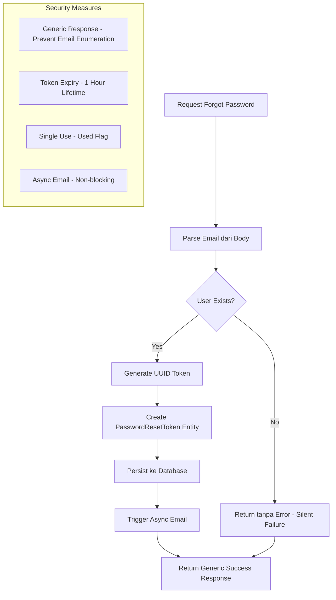

# Dokumentasi Fitur: Authentikasi - Forgot Password

> **Fokus Domain:** BACKEND  
> **Konteks:** Trace Upstream ke Downstream secara Semantik

---

## Alur Data Semantik (Scope: BACKEND)

```
[HTTP Request POST /api/auth/forgot-password]  
    -> [Server: Routing & Middleware]  
    -> [Controller: Parsing Email]  
    -> [Service: Orkestrasi Logika Reset Password]  
        -> [Unit of Work: Akses Repository]  
            -> [Repository: Pencarian User by Email]  
                -> [Mapper: Transformasi Model -> Entity]  
                    -> [Database: Query Data]  
        -> [Generasi Token: UUID Random]  
        -> [Persistensi Token: Password Reset Token]  
            -> [Repository: Create Token]  
                -> [Mapper: Entity -> Model]  
                    -> [Database: Insert Data]  
        -> [Mailer: Pengiriman Email dengan Link Reset (Async)]  
    -> [HTTP Response JSON (Generic Success)]
```

---

## A. Laporan Implementasi Fitur Forgot Password

### Deskripsi Fungsional

Fitur ini menyediakan mekanisme pemulihan akun bagi pengguna yang lupa kata sandi. Secara operasional, sistem menerima alamat email, memvalidasi keberadaannya di database, dan jika ditemukan, menghasilkan token reset unik (UUID) dengan masa berlaku terbatas (1 jam). Token ini dipersistenkan ke database untuk validasi saat proses reset, kemudian dikirimkan ke email pengguna dalam bentuk link yang mengarah ke halaman frontend reset password. Untuk alasan keamanan, sistem selalu mengembalikan respons sukses generik terlepas dari apakah email terdaftar atau tidak, sehingga mencegah enumerasi akun (user enumeration attack).

### Visualisasi

```json
{
    "success": true,
    "code": 200,
    "message": "If email exists, reset token sent",
    "data": null
}
```
*Caption: Gambar 1: Struktur JSON Response generik yang tidak mengekspos keberadaan email untuk keamanan.*

**Email yang Diterima Pengguna:**

```
Subject: Reset Your Password

You requested to reset your password. Click the button below to proceed:

[Reset Password Button -> https://app.notefiber.com/reset-password?token=550e8400-e29b-41d4-a716...]

This link will expire in 1 hour.
If you didn't request this, please ignore this email.
```
*Caption: Gambar 2: Format email reset password yang dikirim ke pengguna.*

---

## B. Bedah Arsitektur & Komponen

Berikut adalah rincian 14 komponen yang menyusun fitur ini di sisi BACKEND, diurutkan dari upstream (penerima request) ke downstream (pengiriman email).

---

### [internal/server/server.go](file:///d:/notetaker/notefiber-BE/internal/server/server.go)
**Layer Terdeteksi:** `HTTP Server & Route Registration`

**Narasi Operasional:**
Komponen ini menginisialisasi instance server HTTP berbasis Fiber dan mendaftarkan seluruh middleware global (CORS, OpenTelemetry Tracing, Error Handler). Pada tahap bootstrap, ia menerima objek [Container](file:///d:/notetaker/notefiber-BE/internal/bootstrap/container.go#16-32) yang berisi semua controller yang sudah terinisialisasi, kemudian memanggil fungsi [registerRoutes](file:///d:/notetaker/notefiber-BE/internal/server/server.go#64-80) untuk menghubungkan setiap controller dengan path HTTP yang sesuai. Untuk alur Forgot Password, [AuthController](file:///d:/notetaker/notefiber-BE/internal/controller/auth_controller.go#11-20) didaftarkan pada grup `/api`, sehingga endpoint `/api/auth/forgot-password` menjadi aktif.

```go
func registerRoutes(app *fiber.App, c *bootstrap.Container) {
	api := app.Group("/api")

	c.AuthController.RegisterRoutes(api)
	c.UserController.RegisterRoutes(api)
	c.OAuthController.RegisterRoutes(api)
	// ... other controllers
}
```
*Caption: Snippet 1: Registrasi route controller ke grup API utama.*

---

### [internal/bootstrap/container.go](file:///d:/notetaker/notefiber-BE/internal/bootstrap/container.go)
**Layer Terdeteksi:** `Dependency Injection Container`

**Narasi Operasional:**
File ini mengorkestrasi konstruksi dan injeksi dependensi seluruh komponen aplikasi. Untuk fitur Forgot Password, [AuthService](file:///d:/notetaker/notefiber-BE/internal/service/auth_service.go#26-35) diinisialisasi dengan dua dependensi kritis: `uowFactory` (untuk akses repository dan persistensi token) dan [emailService](file:///d:/notetaker/notefiber-BE/internal/pkg/mailer/email_service.go#16-21) (untuk pengiriman email reset). Kedua dependensi ini diinjeksikan ke [AuthController](file:///d:/notetaker/notefiber-BE/internal/controller/auth_controller.go#11-20) yang kemudian menangani endpoint forgot-password.

```go
func NewContainer(db *gorm.DB, cfg *config.Config) *Container {
	// 1. Core Facades
	uowFactory := unitofwork.NewRepositoryFactory(db)
	emailService := mailer.NewEmailService(
		cfg.SMTP.Host, cfg.SMTP.Port, cfg.SMTP.Email, cfg.SMTP.Password, cfg.SMTP.SenderName,
	)

	// 3. Services
	authService := service.NewAuthService(uowFactory, emailService)

	// 4. Controllers
	return &Container{
		AuthController: controller.NewAuthController(authService),
		// ...
	}
}
```
*Caption: Snippet 2: Konstruksi dependensi dengan EmailService untuk fitur reset password.*

---

### [internal/dto/auth_payment_dto.go](file:///d:/notetaker/notefiber-BE/internal/dto/auth_payment_dto.go)
**Layer Terdeteksi:** `Data Transfer Object (DTO)`

**Narasi Operasional:**
File ini mendefinisikan kontrak data untuk request forgot password. Struktur [ForgotPasswordRequest](file:///d:/notetaker/notefiber-BE/internal/dto/auth_payment_dto.go#49-52) sangat sederhana, hanya membutuhkan satu field [email](file:///d:/notetaker/notefiber-BE/internal/pkg/mailer/email_service.go#16-21) dengan validasi format email. Tidak ada response DTO khusus karena endpoint ini mengembalikan respons generik tanpa data spesifik untuk mencegah information disclosure.

```go
type ForgotPasswordRequest struct {
	Email string `json:"email" validate:"required,email"`
}
```
*Caption: Snippet 3: Definisi struktur data request untuk forgot password.*

---

### [internal/controller/auth_controller.go](file:///d:/notetaker/notefiber-BE/internal/controller/auth_controller.go)
**Layer Terdeteksi:** `Interface / Controller Layer`

**Narasi Operasional:**
Komponen ini menangani siklus Request-Response HTTP untuk endpoint forgot-password. Fungsi [RegisterRoutes](file:///d:/notetaker/notefiber-BE/internal/controller/auth_controller.go#12-13) mendaftarkan path `/auth/forgot-password` dengan handler [ForgotPassword](file:///d:/notetaker/notefiber-BE/internal/service/auth_service.go#29-30). Saat request masuk, handler mem-parsing body JSON ke struktur [ForgotPasswordRequest](file:///d:/notetaker/notefiber-BE/internal/dto/auth_payment_dto.go#49-52), kemudian mendelegasikan ke [AuthService](file:///d:/notetaker/notefiber-BE/internal/service/auth_service.go#26-35). Yang unik dari handler ini adalah ia **selalu mengembalikan respons sukses** terlepas dari hasil eksekusi service (fire-and-forget pattern), demi mencegah attackers mengetahui email mana yang terdaftar di sistem.

```go
func (c *authController) RegisterRoutes(r fiber.Router) {
	h := r.Group("/auth")
	h.Post("/register", c.Register)
	h.Post("/verify-email", c.VerifyEmail)
	h.Post("/login", c.Login)
	h.Post("/forgot-password", c.ForgotPassword)
	h.Post("/reset-password", c.ResetPassword)
	h.Post("/logout", c.Logout)
}

func (c *authController) ForgotPassword(ctx *fiber.Ctx) error {
	var req dto.ForgotPasswordRequest
	if err := ctx.BodyParser(&req); err != nil {
		return err
	}

	c.service.ForgotPassword(ctx.Context(), &req)
	return ctx.JSON(fiber.Map{
		"success": true,
		"code":    200,
		"message": "If email exists, reset token sent",
		"data":    nil,
	})
}
```
*Caption: Snippet 4: Handler forgot-password dengan pola fire-and-forget untuk keamanan.*

---

### [internal/service/auth_service.go](file:///d:/notetaker/notefiber-BE/internal/service/auth_service.go)
**Layer Terdeteksi:** `Business Logic / Service Layer`

**Narasi Operasional:**
Komponen ini mengenkapsulasi logika pembuatan dan pengiriman token reset password. Alur eksekusi: (1) mencari user berdasarkan email melalui Unit of Work—jika tidak ditemukan, return tanpa error untuk mencegah information leakage, (2) menghasilkan token reset berupa UUID random, (3) membuat entity [PasswordResetToken](file:///d:/notetaker/notefiber-BE/internal/entity/user_entity.go#39-47) dengan masa berlaku 1 jam, (4) mempersistenkan token ke database, dan (5) memicu pengiriman email secara asynchronous (goroutine) agar tidak memblokir respons ke klien. Pendekatan async memastikan kegagalan email tidak mempengaruhi user experience.

```go
func (s *authService) ForgotPassword(ctx context.Context, req *dto.ForgotPasswordRequest) error {
	uow := s.uowFactory.NewUnitOfWork(ctx)
	user, err := uow.UserRepository().FindOne(ctx, specification.ByEmail{Email: req.Email})
	if err != nil || user == nil {
		// Don't leak exists - return nil without error
		return nil
	}

	token := uuid.New().String()
	resetToken := &entity.PasswordResetToken{
		Id:        uuid.New(),
		UserId:    user.Id,
		Token:     token,
		ExpiresAt: time.Now().Add(1 * time.Hour),
		CreatedAt: time.Now(),
		Used:      false,
	}

	err = uow.UserRepository().CreatePasswordResetToken(ctx, resetToken)
	if err != nil {
		return err
	}

	go func() {
		emailErr := s.emailService.SendResetToken(user.Email, token)
		if emailErr != nil {
			fmt.Printf("Error sending reset password email: %v\n", emailErr)
		}
	}()

	return nil
}
```
*Caption: Snippet 5: Logika bisnis dengan silent failure untuk keamanan dan async email delivery.*

---

### [internal/repository/unitofwork/repository_factory.go](file:///d:/notetaker/notefiber-BE/internal/repository/unitofwork/repository_factory.go)
**Layer Terdeteksi:** `Factory Interface`

**Narasi Operasional:**
File ini mendefinisikan kontrak untuk pembuatan instance Unit of Work. Interface [RepositoryFactory](file:///d:/notetaker/notefiber-BE/internal/repository/unitofwork/repository_factory.go#5-8) menyediakan metode [NewUnitOfWork](file:///d:/notetaker/notefiber-BE/internal/repository/unitofwork/repository_factory.go#6-7) yang digunakan oleh Service untuk mendapatkan akses ke repository tanpa coupling langsung ke implementasi database.

```go
type RepositoryFactory interface {
	NewUnitOfWork(ctx context.Context) UnitOfWork
}
```
*Caption: Snippet 6: Interface factory untuk pembuatan Unit of Work.*

---

### [internal/repository/unitofwork/repository_factory_impl.go](file:///d:/notetaker/notefiber-BE/internal/repository/unitofwork/repository_factory_impl.go)
**Layer Terdeteksi:** `Factory Implementation`

**Narasi Operasional:**
Komponen ini mengimplementasikan [RepositoryFactory](file:///d:/notetaker/notefiber-BE/internal/repository/unitofwork/repository_factory.go#5-8) dengan menyimpan referensi ke koneksi database GORM. Setiap panggilan [NewUnitOfWork](file:///d:/notetaker/notefiber-BE/internal/repository/unitofwork/repository_factory.go#6-7) menghasilkan instance baru yang isolated per-request.

```go
type RepositoryFactoryImpl struct {
	db *gorm.DB
}

func NewRepositoryFactory(db *gorm.DB) RepositoryFactory {
	return &RepositoryFactoryImpl{db: db}
}

func (f *RepositoryFactoryImpl) NewUnitOfWork(ctx context.Context) UnitOfWork {
	return NewUnitOfWork(f.db)
}
```
*Caption: Snippet 7: Implementasi factory yang mengenkapsulasi koneksi database.*

---

### [internal/repository/unitofwork/unit_of_work.go](file:///d:/notetaker/notefiber-BE/internal/repository/unitofwork/unit_of_work.go)
**Layer Terdeteksi:** `Unit of Work Interface`

**Narasi Operasional:**
File ini mendefinisikan kontrak untuk pola Unit of Work. Untuk alur Forgot Password, hanya [UserRepository](file:///d:/notetaker/notefiber-BE/internal/repository/unitofwork/unit_of_work.go#14-15) yang digunakan—untuk mencari user dan menyimpan token reset. Transaksi eksplisit tidak diperlukan karena operasinya bersifat single-write.

```go
type UnitOfWork interface {
	Begin(ctx context.Context) error
	Commit() error
	Rollback() error

	UserRepository() contract.UserRepository
	// ... other repositories
}
```
*Caption: Snippet 8: Interface Unit of Work untuk akses repository.*

---

### [internal/repository/unitofwork/unit_of_work_impl.go](file:///d:/notetaker/notefiber-BE/internal/repository/unitofwork/unit_of_work_impl.go)
**Layer Terdeteksi:** `Unit of Work Implementation`

**Narasi Operasional:**
Komponen ini mengimplementasikan pola Unit of Work dengan GORM. Accessor [UserRepository()](file:///d:/notetaker/notefiber-BE/internal/repository/unitofwork/unit_of_work.go#14-15) mengembalikan instance repository yang terhubung ke koneksi database.

```go
func (u *UnitOfWorkImpl) UserRepository() contract.UserRepository {
	return implementation.NewUserRepository(u.getDB())
}
```
*Caption: Snippet 9: Instansiasi UserRepository dari Unit of Work.*

---

### [internal/repository/contract/user_repository.go](file:///d:/notetaker/notefiber-BE/internal/repository/contract/user_repository.go)
**Layer Terdeteksi:** `Repository Interface / Contract`

**Narasi Operasional:**
File ini mendefinisikan kontrak untuk operasi data User termasuk manajemen token. Untuk alur Forgot Password, dua metode digunakan: [FindOne](file:///d:/notetaker/notefiber-BE/internal/repository/implementation/user_repository_impl.go#59-72) untuk mencari user berdasarkan email, dan [CreatePasswordResetToken](file:///d:/notetaker/notefiber-BE/internal/repository/contract/user_repository.go#20-24) untuk mempersistenkan token reset ke database.

```go
type UserRepository interface {
	FindOne(ctx context.Context, specs ...specification.Specification) (*entity.User, error)
	
	// Token Management
	CreatePasswordResetToken(ctx context.Context, token *entity.PasswordResetToken) error
	FindPasswordResetToken(ctx context.Context, specs ...specification.Specification) (*entity.PasswordResetToken, error)
	MarkTokenUsed(ctx context.Context, id uuid.UUID) error

	// ...
}
```
*Caption: Snippet 10: Kontrak repository untuk manajemen Password Reset Token.*

---

### [internal/repository/specification/user_specifications.go](file:///d:/notetaker/notefiber-BE/internal/repository/specification/user_specifications.go)
**Layer Terdeteksi:** `Specification Implementation`

**Narasi Operasional:**
Komponen ini menyediakan implementasi specification untuk pencarian. Untuk alur Forgot Password, [ByEmail](file:///d:/notetaker/notefiber-BE/internal/repository/specification/user_specifications.go#9-12) digunakan untuk mencari user berdasarkan email yang dikirimkan dalam request.

```go
type ByEmail struct { Email string }
func (s ByEmail) Apply(db *gorm.DB) *gorm.DB {
	return db.Where("email = ?", s.Email)
}
```
*Caption: Snippet 11: Specification untuk pencarian user berdasarkan email.*

---

### [internal/repository/implementation/user_repository_impl.go](file:///d:/notetaker/notefiber-BE/internal/repository/implementation/user_repository_impl.go)
**Layer Terdeteksi:** `Repository Implementation`

**Narasi Operasional:**
Komponen ini mengimplementasikan kontrak [UserRepository](file:///d:/notetaker/notefiber-BE/internal/repository/unitofwork/unit_of_work.go#14-15) dengan GORM. Untuk alur Forgot Password, metode [FindOne](file:///d:/notetaker/notefiber-BE/internal/repository/implementation/user_repository_impl.go#59-72) mencari user berdasarkan specification email, dan [CreatePasswordResetToken](file:///d:/notetaker/notefiber-BE/internal/repository/contract/user_repository.go#20-24) mempersistenkan entity token setelah ditransformasi ke Model oleh Mapper.

```go
func (r *UserRepositoryImpl) FindOne(ctx context.Context, specs ...specification.Specification) (*entity.User, error) {
	var modelUser model.User
	query := r.applySpecifications(r.db.WithContext(ctx), specs...)

	if err := query.First(&modelUser).Error; err != nil {
		if errors.Is(err, gorm.ErrRecordNotFound) {
			return nil, nil
		}
		return nil, err
	}

	return r.mapper.ToEntity(&modelUser), nil
}

func (r *UserRepositoryImpl) CreatePasswordResetToken(ctx context.Context, token *entity.PasswordResetToken) error {
	m := r.mapper.PasswordResetTokenToModel(token)
	if err := r.db.WithContext(ctx).Create(m).Error; err != nil {
		return err
	}
	return nil
}
```
*Caption: Snippet 12: Implementasi pencarian user dan persistensi password reset token.*

---

### [internal/entity/user_entity.go](file:///d:/notetaker/notefiber-BE/internal/entity/user_entity.go)
**Layer Terdeteksi:** `Domain Entity`

**Narasi Operasional:**
File ini mendefinisikan entity [PasswordResetToken](file:///d:/notetaker/notefiber-BE/internal/entity/user_entity.go#39-47) yang merepresentasikan token pemulihan password. Atribut kunci mencakup: `UserId` (relasi ke user), [Token](file:///d:/notetaker/notefiber-BE/internal/repository/specification/user_specifications.go#33-36) (nilai UUID yang dikirim via email), `ExpiresAt` (waktu kedaluwarsa 1 jam), dan [Used](file:///d:/notetaker/notefiber-BE/internal/repository/implementation/user_repository_impl.go#170-173) (flag untuk mencegah penggunaan ulang).

```go
type PasswordResetToken struct {
	Id        uuid.UUID
	UserId    uuid.UUID
	Token     string
	ExpiresAt time.Time
	Used      bool
	CreatedAt time.Time
}
```
*Caption: Snippet 13: Entity domain untuk Password Reset Token.*

---

### [internal/model/user_model.go](file:///d:/notetaker/notefiber-BE/internal/model/user_model.go)
**Layer Terdeteksi:** `Database Model (ORM)`

**Narasi Operasional:**
Model [PasswordResetToken](file:///d:/notetaker/notefiber-BE/internal/entity/user_entity.go#39-47) dipetakan ke tabel `password_reset_tokens` dengan konfigurasi kolom yang eksplisit. Indeks pada kolom `token` mempercepat pencarian saat user mengklik link reset. Flag [Used](file:///d:/notetaker/notefiber-BE/internal/repository/implementation/user_repository_impl.go#170-173) bersifat default false dan diubah setelah token berhasil digunakan.

```go
type PasswordResetToken struct {
	Id        uuid.UUID `gorm:"type:uuid;primaryKey;default:gen_random_uuid()"`
	UserId    uuid.UUID `gorm:"type:uuid;not null;index"`
	Token     string    `gorm:"type:varchar(255);not null;index"`
	ExpiresAt time.Time `gorm:"not null"`
	Used      bool      `gorm:"default:false"`
	CreatedAt time.Time `gorm:"autoCreateTime"`
}

func (PasswordResetToken) TableName() string {
	return "password_reset_tokens"
}
```
*Caption: Snippet 14: Model ORM untuk tabel password_reset_tokens.*

---

### [internal/mapper/user_mapper.go](file:///d:/notetaker/notefiber-BE/internal/mapper/user_mapper.go)
**Layer Terdeteksi:** `Data Mapper`

**Narasi Operasional:**
Komponen ini menyediakan transformasi antara Entity dan Model untuk Password Reset Token. [PasswordResetTokenToModel](file:///d:/notetaker/notefiber-BE/internal/mapper/user_mapper.go#88-101) digunakan sebelum persistensi, mentransformasi semua field entity ke format yang sesuai dengan skema database.

```go
func (m *UserMapper) PasswordResetTokenToModel(t *entity.PasswordResetToken) *model.PasswordResetToken {
	if t == nil { return nil }
	return &model.PasswordResetToken{
		Id:        t.Id,
		UserId:    t.UserId,
		Token:     t.Token,
		ExpiresAt: t.ExpiresAt,
		Used:      t.Used,
		CreatedAt: t.CreatedAt,
	}
}

func (m *UserMapper) PasswordResetTokenToEntity(t *model.PasswordResetToken) *entity.PasswordResetToken {
	if t == nil { return nil }
	return &entity.PasswordResetToken{
		Id:        t.Id,
		UserId:    t.UserId,
		Token:     t.Token,
		ExpiresAt: t.ExpiresAt,
		Used:      t.Used,
		CreatedAt: t.CreatedAt,
	}
}
```
*Caption: Snippet 15: Transformasi bidirectional untuk Password Reset Token.*

---

### [internal/pkg/mailer/email_service.go](file:///d:/notetaker/notefiber-BE/internal/pkg/mailer/email_service.go)
**Layer Terdeteksi:** `Infrastructure / External Service Adapter`

**Narasi Operasional:**
Komponen ini mengorkestrasi pengiriman email reset password menggunakan protokol SMTP. Metode [SendResetToken](file:///d:/notetaker/notefiber-BE/internal/pkg/mailer/email_service.go#13-14) menerima email tujuan dan token, mengkonstruksi link reset yang mengarah ke halaman frontend (`FRONTEND_URL/reset-password?token=...`), dan mengirimkan email dengan template HTML yang berisi tombol clickable serta plain text link sebagai fallback. Pengiriman dilakukan secara asynchronous dari Service layer.

```go
type IEmailService interface {
	SendOTP(toEmail, otp string) error
	SendResetToken(toEmail, token string) error
}

func (s *emailService) SendResetToken(toEmail, token string) error {
	m := gomail.NewMessage()
	m.SetHeader("From", s.senderEmail)
	m.SetHeader("To", toEmail)
	m.SetHeader("Subject", "Reset Your Password")

	// Construct the clickable link pointing to the FRONTEND
	resetLink := fmt.Sprintf("%s/reset-password?token=%s", s.frontendURL, token)

	body := fmt.Sprintf(`
		<div style="font-family: Arial, sans-serif; padding: 20px; color: #333;">
			<h2>Password Reset Request</h2>
			<p>You requested to reset your password. Click the button below to proceed:</p>
			<a href="%s" style="background-color: #007BFF; color: white; padding: 10px 20px; text-decoration: none; border-radius: 5px; display: inline-block;">Reset Password</a>
			<p>Or copy this link:</p>
			<p>%s</p>
			<p>This link will expire in 1 hour.</p>
			<p>If you didn't request this, please ignore this email.</p>
		</div>
	`, resetLink, resetLink)

	m.SetBody("text/html", body)

	if err := s.dialer.DialAndSend(m); err != nil {
		fmt.Printf("[MAILER ERROR] Failed to send Reset Token to %s: %v\n", toEmail, err)
		return err
	}

	fmt.Printf("[MAILER] Reset Token sent to %s\n", toEmail)
	return nil
}
```
*Caption: Snippet 16: Implementasi pengiriman email reset password dengan link ke frontend.*

---

## C. Ringkasan Layer Arsitektur

| No | Layer | File | Tanggung Jawab |
|----|-------|------|----------------|
| 1 | HTTP Server | [server/server.go](file:///d:/notetaker/notefiber-BE/internal/server/server.go) | Inisialisasi Fiber, middleware, route registration |
| 2 | DI Container | [bootstrap/container.go](file:///d:/notetaker/notefiber-BE/internal/bootstrap/container.go) | Dependency wiring & injection |
| 3 | DTO | [dto/auth_payment_dto.go](file:///d:/notetaker/notefiber-BE/internal/dto/auth_payment_dto.go) | Kontrak data [ForgotPasswordRequest](file:///d:/notetaker/notefiber-BE/internal/dto/auth_payment_dto.go#49-52) |
| 4 | Controller | [controller/auth_controller.go](file:///d:/notetaker/notefiber-BE/internal/controller/auth_controller.go) | HTTP handler dengan pola fire-and-forget |
| 5 | Service | [service/auth_service.go](file:///d:/notetaker/notefiber-BE/internal/service/auth_service.go) | Orkestrasi logika & async email trigger |
| 6 | Factory Interface | [unitofwork/repository_factory.go](file:///d:/notetaker/notefiber-BE/internal/repository/unitofwork/repository_factory.go) | Kontrak pembuatan Unit of Work |
| 7 | Factory Impl | [unitofwork/repository_factory_impl.go](file:///d:/notetaker/notefiber-BE/internal/repository/unitofwork/repository_factory_impl.go) | Implementasi factory |
| 8 | UoW Interface | [unitofwork/unit_of_work.go](file:///d:/notetaker/notefiber-BE/internal/repository/unitofwork/unit_of_work.go) | Kontrak akses repository |
| 9 | UoW Impl | [unitofwork/unit_of_work_impl.go](file:///d:/notetaker/notefiber-BE/internal/repository/unitofwork/unit_of_work_impl.go) | Instansiasi repository |
| 10 | Repository Contract | [contract/user_repository.go](file:///d:/notetaker/notefiber-BE/internal/repository/contract/user_repository.go) | Interface akses data User & Token |
| 11 | Specification | [specification/user_specifications.go](file:///d:/notetaker/notefiber-BE/internal/repository/specification/user_specifications.go) | Query [ByEmail](file:///d:/notetaker/notefiber-BE/internal/repository/specification/user_specifications.go#9-12) |
| 12 | Repository Impl | [implementation/user_repository_impl.go](file:///d:/notetaker/notefiber-BE/internal/repository/implementation/user_repository_impl.go) | Pencarian user & persistensi token |
| 13 | Entity | [entity/user_entity.go](file:///d:/notetaker/notefiber-BE/internal/entity/user_entity.go) | [PasswordResetToken](file:///d:/notetaker/notefiber-BE/internal/entity/user_entity.go#39-47) domain object |
| 14 | Model | [model/user_model.go](file:///d:/notetaker/notefiber-BE/internal/model/user_model.go) | Representasi tabel `password_reset_tokens` |
| 15 | Mapper | [mapper/user_mapper.go](file:///d:/notetaker/notefiber-BE/internal/mapper/user_mapper.go) | Transformasi Entity ↔ Model |
| 16 | Mailer | [pkg/mailer/email_service.go](file:///d:/notetaker/notefiber-BE/internal/pkg/mailer/email_service.go) | Pengiriman email SMTP |

---

## D. Alur Proses & Keamanan


*Caption: Diagram 1: Alur proses forgot password dengan langkah-langkah keamanan.*

---

## E. Catatan Keamanan

| Aspek | Implementasi |
|-------|--------------|
| **Anti-Enumeration** | Response selalu sukses (`"If email exists, reset token sent"`) |
| **Token Uniqueness** | UUID v4 random, praktis tidak dapat ditebak |
| **Token Expiry** | 1 jam masa berlaku, cukup untuk aksi user |
| **Single Use** | Flag [Used](file:///d:/notetaker/notefiber-BE/internal/repository/implementation/user_repository_impl.go#170-173) mencegah penggunaan ulang token |
| **Async Processing** | Email dikirim via goroutine, tidak memblokir response |
| **Silent Failure** | Error pencarian user tidak di-propagate ke response |

---

*Dokumen ini di-generate dalam mode READ-ONLY tanpa modifikasi terhadap kode sumber.*
