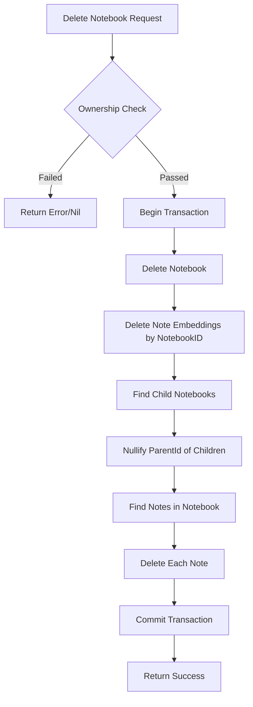

# Dokumentasi Fitur: CRUD Notebook

> **Fokus Domain:** BACKEND  
> **Konteks:** Trace Upstream ke Downstream secara Semantik

---

## Alur Data Semantik (Scope: BACKEND)

```
=== GET ALL NOTEBOOKS (with Notes) ===
[HTTP GET /api/notebook/v1]  
    -> [JWT Middleware: Ekstraksi User ID]  
    -> [Controller: Delegasi ke Service]  
    -> [Service: Fetch Notebooks + Aggregate Notes]  
        -> [Repository: FindAll Notebooks by UserID]  
        -> [Repository: FindAll Notes by NotebookIDs]  
        -> [Service: Map Notes ke masing-masing Notebook]  
    -> [HTTP Response dengan Nested Structure]

=== CREATE NOTEBOOK ===
[HTTP POST /api/notebook/v1]  
    -> [JWT Middleware: Ekstraksi User ID]  
    -> [Controller: Parsing & Validasi]  
    -> [Service: Konstruksi Entity dengan Parent Relation]  
        -> [Repository: Persistensi Notebook]  
    -> [HTTP Response dengan Notebook ID]

=== DELETE NOTEBOOK (Cascade) ===
[HTTP DELETE /api/notebook/v1/:id]  
    -> [JWT Middleware: Ekstraksi User ID]  
    -> [Controller: Parsing ID]  
    -> [Service: Ownership Check -> Transactional Cascade Delete]  
        -> [Transaction Begin]  
        -> [Repository: Delete Notebook]  
        -> [Repository: Delete Note Embeddings by NotebookID]  
        -> [Repository: Nullify ParentId of Child Notebooks]  
        -> [Repository: Delete All Notes in Notebook]  
        -> [Transaction Commit]  
    -> [HTTP Response Success]
```

---

## A. Laporan Implementasi Fitur CRUD Notebook

### Deskripsi Fungsional

Fitur ini menyediakan manajemen notebook sebagai kontainer organisasi untuk catatan (notes). Setiap notebook terikat pada satu user dan dapat memiliki relasi **hierarki parent-child** untuk struktur folder bersarang. Sistem mengimplementasikan:

1. **GetAll**: Pengambilan semua notebook user dengan notes ter-aggregate di dalamnya
2. **Create**: Pembuatan notebook baru dengan opsional parent untuk struktur hierarki
3. **Show**: Pengambilan detail satu notebook dengan validasi kepemilikan
4. **Update**: Modifikasi nama notebook dengan trigger re-embedding untuk semua notes di dalamnya
5. **Delete**: Penghapusan cascade yang mencakup notebook, notes, embeddings, dan orphan handling untuk child notebooks
6. **MoveNotebook**: Pemindahan notebook ke parent lain atau root level

Semua endpoint dilindungi JWT middleware dan menerapkan prinsip multi-tenancy via [UserOwnedBy](file:///d:/notetaker/notefiber-BE/internal/repository/specification/user_specifications.go#17-20) specification.

### Visualisasi

**GetAll Response (Nested Structure):**
```json
{
    "success": true,
    "code": 200,
    "message": "Success get all notebook",
    "data": [
        {
            "id": "550e8400-e29b-41d4-a716-446655440000",
            "name": "Work Projects",
            "parent_id": null,
            "created_at": "2024-12-20T10:00:00Z",
            "updated_at": "2024-12-24T15:30:00Z",
            "notes": [
                {
                    "id": "660e8400-e29b-41d4-a716-446655440001",
                    "title": "Meeting Notes",
                    "content": "Discussed Q1 targets...",
                    "created_at": "2024-12-21T09:00:00Z",
                    "updated_at": null
                }
            ]
        },
        {
            "id": "550e8400-e29b-41d4-a716-446655440002",
            "name": "Personal",
            "parent_id": null,
            "created_at": "2024-12-22T14:00:00Z",
            "updated_at": null,
            "notes": []
        }
    ]
}
```
*Caption: Gambar 1: Response GetAll dengan notes ter-nested di setiap notebook.*

---

## B. Bedah Arsitektur & Komponen

Berikut adalah rincian 17 komponen yang menyusun fitur ini di sisi BACKEND.

---

### [internal/server/server.go](file:///d:/notetaker/notefiber-BE/internal/server/server.go)
**Layer Terdeteksi:** `HTTP Server & Route Registration`

**Narasi Operasional:**
Komponen ini menginisialisasi instance server HTTP berbasis Fiber dan mendaftarkan seluruh controller. Untuk fitur Notebook, [NotebookController](file:///d:/notetaker/notefiber-BE/internal/controller/notebook_controller.go#12-21) didaftarkan pada grup `/api` dengan path prefix `/notebook/v1`. Semua endpoint notebook dilindungi oleh JWT middleware.

```go
func registerRoutes(app *fiber.App, c *bootstrap.Container) {
	api := app.Group("/api")

	c.AuthController.RegisterRoutes(api)
	c.NotebookController.RegisterRoutes(api)
	c.NoteController.RegisterRoutes(api)
	// ... other controllers
}
```
*Caption: Snippet 1: Registrasi NotebookController ke grup API.*

---

### [internal/bootstrap/container.go](file:///d:/notetaker/notefiber-BE/internal/bootstrap/container.go)
**Layer Terdeteksi:** `Dependency Injection Container`

**Narasi Operasional:**
File ini mengorkestrasi konstruksi dan injeksi dependensi. [NotebookService](file:///d:/notetaker/notefiber-BE/internal/service/notebook_service.go#17-25) diinisialisasi dengan dua dependensi: `uowFactory` (untuk akses multi-repository dalam satu transaksi) dan [publisherService](file:///d:/notetaker/notefiber-BE/internal/service/publisher_service.go#15-20) (untuk trigger re-embedding notes saat update notebook). Service ini kemudian diinjeksikan ke [NotebookController](file:///d:/notetaker/notefiber-BE/internal/controller/notebook_controller.go#12-21).

```go
func NewContainer(db *gorm.DB, cfg *config.Config) *Container {
	// 1. Core Facades
	uowFactory := unitofwork.NewRepositoryFactory(db)

	// 2. Event Bus
	pubSub := gochannel.NewGoChannel(gochannel.Config{}, watermillLogger)
	publisherService := service.NewPublisherService(cfg.Keys.ExampleTopic, pubSub)

	// 3. Services
	notebookService := service.NewNotebookService(uowFactory, publisherService)

	// 4. Controllers
	return &Container{
		NotebookController: controller.NewNotebookController(notebookService),
		// ...
	}
}
```
*Caption: Snippet 2: Konstruksi NotebookService dengan Repository Factory dan Publisher.*

---

### [internal/dto/notebook_dto.go](file:///d:/notetaker/notefiber-BE/internal/dto/notebook_dto.go)
**Layer Terdeteksi:** `Data Transfer Object (DTO)`

**Narasi Operasional:**
File ini mendefinisikan kontrak data untuk semua operasi Notebook. [CreateNotebookRequest](file:///d:/notetaker/notefiber-BE/internal/dto/notebook_dto.go#9-13) memerlukan `name` (required) dan `parent_id` (opsional untuk hierarki). [GetAllNotebookResponse](file:///d:/notetaker/notefiber-BE/internal/dto/notebook_dto.go#52-61) memiliki struktur nested dengan array `notes` yang menyertakan detail note di dalamnya. [MoveNotebookRequest](file:///d:/notetaker/notefiber-BE/internal/dto/notebook_dto.go#35-39) menerima `parent_id` nullable—null berarti pindah ke root level.

```go
type CreateNotebookRequest struct {
	Name     string     `json:"name" validate:"required"`
	ParentId *uuid.UUID `json:"parent_id"`
}

type CreateNotebookResponse struct {
	Id uuid.UUID `json:"id"`
}

type ShowNotebookResponse struct {
	Id        uuid.UUID  `json:"id"`
	Name      string     `json:"name"`
	ParentId  *uuid.UUID `json:"parent_id"`
	CreatedAt time.Time  `json:"created_at"`
	UpdatedAt *time.Time `json:"updated_at"`
}

type GetAllNotebookResponse struct {
	Id        uuid.UUID  `json:"id"`
	Name      string     `json:"name"`
	ParentId  *uuid.UUID `json:"parent_id"`
	CreatedAt time.Time  `json:"created_at"`
	UpdatedAt *time.Time `json:"updated_at"`
	Notes     []*GetAllNotebookResponseNote `json:"notes"`
}

type GetAllNotebookResponseNote struct {
	Id        uuid.UUID  `json:"id"`
	Title     string     `json:"title"`
	Content   string     `json:"content"`
	CreatedAt time.Time  `json:"created_at"`
	UpdatedAt *time.Time `json:"updated_at"`
}

type MoveNotebookRequest struct {
	Id       uuid.UUID
	ParentId *uuid.UUID `json:"parent_id"` // null = move to root
}
```
*Caption: Snippet 3: DTO dengan nested structure untuk GetAll response.*

---

### [internal/controller/notebook_controller.go](file:///d:/notetaker/notefiber-BE/internal/controller/notebook_controller.go)
**Layer Terdeteksi:** `Interface / Controller Layer`

**Narasi Operasional:**
Komponen ini menangani siklus Request-Response HTTP untuk semua endpoint Notebook. Setiap handler mengekstrak `user_id` dari JWT token, mem-parsing parameter dan body request, memvalidasi input, lalu mendelegasikan ke Service. Handler [GetAll](file:///d:/notetaker/notefiber-BE/internal/controller/notebook_controller.go#41-52) mengembalikan semua notebooks user dengan notes termasuk di dalamnya. Handler [MoveNotebook](file:///d:/notetaker/notefiber-BE/internal/controller/notebook_controller.go#122-141) mendukung pemindahan notebook dalam hierarki.

```go
func (c *notebookController) RegisterRoutes(r fiber.Router) {
	h := r.Group("/notebook/v1")
	h.Use(serverutils.JwtMiddleware) // PROTECTED
	h.Get("", c.GetAll)
	h.Post("", c.Create)
	h.Get(":id", c.Show)
	h.Put(":id", c.Update)
	h.Delete(":id", c.Delete)
	h.Put(":id/move", c.MoveNotebook)
}

func (c *notebookController) GetAll(ctx *fiber.Ctx) error {
	userIdStr := ctx.Locals("user_id").(string)
	userId, _ := uuid.Parse(userIdStr)

	res, err := c.service.GetAll(ctx.Context(), userId)
	if err != nil {
		return err
	}

	return ctx.JSON(serverutils.SuccessResponse("Success get all notebook", res))
}

func (c *notebookController) Create(ctx *fiber.Ctx) error {
	userIdStr := ctx.Locals("user_id").(string)
	userId, _ := uuid.Parse(userIdStr)

	var req dto.CreateNotebookRequest
	if err := ctx.BodyParser(&req); err != nil {
		return err
	}

	if err := serverutils.ValidateRequest(req); err != nil {
		return err
	}

	res, err := c.service.Create(ctx.Context(), userId, &req)
	if err != nil {
		return err
	}

	return ctx.JSON(serverutils.SuccessResponse("Success create notebook", res))
}

func (c *notebookController) Delete(ctx *fiber.Ctx) error {
	userIdStr := ctx.Locals("user_id").(string)
	userId, _ := uuid.Parse(userIdStr)
	idParam := ctx.Params("id")
	id, _ := uuid.Parse(idParam)

	err := c.service.Delete(ctx.Context(), userId, id)
	if err != nil {
		return err
	}

	return ctx.JSON(serverutils.SuccessResponse[any]("Success delete notebook", nil))
}
```
*Caption: Snippet 4: Controller dengan endpoint CRUD dan hierarchical operations.*

---

### [internal/service/notebook_service.go](file:///d:/notetaker/notefiber-BE/internal/service/notebook_service.go)
**Layer Terdeteksi:** `Business Logic / Service Layer`

**Narasi Operasional:**
Komponen ini mengenkapsulasi logika bisnis untuk semua operasi Notebook.

**GetAll**: Fetch semua notebooks user, kemudian fetch semua notes dari notebook IDs tersebut, dan aggregate notes ke masing-masing notebook dalam response.

**Create**: Konstruksi entity Notebook dengan User ID dan opsional Parent ID untuk hierarki.

**Update**: Fetch notebook dengan ownership check, modifikasi nama, dan trigger re-embedding untuk semua notes di dalam notebook.

**Delete**: Operasi transaksional paling kompleks yang menghapus: (1) notebook itu sendiri, (2) embeddings dari semua notes, (3) nullify parent_id child notebooks (orphan handling), dan (4) semua notes di dalam notebook.

**MoveNotebook**: Validasi ownership notebook sumber dan parent tujuan, lalu update parent_id.

```go
func (c *notebookService) GetAll(ctx context.Context, userId uuid.UUID) ([]*dto.GetAllNotebookResponse, error) {
	uow := c.uowFactory.NewUnitOfWork(ctx)

	// Fetch Notebooks
	notebooks, err := uow.NotebookRepository().FindAll(ctx, specification.UserOwnedBy{UserID: userId})
	if err != nil {
		return nil, err
	}

	ids := make([]uuid.UUID, 0)
	result := make([]*dto.GetAllNotebookResponse, 0)
	for _, notebook := range notebooks {
		res := dto.GetAllNotebookResponse{
			Id: notebook.Id, Name: notebook.Name, ParentId: notebook.ParentId,
			CreatedAt: notebook.CreatedAt, UpdatedAt: notebook.UpdatedAt,
			Notes: make([]*dto.GetAllNotebookResponseNote, 0),
		}
		result = append([]*dto.GetAllNotebookResponse{&res}, result...)
		ids = append(ids, notebook.Id)
	}

	if len(ids) == 0 {
		return result, nil
	}

	// Fetch Notes by NotebookIDs
	notes, err := uow.NoteRepository().FindAll(ctx,
		specification.ByNotebookIDs{NotebookIDs: ids},
		specification.UserOwnedBy{UserID: userId},
	)

	// Map Notes to Notebooks
	for i := 0; i < len(result); i++ {
		for j := 0; j < len(notes); j++ {
			if notes[j].NotebookId == result[i].Id {
				result[i].Notes = append(result[i].Notes, &dto.GetAllNotebookResponseNote{
					Id: notes[j].Id, Title: notes[j].Title, Content: notes[j].Content,
					CreatedAt: notes[j].CreatedAt, UpdatedAt: notes[j].UpdatedAt,
				})
			}
		}
	}

	return result, nil
}

func (c *notebookService) Create(ctx context.Context, userId uuid.UUID, req *dto.CreateNotebookRequest) (*dto.CreateNotebookResponse, error) {
	uow := c.uowFactory.NewUnitOfWork(ctx)
	notebook := entity.Notebook{
		Id:        uuid.New(),
		Name:      req.Name,
		ParentId:  req.ParentId,
		UserId:    userId,
		CreatedAt: time.Now(),
	}

	err := uow.NotebookRepository().Create(ctx, &notebook)
	if err != nil {
		return nil, err
	}

	return &dto.CreateNotebookResponse{Id: notebook.Id}, nil
}

func (c *notebookService) Delete(ctx context.Context, userId uuid.UUID, id uuid.UUID) error {
	uow := c.uowFactory.NewUnitOfWork(ctx)

	// Check ownership
	notebook, err := uow.NotebookRepository().FindOne(ctx,
		specification.ByID{ID: id},
		specification.UserOwnedBy{UserID: userId},
	)
	if err != nil || notebook == nil {
		return err
	}

	// Transaction for Cascade Delete
	if err := uow.Begin(ctx); err != nil {
		return err
	}
	defer uow.Rollback()

	// 1. Delete Notebook
	if err := uow.NotebookRepository().Delete(ctx, id); err != nil {
		return err
	}

	// 2. Delete Note Embeddings by NotebookID
	if err := uow.NoteEmbeddingRepository().DeleteByNotebookId(ctx, id); err != nil {
		return err
	}

	// 3. Nullify Parent ID for child notebooks (Orphan Handling)
	children, _ := uow.NotebookRepository().FindAll(ctx,
		specification.ByParentID{ParentID: &id},
		specification.UserOwnedBy{UserID: userId},
	)
	for _, child := range children {
		child.ParentId = nil
		uow.NotebookRepository().Update(ctx, child)
	}

	// 4. Delete Notes in Notebook
	notes, _ := uow.NoteRepository().FindAll(ctx, specification.ByNotebookID{NotebookID: id})
	for _, note := range notes {
		uow.NoteRepository().Delete(ctx, note.Id)
	}

	return uow.Commit()
}

func (c *notebookService) MoveNotebook(ctx context.Context, userId uuid.UUID, req *dto.MoveNotebookRequest) (*dto.MoveNotebookResponse, error) {
	uow := c.uowFactory.NewUnitOfWork(ctx)

	// Validate source notebook ownership
	notebook, err := uow.NotebookRepository().FindOne(ctx,
		specification.ByID{ID: req.Id},
		specification.UserOwnedBy{UserID: userId},
	)
	if err != nil || notebook == nil {
		return nil, err
	}

	// Validate parent notebook ownership (if not moving to root)
	if req.ParentId != nil {
		parent, err := uow.NotebookRepository().FindOne(ctx,
			specification.ByID{ID: *req.ParentId},
			specification.UserOwnedBy{UserID: userId},
		)
		if err != nil || parent == nil {
			return nil, err
		}
	}

	notebook.ParentId = req.ParentId
	uow.NotebookRepository().Update(ctx, notebook)

	return &dto.MoveNotebookResponse{Id: req.Id}, nil
}
```
*Caption: Snippet 5: Service dengan GetAll aggregation, cascade delete, dan hierarchical move.*

---

### [internal/service/publisher_service.go](file:///d:/notetaker/notefiber-BE/internal/service/publisher_service.go)
**Layer Terdeteksi:** `Event Publishing / Message Queue`

**Narasi Operasional:**
Sama seperti pada Note CRUD, komponen ini digunakan oleh NotebookService untuk trigger re-embedding notes saat notebook di-update. Setiap note dalam notebook yang di-update akan di-publish ke message queue untuk regenerasi embedding.

```go
type IPublisherService interface {
	Publish(ctx context.Context, payload []byte) error
}

func (ps *publisherService) Publish(ctx context.Context, payload []byte) error {
	return ps.pubSub.Publish(
		ps.topicName,
		message.NewMessage(watermill.NewUUID(), payload),
	)
}
```
*Caption: Snippet 6: Publisher service untuk async embedding regeneration.*

---

### [internal/repository/unitofwork/unit_of_work.go](file:///d:/notetaker/notefiber-BE/internal/repository/unitofwork/unit_of_work.go)
**Layer Terdeteksi:** `Unit of Work Interface`

**Narasi Operasional:**
File ini mendefinisikan kontrak Unit of Work. Untuk Notebook CRUD, empat repository digunakan: [NotebookRepository](file:///d:/notetaker/notefiber-BE/internal/repository/contract/notebook_repository.go#12-20) untuk operasi notebook, [NoteRepository](file:///d:/notetaker/notefiber-BE/internal/repository/unitofwork/unit_of_work.go#16-17) untuk operasi notes terkait, [NoteEmbeddingRepository](file:///d:/notetaker/notefiber-BE/internal/repository/unitofwork/unit_of_work_impl.go#71-74) untuk penghapusan embeddings saat delete.

```go
type UnitOfWork interface {
	Begin(ctx context.Context) error
	Commit() error
	Rollback() error

	NotebookRepository() contract.NotebookRepository
	NoteRepository() contract.NoteRepository
	NoteEmbeddingRepository() contract.NoteEmbeddingRepository
	// ... other repositories
}
```
*Caption: Snippet 7: Interface Unit of Work dengan akses ke Notebook, Note, dan Embedding repository.*

---

### [internal/repository/unitofwork/unit_of_work_impl.go](file:///d:/notetaker/notefiber-BE/internal/repository/unitofwork/unit_of_work_impl.go)
**Layer Terdeteksi:** `Unit of Work Implementation`

**Narasi Operasional:**
Komponen ini mengimplementasikan pola Unit of Work dengan GORM. Untuk operasi Delete yang cascade, transaksi eksplisit digunakan untuk menjamin atomisitas penghapusan notebook, notes, embeddings, dan update child notebooks.

```go
func (u *UnitOfWorkImpl) NotebookRepository() contract.NotebookRepository {
	return implementation.NewNotebookRepository(u.getDB())
}

func (u *UnitOfWorkImpl) NoteRepository() contract.NoteRepository {
	return implementation.NewNoteRepository(u.getDB())
}

func (u *UnitOfWorkImpl) NoteEmbeddingRepository() contract.NoteEmbeddingRepository {
	return implementation.NewNoteEmbeddingRepository(u.getDB())
}
```
*Caption: Snippet 8: Instansiasi multiple repositories dari Unit of Work.*

---

### [internal/repository/contract/notebook_repository.go](file:///d:/notetaker/notefiber-BE/internal/repository/contract/notebook_repository.go)
**Layer Terdeteksi:** `Repository Interface / Contract`

**Narasi Operasional:**
File ini mendefinisikan kontrak standar untuk operasi data Notebook: [Create](file:///d:/notetaker/notefiber-BE/internal/service/note_service.go#21-22), [Update](file:///d:/notetaker/notefiber-BE/internal/controller/note_controller.go#84-111), [Delete](file:///d:/notetaker/notefiber-BE/internal/repository/contract/notebook_repository.go#15-16), [FindOne](file:///d:/notetaker/notefiber-BE/internal/repository/contract/notebook_repository.go#16-17), [FindAll](file:///d:/notetaker/notefiber-BE/internal/repository/contract/notebook_repository.go#17-18), dan [Count](file:///d:/notetaker/notefiber-BE/internal/repository/implementation/notebook_repository_impl.go#81-89). Interface ini identik dengan NoteRepository, mengikuti pola repository generik dengan Specification pattern.

```go
type NotebookRepository interface {
	Create(ctx context.Context, notebook *entity.Notebook) error
	Update(ctx context.Context, notebook *entity.Notebook) error
	Delete(ctx context.Context, id uuid.UUID) error
	FindOne(ctx context.Context, specs ...specification.Specification) (*entity.Notebook, error)
	FindAll(ctx context.Context, specs ...specification.Specification) ([]*entity.Notebook, error)
	Count(ctx context.Context, specs ...specification.Specification) (int64, error)
}
```
*Caption: Snippet 9: Kontrak repository CRUD untuk Notebook.*

---

### [internal/repository/specification/notebook_specifications.go](file:///d:/notetaker/notefiber-BE/internal/repository/specification/notebook_specifications.go)
**Layer Terdeteksi:** `Domain Specification Implementation`

**Narasi Operasional:**
File ini menyediakan specification khusus domain Notebook. [ByParentID](file:///d:/notetaker/notefiber-BE/internal/repository/specification/notebook_specifications.go#8-11) memfilter notebooks berdasarkan parent—dengan handling khusus untuk `nil` yang berarti pencarian root notebooks (parent_id IS NULL). Specification ini digunakan untuk operasi hierarkis seperti delete orphan handling.

```go
type ByParentID struct {
	ParentID *uuid.UUID
}

func (s ByParentID) Apply(db *gorm.DB) *gorm.DB {
	if s.ParentID == nil {
		return db.Where("parent_id IS NULL")
	}
	return db.Where("parent_id = ?", s.ParentID)
}
```
*Caption: Snippet 10: Specification untuk filter berdasarkan Parent dengan null handling.*

---

### [internal/repository/implementation/notebook_repository_impl.go](file:///d:/notetaker/notefiber-BE/internal/repository/implementation/notebook_repository_impl.go)
**Layer Terdeteksi:** `Repository Implementation`

**Narasi Operasional:**
Komponen ini mengimplementasikan kontrak [NotebookRepository](file:///d:/notetaker/notefiber-BE/internal/repository/contract/notebook_repository.go#12-20) dengan GORM. Setiap operasi menggunakan Mapper untuk transformasi Entity-Model. Delete menggunakan soft-delete bawaan GORM melalui field `DeletedAt`.

```go
func (r *NotebookRepositoryImpl) Create(ctx context.Context, notebook *entity.Notebook) error {
	m := r.mapper.ToModel(notebook)
	if err := r.db.WithContext(ctx).Create(m).Error; err != nil {
		return err
	}
	*notebook = *r.mapper.ToEntity(m)
	return nil
}

func (r *NotebookRepositoryImpl) Update(ctx context.Context, notebook *entity.Notebook) error {
	m := r.mapper.ToModel(notebook)
	if err := r.db.WithContext(ctx).Save(m).Error; err != nil {
		return err
	}
	*notebook = *r.mapper.ToEntity(m)
	return nil
}

func (r *NotebookRepositoryImpl) Delete(ctx context.Context, id uuid.UUID) error {
	return r.db.WithContext(ctx).Delete(&model.Notebook{}, id).Error
}

func (r *NotebookRepositoryImpl) FindAll(ctx context.Context, specs ...specification.Specification) ([]*entity.Notebook, error) {
	var models []*model.Notebook
	query := r.applySpecifications(r.db.WithContext(ctx), specs...)
	if err := query.Find(&models).Error; err != nil {
		return nil, err
	}
	return r.mapper.ToEntities(models), nil
}
```
*Caption: Snippet 11: Implementasi repository CRUD dengan specification pattern.*

---

### [internal/entity/notebook_entity.go](file:///d:/notetaker/notefiber-BE/internal/entity/notebook_entity.go)
**Layer Terdeteksi:** `Domain Entity`

**Narasi Operasional:**
File ini mendefinisikan entity [Notebook](file:///d:/notetaker/notefiber-BE/internal/entity/notebook_entity.go#10-20) yang merepresentasikan konsep bisnis folder/kategori catatan. Atribut `ParentId` (nullable pointer) memungkinkan struktur hierarki bersarang. `UserId` memastikan isolasi data per pengguna.

```go
type Notebook struct {
	Id        uuid.UUID
	Name      string
	ParentId  *uuid.UUID  // nil = root level notebook
	UserId    uuid.UUID   // Owner ID for multi-tenancy
	CreatedAt time.Time
	UpdatedAt *time.Time
	DeletedAt *time.Time
	IsDeleted bool
}
```
*Caption: Snippet 12: Entity domain untuk Notebook dengan hierarki support.*

---

### [internal/model/notebook_model.go](file:///d:/notetaker/notefiber-BE/internal/model/notebook_model.go)
**Layer Terdeteksi:** `Database Model (ORM)`

**Narasi Operasional:**
Model [Notebook](file:///d:/notetaker/notefiber-BE/internal/entity/notebook_entity.go#10-20) dipetakan ke tabel `notebooks` dengan konfigurasi kolom GORM. Indeks pada `parent_id` dan `user_id` mempercepat query hierarki dan ownership filter. Soft-delete diaktifkan via `gorm.DeletedAt`.

```go
type Notebook struct {
	Id        uuid.UUID      `gorm:"type:uuid;primaryKey;default:gen_random_uuid()"`
	Name      string         `gorm:"type:varchar(255);not null"`
	ParentId  *uuid.UUID     `gorm:"type:uuid;index"`
	UserId    uuid.UUID      `gorm:"type:uuid;not null;index"`
	CreatedAt time.Time      `gorm:"autoCreateTime"`
	UpdatedAt time.Time      `gorm:"autoUpdateTime"`
	DeletedAt gorm.DeletedAt `gorm:"index"`
}

func (Notebook) TableName() string {
	return "notebooks"
}
```
*Caption: Snippet 13: Model ORM dengan hierarchical index.*

---

### [internal/mapper/notebook_mapper.go](file:///d:/notetaker/notefiber-BE/internal/mapper/notebook_mapper.go)
**Layer Terdeteksi:** `Data Mapper`

**Narasi Operasional:**
Komponen ini menyediakan transformasi bidirectional antara Entity dan Model untuk Notebook. Handling khusus diberikan pada field nullable (`ParentId`, `UpdatedAt`, `DeletedAt`) untuk menghindari nil pointer dereference dan memastikan konversi `gorm.DeletedAt` yang benar.

```go
func (m *NotebookMapper) ToEntity(n *model.Notebook) *entity.Notebook {
	if n == nil {
		return nil
	}
	
	var deletedAt *time.Time
	if n.DeletedAt.Valid {
		t := n.DeletedAt.Time
		deletedAt = &t
	}

	var updatedAt *time.Time
	if !n.UpdatedAt.IsZero() {
		t := n.UpdatedAt
		updatedAt = &t
	}

	return &entity.Notebook{
		Id:        n.Id,
		Name:      n.Name,
		ParentId:  n.ParentId,
		UserId:    n.UserId,
		CreatedAt: n.CreatedAt,
		UpdatedAt: updatedAt,
		DeletedAt: deletedAt,
		IsDeleted: n.DeletedAt.Valid,
	}
}

func (m *NotebookMapper) ToModel(n *entity.Notebook) *model.Notebook {
	if n == nil {
		return nil
	}

	var deletedAt gorm.DeletedAt
	if n.DeletedAt != nil {
		deletedAt = gorm.DeletedAt{Time: *n.DeletedAt, Valid: true}
	}

	return &model.Notebook{
		Id:        n.Id,
		Name:      n.Name,
		ParentId:  n.ParentId,
		UserId:    n.UserId,
		CreatedAt: n.CreatedAt,
		DeletedAt: deletedAt,
	}
}
```
*Caption: Snippet 14: Mapper dengan nullable field handling.*

---

## C. Ringkasan Layer Arsitektur

| No | Layer | File | Tanggung Jawab |
|----|-------|------|----------------|
| 1 | HTTP Server | [server/server.go](file:///d:/notetaker/notefiber-BE/internal/server/server.go) | Inisialisasi Fiber, route registration |
| 2 | DI Container | [bootstrap/container.go](file:///d:/notetaker/notefiber-BE/internal/bootstrap/container.go) | Dependency wiring dengan Publisher |
| 3 | DTO | [dto/notebook_dto.go](file:///d:/notetaker/notefiber-BE/internal/dto/notebook_dto.go) | Kontrak data dengan nested Notes |
| 4 | Controller | [controller/notebook_controller.go](file:///d:/notetaker/notefiber-BE/internal/controller/notebook_controller.go) | HTTP handler dengan JWT extraction |
| 5 | Service | [service/notebook_service.go](file:///d:/notetaker/notefiber-BE/internal/service/notebook_service.go) | Business logic, aggregation, cascade delete |
| 6 | Publisher | [service/publisher_service.go](file:///d:/notetaker/notefiber-BE/internal/service/publisher_service.go) | Async re-embedding trigger |
| 7 | Factory Interface | [unitofwork/repository_factory.go](file:///d:/notetaker/notefiber-BE/internal/repository/unitofwork/repository_factory.go) | Kontrak pembuatan Unit of Work |
| 8 | Factory Impl | [unitofwork/repository_factory_impl.go](file:///d:/notetaker/notefiber-BE/internal/repository/unitofwork/repository_factory_impl.go) | Implementasi factory |
| 9 | UoW Interface | [unitofwork/unit_of_work.go](file:///d:/notetaker/notefiber-BE/internal/repository/unitofwork/unit_of_work.go) | Kontrak transaksi & multi-repository access |
| 10 | UoW Impl | [unitofwork/unit_of_work_impl.go](file:///d:/notetaker/notefiber-BE/internal/repository/unitofwork/unit_of_work_impl.go) | Transaksi GORM untuk cascade ops |
| 11 | Notebook Contract | [contract/notebook_repository.go](file:///d:/notetaker/notefiber-BE/internal/repository/contract/notebook_repository.go) | Interface CRUD operations |
| 12 | Note Contract | [contract/note_repository.go](file:///d:/notetaker/notefiber-BE/internal/repository/contract/note_repository.go) | Interface untuk note deletion |
| 13 | Notebook Specs | [specification/notebook_specifications.go](file:///d:/notetaker/notefiber-BE/internal/repository/specification/notebook_specifications.go) | [ByParentID](file:///d:/notetaker/notefiber-BE/internal/repository/specification/notebook_specifications.go#8-11) dengan null handling |
| 14 | Repository Impl | [implementation/notebook_repository_impl.go](file:///d:/notetaker/notefiber-BE/internal/repository/implementation/notebook_repository_impl.go) | GORM CRUD implementation |
| 15 | Entity | [entity/notebook_entity.go](file:///d:/notetaker/notefiber-BE/internal/entity/notebook_entity.go) | Domain object dengan hierarki |
| 16 | Model | [model/notebook_model.go](file:///d:/notetaker/notefiber-BE/internal/model/notebook_model.go) | Database table mapping |
| 17 | Mapper | [mapper/notebook_mapper.go](file:///d:/notetaker/notefiber-BE/internal/mapper/notebook_mapper.go) | Entity ↔ Model transformation |

---

## D. Endpoint API Reference

| Method | Endpoint | Deskripsi | Auth |
|--------|----------|-----------|------|
| `GET` | `/api/notebook/v1` | Get all notebooks with nested notes | JWT Required |
| `POST` | `/api/notebook/v1` | Create new notebook (with optional parent) | JWT Required |
| `GET` | `/api/notebook/v1/:id` | Get notebook by ID | JWT Required |
| `PUT` | `/api/notebook/v1/:id` | Update notebook name | JWT Required |
| `PUT` | `/api/notebook/v1/:id/move` | Move notebook to different parent | JWT Required |
| `DELETE` | `/api/notebook/v1/:id` | Delete notebook (cascade) | JWT Required |

---

## E. Cascade Delete Operations


*Caption: Diagram 1: Alur cascade delete yang menjaga integritas data.*

---

## F. Fitur Keamanan & Isolasi Data

| Aspek | Implementasi |
|-------|--------------|
| **Authentication** | JWT middleware wajib untuk semua endpoint |
| **Authorization** | [UserOwnedBy](file:///d:/notetaker/notefiber-BE/internal/repository/specification/user_specifications.go#17-20) specification di setiap query |
| **Multi-tenancy** | User ID dari token, bukan dari request body |
| **Hierarchy Validation** | Parent notebook ownership check pada move |
| **Orphan Handling** | Nullify parent_id untuk child notebooks saat delete |
| **Cascade Delete** | Atomik dalam satu transaksi database |
| **Soft-delete** | GORM `DeletedAt` untuk data recovery |

---

*Dokumen ini di-generate dalam mode READ-ONLY tanpa modifikasi terhadap kode sumber.*
