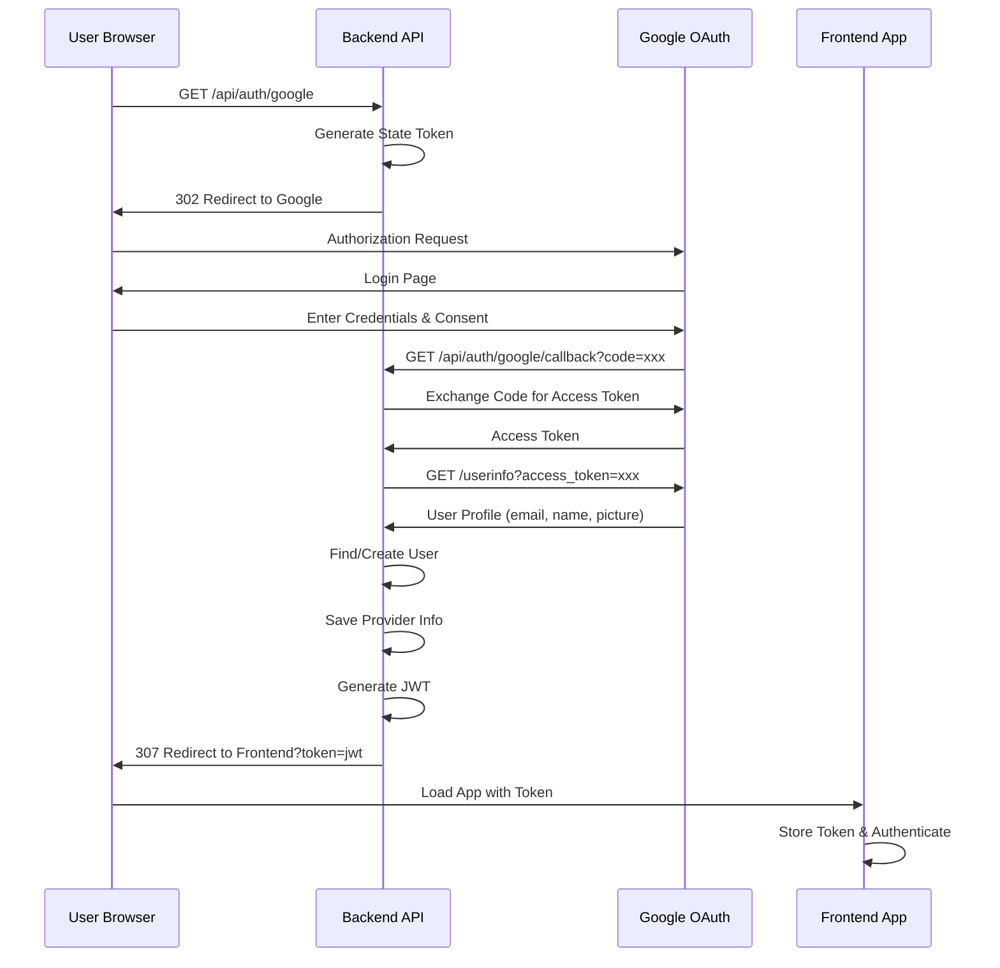

# Dokumentasi Fitur: Authentikasi - OAuth Sign In & Sign Up (Google)

> **Fokus Domain:** BACKEND  
> **Konteks:** Trace Upstream ke Downstream secara Semantik

---

## Alur Data Semantik (Scope: BACKEND)

```
=== FASE 1: Inisiasi Login ===
[HTTP Request GET /api/auth/google]  
    -> [Server: Routing]  
    -> [OAuth Controller: Trigger Login]  
    -> [OAuth Service: Generate Login URL dengan State]  
    -> [HTTP Redirect ke Google Authorization Page]

=== FASE 2: Callback & Autentikasi ===
[HTTP Request GET /api/auth/google/callback?code=xxx]  
    -> [Server: Routing]  
    -> [OAuth Controller: Extract Authorization Code]  
    -> [OAuth Service: Orkestrasi Autentikasi]  
        -> [Google API: Exchange Code for Access Token]  
        -> [Google API: Fetch User Info]  
        -> [Unit of Work: Akses Repository]  
            -> [Repository: Cari User by Email]  
            -> [Repository: Cari Soft-Deleted User (Fallback)]  
            -> [Decision: Create New User / Restore User / Use Existing]  
            -> [Repository: Persist User & Provider Info]  
        -> [Generasi JWT Access Token]  
    -> [HTTP Redirect ke Frontend dengan Token]
```

---

## A. Laporan Implementasi Fitur OAuth Sign In & Sign Up

### Deskripsi Fungsional

Fitur ini menyediakan mekanisme autentikasi dan registrasi pengguna melalui provider OAuth eksternal (Google). Sistem mengimplementasikan **OAuth 2.0 Authorization Code Flow** yang memungkinkan pengguna login menggunakan akun Google mereka tanpa perlu membuat password terpisah. Alur ini menangani tiga skenario secara otomatis: (1) **Registrasi baru** jika email belum terdaftar, (2) **Login** jika user sudah ada, dan (3) **Reaktivasi akun** jika user sebelumnya soft-deleted. Setelah autentikasi berhasil, sistem menyimpan informasi provider (Google ID, avatar) dan redirect user ke frontend dengan JWT token.

### Visualisasi

**Fase 1: Redirect ke Google**
```
GET /api/auth/google
→ HTTP 302 Redirect
→ https://accounts.google.com/o/oauth2/v2/auth?client_id=xxx&redirect_uri=xxx&scope=email+profile&state=xxx
```

**Fase 2: Callback Response (Redirect ke Frontend)**
```
GET /api/auth/google/callback?code=xxx&state=xxx
→ HTTP 307 Temporary Redirect
→ https://app.notefiber.com/app?token=eyJhbGciOiJIUzI1NiIs...
```
*Caption: Gambar 1: Alur redirect OAuth dengan token delivery via URL.*

---

## B. Bedah Arsitektur & Komponen

Berikut adalah rincian 15 komponen yang menyusun fitur ini di sisi BACKEND, diurutkan dari upstream (penerima request) ke downstream (persistensi data).

---

### [internal/server/server.go](file:///d:/notetaker/notefiber-BE/internal/server/server.go)
**Layer Terdeteksi:** `HTTP Server & Route Registration`

**Narasi Operasional:**
Komponen ini menginisialisasi instance server HTTP berbasis Fiber dan mendaftarkan seluruh middleware global. Untuk alur OAuth, [OAuthController](file:///d:/notetaker/notefiber-BE/internal/controller/oauth_controller.go#14-19) didaftarkan pada grup `/api`, mengaktifkan dua endpoint: `/api/auth/:provider` untuk inisiasi login dan `/api/auth/:provider/callback` untuk menerima callback dari Google setelah user authorize.

```go
func registerRoutes(app *fiber.App, c *bootstrap.Container) {
	api := app.Group("/api")

	c.AuthController.RegisterRoutes(api)
	c.UserController.RegisterRoutes(api)
	c.OAuthController.RegisterRoutes(api)
	// ... other controllers
}
```
*Caption: Snippet 1: Registrasi OAuthController ke grup API.*

---

### [internal/bootstrap/container.go](file:///d:/notetaker/notefiber-BE/internal/bootstrap/container.go)
**Layer Terdeteksi:** `Dependency Injection Container`

**Narasi Operasional:**
File ini mengorkestrasi konstruksi dan injeksi dependensi. Untuk OAuth, [OAuthService](file:///d:/notetaker/notefiber-BE/internal/service/oauth_service.go#28-32) diinisialisasi dengan `uowFactory` saja (tidak memerlukan emailService karena tidak ada pengiriman email dalam flow ini). Service ini kemudian diinjeksikan ke [OAuthController](file:///d:/notetaker/notefiber-BE/internal/controller/oauth_controller.go#14-19). Konfigurasi OAuth (Client ID, Secret, Redirect URL) dibaca dari environment variables di dalam service.

```go
func NewContainer(db *gorm.DB, cfg *config.Config) *Container {
	// 1. Core Facades
	uowFactory := unitofwork.NewRepositoryFactory(db)

	// 3. Services
	oauthService := service.NewOAuthService(uowFactory)

	// 4. Controllers
	return &Container{
		OAuthController: controller.NewOAuthController(oauthService),
		// ...
	}
}
```
*Caption: Snippet 2: Konstruksi OAuthService dengan Repository Factory.*

---

### [internal/dto/auth_payment_dto.go](file:///d:/notetaker/notefiber-BE/internal/dto/auth_payment_dto.go)
**Layer Terdeteksi:** `Data Transfer Object (DTO)`

**Narasi Operasional:**
File ini mendefinisikan [LoginResponse](file:///d:/notetaker/notefiber-BE/internal/dto/auth_payment_dto.go#32-37) dan [UserDTO](file:///d:/notetaker/notefiber-BE/internal/dto/auth_payment_dto.go#42-48) yang digunakan oleh OAuth flow untuk mengembalikan data autentikasi. Struktur ini identik dengan login tradisional, memungkinkan frontend menangani kedua jenis login dengan cara yang sama. OAuth tidak memerlukan request DTO khusus karena parameter dikirim via URL path dan query string.

```go
type LoginResponse struct {
	AccessToken  string  `json:"access_token"`
	RefreshToken string  `json:"refresh_token,omitempty"`
	User         UserDTO `json:"user"`
}

type UserDTO struct {
	Id       uuid.UUID `json:"id"`
	Email    string    `json:"email"`
	FullName string    `json:"full_name"`
	Role     string    `json:"role"`
}
```
*Caption: Snippet 3: DTO response yang digunakan OAuth flow.*

---

### [internal/controller/oauth_controller.go](file:///d:/notetaker/notefiber-BE/internal/controller/oauth_controller.go)
**Layer Terdeteksi:** `Interface / Controller Layer`

**Narasi Operasional:**
Komponen ini menangani dua endpoint OAuth: [Login](file:///d:/notetaker/notefiber-BE/internal/controller/auth_controller.go#14-15) dan [Callback](file:///d:/notetaker/notefiber-BE/internal/controller/oauth_controller.go#50-87). Handler [Login](file:///d:/notetaker/notefiber-BE/internal/controller/auth_controller.go#14-15) menerima nama provider dari URL path, meminta login URL dari service, dan redirect user ke halaman otorisasi Google. Handler [Callback](file:///d:/notetaker/notefiber-BE/internal/controller/oauth_controller.go#50-87) menerima authorization code dari Google, mendelegasikan ke service untuk exchange dan autentikasi, lalu redirect user ke frontend dengan JWT token sebagai query parameter. Pendekatan redirect-based ini memungkinkan integrasi seamless dengan SPA frontend.

```go
func (c *oauthController) RegisterRoutes(r fiber.Router) {
	h := r.Group("/auth")
	h.Get("/:provider", c.Login)
	h.Get("/:provider/callback", c.Callback)
}

func (c *oauthController) Login(ctx *fiber.Ctx) error {
	provider := ctx.Params("provider")
	log.Printf("[OAuth] Login initiated for provider: %s", provider)
	
	url, err := c.service.GetLoginURL(provider)
	if err != nil {
		return ctx.Status(fiber.StatusBadRequest).JSON(serverutils.ErrorResponse(400, err.Error()))
	}
	
	// Redirect user to Google
	return ctx.Redirect(url)
}

func (c *oauthController) Callback(ctx *fiber.Ctx) error {
	provider := ctx.Params("provider")
	code := ctx.Query("code")

	if code == "" {
		return ctx.Status(fiber.StatusBadRequest).JSON(serverutils.ErrorResponse(400, "Missing code"))
	}

	res, err := c.service.HandleCallback(ctx.Context(), provider, code)
	if err != nil {
		return ctx.Status(fiber.StatusInternalServerError).JSON(serverutils.ErrorResponse(500, err.Error()))
	}

	// Redirect to Frontend with Token in URL
	frontendURL := os.Getenv("FRONTEND_URL")
	redirectURL := fmt.Sprintf("%s/app?token=%s", frontendURL, res.AccessToken)
	
	return ctx.Redirect(redirectURL, fiber.StatusTemporaryRedirect)
}
```
*Caption: Snippet 4: OAuth controller dengan redirect flow ke Google dan Frontend.*

---

### [internal/service/oauth_service.go](file:///d:/notetaker/notefiber-BE/internal/service/oauth_service.go)
**Layer Terdeteksi:** `Business Logic / Service Layer`

**Narasi Operasional:**
Komponen ini mengenkapsulasi seluruh logika OAuth 2.0 flow. Saat inisialisasi, service mengkonfigurasi `oauth2.Config` dengan credentials dari environment variables. Metode [GetLoginURL](file:///d:/notetaker/notefiber-BE/internal/service/oauth_service.go#29-30) menghasilkan URL otorisasi Google dengan state parameter untuk CSRF protection. Metode [HandleCallback](file:///d:/notetaker/notefiber-BE/internal/service/oauth_service.go#30-31) mengorkestrasi: (1) exchange authorization code ke access token via Google API, (2) fetch user info dari Google, (3) cari user di database—termasuk pengecekan soft-deleted user untuk reaktivasi, (4) create user baru jika tidak ditemukan, (5) simpan/update provider info, dan (6) generate JWT access token. Seluruh flow mendukung tiga skenario: registrasi baru, login existing user, dan reaktivasi akun.

```go
type oauthService struct {
	uowFactory unitofwork.RepositoryFactory
	googleConf *oauth2.Config
}

func NewOAuthService(uowFactory unitofwork.RepositoryFactory) IOAuthService {
	conf := &oauth2.Config{
		ClientID:     os.Getenv("GOOGLE_CLIENT_ID"),
		ClientSecret: os.Getenv("GOOGLE_CLIENT_SECRET"),
		RedirectURL:  os.Getenv("GOOGLE_REDIRECT_URL"),
		Scopes: []string{
			"https://www.googleapis.com/auth/userinfo.email",
			"https://www.googleapis.com/auth/userinfo.profile",
		},
		Endpoint: google.Endpoint,
	}

	return &oauthService{uowFactory: uowFactory, googleConf: conf}
}

func (s *oauthService) GetLoginURL(provider string) (string, error) {
	if provider != "google" {
		return "", errors.New("unsupported provider")
	}

	b := make([]byte, 16)
	rand.Read(b)
	state := base64.URLEncoding.EncodeToString(b)

	url := s.googleConf.AuthCodeURL(state)
	return url, nil
}

func (s *oauthService) HandleCallback(ctx context.Context, provider string, code string) (*dto.LoginResponse, error) {
	if provider != "google" {
		return nil, errors.New("unsupported provider")
	}

	// 1. Exchange code for token
	token, err := s.googleConf.Exchange(ctx, code)
	if err != nil {
		return nil, fmt.Errorf("code exchange failed: %v", err)
	}

	// 2. Get user info from Google
	userInfoURL := "https://www.googleapis.com/oauth2/v2/userinfo?access_token=" + token.AccessToken
	resp, err := http.Get(userInfoURL)
	// ... error handling ...

	var googleUser struct {
		ID            string `json:"id"`
		Email         string `json:"email"`
		VerifiedEmail bool   `json:"verified_email"`
		Name          string `json:"name"`
		Picture       string `json:"picture"`
	}
	json.Unmarshal(content, &googleUser)

	// 3. Find or Create User
	uow := s.uowFactory.NewUnitOfWork(ctx)
	
	// Check for active users
	user, _ := uow.UserRepository().FindOne(ctx, specification.ByEmail{Email: googleUser.Email})
	
	// Check for soft-deleted users (reactivation scenario)
	if user == nil {
		user, _ = uow.UserRepository().FindOneUnscoped(ctx, specification.ByEmail{Email: googleUser.Email})
		if user != nil {
			// Reactivate soft-deleted user
			uow.UserRepository().Restore(ctx, user.Id)
			user, _ = uow.UserRepository().FindOne(ctx, specification.ByEmail{Email: googleUser.Email})
		}
	}

	// Create new user if doesn't exist
	if user == nil {
		newUser := &entity.User{
			Id:            uuid.New(),
			Email:         googleUser.Email,
			FullName:      googleUser.Name,
			PasswordHash:  nil, // OAuth users have no password
			Role:          entity.UserRoleUser,
			Status:        entity.UserStatusActive,
			EmailVerified: true, // Google already verified email
		}
		
		uow.Begin(ctx)
		uow.UserRepository().Create(ctx, newUser)
		uow.Commit()
		user = newUser
	}

	// 4. Save Provider Info
	userProvider := &entity.UserProvider{
		Id:             uuid.New(),
		UserId:         user.Id,
		ProviderName:   "google",
		ProviderUserId: googleUser.ID,
		AvatarURL:      googleUser.Picture,
	}
	uow.UserRepository().SaveUserProvider(ctx, userProvider)

	// 5. Generate JWT
	claims := jwt.MapClaims{
		"user_id": user.Id.String(),
		"role":    user.Role,
		"exp":     time.Now().Add(time.Hour * 24).Unix(),
	}
	jwtToken := jwt.NewWithClaims(jwt.SigningMethodHS256, claims)
	signedToken, _ := jwtToken.SignedString([]byte(os.Getenv("JWT_SECRET")))

	return &dto.LoginResponse{
		AccessToken: signedToken,
		User: dto.UserDTO{
			Id: user.Id, Email: user.Email, FullName: user.FullName, Role: string(user.Role),
		},
	}, nil
}
```
*Caption: Snippet 5: OAuth service dengan logic find-or-create user dan provider sync.*

---

### [internal/repository/unitofwork/repository_factory.go](file:///d:/notetaker/notefiber-BE/internal/repository/unitofwork/repository_factory.go)
**Layer Terdeteksi:** `Factory Interface`

**Narasi Operasional:**
File ini mendefinisikan kontrak untuk pembuatan instance Unit of Work yang digunakan OAuth service untuk akses repository.

```go
type RepositoryFactory interface {
	NewUnitOfWork(ctx context.Context) UnitOfWork
}
```
*Caption: Snippet 6: Interface factory untuk pembuatan Unit of Work.*

---

### [internal/repository/unitofwork/repository_factory_impl.go](file:///d:/notetaker/notefiber-BE/internal/repository/unitofwork/repository_factory_impl.go)
**Layer Terdeteksi:** `Factory Implementation`

**Narasi Operasional:**
Komponen ini mengimplementasikan [RepositoryFactory](file:///d:/notetaker/notefiber-BE/internal/repository/unitofwork/repository_factory.go#5-8) dengan menyimpan referensi ke koneksi database GORM.

```go
func NewRepositoryFactory(db *gorm.DB) RepositoryFactory {
	return &RepositoryFactoryImpl{db: db}
}

func (f *RepositoryFactoryImpl) NewUnitOfWork(ctx context.Context) UnitOfWork {
	return NewUnitOfWork(f.db)
}
```
*Caption: Snippet 7: Implementasi factory dengan koneksi database.*

---

### [internal/repository/unitofwork/unit_of_work.go](file:///d:/notetaker/notefiber-BE/internal/repository/unitofwork/unit_of_work.go)
**Layer Terdeteksi:** `Unit of Work Interface`

**Narasi Operasional:**
File ini mendefinisikan kontrak Unit of Work. Untuk OAuth flow, hanya [UserRepository](file:///d:/notetaker/notefiber-BE/internal/repository/unitofwork/unit_of_work_impl.go#59-62) yang digunakan untuk operasi user dan provider.

```go
type UnitOfWork interface {
	Begin(ctx context.Context) error
	Commit() error
	Rollback() error

	UserRepository() contract.UserRepository
	// ... other repositories
}
```
*Caption: Snippet 8: Interface Unit of Work untuk akses repository.*

---

### [internal/repository/unitofwork/unit_of_work_impl.go](file:///d:/notetaker/notefiber-BE/internal/repository/unitofwork/unit_of_work_impl.go)
**Layer Terdeteksi:** `Unit of Work Implementation`

**Narasi Operasional:**
Komponen ini mengimplementasikan pola Unit of Work dengan GORM. Untuk OAuth, transaksi digunakan saat membuat user baru untuk menjamin atomisitas.

```go
func (u *UnitOfWorkImpl) Begin(ctx context.Context) error {
	u.tx = u.db.WithContext(ctx).Begin()
	return u.tx.Error
}

func (u *UnitOfWorkImpl) UserRepository() contract.UserRepository {
	return implementation.NewUserRepository(u.getDB())
}
```
*Caption: Snippet 9: Implementasi Unit of Work dengan transaksi.*

---

### [internal/repository/contract/user_repository.go](file:///d:/notetaker/notefiber-BE/internal/repository/contract/user_repository.go)
**Layer Terdeteksi:** `Repository Interface / Contract`

**Narasi Operasional:**
File ini mendefinisikan kontrak untuk operasi data User. Untuk OAuth, beberapa metode khusus digunakan: [FindOne](file:///d:/notetaker/notefiber-BE/internal/repository/contract/user_repository.go#16-17) untuk cari user aktif, [FindOneUnscoped](file:///d:/notetaker/notefiber-BE/internal/repository/contract/user_repository.go#17-18) untuk cari user soft-deleted (reaktivasi), [Restore](file:///d:/notetaker/notefiber-BE/internal/repository/contract/user_repository.go#20-21) untuk reaktivasi, [Create](file:///d:/notetaker/notefiber-BE/internal/repository/contract/user_repository.go#13-14) untuk user baru, dan [SaveUserProvider](file:///d:/notetaker/notefiber-BE/internal/repository/implementation/user_repository_impl.go#240-249) untuk menyimpan info OAuth provider.

```go
type UserRepository interface {
	Create(ctx context.Context, user *entity.User) error
	FindOne(ctx context.Context, specs ...specification.Specification) (*entity.User, error)
	FindOneUnscoped(ctx context.Context, specs ...specification.Specification) (*entity.User, error)
	Restore(ctx context.Context, id uuid.UUID) error
	
	// Provider
	SaveUserProvider(ctx context.Context, provider *entity.UserProvider) error

	// ...
}
```
*Caption: Snippet 10: Kontrak repository dengan metode khusus OAuth.*

---

### [internal/repository/specification/user_specifications.go](file:///d:/notetaker/notefiber-BE/internal/repository/specification/user_specifications.go)
**Layer Terdeteksi:** `Specification Implementation`

**Narasi Operasional:**
Untuk OAuth flow, [ByEmail](file:///d:/notetaker/notefiber-BE/internal/repository/specification/user_specifications.go#9-12) digunakan untuk mencari user berdasarkan email yang diterima dari Google user info.

```go
type ByEmail struct { Email string }
func (s ByEmail) Apply(db *gorm.DB) *gorm.DB {
	return db.Where("email = ?", s.Email)
}
```
*Caption: Snippet 11: Specification untuk pencarian user berdasarkan email.*

---

### [internal/repository/implementation/user_repository_impl.go](file:///d:/notetaker/notefiber-BE/internal/repository/implementation/user_repository_impl.go)
**Layer Terdeteksi:** `Repository Implementation`

**Narasi Operasional:**
Komponen ini mengimplementasikan metode repository untuk OAuth. [FindOneUnscoped](file:///d:/notetaker/notefiber-BE/internal/repository/contract/user_repository.go#17-18) menggunakan GORM's [Unscoped()](file:///d:/notetaker/notefiber-BE/internal/repository/contract/user_repository.go#17-18) untuk include soft-deleted records. [Restore](file:///d:/notetaker/notefiber-BE/internal/repository/contract/user_repository.go#20-21) menghapus `deleted_at` dan mengubah status ke active. [SaveUserProvider](file:///d:/notetaker/notefiber-BE/internal/repository/implementation/user_repository_impl.go#240-249) menggunakan `ON CONFLICT` clause untuk upsert—update avatar jika provider sudah ada, atau insert baru jika belum.

```go
func (r *UserRepositoryImpl) FindOneUnscoped(ctx context.Context, specs ...specification.Specification) (*entity.User, error) {
	var modelUser model.User
	query := r.applySpecifications(r.db.WithContext(ctx).Unscoped(), specs...)

	if err := query.First(&modelUser).Error; err != nil {
		if errors.Is(err, gorm.ErrRecordNotFound) {
			return nil, nil
		}
		return nil, err
	}

	return r.mapper.ToEntity(&modelUser), nil
}

func (r *UserRepositoryImpl) Restore(ctx context.Context, id uuid.UUID) error {
	return r.db.WithContext(ctx).Unscoped().Model(&model.User{}).
		Where("id = ?", id).
		Updates(map[string]interface{}{
			"deleted_at": nil,
			"status":     "active",
		}).Error
}

func (r *UserRepositoryImpl) SaveUserProvider(ctx context.Context, provider *entity.UserProvider) error {
	m := r.mapper.UserProviderToModel(provider)
	return r.db.WithContext(ctx).Exec(`
		INSERT INTO user_providers (id, user_id, provider_name, provider_user_id, avatar_url, created_at)
		VALUES (?, ?, ?, ?, ?, ?)
		ON CONFLICT (provider_name, provider_user_id) 
		DO UPDATE SET avatar_url = EXCLUDED.avatar_url
	`, m.Id, m.UserId, m.ProviderName, m.ProviderUserId, m.AvatarURL, m.CreatedAt).Error
}
```
*Caption: Snippet 12: Implementasi repository dengan unscoped query dan upsert provider.*

---

### [internal/entity/user_entity.go](file:///d:/notetaker/notefiber-BE/internal/entity/user_entity.go)
**Layer Terdeteksi:** `Domain Entity`

**Narasi Operasional:**
File ini mendefinisikan entity [User](file:///d:/notetaker/notefiber-BE/internal/entity/user_entity.go#22-38) dan [UserProvider](file:///d:/notetaker/notefiber-BE/internal/model/user_model.go#44-52). Untuk OAuth, `User.PasswordHash` adalah `nil` (tidak ada password), dan `User.EmailVerified` adalah `true` (Google sudah verifikasi). [UserProvider](file:///d:/notetaker/notefiber-BE/internal/model/user_model.go#44-52) menyimpan relasi ke provider OAuth dengan `ProviderName`, `ProviderUserId`, dan `AvatarURL`.

```go
type User struct {
	Id            uuid.UUID
	Email         string
	PasswordHash  *string    // nil for OAuth users
	FullName      string
	Role          UserRole
	Status        UserStatus
	EmailVerified bool       // true for OAuth users
	AvatarURL     *string
	// ...
}

type UserProvider struct {
	Id             uuid.UUID
	UserId         uuid.UUID
	ProviderName   string    // "google"
	ProviderUserId string    // Google's unique user ID
	AvatarURL      string    // Profile picture from Google
	CreatedAt      time.Time
}
```
*Caption: Snippet 13: Entity domain untuk User dan OAuth Provider.*

---

### [internal/model/user_model.go](file:///d:/notetaker/notefiber-BE/internal/model/user_model.go)
**Layer Terdeteksi:** `Database Model (ORM)`

**Narasi Operasional:**
Model [User](file:///d:/notetaker/notefiber-BE/internal/entity/user_entity.go#22-38) dipetakan ke tabel `users`. Model [UserProvider](file:///d:/notetaker/notefiber-BE/internal/model/user_model.go#44-52) dipetakan ke tabel `user_providers` dengan unique constraint pada [(provider_name, provider_user_id)](file:///d:/notetaker/notefiber-BE/internal/server/server.go#59-63) untuk mencegah duplikasi.

```go
type User struct {
	Id            uuid.UUID      `gorm:"type:uuid;primaryKey;default:gen_random_uuid()"`
	Email         string         `gorm:"type:varchar(255);uniqueIndex;not null"`
	PasswordHash  *string        `gorm:"type:varchar(255)"`
	FullName      string         `gorm:"type:varchar(255);not null"`
	Role          string         `gorm:"type:varchar(50);not null;default:'user'"`
	Status        string         `gorm:"type:varchar(50);not null;default:'pending'"`
	EmailVerified bool           `gorm:"default:false"`
	DeletedAt     gorm.DeletedAt `gorm:"index"`
	// ...
}

type UserProvider struct {
	Id             uuid.UUID `gorm:"type:uuid;primaryKey;default:gen_random_uuid()"`
	UserId         uuid.UUID `gorm:"type:uuid;not null;index"`
	ProviderName   string    `gorm:"type:varchar(50);not null"`
	ProviderUserId string    `gorm:"type:varchar(255);not null"`
	AvatarURL      string    `gorm:"type:text"`
	CreatedAt      time.Time `gorm:"autoCreateTime"`
}

func (UserProvider) TableName() string { return "user_providers" }
```
*Caption: Snippet 14: Model ORM untuk User dan UserProvider.*

---

### [internal/mapper/user_mapper.go](file:///d:/notetaker/notefiber-BE/internal/mapper/user_mapper.go)
**Layer Terdeteksi:** `Data Mapper`

**Narasi Operasional:**
Komponen ini menyediakan transformasi antara Entity dan Model untuk User dan UserProvider.

```go
func (m *UserMapper) ToEntity(u *model.User) *entity.User {
	return &entity.User{
		Id:            u.Id,
		Email:         u.Email,
		PasswordHash:  u.PasswordHash,
		FullName:      u.FullName,
		Role:          entity.UserRole(u.Role),
		Status:        entity.UserStatus(u.Status),
		EmailVerified: u.EmailVerified,
		// ...
	}
}

func (m *UserMapper) UserProviderToModel(p *entity.UserProvider) *model.UserProvider {
	return &model.UserProvider{
		Id:             p.Id,
		UserId:         p.UserId,
		ProviderName:   p.ProviderName,
		ProviderUserId: p.ProviderUserId,
		AvatarURL:      p.AvatarURL,
		CreatedAt:      p.CreatedAt,
	}
}
```
*Caption: Snippet 15: Transformasi Entity-Model untuk User dan Provider.*

---

## C. Ringkasan Layer Arsitektur

| No | Layer | File | Tanggung Jawab |
|----|-------|------|----------------|
| 1 | HTTP Server | [server/server.go](file:///d:/notetaker/notefiber-BE/internal/server/server.go) | Inisialisasi Fiber, route registration |
| 2 | DI Container | [bootstrap/container.go](file:///d:/notetaker/notefiber-BE/internal/bootstrap/container.go) | Dependency wiring |
| 3 | DTO | [dto/auth_payment_dto.go](file:///d:/notetaker/notefiber-BE/internal/dto/auth_payment_dto.go) | Kontrak [LoginResponse](file:///d:/notetaker/notefiber-BE/internal/dto/auth_payment_dto.go#32-37) & [UserDTO](file:///d:/notetaker/notefiber-BE/internal/dto/auth_payment_dto.go#42-48) |
| 4 | Controller | [controller/oauth_controller.go](file:///d:/notetaker/notefiber-BE/internal/controller/oauth_controller.go) | HTTP handler dengan redirect flow |
| 5 | Service | [service/oauth_service.go](file:///d:/notetaker/notefiber-BE/internal/service/oauth_service.go) | OAuth 2.0 flow & user management |
| 6 | Factory Interface | [unitofwork/repository_factory.go](file:///d:/notetaker/notefiber-BE/internal/repository/unitofwork/repository_factory.go) | Kontrak pembuatan Unit of Work |
| 7 | Factory Impl | [unitofwork/repository_factory_impl.go](file:///d:/notetaker/notefiber-BE/internal/repository/unitofwork/repository_factory_impl.go) | Implementasi factory |
| 8 | UoW Interface | [unitofwork/unit_of_work.go](file:///d:/notetaker/notefiber-BE/internal/repository/unitofwork/unit_of_work.go) | Kontrak transaksi & akses repository |
| 9 | UoW Impl | [unitofwork/unit_of_work_impl.go](file:///d:/notetaker/notefiber-BE/internal/repository/unitofwork/unit_of_work_impl.go) | Manajemen transaksi GORM |
| 10 | Repository Contract | [contract/user_repository.go](file:///d:/notetaker/notefiber-BE/internal/repository/contract/user_repository.go) | Interface akses User & Provider |
| 11 | Specification | [specification/user_specifications.go](file:///d:/notetaker/notefiber-BE/internal/repository/specification/user_specifications.go) | Query [ByEmail](file:///d:/notetaker/notefiber-BE/internal/repository/specification/user_specifications.go#9-12) |
| 12 | Repository Impl | [implementation/user_repository_impl.go](file:///d:/notetaker/notefiber-BE/internal/repository/implementation/user_repository_impl.go) | CRUD, Restore, SaveProvider |
| 13 | Entity | [entity/user_entity.go](file:///d:/notetaker/notefiber-BE/internal/entity/user_entity.go) | [User](file:///d:/notetaker/notefiber-BE/internal/entity/user_entity.go#22-38) & [UserProvider](file:///d:/notetaker/notefiber-BE/internal/model/user_model.go#44-52) domain objects |
| 14 | Model | [model/user_model.go](file:///d:/notetaker/notefiber-BE/internal/model/user_model.go) | Representasi tabel database |
| 15 | Mapper | [mapper/user_mapper.go](file:///d:/notetaker/notefiber-BE/internal/mapper/user_mapper.go) | Transformasi Entity ↔ Model |

---

## D. Alur OAuth 2.0 Authorization Code Flow


*Caption: Diagram 1: Sequence diagram OAuth 2.0 Authorization Code Flow.*

---

## E. Skenario User Management

| Skenario | Kondisi | Aksi |
|----------|---------|------|
| **New Registration** | Email tidak ditemukan di database | Create user baru dengan status `active`, email verified `true` |
| **Existing User Login** | Email ditemukan dengan status active | Langsung generate JWT, update provider info |
| **Reactivation** | Email ditemukan dengan soft-delete | Restore user (clear `deleted_at`, status → `active`) |
| **Provider Sync** | User sudah punya provider entry | Update avatar URL via `ON CONFLICT` |

---

## F. Catatan Keamanan

| Aspek | Implementasi |
|-------|--------------|
| **State Parameter** | Random 16 bytes, base64 encoded untuk CSRF protection |
| **No Password Storage** | OAuth users memiliki `PasswordHash = nil` |
| **Pre-verified Email** | `EmailVerified = true` karena Google sudah verifikasi |
| **Token via URL** | JWT dikirim via redirect URL query (HTTPS required) |
| **Provider Uniqueness** | Unique constraint [(provider_name, provider_user_id)](file:///d:/notetaker/notefiber-BE/internal/server/server.go#59-63) |

---

*Dokumen ini di-generate dalam mode READ-ONLY tanpa modifikasi terhadap kode sumber.*
