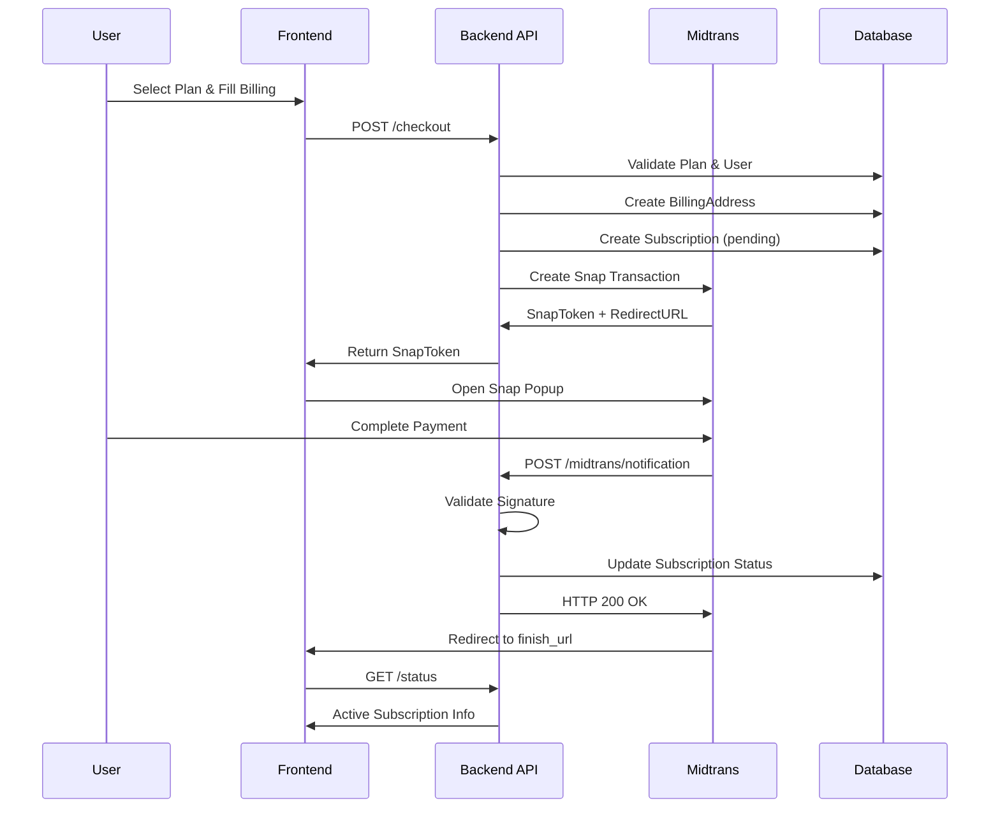

# Dokumentasi Fitur: Payment Flow (Subscription & Midtrans Integration)

> **Fokus Domain:** BACKEND  
> **Konteks:** Trace Upstream ke Downstream secara Semantik

---

## Alur Data Semantik (Scope: BACKEND)

```
=== GET PLANS (Public) ===
[HTTP GET /api/payment/plans]  
    -> [Controller: Delegasi ke Service]  
    -> [Service: Fetch All Plans]  
        -> [Repository: FindAllPlans]  
    -> [HTTP Response dengan List Plans]

=== CHECKOUT (Protected) ===
[HTTP POST /api/payment/checkout]  
    -> [JWT Auth Middleware: Ekstraksi User ID]  
    -> [Controller: Parsing & Validasi]  
    -> [Service: CreateSubscription]  
        -> [Repository: Validate Plan & User]  
        -> [Transaction Begin]  
        -> [Repository: Create BillingAddress]  
        -> [Repository: Create Subscription (Pending)]  
        -> [Transaction Commit]  
        -> [Midtrans API: Create Snap Transaction]  
    -> [HTTP Response dengan SnapToken & RedirectURL]

=== WEBHOOK (From Midtrans) ===
[HTTP POST /api/payment/midtrans/notification]  
    -> [Controller: Parse Webhook Payload]  
    -> [Service: HandleNotification]  
        -> [Validate Signature (SHA512)]  
        -> [Transaction Begin]  
        -> [Repository: Find Subscription by OrderId]  
        -> [Update Status based on TransactionStatus]  
        -> [Transaction Commit]  
    -> [HTTP 200 OK to Midtrans]
```

---

## A. Laporan Implementasi Fitur Payment Flow

### Deskripsi Fungsional

Fitur ini menyediakan manajemen subscription berbayar dengan integrasi **Midtrans Payment Gateway**. Sistem mengimplementasikan **Snap API** untuk checkout yang aman dan webhook untuk notifikasi asinkron dari payment gateway. Alur utama:

1. **GetPlans**: Endpoint publik untuk menampilkan daftar paket langganan dengan fitur dan harga
2. **GetOrderSummary**: Kalkulasi preview termasuk subtotal, tax, dan total sebelum checkout
3. **Checkout**: Pembuatan subscription pending, billing address, dan generate Midtrans Snap Token
4. **Webhook**: Penerimaan notifikasi dari Midtrans dengan validasi signature dan update status subscription
5. **GetSubscriptionStatus**: Pengambilan status langganan aktif user dengan feature flags
6. **CancelSubscription**: Pembatalan langganan aktif user

Semua transaksi finansial dilindungi oleh **SHA512 signature validation** dari Midtrans.

### Visualisasi

**Checkout Response:**
```json
{
    "success": true,
    "code": 200,
    "message": "Subscription created",
    "data": {
        "subscription_id": "550e8400-e29b-41d4-a716-446655440000",
        "snap_token": "66e4fa55-fdac-4ef9-91b5-733b97d8b440",
        "snap_redirect_url": "https://app.sandbox.midtrans.com/snap/v2/vtweb/66e4fa55..."
    }
}
```

**Webhook Payload (from Midtrans):**
```json
{
    "transaction_status": "settlement",
    "order_id": "550e8400-e29b-41d4-a716-446655440000",
    "fraud_status": "accept",
    "signature_key": "a1b2c3d4...",
    "status_code": "200",
    "gross_amount": "99000.00"
}
```
*Caption: Gambar 1: Response checkout dan webhook payload dari Midtrans.*

---

## B. Bedah Arsitektur & Komponen

Berikut adalah rincian 17 komponen yang menyusun fitur ini di sisi BACKEND.

---

### [internal/server/server.go](file:///d:/notetaker/notefiber-BE/internal/server/server.go)
**Layer Terdeteksi:** `HTTP Server & Route Registration`

**Narasi Operasional:**
Komponen ini menginisialisasi instance server HTTP dan mendaftarkan [PaymentController](file:///d:/notetaker/notefiber-BE/internal/controller/payment_controller.go#16-25). Endpoint webhook (`/midtrans/notification`) bersifat publik untuk menerima notifikasi dari Midtrans, sedangkan endpoint lain seperti checkout dilindungi JWT middleware.

```go
func registerRoutes(app *fiber.App, c *bootstrap.Container) {
	api := app.Group("/api")

	c.PaymentController.RegisterRoutes(api)
	// ... other controllers
}
```
*Caption: Snippet 1: Registrasi PaymentController ke grup API.*

---

### [internal/bootstrap/container.go](file:///d:/notetaker/notefiber-BE/internal/bootstrap/container.go)
**Layer Terdeteksi:** `Dependency Injection Container`

**Narasi Operasional:**
File ini mengorkestrasi konstruksi dan injeksi dependensi. [PaymentService](file:///d:/notetaker/notefiber-BE/internal/service/payment_service.go#22-30) diinisialisasi dengan `uowFactory` untuk akses multi-repository dalam satu transaksi. Konfigurasi Midtrans (Server Key, Environment) dibaca dari environment variables di dalam service.

```go
func NewContainer(db *gorm.DB, cfg *config.Config) *Container {
	// 1. Core Facades
	uowFactory := unitofwork.NewRepositoryFactory(db)

	// 3. Services
	paymentService := service.NewPaymentService(uowFactory)

	// 4. Controllers
	return &Container{
		PaymentController: controller.NewPaymentController(paymentService),
		// ...
	}
}
```
*Caption: Snippet 2: Konstruksi PaymentService dengan Repository Factory.*

---

### [internal/dto/auth_payment_dto.go](file:///d:/notetaker/notefiber-BE/internal/dto/auth_payment_dto.go)
**Layer Terdeteksi:** `Data Transfer Object (DTO)`

**Narasi Operasional:**
File ini mendefinisikan kontrak data untuk semua operasi payment. [CheckoutRequest](file:///d:/notetaker/notefiber-BE/internal/dto/auth_payment_dto.go#81-94) berisi informasi billing lengkap dengan validasi required untuk setiap field. [CheckoutResponse](file:///d:/notetaker/notefiber-BE/internal/dto/auth_payment_dto.go#95-100) mengembalikan `snap_token` dan `snap_redirect_url` untuk integrasi frontend dengan Midtrans Snap. [MidtransWebhookRequest](file:///d:/notetaker/notefiber-BE/internal/dto/auth_payment_dto.go#101-110) mendefinisikan payload yang diterima dari Midtrans dengan field untuk signature validation.

```go
type PlanResponse struct {
	Id          uuid.UUID `json:"id"`
	Name        string    `json:"name"`
	Slug        string    `json:"slug"`
	Price       float64   `json:"price"`
	Description string    `json:"description"`
	Features    []string  `json:"features"`
}

type OrderSummaryResponse struct {
	PlanName      string  `json:"plan_name"`
	BillingPeriod string  `json:"billing_period"`
	PricePerUnit  string  `json:"price_per_unit"`
	Subtotal      float64 `json:"subtotal"`
	Tax           float64 `json:"tax"`
	Total         float64 `json:"total"`
	Currency      string  `json:"currency"`
}

type CheckoutRequest struct {
	PlanId       uuid.UUID `json:"plan_id" validate:"required"`
	FirstName    string    `json:"first_name" validate:"required"`
	LastName     string    `json:"last_name" validate:"required"`
	Email        string    `json:"email" validate:"required,email"`
	Phone        string    `json:"phone"`
	AddressLine1 string    `json:"address_line1" validate:"required"`
	AddressLine2 string    `json:"address_line2"`
	City         string    `json:"city" validate:"required"`
	State        string    `json:"state" validate:"required"`
	PostalCode   string    `json:"postal_code" validate:"required,max=10"`
	Country      string    `json:"country" validate:"required"`
}

type CheckoutResponse struct {
	SubscriptionId  uuid.UUID `json:"subscription_id"`
	SnapRedirectUrl string    `json:"snap_redirect_url"`
	SnapToken       string    `json:"snap_token"`
}

type MidtransWebhookRequest struct {
	TransactionStatus string `json:"transaction_status"`
	OrderId           string `json:"order_id"`
	FraudStatus       string `json:"fraud_status"`
	SignatureKey      string `json:"signature_key"`
	StatusCode        string `json:"status_code"`
	GrossAmount       string `json:"gross_amount"`
}
```
*Caption: Snippet 3: DTO untuk operasi Payment dengan Midtrans integration.*

---

### [internal/controller/payment_controller.go](file:///d:/notetaker/notefiber-BE/internal/controller/payment_controller.go)
**Layer Terdeteksi:** `Interface / Controller Layer`

**Narasi Operasional:**
Komponen ini menangani HTTP endpoints untuk payment. Menggunakan custom [authMiddleware](file:///d:/notetaker/notefiber-BE/internal/controller/payment_controller.go#46-69) untuk route protection (berbeda dari global JWT middleware). Handler [Webhook](file:///d:/notetaker/notefiber-BE/internal/controller/payment_controller.go#116-140) bersifat public dan mengembalikan HTTP status code yang sesuai untuk Midtrans retry mechanism. Handler [GetPlans](file:///d:/notetaker/notefiber-BE/internal/service/payment_service.go#41-70) dan [GetOrderSummary](file:///d:/notetaker/notefiber-BE/internal/service/payment_service.go#71-101) bersifat public untuk preview sebelum login.

```go
func (c *paymentController) RegisterRoutes(r fiber.Router) {
	h := r.Group("/payment")
	h.Post("/midtrans/notification", c.Webhook)  // Public: Midtrans callback
	h.Get("/plans", c.GetPlans)                  // Public: View plans
	h.Get("/summary", c.GetOrderSummary)         // Public: Preview order

	// Protected Routes
	h.Post("/checkout", c.authMiddleware, c.Checkout)
	h.Get("/status", c.authMiddleware, c.GetStatus)
	h.Post("/cancel", c.authMiddleware, c.CancelSubscription)
}

func (c *paymentController) Checkout(ctx *fiber.Ctx) error {
	var req dto.CheckoutRequest
	if err := ctx.BodyParser(&req); err != nil {
		return err
	}
	if err := serverutils.ValidateRequest(req); err != nil {
		return err
	}

	userIdStr := ctx.Locals("user_id").(string)
	userId, _ := uuid.Parse(userIdStr)

	res, err := c.service.CreateSubscription(ctx.Context(), userId, &req)
	if err != nil {
		return ctx.Status(fiber.StatusInternalServerError).JSON(serverutils.ErrorResponse(500, err.Error()))
	}
	return ctx.JSON(serverutils.SuccessResponse("Subscription created", res))
}

func (c *paymentController) Webhook(ctx *fiber.Ctx) error {
	var req dto.MidtransWebhookRequest
	if err := ctx.BodyParser(&req); err != nil {
		return ctx.SendStatus(fiber.StatusBadRequest)
	}

	fmt.Printf("[WEBHOOK] Received: OrderId=%s, Status=%s\n", req.OrderId, req.TransactionStatus)

	err := c.service.HandleNotification(ctx.Context(), &req)
	if err != nil {
		// Return 500 so Midtrans will retry the notification
		return ctx.SendStatus(fiber.StatusInternalServerError)
	}

	return ctx.SendStatus(fiber.StatusOK)
}

func (c *paymentController) GetStatus(ctx *fiber.Ctx) error {
	userIdStr := ctx.Locals("user_id").(string)
	userId, _ := uuid.Parse(userIdStr)

	res, err := c.service.GetSubscriptionStatus(ctx.Context(), userId)
	if err != nil {
		return ctx.Status(fiber.StatusInternalServerError).JSON(serverutils.ErrorResponse(500, err.Error()))
	}
	return ctx.JSON(serverutils.SuccessResponse("Subscription status", res))
}
```
*Caption: Snippet 4: Controller dengan public/protected routes dan webhook handling.*

---

### [internal/service/payment_service.go](file:///d:/notetaker/notefiber-BE/internal/service/payment_service.go)
**Layer Terdeteksi:** `Business Logic / Service Layer`

**Narasi Operasional:**
Komponen ini mengenkapsulasi seluruh logika bisnis payment dengan integrasi Midtrans.

**GetPlans**: Fetch semua plans dan map ke response DTO dengan feature list yang dinamis.

**GetOrderSummary**: Kalkulasi subtotal, tax, dan total berdasarkan plan price dan tax rate.

**CreateSubscription**: Orkestrasi kompleks yang mencakup: (1) validasi plan dan user, (2) create billing address, (3) create subscription dengan status `inactive` dan payment status `pending`, (4) call Midtrans Snap API untuk generate token.

**HandleNotification**: Validasi webhook dengan SHA512 signature, lalu update subscription status berdasarkan `transaction_status` dari Midtrans (settlement → active, deny/cancel/expire → failed).

**GetSubscriptionStatus**: Fetch active subscription user dengan fallback ke Free Plan jika tidak ada.

```go
func (s *paymentService) CreateSubscription(ctx context.Context, userId uuid.UUID, req *dto.CheckoutRequest) (*dto.CheckoutResponse, error) {
	uow := s.uowFactory.NewUnitOfWork(ctx)

	// 1. Validate Plan
	plan, err := uow.SubscriptionRepository().FindOnePlan(ctx, specification.ByID{ID: req.PlanId})
	if plan == nil {
		return nil, errors.New("plan not found")
	}

	// 2. Validate User
	user, err := uow.UserRepository().FindOne(ctx, specification.ByID{ID: userId})
	if user == nil {
		return nil, errors.New("user not found")
	}

	// 3. Create Billing Address Entity
	billingId := uuid.New()
	billingAddr := &entity.BillingAddress{
		Id: billingId, UserId: userId,
		FirstName: req.FirstName, LastName: req.LastName,
		Email: req.Email, Phone: req.Phone,
		AddressLine1: req.AddressLine1, City: req.City,
		State: req.State, PostalCode: req.PostalCode, Country: req.Country,
	}

	// 4. Create Subscription Entity (Pending)
	subId := uuid.New()
	sub := &entity.UserSubscription{
		Id:              subId,
		UserId:          userId,
		PlanId:          plan.Id,
		BillingAddressId: &billingId,
		Status:          entity.SubscriptionStatusInactive,
		PaymentStatus:   entity.PaymentStatusPending,
		CurrentPeriodEnd: time.Now().AddDate(0, 1, 0), // 1 month
	}

	// 5. Transaction: Persist Billing + Subscription
	uow.Begin(ctx)
	defer uow.Rollback()
	uow.BillingRepository().Create(ctx, billingAddr)
	uow.SubscriptionRepository().CreateSubscription(ctx, sub)
	uow.Commit()

	// 6. Call Midtrans Snap API
	var sClient snap.Client
	sClient.New(os.Getenv("MIDTRANS_SERVER_KEY"), midtrans.Sandbox)

	finalAmount := int64(plan.Price + (plan.Price * plan.TaxRate))
	snapReq := &snap.Request{
		TransactionDetails: midtrans.TransactionDetails{
			OrderID:  subId.String(),
			GrossAmt: finalAmount,
		},
		CustomerDetail: &midtrans.CustomerDetails{
			FName: req.FirstName, LName: req.LastName,
			Email: req.Email, Phone: req.Phone,
		},
		Callbacks: &snap.Callbacks{
			Finish: os.Getenv("FRONTEND_URL") + "/app?payment=success",
		},
	}

	snapResp, midErr := sClient.CreateTransaction(snapReq)
	if midErr != nil {
		return nil, fmt.Errorf("midtrans error: %v", midErr.GetMessage())
	}

	return &dto.CheckoutResponse{
		SubscriptionId:  subId,
		SnapToken:       snapResp.Token,
		SnapRedirectUrl: snapResp.RedirectURL,
	}, nil
}

func (s *paymentService) HandleNotification(ctx context.Context, req *dto.MidtransWebhookRequest) error {
	// 1. Signature Validation
	serverKey := os.Getenv("MIDTRANS_SERVER_KEY")
	signatureInput := req.OrderId + req.StatusCode + req.GrossAmount + serverKey
	expectedSignature := fmt.Sprintf("%x", sha512.Sum512([]byte(signatureInput)))

	if req.SignatureKey != expectedSignature {
		return fmt.Errorf("invalid signature")
	}

	// 2. Parse Subscription ID
	subId, _ := uuid.Parse(req.OrderId)

	// 3. Transaction Update
	uow := s.uowFactory.NewUnitOfWork(ctx)
	uow.Begin(ctx)
	defer uow.Rollback()

	sub, _ := uow.SubscriptionRepository().FindOneSubscription(ctx, specification.ByID{ID: subId})
	if sub == nil {
		return fmt.Errorf("subscription not found")
	}

	// 4. Determine New Status
	switch req.TransactionStatus {
	case "capture", "settlement":
		sub.Status = entity.SubscriptionStatusActive
		sub.PaymentStatus = entity.PaymentStatusPaid
	case "deny", "cancel", "expire":
		sub.Status = entity.SubscriptionStatusInactive
		sub.PaymentStatus = entity.PaymentStatusFailed
	case "pending":
		return nil // No action needed
	}

	uow.SubscriptionRepository().UpdateSubscription(ctx, sub)
	return uow.Commit()
}

func (s *paymentService) GetSubscriptionStatus(ctx context.Context, userId uuid.UUID) (*dto.SubscriptionStatusResponse, error) {
	uow := s.uowFactory.NewUnitOfWork(ctx)
	subs, _ := uow.SubscriptionRepository().FindAllSubscriptions(ctx,
		specification.UserOwnedBy{UserID: userId},
		specification.OrderBy{Field: "created_at", Desc: true},
	)

	// Find active subscription
	var activeSub *entity.UserSubscription
	for _, sub := range subs {
		if sub.Status == entity.SubscriptionStatusActive && sub.CurrentPeriodEnd.After(time.Now()) {
			activeSub = sub
			break
		}
	}

	if activeSub == nil {
		return &dto.SubscriptionStatusResponse{
			PlanName: "Free Plan", Status: "inactive", IsActive: false,
			Features: dto.SubscriptionFeatures{MaxNotebooks: 3, MaxNotesPerNotebook: 10},
		}, nil
	}

	plan, _ := uow.SubscriptionRepository().FindOnePlan(ctx, specification.ByID{ID: activeSub.PlanId})

	return &dto.SubscriptionStatusResponse{
		SubscriptionId:   activeSub.Id,
		PlanName:         plan.Name,
		Status:           string(activeSub.Status),
		CurrentPeriodEnd: activeSub.CurrentPeriodEnd,
		IsActive:         true,
		Features: dto.SubscriptionFeatures{
			AiChat:         plan.AiChatEnabled,
			SemanticSearch: plan.SemanticSearchEnabled,
			MaxNotebooks:   plan.MaxNotebooks,
		},
	}, nil
}
```
*Caption: Snippet 5: Service dengan Midtrans integration dan webhook handling.*

---

### [internal/repository/unitofwork/unit_of_work.go](file:///d:/notetaker/notefiber-BE/internal/repository/unitofwork/unit_of_work.go)
**Layer Terdeteksi:** `Unit of Work Interface`

**Narasi Operasional:**
File ini mendefinisikan kontrak Unit of Work. Untuk Payment Flow, tiga repository digunakan: [SubscriptionRepository](file:///d:/notetaker/notefiber-BE/internal/repository/contract/subscription_repository.go#12-37) untuk plans dan subscriptions, [BillingRepository](file:///d:/notetaker/notefiber-BE/internal/repository/unitofwork/unit_of_work.go#25-26) untuk alamat billing, dan [UserRepository](file:///d:/notetaker/notefiber-BE/internal/repository/contract/user_repository.go#12-49) untuk validasi user.

```go
type UnitOfWork interface {
	Begin(ctx context.Context) error
	Commit() error
	Rollback() error

	UserRepository() contract.UserRepository
	SubscriptionRepository() contract.SubscriptionRepository
	BillingRepository() contract.BillingRepository
	// ...
}
```
*Caption: Snippet 6: Interface Unit of Work dengan akses ke Subscription dan Billing repository.*

---

### [internal/repository/contract/subscription_repository.go](file:///d:/notetaker/notefiber-BE/internal/repository/contract/subscription_repository.go)
**Layer Terdeteksi:** `Repository Interface / Contract`

**Narasi Operasional:**
File ini mendefinisikan kontrak untuk operasi data terkait subscription. Interface ini memisahkan operasi Plans dan User Subscriptions, serta menyediakan metode untuk admin dashboard (revenue, active subscribers).

```go
type SubscriptionRepository interface {
	// Plans
	CreatePlan(ctx context.Context, plan *entity.SubscriptionPlan) error
	UpdatePlan(ctx context.Context, plan *entity.SubscriptionPlan) error
	DeletePlan(ctx context.Context, id uuid.UUID) error
	FindOnePlan(ctx context.Context, specs ...specification.Specification) (*entity.SubscriptionPlan, error)
	FindAllPlans(ctx context.Context, specs ...specification.Specification) ([]*entity.SubscriptionPlan, error)

	// User Subscriptions
	CreateSubscription(ctx context.Context, subscription *entity.UserSubscription) error
	UpdateSubscription(ctx context.Context, subscription *entity.UserSubscription) error
	DeleteSubscription(ctx context.Context, id uuid.UUID) error
	FindOneSubscription(ctx context.Context, specs ...specification.Specification) (*entity.UserSubscription, error)
	FindAllSubscriptions(ctx context.Context, specs ...specification.Specification) ([]*entity.UserSubscription, error)

	// Admin Stats
	GetTotalRevenue(ctx context.Context) (float64, error)
	CountActiveSubscribers(ctx context.Context) (int, error)
}
```
*Caption: Snippet 7: Kontrak repository untuk Plans dan Subscriptions.*

---

### [internal/entity/subscription_entity.go](file:///d:/notetaker/notefiber-BE/internal/entity/subscription_entity.go)
**Layer Terdeteksi:** `Domain Entity`

**Narasi Operasional:**
File ini mendefinisikan entitas domain untuk subscription system. [SubscriptionPlan](file:///d:/notetaker/notefiber-BE/internal/entity/subscription_entity.go#27-53) mendefinisikan paket dengan limits dan feature flags. [UserSubscription](file:///d:/notetaker/notefiber-BE/internal/entity/subscription_entity.go#54-67) merepresentasikan langganan user dengan status lifecycle dan billing period. Status constants mengikuti state machine: Inactive → Active (payment success) → Canceled.

```go
type SubscriptionStatus string
type PaymentStatus string
type BillingPeriod string

const (
	SubscriptionStatusActive   SubscriptionStatus = "active"
	SubscriptionStatusInactive SubscriptionStatus = "inactive"
	SubscriptionStatusCanceled SubscriptionStatus = "canceled"

	PaymentStatusPending PaymentStatus = "pending"
	PaymentStatusPaid    PaymentStatus = "success"
	PaymentStatusFailed  PaymentStatus = "failed"

	BillingPeriodMonthly BillingPeriod = "monthly"
	BillingPeriodYearly  BillingPeriod = "yearly"
)

type SubscriptionPlan struct {
	Id            uuid.UUID
	Name          string
	Slug          string
	Description   string
	Price         float64
	TaxRate       float64
	BillingPeriod BillingPeriod
	// Limits
	MaxNotebooks             int
	MaxNotesPerNotebook      int
	AiChatDailyLimit         int
	SemanticSearchDailyLimit int
	// Feature Flags
	SemanticSearchEnabled bool
	AiChatEnabled         bool
	IsMostPopular         bool
	IsActive              bool
}

type UserSubscription struct {
	Id                 uuid.UUID
	UserId             uuid.UUID
	PlanId             uuid.UUID
	BillingAddressId   *uuid.UUID
	Status             SubscriptionStatus
	PaymentStatus      PaymentStatus
	CurrentPeriodStart time.Time
	CurrentPeriodEnd   time.Time
	CreatedAt          time.Time
	UpdatedAt          time.Time
}
```
*Caption: Snippet 8: Entity domain untuk Subscription dengan status state machine.*

---

### [internal/entity/billing_entity.go](file:///d:/notetaker/notefiber-BE/internal/entity/billing_entity.go)
**Layer Terdeteksi:** `Domain Entity - Billing`

**Narasi Operasional:**
Entity `BillingAddress` menyimpan informasi billing customer yang dikumpulkan saat checkout dan dikirim ke Midtrans sebagai customer details.

```go
type BillingAddress struct {
	Id           uuid.UUID
	UserId       uuid.UUID
	FirstName    string
	LastName     string
	Email        string
	Phone        string
	AddressLine1 string
	AddressLine2 string
	City         string
	State        string
	PostalCode   string
	Country      string
	IsDefault    bool
	CreatedAt    time.Time
	UpdatedAt    time.Time
}
```
*Caption: Snippet 9: Entity untuk Billing Address.*

---

## C. Ringkasan Layer Arsitektur

| No | Layer | File | Tanggung Jawab |
|----|-------|------|----------------|
| 1 | HTTP Server | [server/server.go](file:///d:/notetaker/notefiber-BE/internal/server/server.go) | Route registration |
| 2 | DI Container | [bootstrap/container.go](file:///d:/notetaker/notefiber-BE/internal/bootstrap/container.go) | Dependency wiring |
| 3 | DTO | [dto/auth_payment_dto.go](file:///d:/notetaker/notefiber-BE/internal/dto/auth_payment_dto.go) | Kontrak data Checkout, Webhook, Plans |
| 4 | Controller | [controller/payment_controller.go](file:///d:/notetaker/notefiber-BE/internal/controller/payment_controller.go) | HTTP handler + Auth middleware |
| 5 | Service | [service/payment_service.go](file:///d:/notetaker/notefiber-BE/internal/service/payment_service.go) | Business logic + Midtrans API |
| 6 | Factory Interface | [unitofwork/repository_factory.go](file:///d:/notetaker/notefiber-BE/internal/repository/unitofwork/repository_factory.go) | Kontrak pembuatan Unit of Work |
| 7 | Factory Impl | [unitofwork/repository_factory_impl.go](file:///d:/notetaker/notefiber-BE/internal/repository/unitofwork/repository_factory_impl.go) | Implementasi factory |
| 8 | UoW Interface | [unitofwork/unit_of_work.go](file:///d:/notetaker/notefiber-BE/internal/repository/unitofwork/unit_of_work.go) | Kontrak multi-repository access |
| 9 | UoW Impl | [unitofwork/unit_of_work_impl.go](file:///d:/notetaker/notefiber-BE/internal/repository/unitofwork/unit_of_work_impl.go) | Transaction management |
| 10 | Subscription Contract | [contract/subscription_repository.go](file:///d:/notetaker/notefiber-BE/internal/repository/contract/subscription_repository.go) | Interface Plans & Subscriptions |
| 11 | Billing Contract | [contract/billing_repository.go](file:///d:/notetaker/notefiber-BE/internal/repository/contract/billing_repository.go) | Interface Billing Address |
| 12 | Common Specs | [specification/common_specifications.go](file:///d:/notetaker/notefiber-BE/internal/repository/specification/common_specifications.go) | [ByID](file:///d:/notetaker/notefiber-BE/internal/repository/specification/common_specifications.go#11-14), [UserOwnedBy](file:///d:/notetaker/notefiber-BE/internal/repository/specification/user_specifications.go#17-20), [OrderBy](file:///d:/notetaker/notefiber-BE/internal/repository/specification/common_specifications.go#29-33) |
| 13 | Subscription Impl | [implementation/subscription_repository_impl.go](file:///d:/notetaker/notefiber-BE/internal/repository/implementation/subscription_repository_impl.go) | CRUD Plans & Subscriptions |
| 14 | Billing Impl | [implementation/billing_repository_impl.go](file:///d:/notetaker/notefiber-BE/internal/repository/implementation/billing_repository_impl.go) | CRUD Billing Address |
| 15 | Subscription Entity | [entity/subscription_entity.go](file:///d:/notetaker/notefiber-BE/internal/entity/subscription_entity.go) | Domain objects |
| 16 | Billing Entity | [entity/billing_entity.go](file:///d:/notetaker/notefiber-BE/internal/entity/billing_entity.go) | BillingAddress domain |
| 17 | Mapper | [mapper/subscription_mapper.go](file:///d:/notetaker/notefiber-BE/internal/mapper/subscription_mapper.go) | Entity ↔ Model transformation |

---

## D. Endpoint API Reference

| Method | Endpoint | Deskripsi | Auth |
|--------|----------|-----------|------|
| `GET` | `/api/payment/plans` | List subscription plans | Public |
| `GET` | `/api/payment/summary?plan_id=xxx` | Order preview with tax | Public |
| `POST` | `/api/payment/checkout` | Create subscription + Snap token | JWT Required |
| `POST` | `/api/payment/midtrans/notification` | Webhook from Midtrans | Public (Signature) |
| `GET` | `/api/payment/status` | Current subscription status | JWT Required |
| `POST` | `/api/payment/cancel` | Cancel active subscription | JWT Required |

---

## E. Payment Flow Diagram


*Caption: Diagram 1: Complete payment flow dari checkout sampai subscription activation.*

---

## F. Webhook Status Mapping

| Midtrans Status | Subscription Status | Payment Status | Aksi |
|-----------------|---------------------|----------------|------|
| `capture` | `active` | `success` | Activate subscription |
| `settlement` | `active` | `success` | Activate subscription |
| `pending` | - | - | No action (wait) |
| `deny` | `inactive` | `failed` | Payment rejected |
| `cancel` | `inactive` | `failed` | User canceled |
| `expire` | `inactive` | `failed` | Payment timeout |

---

## G. Security Measures

| Aspek | Implementasi |
|-------|--------------|
| **Signature Validation** | SHA512(order_id + status_code + gross_amount + server_key) |
| **JWT Authentication** | Protected routes via [authMiddleware](file:///d:/notetaker/notefiber-BE/internal/controller/payment_controller.go#46-69) |
| **Idempotency** | Check if status already updated before processing |
| **Transaction Atomicity** | BillingAddress + Subscription in single transaction |
| **Webhook Retry** | Return 500 for Midtrans to retry on failure |
| **Secure Checkout** | Midtrans Snap handles card data (PCI compliant) |

---

## H. Environment Configuration

```env
# Midtrans Configuration
MIDTRANS_SERVER_KEY=SB-Mid-server-xxx
MIDTRANS_IS_PRODUCTION=false
FRONTEND_URL=http://localhost:5173
```

---

*Dokumen ini di-generate dalam mode READ-ONLY tanpa modifikasi terhadap kode sumber.*
