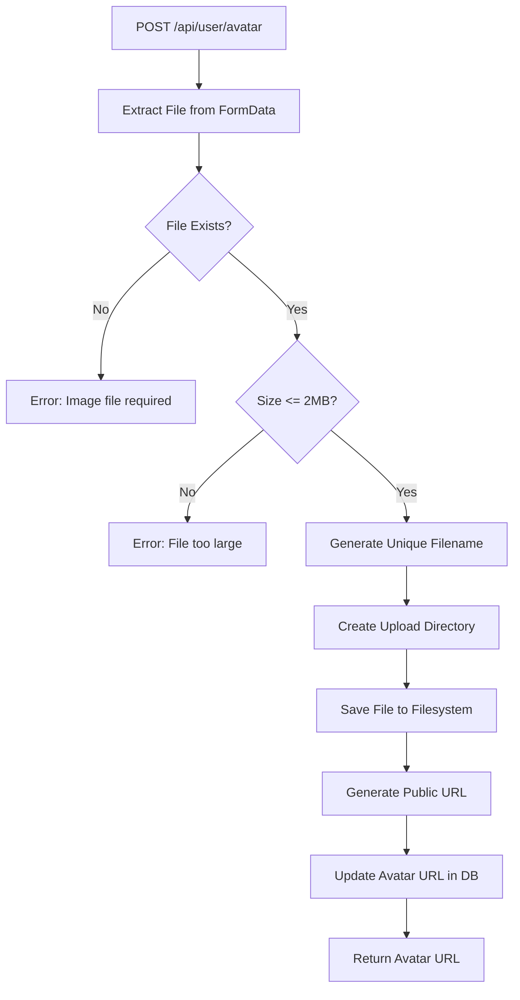

# Dokumentasi Fitur: Profile Management

> **Fokus Domain:** BACKEND  
> **Konteks:** Trace Upstream ke Downstream secara Semantik

---

## Alur Data Semantik (Scope: BACKEND)

```
=== GET PROFILE ===
[HTTP GET /api/user/profile]  
    -> [JWT Middleware: Ekstraksi User ID]  
    -> [Controller: Delegasi ke Service]  
    -> [Service: Fetch User dengan Avatar]  
        -> [Repository: GetByIdWithAvatar]  
            -> [Mapper: Model -> Entity]  
    -> [HTTP Response dengan UserProfileResponse]

=== UPDATE PROFILE ===
[HTTP PUT /api/user/profile]  
    -> [JWT Middleware: Ekstraksi User ID]  
    -> [Controller: Parsing & Validasi]  
    -> [Service: Fetch -> Modify -> Persist]  
        -> [Repository: FindOne + Update]  
    -> [HTTP Response Success]

=== UPLOAD AVATAR ===
[HTTP POST /api/user/avatar]  
    -> [JWT Middleware: Ekstraksi User ID]  
    -> [Controller: Ekstraksi File dari FormData]  
    -> [Service: File Processing Pipeline]  
        -> [Validasi Ukuran File (Max 2MB)]  
        -> [Generate Unique Filename]  
        -> [Simpan ke Filesystem]  
        -> [Generate Public URL]  
        -> [Repository: UpdateAvatar]  
    -> [HTTP Response dengan Avatar URL]

=== DELETE ACCOUNT ===
[HTTP DELETE /api/user/account]  
    -> [JWT Middleware: Ekstraksi User ID]  
    -> [Controller: Delegasi ke Service]  
    -> [Service: Soft Delete User]  
        -> [Repository: Delete (Soft)]  
    -> [HTTP Response Success]
```

---

## A. Laporan Implementasi Fitur Profile Management

### Deskripsi Fungsional

Fitur ini menyediakan manajemen profil pengguna yang mencakup akses dan modifikasi data personal. Sistem mengimplementasikan:

1. **Get Profile**: Pengambilan data profil lengkap termasuk avatar, role, status, dan usage statistics
2. **Update Profile**: Modifikasi nama lengkap pengguna dengan validasi minimum karakter
3. **Upload Avatar**: Unggah gambar profil dengan validasi ukuran, penyimpanan ke filesystem, dan generate public URL
4. **Delete Account**: Soft-delete akun pengguna untuk data recovery dan compliance

Fitur tambahan **Request Refund** juga tersedia di controller ini untuk proses permintaan pengembalian dana subscription.

Semua endpoint dilindungi JWT middleware dan beroperasi pada data user yang terautentikasi.

### Visualisasi

**Get Profile Response:**
```json
{
    "success": true,
    "code": 200,
    "message": "User profile",
    "data": {
        "id": "550e8400-e29b-41d4-a716-446655440000",
        "email": "john.doe@example.com",
        "full_name": "John Doe",
        "role": "user",
        "status": "active",
        "avatar_url": "http://localhost:3000/uploads/avatars/550e8400_1703505600.jpg",
        "ai_daily_usage": 5,
        "created_at": "2024-01-15T10:00:00Z"
    }
}
```

**Upload Avatar Response:**
```json
{
    "success": true,
    "code": 200,
    "message": "Avatar uploaded successfully",
    "data": {
        "avatar_url": "http://localhost:3000/uploads/avatars/550e8400_1703505600.jpg"
    }
}
```
*Caption: Gambar 1: Response untuk Get Profile dan Upload Avatar.*

---

## B. Bedah Arsitektur & Komponen

Berikut adalah rincian 15 komponen yang menyusun fitur ini di sisi BACKEND.

---

### [internal/server/server.go](file:///d:/notetaker/notefiber-BE/internal/server/server.go)
**Layer Terdeteksi:** `HTTP Server & Route Registration`

**Narasi Operasional:**
Komponen ini menginisialisasi instance server HTTP berbasis Fiber dan mendaftarkan seluruh controller. Untuk fitur Profile, [UserController](file:///d:/notetaker/notefiber-BE/internal/controller/user_controller.go#13-21) didaftarkan pada grup `/api`. Semua endpoint user dilindungi oleh JWT middleware. Server juga menyajikan static files dari direktori `./uploads` untuk akses avatar via URL publik.

```go
func registerRoutes(app *fiber.App, c *bootstrap.Container) {
	api := app.Group("/api")

	c.AuthController.RegisterRoutes(api)
	c.UserController.RegisterRoutes(api)
	c.NotebookController.RegisterRoutes(api)
	// ... other controllers

	// Static file serving for avatars
	app.Static("/uploads", "./uploads")
}
```
*Caption: Snippet 1: Registrasi UserController dan static file serving.*

---

### [internal/bootstrap/container.go](file:///d:/notetaker/notefiber-BE/internal/bootstrap/container.go)
**Layer Terdeteksi:** `Dependency Injection Container`

**Narasi Operasional:**
File ini mengorkestrasi konstruksi dan injeksi dependensi. [UserService](file:///d:/notetaker/notefiber-BE/internal/service/user_service.go#21-28) diinisialisasi hanya dengan `uowFactory` karena file storage dilakukan secara langsung menggunakan standard library Go ([os](file:///d:/notetaker/notefiber-BE/internal/repository/unitofwork/unit_of_work_impl.go#67-70), [io](file:///d:/notetaker/notefiber-BE/internal/repository/specification/common_specifications.go#52-56)). Service ini kemudian diinjeksikan ke [UserController](file:///d:/notetaker/notefiber-BE/internal/controller/user_controller.go#13-21).

```go
func NewContainer(db *gorm.DB, cfg *config.Config) *Container {
	// 1. Core Facades
	uowFactory := unitofwork.NewRepositoryFactory(db)

	// 3. Services
	userService := service.NewUserService(uowFactory)

	// 4. Controllers
	return &Container{
		UserController: controller.NewUserController(userService),
		// ...
	}
}
```
*Caption: Snippet 2: Konstruksi UserService dengan Repository Factory.*

---

### [internal/dto/user_dto.go](file:///d:/notetaker/notefiber-BE/internal/dto/user_dto.go)
**Layer Terdeteksi:** `Data Transfer Object (DTO)`

**Narasi Operasional:**
File ini mendefinisikan kontrak data untuk operasi profil. [UserProfileResponse](file:///d:/notetaker/notefiber-BE/internal/dto/user_dto.go#10-20) menyertakan semua informasi user termasuk `avatar_url` (omitempty jika kosong) dan `ai_daily_usage` untuk tracking penggunaan fitur AI. [UpdateProfileRequest](file:///d:/notetaker/notefiber-BE/internal/dto/user_dto.go#21-25) memerlukan `full_name` dengan minimum 3 karakter dan opsional [email](file:///d:/notetaker/notefiber-BE/internal/pkg/mailer/email_service.go#16-21) untuk update.

```go
type UserProfileResponse struct {
	Id           uuid.UUID `json:"id"`
	Email        string    `json:"email"`
	FullName     string    `json:"full_name"`
	Role         string    `json:"role"`
	Status       string    `json:"status"`
	AvatarURL    string    `json:"avatar_url,omitempty"`
	AiDailyUsage int       `json:"ai_daily_usage"`
	CreatedAt    time.Time `json:"created_at"`
}

type UpdateProfileRequest struct {
	FullName string `json:"full_name" validate:"required,min=3"`
	Email    string `json:"email" validate:"omitempty,email"`
}
```
*Caption: Snippet 3: DTO untuk operasi Profile dengan avatar support.*

---

### [internal/controller/user_controller.go](file:///d:/notetaker/notefiber-BE/internal/controller/user_controller.go)
**Layer Terdeteksi:** `Interface / Controller Layer`

**Narasi Operasional:**
Komponen ini menangani siklus Request-Response HTTP untuk semua endpoint User. Setiap handler mengekstrak `user_id` dari JWT token. Handler [UploadAvatar](file:///d:/notetaker/notefiber-BE/internal/controller/user_controller.go#81-100) menggunakan `ctx.FormFile()` untuk mengekstrak file dari multipart form-data. Handler [RequestRefund](file:///d:/notetaker/notefiber-BE/internal/service/user_service.go#142-207) menyertakan validasi tambahan untuk business rules (subscription_id required, reason minimum 10 karakter).

```go
func (c *userController) RegisterRoutes(r fiber.Router) {
	h := r.Group("/user")
	h.Use(serverutils.JwtMiddleware) // PROTECTED
	h.Get("/profile", c.GetProfile)
	h.Put("/profile", c.UpdateProfile)
	h.Delete("/account", c.DeleteAccount)
	h.Post("/avatar", c.UploadAvatar)
	h.Post("/refund/request", c.RequestRefund)
}

func (c *userController) GetProfile(ctx *fiber.Ctx) error {
	userIdStr := ctx.Locals("user_id").(string)
	userId, _ := uuid.Parse(userIdStr)

	res, err := c.service.GetProfile(ctx.Context(), userId)
	if err != nil {
		return ctx.Status(fiber.StatusInternalServerError).JSON(serverutils.ErrorResponse(500, err.Error()))
	}
	return ctx.JSON(serverutils.SuccessResponse("User profile", res))
}

func (c *userController) UpdateProfile(ctx *fiber.Ctx) error {
	userIdStr := ctx.Locals("user_id").(string)
	userId, _ := uuid.Parse(userIdStr)

	var req dto.UpdateProfileRequest
	if err := ctx.BodyParser(&req); err != nil {
		return err
	}
	if err := serverutils.ValidateRequest(req); err != nil {
		return err
	}

	err := c.service.UpdateProfile(ctx.Context(), userId, &req)
	if err != nil {
		return ctx.Status(fiber.StatusInternalServerError).JSON(serverutils.ErrorResponse(500, err.Error()))
	}
	return ctx.JSON(serverutils.SuccessResponse[any]("Profile updated", nil))
}

func (c *userController) UploadAvatar(ctx *fiber.Ctx) error {
	userIdStr := ctx.Locals("user_id").(string)
	userId, _ := uuid.Parse(userIdStr)

	// Get file from multipart form-data
	file, err := ctx.FormFile("avatar")
	if err != nil {
		return ctx.Status(fiber.StatusBadRequest).JSON(serverutils.ErrorResponse(400, "Image file is required"))
	}

	url, err := c.service.UploadAvatar(ctx.Context(), userId, file)
	if err != nil {
		return ctx.Status(fiber.StatusInternalServerError).JSON(serverutils.ErrorResponse(500, err.Error()))
	}

	return ctx.JSON(serverutils.SuccessResponse("Avatar uploaded successfully", map[string]string{
		"avatar_url": url,
	}))
}

func (c *userController) DeleteAccount(ctx *fiber.Ctx) error {
	userIdStr := ctx.Locals("user_id").(string)
	userId, _ := uuid.Parse(userIdStr)

	err := c.service.DeleteAccount(ctx.Context(), userId)
	if err != nil {
		return ctx.Status(fiber.StatusInternalServerError).JSON(serverutils.ErrorResponse(500, err.Error()))
	}
	return ctx.JSON(serverutils.SuccessResponse[any]("Account deleted", nil))
}
```
*Caption: Snippet 4: Controller dengan multipart file handling dan CRUD operations.*

---

### [internal/service/user_service.go](file:///d:/notetaker/notefiber-BE/internal/service/user_service.go)
**Layer Terdeteksi:** `Business Logic / Service Layer`

**Narasi Operasional:**
Komponen ini mengenkapsulasi logika bisnis untuk semua operasi Profile.

**GetProfile**: Fetch user dengan avatar menggunakan metode khusus [GetByIdWithAvatar](file:///d:/notetaker/notefiber-BE/internal/repository/contract/user_repository.go#34-36) yang meng-include relasi provider untuk mendapatkan avatar dari OAuth.

**UpdateProfile**: Fetch user dengan ownership validation, modifikasi nama, dan persist ke database.

**UploadAvatar**: Pipeline file processing yang mencakup: (1) validasi ukuran max 2MB, (2) generate unique filename dengan format `{userId}_{timestamp}.{ext}`, (3) simpan ke `./uploads/avatars/`, (4) generate public URL berdasarkan `APP_BASE_URL`, dan (5) update avatar URL di database.

**DeleteAccount**: Soft-delete user melalui GORM yang akan set `deleted_at` timestamp.

```go
func (s *userService) GetProfile(ctx context.Context, userId uuid.UUID) (*dto.UserProfileResponse, error) {
	uow := s.uowFactory.NewUnitOfWork(ctx)
	user, err := uow.UserRepository().GetByIdWithAvatar(ctx, userId)
	if err != nil {
		return nil, err
	}
	if user == nil {
		return nil, fmt.Errorf("user not found")
	}

	avatarURL := ""
	if user.AvatarURL != nil {
		avatarURL = *user.AvatarURL
	}

	return &dto.UserProfileResponse{
		Id:           user.Id,
		Email:        user.Email,
		FullName:     user.FullName,
		Role:         string(user.Role),
		Status:       string(user.Status),
		AvatarURL:    avatarURL,
		AiDailyUsage: user.AiDailyUsage,
		CreatedAt:    user.CreatedAt,
	}, nil
}

func (s *userService) UpdateProfile(ctx context.Context, userId uuid.UUID, req *dto.UpdateProfileRequest) error {
	uow := s.uowFactory.NewUnitOfWork(ctx)
	repo := uow.UserRepository()
	
	user, err := repo.FindOne(ctx, specification.ByID{ID: userId})
	if err != nil {
		return err
	}
	if user == nil {
		return fmt.Errorf("user not found")
	}

	user.FullName = req.FullName
	return repo.Update(ctx, user)
}

func (s *userService) UploadAvatar(ctx context.Context, userId uuid.UUID, file *multipart.FileHeader) (string, error) {
	// 1. Validate File Size (Max 2MB)
	if file.Size > 2*1024*1024 {
		return "", fmt.Errorf("file too large (max 2MB)")
	}

	// 2. Open File
	src, err := file.Open()
	if err != nil {
		return "", err
	}
	defer src.Close()

	// 3. Create Upload Directory
	uploadDir := "./uploads/avatars"
	if err := os.MkdirAll(uploadDir, 0755); err != nil {
		return "", err
	}

	// 4. Generate Unique Filename
	ext := filepath.Ext(file.Filename)
	filename := fmt.Sprintf("%s_%d%s", userId.String(), time.Now().Unix(), ext)
	dstPath := filepath.Join(uploadDir, filename)

	// 5. Save File to Filesystem
	dst, err := os.Create(dstPath)
	if err != nil {
		return "", err
	}
	defer dst.Close()

	if _, err = io.Copy(dst, src); err != nil {
		return "", err
	}

	// 6. Generate Public URL
	baseURL := os.Getenv("APP_BASE_URL")
	if baseURL == "" {
		baseURL = "http://localhost:3000"
	}
	publicURL := fmt.Sprintf("%s/uploads/avatars/%s", baseURL, filename)

	// 7. Update Avatar URL in Database
	uow := s.uowFactory.NewUnitOfWork(ctx)
	err = uow.UserRepository().UpdateAvatar(ctx, userId, publicURL)
	if err != nil {
		return "", err
	}

	return publicURL, nil
}

func (s *userService) DeleteAccount(ctx context.Context, userId uuid.UUID) error {
	uow := s.uowFactory.NewUnitOfWork(ctx)
	return uow.UserRepository().Delete(ctx, userId)
}
```
*Caption: Snippet 5: Service dengan file upload pipeline dan CRUD operations.*

---

### `internal/repository/unitofwork/repository_factory.go`
**Layer Terdeteksi:** `Factory Interface`

**Narasi Operasional:**
File ini mendefinisikan kontrak untuk pembuatan instance Unit of Work yang digunakan UserService untuk akses repository.

```go
type RepositoryFactory interface {
	NewUnitOfWork(ctx context.Context) UnitOfWork
}
```
*Caption: Snippet 6: Interface factory untuk pembuatan Unit of Work.*

---

### `internal/repository/unitofwork/unit_of_work.go`
**Layer Terdeteksi:** `Unit of Work Interface`

**Narasi Operasional:**
File ini mendefinisikan kontrak Unit of Work. Untuk Profile Management, hanya `UserRepository` yang digunakan untuk operasi CRUD user.

```go
type UnitOfWork interface {
	Begin(ctx context.Context) error
	Commit() error
	Rollback() error

	UserRepository() contract.UserRepository
	// ... other repositories
}
```
*Caption: Snippet 7: Interface Unit of Work dengan akses ke UserRepository.*

---

### `internal/repository/unitofwork/unit_of_work_impl.go`
**Layer Terdeteksi:** `Unit of Work Implementation`

**Narasi Operasional:**
Komponen ini mengimplementasikan pola Unit of Work. Untuk operasi profile yang bersifat single-table, transaksi eksplisit tidak diperlukan—GORM menangani atomisitas per-operasi.

```go
func (u *UnitOfWorkImpl) UserRepository() contract.UserRepository {
	return implementation.NewUserRepository(u.getDB())
}
```
*Caption: Snippet 8: Instansiasi UserRepository dari Unit of Work.*

---

### `internal/repository/contract/user_repository.go`
**Layer Terdeteksi:** `Repository Interface / Contract`

**Narasi Operasional:**
File ini mendefinisikan kontrak untuk operasi data User. Untuk Profile Management, beberapa metode digunakan: `FindOne` untuk fetch user, `Update` untuk modifikasi profil, `Delete` untuk soft-delete akun, `GetByIdWithAvatar` untuk fetch user dengan avatar dari provider, dan `UpdateAvatar` untuk update avatar URL.

```go
type UserRepository interface {
	Create(ctx context.Context, user *entity.User) error
	Update(ctx context.Context, user *entity.User) error
	Delete(ctx context.Context, id uuid.UUID) error
	FindOne(ctx context.Context, specs ...specification.Specification) (*entity.User, error)
	
	// Profile-specific methods
	GetByIdWithAvatar(ctx context.Context, id uuid.UUID) (*entity.User, error)
	UpdateAvatar(ctx context.Context, userId uuid.UUID, avatarURL string) error

	// ...
}
```
*Caption: Snippet 9: Kontrak repository dengan metode khusus Profile.*

---

### `internal/repository/specification/common_specifications.go`
**Layer Terdeteksi:** `Specification Implementation`

**Narasi Operasional:**
Untuk Profile Management, `ByID` digunakan untuk mencari user berdasarkan ID yang diekstrak dari JWT token.

```go
type ByID struct {
	ID uuid.UUID
}

func (s ByID) Apply(db *gorm.DB) *gorm.DB {
	return db.Where("id = ?", s.ID)
}
```
*Caption: Snippet 10: Specification untuk filter berdasarkan User ID.*

---

### `internal/repository/implementation/user_repository_impl.go`
**Layer Terdeteksi:** `Repository Implementation`

**Narasi Operasional:**
Komponen ini mengimplementasikan kontrak `UserRepository`. `GetByIdWithAvatar` melakukan preload relasi `UserProviders` untuk mengambil avatar dari OAuth provider jika ada. `UpdateAvatar` menggunakan GORM's `UpdateColumn` untuk partial update pada kolom `avatar_url` saja. `Delete` menggunakan soft-delete bawaan GORM.

```go
func (r *UserRepositoryImpl) GetByIdWithAvatar(ctx context.Context, id uuid.UUID) (*entity.User, error) {
	var modelUser model.User
	if err := r.db.WithContext(ctx).
		Preload("UserProviders").
		Where("id = ?", id).
		First(&modelUser).Error; err != nil {
		if errors.Is(err, gorm.ErrRecordNotFound) {
			return nil, nil
		}
		return nil, err
	}

	user := r.mapper.ToEntity(&modelUser)

	// Get avatar from provider if user doesn't have direct avatar
	if user.AvatarURL == nil && len(modelUser.UserProviders) > 0 {
		avatarFromProvider := modelUser.UserProviders[0].AvatarURL
		user.AvatarURL = &avatarFromProvider
	}

	return user, nil
}

func (r *UserRepositoryImpl) UpdateAvatar(ctx context.Context, userId uuid.UUID, avatarURL string) error {
	return r.db.WithContext(ctx).
		Model(&model.User{}).
		Where("id = ?", userId).
		UpdateColumn("avatar_url", avatarURL).Error
}

func (r *UserRepositoryImpl) Update(ctx context.Context, user *entity.User) error {
	m := r.mapper.ToModel(user)
	if err := r.db.WithContext(ctx).Save(m).Error; err != nil {
		return err
	}
	*user = *r.mapper.ToEntity(m)
	return nil
}

func (r *UserRepositoryImpl) Delete(ctx context.Context, id uuid.UUID) error {
	return r.db.WithContext(ctx).Delete(&model.User{}, id).Error
}
```
*Caption: Snippet 11: Implementasi repository dengan avatar preload dan partial update.*

---

### `internal/entity/user_entity.go`
**Layer Terdeteksi:** `Domain Entity`

**Narasi Operasional:**
File ini mendefinisikan entity `User` yang merepresentasikan pengguna aplikasi. Atribut yang relevan untuk profile mencakup: `FullName`, `AvatarURL` (nullable untuk kasus user tanpa avatar), `Role`, `Status`, dan `AiDailyUsage` untuk tracking penggunaan fitur AI.

```go
type UserRole string
type UserStatus string

const (
	UserRoleUser  UserRole = "user"
	UserRoleAdmin UserRole = "admin"

	UserStatusPending UserStatus = "pending"
	UserStatusActive  UserStatus = "active"
	UserStatusBlocked UserStatus = "blocked"
)

type User struct {
	Id            uuid.UUID
	Email         string
	PasswordHash  *string
	FullName      string
	Role          UserRole
	Status        UserStatus
	EmailVerified bool
	AvatarURL     *string     // Nullable: nil if no avatar
	AiDailyUsage  int         // AI feature usage counter
	CreatedAt     time.Time
	UpdatedAt     *time.Time
	DeletedAt     *time.Time
}
```
*Caption: Snippet 12: Entity domain untuk User dengan avatar dan usage tracking.*

---

### `internal/model/user_model.go`
**Layer Terdeteksi:** `Database Model (ORM)`

**Narasi Operasional:**
Model `User` dipetakan ke tabel `users` dengan konfigurasi kolom GORM. Kolom `avatar_url` bersifat nullable menggunakan pointer `*string`. Relasi `UserProviders` di-preload untuk mendapatkan avatar dari OAuth jika user tidak punya avatar langsung. Soft-delete diaktifkan via `gorm.DeletedAt`.

```go
type User struct {
	Id            uuid.UUID      `gorm:"type:uuid;primaryKey;default:gen_random_uuid()"`
	Email         string         `gorm:"type:varchar(255);uniqueIndex;not null"`
	PasswordHash  *string        `gorm:"type:varchar(255)"`
	FullName      string         `gorm:"type:varchar(255);not null"`
	Role          string         `gorm:"type:varchar(50);not null;default:'user'"`
	Status        string         `gorm:"type:varchar(50);not null;default:'pending'"`
	EmailVerified bool           `gorm:"default:false"`
	AvatarURL     *string        `gorm:"type:text"`
	AiDailyUsage  int            `gorm:"default:0"`
	CreatedAt     time.Time      `gorm:"autoCreateTime"`
	UpdatedAt     time.Time      `gorm:"autoUpdateTime"`
	DeletedAt     gorm.DeletedAt `gorm:"index"`

	// Relations
	UserProviders []UserProvider `gorm:"foreignKey:UserId"`
}

func (User) TableName() string {
	return "users"
}
```
*Caption: Snippet 13: Model ORM dengan avatar dan provider relation.*

---

### `internal/mapper/user_mapper.go`
**Layer Terdeteksi:** `Data Mapper`

**Narasi Operasional:**
Komponen ini menyediakan transformasi bidirectional antara Entity dan Model untuk User. Handling khusus diberikan pada field nullable termasuk `AvatarURL` dan `AiDailyUsage`.

```go
func (m *UserMapper) ToEntity(u *model.User) *entity.User {
	if u == nil {
		return nil
	}
	return &entity.User{
		Id:            u.Id,
		Email:         u.Email,
		PasswordHash:  u.PasswordHash,
		FullName:      u.FullName,
		Role:          entity.UserRole(u.Role),
		Status:        entity.UserStatus(u.Status),
		EmailVerified: u.EmailVerified,
		AvatarURL:     u.AvatarURL,
		AiDailyUsage:  u.AiDailyUsage,
		CreatedAt:     u.CreatedAt,
		// ...
	}
}

func (m *UserMapper) ToModel(u *entity.User) *model.User {
	if u == nil {
		return nil
	}
	return &model.User{
		Id:            u.Id,
		Email:         u.Email,
		PasswordHash:  u.PasswordHash,
		FullName:      u.FullName,
		Role:          string(u.Role),
		Status:        string(u.Status),
		EmailVerified: u.EmailVerified,
		AvatarURL:     u.AvatarURL,
		AiDailyUsage:  u.AiDailyUsage,
		CreatedAt:     u.CreatedAt,
		// ...
	}
}
```
*Caption: Snippet 14: Mapper dengan handling Avatar dan usage fields.*

---

## C. Ringkasan Layer Arsitektur

| No | Layer | File | Tanggung Jawab |
|----|-------|------|----------------|
| 1 | HTTP Server | `server/server.go` | Route registration + Static file serving |
| 2 | DI Container | `bootstrap/container.go` | Dependency wiring |
| 3 | DTO | `dto/user_dto.go` | Kontrak data dengan avatar support |
| 4 | Controller | `controller/user_controller.go` | HTTP handler + Multipart file parsing |
| 5 | Service | `service/user_service.go` | Business logic + File upload pipeline |
| 6 | Factory Interface | `unitofwork/repository_factory.go` | Kontrak pembuatan Unit of Work |
| 7 | Factory Impl | `unitofwork/repository_factory_impl.go` | Implementasi factory |
| 8 | UoW Interface | `unitofwork/unit_of_work.go` | Kontrak akses repository |
| 9 | UoW Impl | `unitofwork/unit_of_work_impl.go` | Instansiasi UserRepository |
| 10 | Repository Contract | `contract/user_repository.go` | Interface dengan avatar methods |
| 11 | Common Specs | `specification/common_specifications.go` | `ByID` specification |
| 12 | Repository Impl | `implementation/user_repository_impl.go` | CRUD + Avatar + Provider preload |
| 13 | Entity | `entity/user_entity.go` | Domain object dengan avatar |
| 14 | Model | `model/user_model.go` | Database mapping + Relations |
| 15 | Mapper | `mapper/user_mapper.go` | Entity ↔ Model transformation |

---

## D. Endpoint API Reference

| Method | Endpoint | Deskripsi | Auth |
|--------|----------|-----------|------|
| `GET` | `/api/user/profile` | Get user profile with avatar | JWT Required |
| `PUT` | `/api/user/profile` | Update profile info | JWT Required |
| `POST` | `/api/user/avatar` | Upload avatar image (multipart) | JWT Required |
| `DELETE` | `/api/user/account` | Delete account (soft-delete) | JWT Required |
| `POST` | `/api/user/refund/request` | Request subscription refund | JWT Required |

---

## E. Avatar Upload Pipeline


*Caption: Diagram 1: Alur upload avatar dengan validasi dan persistensi.*

**Filename Format:** `{userId}_{timestamp}.{ext}`  
**Storage Path:** `./uploads/avatars/`  
**Public URL:** `{APP_BASE_URL}/uploads/avatars/{filename}`

---

## F. Avatar Resolution Priority

| Priority | Source | Deskripsi |
|----------|--------|-----------|
| 1 | **Direct Avatar** | User upload via `/api/user/avatar` |
| 2 | **OAuth Provider** | Avatar dari Google/OAuth provider |
| 3 | **Default** | Empty string (frontend handles placeholder) |

Implementasi `GetByIdWithAvatar`:
```go
// Get avatar from provider if user doesn't have direct avatar
if user.AvatarURL == nil && len(modelUser.UserProviders) > 0 {
    avatarFromProvider := modelUser.UserProviders[0].AvatarURL
    user.AvatarURL = &avatarFromProvider
}
```

---

## G. Fitur Keamanan & Validasi

| Aspek | Implementasi |
|-------|--------------|
| **Authentication** | JWT middleware wajib untuk semua endpoint |
| **Self-Only Access** | User hanya bisa akses/modifikasi profil sendiri |
| **File Size Limit** | Maksimum 2MB untuk avatar |
| **Unique Filename** | Format `{userId}_{timestamp}` mencegah overwrite |
| **Soft-delete** | Akun tidak dihapus permanen, dapat di-recover |
| **Validation** | `full_name` minimum 3 karakter |

---

*Dokumen ini di-generate dalam mode READ-ONLY tanpa modifikasi terhadap kode sumber.*
