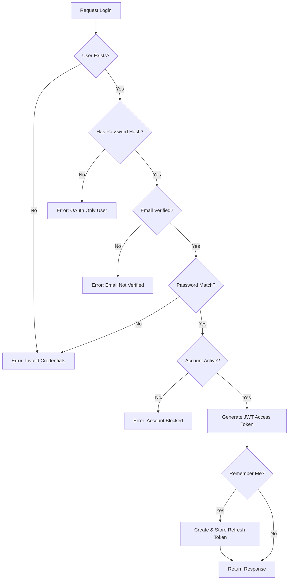

# Dokumentasi Fitur: Authentikasi - Sign In User Credential

> **Fokus Domain:** BACKEND  
> **Konteks:** Trace Upstream ke Downstream secara Semantik

---

## Alur Data Semantik (Scope: BACKEND)

```
[HTTP Request POST /api/auth/login]  
    -> [Server: Routing & Middleware]  
    -> [Controller: Parsing & Ekstraksi Metadata Klien]  
    -> [Service: Orkestrasi Logika Autentikasi]  
        -> [Unit of Work: Manajemen Akses Data]  
            -> [Repository: Pencarian User & Validasi]  
                -> [Mapper: Transformasi Model -> Entity]  
                    -> [Model: Representasi Tabel Database]  
                        -> [Database: Query Data]  
        -> [Validasi Kredensial: Bcrypt Compare]  
        -> [Generasi Token: JWT Access Token]  
        -> [Persistensi Session: Refresh Token (Opsional)]  
    -> [HTTP Response JSON dengan Token]
```

---

## A. Laporan Implementasi Fitur Sign In User Credential

### Deskripsi Fungsional

Fitur ini menyediakan mekanisme autentikasi pengguna dengan metode tradisional (email & password). Secara operasional, sistem memvalidasi identitas pengguna dengan membandingkan kredensial yang dikirimkan terhadap data yang tersimpan di database. Proses ini mencakup beberapa pemeriksaan keamanan: keberadaan akun, status verifikasi email, status akun (aktif/diblokir), dan kecocokan password. Jika validasi berhasil, sistem menghasilkan JWT Access Token untuk otorisasi request berikutnya. Fitur "Remember Me" memungkinkan pembuatan Refresh Token yang dipersistenkan ke database untuk memperpanjang sesi tanpa login ulang.

### Visualisasi

```json
{
    "success": true,
    "code": 200,
    "message": "Login successful",
    "data": {
        "access_token": "eyJhbGciOiJIUzI1NiIsInR5cCI6IkpXVCJ9...",
        "refresh_token": "550e8400-e29b-41d4-a716-446655440000",
        "user": {
            "id": "550e8400-e29b-41d4-a716-446655440000",
            "email": "user@example.com",
            "full_name": "John Doe",
            "role": "user"
        }
    }
}
```
*Caption: Gambar 1: Struktur JSON Response sukses yang berisi token autentikasi dan data profil pengguna.*

---

## B. Bedah Arsitektur & Komponen

Berikut adalah rincian 15 komponen yang menyusun fitur ini di sisi BACKEND, diurutkan dari upstream (penerima request) ke downstream (persistensi data).

---

### [internal/server/server.go](file:///d:/notetaker/notefiber-BE/internal/server/server.go)
**Layer Terdeteksi:** `HTTP Server & Route Registration`

**Narasi Operasional:**
Komponen ini menginisialisasi instance server HTTP berbasis Fiber dan mendaftarkan seluruh middleware global (CORS, OpenTelemetry Tracing, Error Handler). Pada tahap bootstrap, ia menerima objek [Container](file:///d:/notetaker/notefiber-BE/internal/bootstrap/container.go#16-32) yang berisi semua controller yang sudah terinisialisasi, kemudian memanggil fungsi [registerRoutes](file:///d:/notetaker/notefiber-BE/internal/server/server.go#64-80) untuk menghubungkan setiap controller dengan path HTTP yang sesuai. Untuk alur Sign In, [AuthController](file:///d:/notetaker/notefiber-BE/internal/controller/auth_controller.go#11-20) didaftarkan pada grup `/api`, sehingga endpoint `/api/auth/login` menjadi aktif dan siap menerima request dari klien.

```go
func registerRoutes(app *fiber.App, c *bootstrap.Container) {
	api := app.Group("/api")

	c.AuthController.RegisterRoutes(api)
	c.UserController.RegisterRoutes(api)
	c.OAuthController.RegisterRoutes(api)
	// ... other controllers
}
```
*Caption: Snippet 1: Registrasi route controller ke grup API utama.*

---

### [internal/bootstrap/container.go](file:///d:/notetaker/notefiber-BE/internal/bootstrap/container.go)
**Layer Terdeteksi:** `Dependency Injection Container`

**Narasi Operasional:**
File ini mengorkestrasi konstruksi dan injeksi dependensi seluruh komponen aplikasi. Ia menginisialisasi infrastruktur inti ([RepositoryFactory](file:///d:/notetaker/notefiber-BE/internal/repository/unitofwork/repository_factory.go#5-8)) dan menyusun hierarki dependensi: Service dibangun dengan Repository Factory, kemudian Controller dibangun dengan Service. Untuk alur autentikasi, [AuthService](file:///d:/notetaker/notefiber-BE/internal/service/auth_service.go#26-35) diinisialisasi dengan `uowFactory` (untuk akses data), lalu diinjeksikan ke [AuthController](file:///d:/notetaker/notefiber-BE/internal/controller/auth_controller.go#11-20). Pendekatan ini memastikan decoupling antar layer dan memudahkan pengujian unit.

```go
func NewContainer(db *gorm.DB, cfg *config.Config) *Container {
	// 1. Core Facades
	uowFactory := unitofwork.NewRepositoryFactory(db)
	emailService := mailer.NewEmailService(...)

	// 3. Services
	authService := service.NewAuthService(uowFactory, emailService)

	// 4. Controllers
	return &Container{
		AuthController: controller.NewAuthController(authService),
		// ...
	}
}
```
*Caption: Snippet 2: Konstruksi hierarki dependensi untuk fitur autentikasi.*

---

### [internal/dto/auth_payment_dto.go](file:///d:/notetaker/notefiber-BE/internal/dto/auth_payment_dto.go)
**Layer Terdeteksi:** `Data Transfer Object (DTO)`

**Narasi Operasional:**
File ini mendefinisikan kontrak data untuk pertukaran informasi autentikasi antara klien dan server. Struktur [LoginRequest](file:///d:/notetaker/notefiber-BE/internal/dto/auth_payment_dto.go#26-31) menentukan field wajib ([email](file:///d:/notetaker/notefiber-BE/internal/pkg/mailer/email_service.go#16-21), `password`) dan field opsional (`remember_me`). Kontrak ini digunakan oleh Controller untuk mem-parsing body request. Struktur [LoginResponse](file:///d:/notetaker/notefiber-BE/internal/dto/auth_payment_dto.go#32-37) mendefinisikan payload respons yang berisi `access_token`, `refresh_token` (opsional), dan objek [UserDTO](file:///d:/notetaker/notefiber-BE/internal/dto/auth_payment_dto.go#42-48) yang memuat informasi profil pengguna.

```go
type LoginRequest struct {
	Email      string `json:"email" validate:"required,email"`
	Password   string `json:"password" validate:"required"`
	RememberMe bool   `json:"remember_me"`
}

type LoginResponse struct {
	AccessToken  string  `json:"access_token"`
	RefreshToken string  `json:"refresh_token,omitempty"`
	User         UserDTO `json:"user"`
}

type UserDTO struct {
	Id       uuid.UUID `json:"id"`
	Email    string    `json:"email"`
	FullName string    `json:"full_name"`
	Role     string    `json:"role"`
}
```
*Caption: Snippet 3: Definisi struktur data request dan response untuk login.*

---

### [internal/controller/auth_controller.go](file:///d:/notetaker/notefiber-BE/internal/controller/auth_controller.go)
**Layer Terdeteksi:** `Interface / Controller Layer`

**Narasi Operasional:**
Komponen ini menangani siklus Request-Response HTTP untuk endpoint login. Fungsi [RegisterRoutes](file:///d:/notetaker/notefiber-BE/internal/controller/auth_controller.go#12-13) mendaftarkan path `/auth/login` dengan handler [Login](file:///d:/notetaker/notefiber-BE/internal/controller/auth_controller.go#84-110). Saat request masuk, handler mem-parsing body JSON ke struktur [LoginRequest](file:///d:/notetaker/notefiber-BE/internal/dto/auth_payment_dto.go#26-31), mengekstrak metadata klien (IP Address dan User-Agent) dari header request untuk keperluan audit session, kemudian mendelegasikan eksekusi ke [AuthService](file:///d:/notetaker/notefiber-BE/internal/service/auth_service.go#26-35). Setelah proses selesai, ia membungkus hasil ke dalam format respons JSON standar.

```go
func (c *authController) RegisterRoutes(r fiber.Router) {
	h := r.Group("/auth")
	h.Post("/register", c.Register)
	h.Post("/verify-email", c.VerifyEmail)
	h.Post("/login", c.Login)
	h.Post("/forgot-password", c.ForgotPassword)
	h.Post("/reset-password", c.ResetPassword)
	h.Post("/logout", c.Logout)
}

func (c *authController) Login(ctx *fiber.Ctx) error {
	var req dto.LoginRequest
	if err := ctx.BodyParser(&req); err != nil {
		return err
	}

	// Capture IP and User-Agent
	ipAddress := ctx.IP()
	userAgent := ctx.Get("User-Agent")

	res, err := c.service.Login(ctx.Context(), &req, ipAddress, userAgent)
	if err != nil {
		return ctx.Status(fiber.StatusUnauthorized).JSON(fiber.Map{
			"success": false, "code": 401, "message": err.Error(),
		})
	}
	return ctx.JSON(fiber.Map{
		"success": true, "code": 200,
		"message": "Login successful",
		"data": res,
	})
}
```
*Caption: Snippet 4: Implementasi handler login dengan ekstraksi metadata klien.*

---

### [internal/service/auth_service.go](file:///d:/notetaker/notefiber-BE/internal/service/auth_service.go)
**Layer Terdeteksi:** `Business Logic / Service Layer`

**Narasi Operasional:**
Komponen ini mengenkapsulasi inti logika autentikasi. Ia mengoordinasikan serangkaian validasi keamanan secara berurutan: (1) mencari user berdasarkan email melalui Unit of Work, (2) memverifikasi keberadaan password hash (menolak user OAuth-only), (3) memeriksa status verifikasi email, (4) membandingkan password menggunakan bcrypt, (5) memeriksa status akun (menolak user yang diblokir). Jika semua validasi lolos, sistem menghasilkan JWT Access Token dengan klaim `user_id`, `role`, dan `exp`. Jika flag `RememberMe` aktif, sistem juga membuat Refresh Token (UUID), meng-hash-nya dengan SHA256, dan mempersistenkan ke database bersama metadata session (IP, User-Agent).

```go
func (s *authService) Login(ctx context.Context, req *dto.LoginRequest, ipAddress, userAgent string) (*dto.LoginResponse, error) {
	uow := s.uowFactory.NewUnitOfWork(ctx)
	
	// 1. Check if user exists
	user, err := uow.UserRepository().FindOne(ctx, specification.ByEmail{Email: req.Email})
	if err != nil || user == nil {
		return nil, errors.New("invalid credentials")
	}

	// 2. Check if user has a password (might be OAuth only)
	if user.PasswordHash == nil {
		return nil, errors.New("user registered via OAuth")
	}

	// 3. SECURITY CHECK: Check if email is verified
	if user.Status == entity.UserStatusPending || !user.EmailVerified {
		return nil, errors.New("email not verified. please check your inbox for the otp code")
	}

	// 4. Compare passwords
	err = bcrypt.CompareHashAndPassword([]byte(*user.PasswordHash), []byte(req.Password))
	if err != nil {
		return nil, errors.New("invalid credentials")
	}

	// 5. Check if user is blocked/suspended
	if user.Status == entity.UserStatusBlocked {
		return nil, errors.New("user account is blocked")
	}

	// 6. Generate JWT
	accessTokenExpiry := time.Hour * 24
	claims := jwt.MapClaims{
		"user_id": user.Id.String(),
		"role":    user.Role,
		"exp":     time.Now().Add(accessTokenExpiry).Unix(),
	}
	token := jwt.NewWithClaims(jwt.SigningMethodHS256, claims)
	signedToken, err := token.SignedString([]byte(os.Getenv("JWT_SECRET")))

	var rawRefreshToken string

	// 7. Create Refresh Token if "Remember Me" is checked
	if req.RememberMe {
		rawRefreshToken = uuid.New().String()

		// Hash token
		hasher := sha256.New()
		hasher.Write([]byte(rawRefreshToken))
		tokenHash := hex.EncodeToString(hasher.Sum(nil))

		refreshTokenEntity := &entity.UserRefreshToken{
			Id:        uuid.New(),
			UserId:    user.Id,
			TokenHash: tokenHash,
			ExpiresAt: time.Now().Add(time.Hour * 24 * 30),
			Revoked:   false,
			CreatedAt: time.Now(),
			IpAddress: ipAddress,
			UserAgent: userAgent,
		}

		err = uow.UserRepository().CreateRefreshToken(ctx, refreshTokenEntity)
		if err != nil {
			return nil, fmt.Errorf("failed to create session: %v", err)
		}
	}

	return &dto.LoginResponse{
		AccessToken:  signedToken,
		RefreshToken: rawRefreshToken,
		User: dto.UserDTO{
			Id: user.Id, Email: user.Email, FullName: user.FullName, Role: string(user.Role),
		},
	}, nil
}
```
*Caption: Snippet 5: Orkestrasi logika autentikasi dengan validasi bertingkat dan generasi token.*

---

### [internal/repository/unitofwork/repository_factory.go](file:///d:/notetaker/notefiber-BE/internal/repository/unitofwork/repository_factory.go)
**Layer Terdeteksi:** `Factory Interface`

**Narasi Operasional:**
File ini mendefinisikan kontrak untuk pembuatan instance Unit of Work. Interface [RepositoryFactory](file:///d:/notetaker/notefiber-BE/internal/repository/unitofwork/repository_factory.go#5-8) menyediakan satu metode [NewUnitOfWork](file:///d:/notetaker/notefiber-BE/internal/repository/unitofwork/repository_factory_impl.go#19-26) yang menerima konteks dan mengembalikan instance [UnitOfWork](file:///d:/notetaker/notefiber-BE/internal/repository/unitofwork/unit_of_work.go#9-28) baru. Pendekatan ini memungkinkan Service layer untuk mendapatkan instance repository yang terisolasi per-request tanpa harus mengetahui detail implementasi koneksi database.

```go
type RepositoryFactory interface {
	NewUnitOfWork(ctx context.Context) UnitOfWork
}
```
*Caption: Snippet 6: Interface factory untuk pembuatan Unit of Work.*

---

### [internal/repository/unitofwork/repository_factory_impl.go](file:///d:/notetaker/notefiber-BE/internal/repository/unitofwork/repository_factory_impl.go)
**Layer Terdeteksi:** `Factory Implementation`

**Narasi Operasional:**
Komponen ini mengimplementasikan [RepositoryFactory](file:///d:/notetaker/notefiber-BE/internal/repository/unitofwork/repository_factory.go#5-8) dengan menyimpan referensi ke koneksi database GORM. Saat [NewUnitOfWork](file:///d:/notetaker/notefiber-BE/internal/repository/unitofwork/repository_factory_impl.go#19-26) dipanggil, ia membuat instance [UnitOfWork](file:///d:/notetaker/notefiber-BE/internal/repository/unitofwork/unit_of_work.go#9-28) baru yang siap digunakan untuk operasi database. Setiap Unit of Work bersifat short-lived (per-request) untuk menjamin isolasi antar request.

```go
type RepositoryFactoryImpl struct {
	db *gorm.DB
}

func NewRepositoryFactory(db *gorm.DB) RepositoryFactory {
	return &RepositoryFactoryImpl{db: db}
}

func (f *RepositoryFactoryImpl) NewUnitOfWork(ctx context.Context) UnitOfWork {
	return NewUnitOfWork(f.db)
}
```
*Caption: Snippet 7: Implementasi factory yang mengenkapsulasi koneksi database.*

---

### [internal/repository/unitofwork/unit_of_work.go](file:///d:/notetaker/notefiber-BE/internal/repository/unitofwork/unit_of_work.go)
**Layer Terdeteksi:** `Unit of Work Interface`

**Narasi Operasional:**
File ini mendefinisikan kontrak untuk pola Unit of Work yang mengelola transaksi database dan menyediakan akses ke seluruh repository. Interface ini mendeklarasikan metode transaksional ([Begin](file:///d:/notetaker/notefiber-BE/internal/repository/unitofwork/unit_of_work.go#10-11), [Commit](file:///d:/notetaker/notefiber-BE/internal/repository/unitofwork/unit_of_work_impl.go#39-47), [Rollback](file:///d:/notetaker/notefiber-BE/internal/repository/unitofwork/unit_of_work_impl.go#48-56)) serta accessor untuk setiap repository domain ([UserRepository](file:///d:/notetaker/notefiber-BE/internal/repository/contract/user_repository.go#12-49), dll). Untuk alur login, hanya [UserRepository](file:///d:/notetaker/notefiber-BE/internal/repository/contract/user_repository.go#12-49) yang digunakan untuk pencarian user dan persistensi refresh token.

```go
type UnitOfWork interface {
	Begin(ctx context.Context) error
	Commit() error
	Rollback() error

	UserRepository() contract.UserRepository
	NotebookRepository() contract.NotebookRepository
	// ... other repositories
}
```
*Caption: Snippet 8: Interface Unit of Work untuk manajemen transaksi dan akses repository.*

---

### [internal/repository/unitofwork/unit_of_work_impl.go](file:///d:/notetaker/notefiber-BE/internal/repository/unitofwork/unit_of_work_impl.go)
**Layer Terdeteksi:** `Unit of Work Implementation`

**Narasi Operasional:**
Komponen ini mengimplementasikan pola Unit of Work dengan memanfaatkan mekanisme transaksi GORM. Accessor [UserRepository()](file:///d:/notetaker/notefiber-BE/internal/repository/contract/user_repository.go#12-49) mengembalikan instance repository yang terhubung ke koneksi database aktif. Untuk alur login, transaksi eksplisit tidak diperlukan karena operasi bersifat read-heavy dengan satu write opsional (refresh token).

```go
func (u *UnitOfWorkImpl) getDB() *gorm.DB {
	if u.tx != nil {
		return u.tx
	}
	return u.db
}

func (u *UnitOfWorkImpl) UserRepository() contract.UserRepository {
	return implementation.NewUserRepository(u.getDB())
}
```
*Caption: Snippet 9: Instansiasi repository dengan koneksi database.*

---

### [internal/repository/contract/user_repository.go](file:///d:/notetaker/notefiber-BE/internal/repository/contract/user_repository.go)
**Layer Terdeteksi:** `Repository Interface / Contract`

**Narasi Operasional:**
File ini mendefinisikan kontrak untuk seluruh operasi data terkait entitas User. Untuk alur login, metode [FindOne](file:///d:/notetaker/notefiber-BE/internal/repository/contract/user_repository.go#16-17) digunakan untuk mencari user berdasarkan email (dengan Specification [ByEmail](file:///d:/notetaker/notefiber-BE/internal/repository/specification/user_specifications.go#9-12)), dan metode [CreateRefreshToken](file:///d:/notetaker/notefiber-BE/internal/repository/contract/user_repository.go#31-32) digunakan untuk mempersistenkan session. Kontrak ini memungkinkan Service layer berinteraksi dengan data tanpa mengetahui teknologi persistensi yang digunakan.

```go
type UserRepository interface {
	Create(ctx context.Context, user *entity.User) error
	FindOne(ctx context.Context, specs ...specification.Specification) (*entity.User, error)
	
	// Token Management
	CreateRefreshToken(ctx context.Context, token *entity.UserRefreshToken) error
	RevokeRefreshToken(ctx context.Context, tokenHash string) error

	// ...
}
```
*Caption: Snippet 10: Kontrak repository untuk akses data User dan Refresh Token.*

---

### [internal/repository/specification/specification.go](file:///d:/notetaker/notefiber-BE/internal/repository/specification/specification.go)
**Layer Terdeteksi:** `Specification Pattern Interface`

**Narasi Operasional:**
File ini mendefinisikan interface dasar untuk pola Specification yang digunakan untuk membangun query database secara deklaratif. Setiap specification mengimplementasikan metode [Apply](file:///d:/notetaker/notefiber-BE/internal/repository/specification/user_specifications.go#21-24) yang memodifikasi query GORM dengan kondisi tertentu.

```go
type Specification interface {
	Apply(db *gorm.DB) *gorm.DB
}
```
*Caption: Snippet 11: Interface dasar untuk pola Specification.*

---

### [internal/repository/specification/user_specifications.go](file:///d:/notetaker/notefiber-BE/internal/repository/specification/user_specifications.go)
**Layer Terdeteksi:** `Specification Implementation`

**Narasi Operasional:**
Komponen ini menyediakan implementasi specification khusus untuk domain User. Untuk alur login, [ByEmail](file:///d:/notetaker/notefiber-BE/internal/repository/specification/user_specifications.go#9-12) digunakan untuk mencari user berdasarkan alamat email yang dikirimkan dalam request. Specification ini digunakan oleh Service layer untuk membangun query pencarian yang spesifik.

```go
type ByEmail struct { Email string }
func (s ByEmail) Apply(db *gorm.DB) *gorm.DB {
	return db.Where("email = ?", s.Email)
}
```
*Caption: Snippet 12: Implementasi specification untuk pencarian User berdasarkan email.*

---

### [internal/repository/implementation/user_repository_impl.go](file:///d:/notetaker/notefiber-BE/internal/repository/implementation/user_repository_impl.go)
**Layer Terdeteksi:** `Repository Implementation`

**Narasi Operasional:**
Komponen ini mengimplementasikan kontrak [UserRepository](file:///d:/notetaker/notefiber-BE/internal/repository/contract/user_repository.go#12-49) dengan memanfaatkan GORM sebagai ORM. Untuk alur login, metode [FindOne](file:///d:/notetaker/notefiber-BE/internal/repository/contract/user_repository.go#16-17) menerima Specification [ByEmail](file:///d:/notetaker/notefiber-BE/internal/repository/specification/user_specifications.go#9-12), mengaplikasikannya ke query, mengeksekusi pencarian, dan mentransformasi hasil Model ke Entity menggunakan Mapper. Metode [CreateRefreshToken](file:///d:/notetaker/notefiber-BE/internal/repository/contract/user_repository.go#31-32) mempersistenkan entity refresh token yang sudah di-hash ke tabel `user_refresh_tokens`.

```go
func (r *UserRepositoryImpl) FindOne(ctx context.Context, specs ...specification.Specification) (*entity.User, error) {
	var modelUser model.User
	query := r.applySpecifications(r.db.WithContext(ctx), specs...)

	if err := query.First(&modelUser).Error; err != nil {
		if errors.Is(err, gorm.ErrRecordNotFound) {
			return nil, nil
		}
		return nil, err
	}

	return r.mapper.ToEntity(&modelUser), nil
}

func (r *UserRepositoryImpl) CreateRefreshToken(ctx context.Context, token *entity.UserRefreshToken) error {
	m := r.mapper.UserRefreshTokenToModel(token)
	if err := r.db.WithContext(ctx).Create(m).Error; err != nil {
		return err
	}
	return nil
}
```
*Caption: Snippet 13: Implementasi pencarian user dan persistensi refresh token.*

---

### [internal/entity/user_entity.go](file:///d:/notetaker/notefiber-BE/internal/entity/user_entity.go)
**Layer Terdeteksi:** `Domain Entity`

**Narasi Operasional:**
File ini mendefinisikan struktur data domain yang merepresentasikan konsep bisnis User dan Refresh Token. Entity [User](file:///d:/notetaker/notefiber-BE/internal/model/user_model.go#10-26) menyimpan atribut yang divalidasi saat login: [Email](file:///d:/notetaker/notefiber-BE/internal/repository/specification/user_specifications.go#9-12), `PasswordHash`, [Status](file:///d:/notetaker/notefiber-BE/internal/entity/user_entity.go#11-12), dan `EmailVerified`. Entity [UserRefreshToken](file:///d:/notetaker/notefiber-BE/internal/model/user_model.go#69-79) merepresentasikan session dengan atribut [TokenHash](file:///d:/notetaker/notefiber-BE/internal/repository/specification/user_specifications.go#41-44), `ExpiresAt`, `Revoked`, serta metadata audit (`IpAddress`, `UserAgent`).

```go
type UserRole string
type UserStatus string

const (
	UserRoleUser  UserRole = "user"
	UserRoleAdmin UserRole = "admin"

	UserStatusPending UserStatus = "pending"
	UserStatusActive  UserStatus = "active"
	UserStatusBlocked UserStatus = "blocked"
)

type User struct {
	Id            uuid.UUID
	Email         string
	PasswordHash  *string
	FullName      string
	Role          UserRole
	Status        UserStatus
	EmailVerified bool
	// ...
}

type UserRefreshToken struct {
	Id        uuid.UUID
	UserId    uuid.UUID
	TokenHash string
	ExpiresAt time.Time
	Revoked   bool
	CreatedAt time.Time
	IpAddress string
	UserAgent string
}
```
*Caption: Snippet 14: Definisi Entity domain untuk User dan Refresh Token.*

---

### [internal/model/user_model.go](file:///d:/notetaker/notefiber-BE/internal/model/user_model.go)
**Layer Terdeteksi:** `Database Model (ORM)`

**Narasi Operasional:**
Komponen ini mendefinisikan struktur data yang dipetakan langsung ke tabel database menggunakan tag GORM. Model [User](file:///d:/notetaker/notefiber-BE/internal/model/user_model.go#10-26) dipetakan ke tabel `users`. Model [UserRefreshToken](file:///d:/notetaker/notefiber-BE/internal/model/user_model.go#69-79) dipetakan ke tabel `user_refresh_tokens` dengan kolom untuk menyimpan hash token, waktu kedaluwarsa, status revokasi, dan metadata klien.

```go
type User struct {
	Id            uuid.UUID      `gorm:"type:uuid;primaryKey;default:gen_random_uuid()"`
	Email         string         `gorm:"type:varchar(255);uniqueIndex;not null"`
	PasswordHash  *string        `gorm:"type:varchar(255)"`
	FullName      string         `gorm:"type:varchar(255);not null"`
	Role          string         `gorm:"type:varchar(50);not null;default:'user'"`
	Status        string         `gorm:"type:varchar(50);not null;default:'pending'"`
	EmailVerified bool           `gorm:"default:false"`
	// ...
}

func (User) TableName() string { return "users" }

type UserRefreshToken struct {
	Id        uuid.UUID `gorm:"type:uuid;primaryKey;default:gen_random_uuid()"`
	UserId    uuid.UUID `gorm:"type:uuid;not null;index"`
	TokenHash string    `gorm:"type:text;not null"`
	ExpiresAt time.Time `gorm:"not null"`
	Revoked   bool      `gorm:"default:false"`
	IpAddress string    `gorm:"type:varchar(45)"`
	UserAgent string    `gorm:"type:text"`
	CreatedAt time.Time `gorm:"autoCreateTime"`
}

func (UserRefreshToken) TableName() string { return "user_refresh_tokens" }
```
*Caption: Snippet 15: Model ORM dengan mapping ke tabel database.*

---

### [internal/mapper/user_mapper.go](file:///d:/notetaker/notefiber-BE/internal/mapper/user_mapper.go)
**Layer Terdeteksi:** `Data Mapper`

**Narasi Operasional:**
Komponen ini menyediakan fungsi konversi dua arah antara Entity (domain) dan Model (database). Untuk alur login, [ToEntity](file:///d:/notetaker/notefiber-BE/internal/mapper/user_mapper.go#14-34) mentransformasi Model User hasil query database menjadi Entity yang digunakan di layer Service untuk validasi. [UserRefreshTokenToModel](file:///d:/notetaker/notefiber-BE/internal/mapper/user_mapper.go#172-187) mentransformasi Entity refresh token menjadi Model sebelum persistensi.

```go
func (m *UserMapper) ToEntity(u *model.User) *entity.User {
	if u == nil { return nil }
	return &entity.User{
		Id:            u.Id,
		Email:         u.Email,
		PasswordHash:  u.PasswordHash,
		FullName:      u.FullName,
		Role:          entity.UserRole(u.Role),
		Status:        entity.UserStatus(u.Status),
		EmailVerified: u.EmailVerified,
		// ...
	}
}

func (m *UserMapper) UserRefreshTokenToModel(t *entity.UserRefreshToken) *model.UserRefreshToken {
	if t == nil { return nil }
	return &model.UserRefreshToken{
		Id:        t.Id,
		UserId:    t.UserId,
		TokenHash: t.TokenHash,
		ExpiresAt: t.ExpiresAt,
		Revoked:   t.Revoked,
		IpAddress: t.IpAddress,
		UserAgent: t.UserAgent,
		CreatedAt: t.CreatedAt,
	}
}
```
*Caption: Snippet 16: Transformasi bidirectional antara Entity dan Model.*

---

## C. Ringkasan Layer Arsitektur

| No | Layer | File | Tanggung Jawab |
|----|-------|------|----------------|
| 1 | HTTP Server | [server/server.go](file:///d:/notetaker/notefiber-BE/internal/server/server.go) | Inisialisasi Fiber, middleware, route registration |
| 2 | DI Container | [bootstrap/container.go](file:///d:/notetaker/notefiber-BE/internal/bootstrap/container.go) | Dependency wiring & injection |
| 3 | DTO | [dto/auth_payment_dto.go](file:///d:/notetaker/notefiber-BE/internal/dto/auth_payment_dto.go) | Kontrak data request/response |
| 4 | Controller | [controller/auth_controller.go](file:///d:/notetaker/notefiber-BE/internal/controller/auth_controller.go) | HTTP handler, parsing, ekstraksi metadata klien |
| 5 | Service | [service/auth_service.go](file:///d:/notetaker/notefiber-BE/internal/service/auth_service.go) | Orkestrasi logika autentikasi & generasi token |
| 6 | Factory Interface | [unitofwork/repository_factory.go](file:///d:/notetaker/notefiber-BE/internal/repository/unitofwork/repository_factory.go) | Kontrak pembuatan Unit of Work |
| 7 | Factory Impl | [unitofwork/repository_factory_impl.go](file:///d:/notetaker/notefiber-BE/internal/repository/unitofwork/repository_factory_impl.go) | Implementasi factory |
| 8 | UoW Interface | [unitofwork/unit_of_work.go](file:///d:/notetaker/notefiber-BE/internal/repository/unitofwork/unit_of_work.go) | Kontrak akses repository |
| 9 | UoW Impl | [unitofwork/unit_of_work_impl.go](file:///d:/notetaker/notefiber-BE/internal/repository/unitofwork/unit_of_work_impl.go) | Instansiasi repository |
| 10 | Repository Contract | [contract/user_repository.go](file:///d:/notetaker/notefiber-BE/internal/repository/contract/user_repository.go) | Interface akses data User |
| 11 | Specification Base | [specification/specification.go](file:///d:/notetaker/notefiber-BE/internal/repository/specification/specification.go) | Interface pola specification |
| 12 | User Specifications | [specification/user_specifications.go](file:///d:/notetaker/notefiber-BE/internal/repository/specification/user_specifications.go) | Query predicates untuk User |
| 13 | Repository Impl | [implementation/user_repository_impl.go](file:///d:/notetaker/notefiber-BE/internal/repository/implementation/user_repository_impl.go) | Pencarian & persistensi data |
| 14 | Entity | [entity/user_entity.go](file:///d:/notetaker/notefiber-BE/internal/entity/user_entity.go) | Objek domain |
| 15 | Model | [model/user_model.go](file:///d:/notetaker/notefiber-BE/internal/model/user_model.go) | Representasi tabel database |
| 16 | Mapper | [mapper/user_mapper.go](file:///d:/notetaker/notefiber-BE/internal/mapper/user_mapper.go) | Transformasi Entity <-> Model |

---

## D. Alur Validasi Keamanan


*Caption: Diagram 1: Alur validasi keamanan bertingkat pada proses login.*

---

*Dokumen ini di-generate dalam mode READ-ONLY tanpa modifikasi terhadap kode sumber.*
