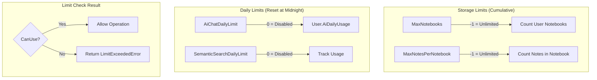

# Dokumentasi Fitur: User Subscription Flow (Perspektif User)

> **Fokus Domain:** BACKEND  
> **Konteks:** Trace Upstream ke Downstream secara Semantik  
> **Scope:** User-facing subscription features (tidak termasuk Admin operations)

---

## Alur Data Semantik (Scope: BACKEND)

```
=== GET ALL PLANS (Public) ===
[HTTP GET /api/plans]  
    -> [Controller: Delegasi ke Service]  
    -> [Service: Fetch Active Plans dengan Features]  
        -> [Repository: FindAllPlans dengan Preload Features]  
    -> [HTTP Response dengan Plans & Limits]

=== GET USAGE STATUS (Protected) ===
[HTTP GET /api/user/usage-status]  
    -> [JWT Middleware: Ekstraksi User ID]  
    -> [Controller: Delegasi ke Service]  
    -> [Service: Aggregate Usage Data]  
        -> [Repository: Get User's Active Plan]  
        -> [Repository: Count Notebooks]  
        -> [Repository: Count Notes]  
        -> [Calculate: Daily Limit Reset Time]  
    -> [HTTP Response dengan UsageStatusResponse]

=== GET SUBSCRIPTION STATUS (Protected) ===
[HTTP GET /api/payment/status]  
    -> [JWT Middleware: Ekstraksi User ID]  
    -> [Controller: Delegasi ke PaymentService]  
    -> [Service: Find Active Subscription]  
        -> [Repository: FindAllSubscriptions by UserID]  
        -> [Filter: Status Active & Period Valid]  
        -> [Repository: Get Plan Details]  
    -> [HTTP Response dengan SubscriptionStatusResponse]

=== REQUEST REFUND (Protected) ===
[HTTP POST /api/user/refund/request]  
    -> [JWT Middleware: Ekstraksi User ID]  
    -> [Controller: Validasi Request]  
    -> [Service: RequestRefund]  
        -> [Repository: Validate Subscription Ownership]  
        -> [Check: Subscription Active & Paid]  
        -> [Check: No Existing Refund]  
        -> [Repository: Create Refund (Pending)]  
    -> [HTTP Response dengan RefundId & Status]
```

---

## A. Laporan Implementasi Fitur User Subscription Flow

### Deskripsi Fungsional

Fitur ini menyediakan antarmuka bagi pengguna untuk mengelola langganan mereka. Dari perspektif user, sistem mengimplementasikan:

1. **GetAllPlans**: Endpoint publik untuk melihat semua paket langganan dengan fitur, harga, dan limits
2. **GetUsageStatus**: Monitoring penggunaan real-time vs limits (notebooks, notes, AI chat, semantic search)
3. **GetSubscriptionStatus**: Status langganan aktif dengan periode validitas dan feature flags
4. **CheckCanCreateNotebook/Note**: Guard untuk validasi limit sebelum membuat resource
5. **CancelSubscription**: Pembatalan langganan aktif
6. **RequestRefund**: Pengajuan refund untuk langganan berbayar yang aktif

Semua endpoint (kecuali GetAllPlans) dilindungi JWT middleware dengan pendekatan **freemium model**—user tanpa langganan aktif mendapatkan Free Plan dengan limits terbatas.

### Visualisasi

**Usage Status Response:**
```json
{
    "success": true,
    "code": 200,
    "message": "Usage status retrieved",
    "data": {
        "plan": {
            "id": "550e8400-e29b-41d4-a716-446655440000",
            "name": "Pro Plan",
            "slug": "pro"
        },
        "storage": {
            "notebooks": { "used": 5, "limit": -1, "can_use": true },
            "notes": { "used": 42, "limit": -1, "can_use": true }
        },
        "daily": {
            "ai_chat": {
                "used": 3,
                "limit": 100,
                "can_use": true,
                "resets_at": "2024-12-26T00:00:00Z"
            },
            "semantic_search": {
                "used": 0,
                "limit": 50,
                "can_use": true,
                "resets_at": "2024-12-26T00:00:00Z"
            }
        },
        "upgrade_available": false
    }
}
```

**Plan With Features Response:**
```json
{
    "id": "660e8400-e29b-41d4-a716-446655440000",
    "name": "Pro Plan",
    "slug": "pro",
    "tagline": "Unlock AI Chat and Semantic Search",
    "price": 9.99,
    "billing_period": "monthly",
    "is_most_popular": true,
    "limits": {
        "max_notebooks": -1,
        "max_notes_per_notebook": -1,
        "ai_chat_daily": 100,
        "semantic_search_daily": 50
    },
    "features": [
        { "key": "ai_chat", "text": "AI Chat Assistant", "is_enabled": true },
        { "key": "semantic_search", "text": "Semantic Search", "is_enabled": true }
    ]
}
```
*Caption: Gambar 1: Response struktur untuk Usage Status dan Plan Details.*

---

## B. Bedah Arsitektur & Komponen

Berikut adalah rincian 16 komponen yang menyusun fitur ini di sisi BACKEND.

---

### [internal/server/server.go](file:///d:/notetaker/notefiber-BE/internal/server/server.go)
**Layer Terdeteksi:** `HTTP Server & Route Registration`

**Narasi Operasional:**
Komponen ini menginisialisasi server dan mendaftarkan controllers. [PlanController](file:///d:/notetaker/notefiber-BE/internal/controller/plan_controller.go#13-16) dan [UserController](file:///d:/notetaker/notefiber-BE/internal/controller/user_controller.go#13-21) menangani operasi subscription dari sisi user. Routes didaftarkan dengan pemisahan public (plans) dan protected (usage-status, refund).

```go
func registerRoutes(app *fiber.App, c *bootstrap.Container) {
	api := app.Group("/api")

	c.PlanController.RegisterRoutes(api, serverutils.JwtMiddleware)
	c.UserController.RegisterRoutes(api)
	c.PaymentController.RegisterRoutes(api)
	// ... other controllers
}
```
*Caption: Snippet 1: Registrasi PlanController dan UserController ke grup API.*

---

### [internal/bootstrap/container.go](file:///d:/notetaker/notefiber-BE/internal/bootstrap/container.go)
**Layer Terdeteksi:** `Dependency Injection Container`

**Narasi Operasional:**
File ini mengorkestrasi konstruksi dependensi. [PlanService](file:///d:/notetaker/notefiber-BE/internal/service/plan_service.go#17-26) diinisialisasi dengan `uowFactory` untuk akses ke multiple repositories (Subscription, Notebook, Note). [UserService](file:///d:/notetaker/notefiber-BE/internal/service/user_service.go#21-28) juga menggunakan factory yang sama untuk operasi refund.

```go
func NewContainer(db *gorm.DB, cfg *config.Config) *Container {
	// 1. Core Facades
	uowFactory := unitofwork.NewRepositoryFactory(db)

	// 3. Services
	planService := service.NewPlanService(uowFactory)
	userService := service.NewUserService(uowFactory)

	// 4. Controllers
	return &Container{
		PlanController: controller.NewPlanController(planService),
		UserController: controller.NewUserController(userService),
		// ...
	}
}
```
*Caption: Snippet 2: Konstruksi PlanService dan UserService.*

---

### [internal/dto/usage_dto.go](file:///d:/notetaker/notefiber-BE/internal/dto/usage_dto.go)
**Layer Terdeteksi:** `Data Transfer Object (DTO)`

**Narasi Operasional:**
File ini mendefinisikan struktur response untuk usage tracking. [UsageStatusResponse](file:///d:/notetaker/notefiber-BE/internal/dto/usage_dto.go#32-38) menyediakan informasi lengkap tentang penggunaan vs limits dengan struktur nested untuk [StorageLimits](file:///d:/notetaker/notefiber-BE/internal/dto/usage_dto.go#20-24) (notebooks, notes) dan [DailyLimits](file:///d:/notetaker/notefiber-BE/internal/dto/usage_dto.go#26-30) (ai_chat, semantic_search). Flag `upgrade_available` membantu frontend menampilkan prompt upgrade.

```go
// UsageLimit represents a single limit status
type UsageLimit struct {
	Used     int        `json:"used"`
	Limit    int        `json:"limit"` // -1 = unlimited, 0 = disabled
	CanUse   bool       `json:"can_use"`
	ResetsAt *time.Time `json:"resets_at,omitempty"` // For daily limits
}

// StorageLimits for cumulative resources (notebooks, notes)
type StorageLimits struct {
	Notebooks UsageLimit `json:"notebooks"`
	Notes     UsageLimit `json:"notes"`
}

// DailyLimits for usage that resets daily
type DailyLimits struct {
	AiChat         UsageLimit `json:"ai_chat"`
	SemanticSearch UsageLimit `json:"semantic_search"`
}

// UsageStatusResponse is returned by GET /api/user/usage-status
type UsageStatusResponse struct {
	Plan             PlanInfo      `json:"plan"`
	Storage          StorageLimits `json:"storage"`
	Daily            DailyLimits   `json:"daily"`
	UpgradeAvailable bool          `json:"upgrade_available"`
}

type PlanInfo struct {
	Id   uuid.UUID `json:"id"`
	Name string    `json:"name"`
	Slug string    `json:"slug"`
}

// PlanWithFeaturesResponse for pricing modal
type PlanWithFeaturesResponse struct {
	Id            uuid.UUID     `json:"id"`
	Name          string        `json:"name"`
	Slug          string        `json:"slug"`
	Tagline       string        `json:"tagline"`
	Price         float64       `json:"price"`
	BillingPeriod string        `json:"billing_period"`
	IsMostPopular bool          `json:"is_most_popular"`
	Limits        PlanLimitsDTO `json:"limits"`
	Features      []FeatureDTO  `json:"features"`
}

type PlanLimitsDTO struct {
	MaxNotebooks        int `json:"max_notebooks"`
	MaxNotesPerNotebook int `json:"max_notes_per_notebook"`
	AiChatDaily         int `json:"ai_chat_daily"`
	SemanticSearchDaily int `json:"semantic_search_daily"`
}
```
*Caption: Snippet 3: DTO untuk Usage Status dan Plan dengan Features.*

---

### [internal/dto/refund_dto.go](file:///d:/notetaker/notefiber-BE/internal/dto/refund_dto.go)
**Layer Terdeteksi:** `Data Transfer Object (DTO) - Refund`

**Narasi Operasional:**
File ini mendefinisikan kontrak data untuk operasi refund dari sisi user. [UserRefundRequest](file:///d:/notetaker/notefiber-BE/internal/dto/refund_dto.go#11-15) memerlukan `subscription_id` dan `reason` dengan minimum 10 karakter. Response menyediakan `refund_id` untuk tracking.

```go
type UserRefundRequest struct {
	SubscriptionId uuid.UUID `json:"subscription_id" validate:"required"`
	Reason         string    `json:"reason" validate:"required,min=10"`
}

type UserRefundResponse struct {
	RefundId string `json:"refund_id"`
	Status   string `json:"status"`
	Message  string `json:"message"`
}

type UserRefundListResponse struct {
	Id             uuid.UUID `json:"id"`
	SubscriptionId uuid.UUID `json:"subscription_id"`
	PlanName       string    `json:"plan_name"`
	Amount         float64   `json:"amount"`
	Reason         string    `json:"reason"`
	Status         string    `json:"status"`
	CreatedAt      time.Time `json:"created_at"`
}
```
*Caption: Snippet 4: DTO untuk User Refund operations.*

---

### [internal/controller/plan_controller.go](file:///d:/notetaker/notefiber-BE/internal/controller/plan_controller.go)
**Layer Terdeteksi:** `Interface / Controller Layer`

**Narasi Operasional:**
Komponen ini menangani endpoints terkait plans dan usage. [GetAllPlans](file:///d:/notetaker/notefiber-BE/internal/controller/plan_controller.go#36-51) bersifat public untuk pricing modal, sedangkan [GetUsageStatus](file:///d:/notetaker/notefiber-BE/internal/controller/plan_controller.go#52-78) memerlukan autentikasi untuk menampilkan usage real-time user.

```go
func (c *planController) RegisterRoutes(api fiber.Router, jwtMiddleware fiber.Handler) {
	// Public endpoints
	api.Get("/plans", c.GetAllPlans)

	// Authenticated endpoints
	user := api.Group("/user", jwtMiddleware)
	user.Get("/usage-status", c.GetUsageStatus)
}

// GetAllPlans returns all active plans with features for pricing modal
func (c *planController) GetAllPlans(ctx *fiber.Ctx) error {
	plans, err := c.planService.GetAllActivePlansWithFeatures(ctx.Context())
	if err != nil {
		return ctx.Status(fiber.StatusInternalServerError).JSON(serverutils.ErrorResponse(500, err.Error()))
	}

	return ctx.JSON(serverutils.SuccessResponse("Plans retrieved", plans))
}

// GetUsageStatus returns current usage vs limits for the authenticated user
func (c *planController) GetUsageStatus(ctx *fiber.Ctx) error {
	userIdStr := ctx.Locals("user_id")
	if userIdStr == nil {
		return ctx.Status(fiber.StatusUnauthorized).JSON(serverutils.ErrorResponse(401, "Unauthorized"))
	}

	userId, _ := uuid.Parse(userIdStr.(string))

	status, err := c.planService.GetUserUsageStatus(ctx.Context(), userId)
	if err != nil {
		return ctx.Status(fiber.StatusInternalServerError).JSON(serverutils.ErrorResponse(500, err.Error()))
	}

	return ctx.JSON(serverutils.SuccessResponse("Usage status retrieved", status))
}
```
*Caption: Snippet 5: Controller dengan public plans dan protected usage status.*

---

### [internal/controller/user_controller.go](file:///d:/notetaker/notefiber-BE/internal/controller/user_controller.go)
**Layer Terdeteksi:** `Interface / Controller Layer - User`

**Narasi Operasional:**
Komponen ini menangani endpoints user termasuk [RequestRefund](file:///d:/notetaker/notefiber-BE/internal/controller/user_controller.go#101-135). Validasi dilakukan di level controller untuk business rules seperti minimum karakter reason dan required subscription_id.

```go
func (c *userController) RegisterRoutes(r fiber.Router) {
	h := r.Group("/user")
	h.Use(serverutils.JwtMiddleware)
	h.Get("/profile", c.GetProfile)
	h.Post("/refund/request", c.RequestRefund)
	// ...
}

// RequestRefund handles user refund request
func (c *userController) RequestRefund(ctx *fiber.Ctx) error {
	userIdStr := ctx.Locals("user_id").(string)
	userId, _ := uuid.Parse(userIdStr)

	var req dto.UserRefundRequest
	if err := ctx.BodyParser(&req); err != nil {
		return ctx.Status(fiber.StatusBadRequest).JSON(serverutils.ErrorResponse(400, "Invalid request body"))
	}

	if req.SubscriptionId == uuid.Nil {
		return ctx.Status(fiber.StatusBadRequest).JSON(serverutils.ErrorResponse(400, "subscription_id is required"))
	}
	if req.Reason == "" || len(req.Reason) < 10 {
		return ctx.Status(fiber.StatusBadRequest).JSON(serverutils.ErrorResponse(400, "reason must be at least 10 characters"))
	}

	res, err := c.service.RequestRefund(ctx.Context(), userId, req)
	if err != nil {
		errMsg := err.Error()
		if errMsg == "subscription not found" {
			return ctx.Status(fiber.StatusNotFound).JSON(serverutils.ErrorResponse(404, errMsg))
		}
		if errMsg == "refund already requested for this subscription" ||
			errMsg == "subscription is not active" ||
			errMsg == "subscription is not eligible for refund" {
			return ctx.Status(fiber.StatusBadRequest).JSON(serverutils.ErrorResponse(400, errMsg))
		}
		return ctx.Status(fiber.StatusInternalServerError).JSON(serverutils.ErrorResponse(500, err.Error()))
	}

	return ctx.JSON(serverutils.SuccessResponse("Refund request submitted", res))
}
```
*Caption: Snippet 6: Controller dengan refund request dan error handling.*

---

### [internal/service/plan_service.go](file:///d:/notetaker/notefiber-BE/internal/service/plan_service.go)
**Layer Terdeteksi:** `Business Logic / Service Layer`

**Narasi Operasional:**
Komponen ini mengenkapsulasi logika bisnis untuk subscription dari sisi user.

**GetAllActivePlansWithFeatures**: Fetch semua plans dengan preloaded features, filter hanya yang `IsActive`, dan map ke response DTO.

**GetUserUsageStatus**: Aggregasi data usage mencakup: (1) get user's active plan (atau fallback ke Free Plan), (2) count notebooks user, (3) count total notes user, (4) calculate daily reset time (next midnight), (5) build response dengan `CanUse` calculation.

**CheckCanCreateNotebook/Note**: Guard functions yang digunakan oleh Notebook/Note service sebelum create untuk validasi limit.

**getUserPlan**: Helper function yang mencari active subscription dan return plan, atau return default Free Plan jika tidak ada.

```go
// GetAllActivePlansWithFeatures returns all active plans with their features
func (s *planService) GetAllActivePlansWithFeatures(ctx context.Context) ([]*dto.PlanWithFeaturesResponse, error) {
	uow := s.uowFactory.NewUnitOfWork(ctx)
	plans, err := uow.SubscriptionRepository().FindAllPlans(ctx)
	if err != nil {
		return nil, err
	}

	var result []*dto.PlanWithFeaturesResponse
	for _, plan := range plans {
		if !plan.IsActive {
			continue
		}

		// Map features
		featureDTOs := make([]dto.FeatureDTO, 0, len(plan.Features))
		for _, f := range plan.Features {
			featureDTOs = append(featureDTOs, dto.FeatureDTO{
				Key: f.Key, Text: f.Name, IsEnabled: true,
			})
		}

		result = append(result, &dto.PlanWithFeaturesResponse{
			Id: plan.Id, Name: plan.Name, Slug: plan.Slug,
			Tagline: plan.Tagline, Price: plan.Price,
			BillingPeriod: string(plan.BillingPeriod),
			IsMostPopular: plan.IsMostPopular,
			Limits: dto.PlanLimitsDTO{
				MaxNotebooks:        plan.MaxNotebooks,
				MaxNotesPerNotebook: plan.MaxNotesPerNotebook,
				AiChatDaily:         plan.AiChatDailyLimit,
				SemanticSearchDaily: plan.SemanticSearchDailyLimit,
			},
			Features: featureDTOs,
		})
	}

	return result, nil
}

// GetUserUsageStatus returns current usage vs limits for a user
func (s *planService) GetUserUsageStatus(ctx context.Context, userId uuid.UUID) (*dto.UsageStatusResponse, error) {
	uow := s.uowFactory.NewUnitOfWork(ctx)

	// Get user for AI usage tracking
	user, _ := uow.UserRepository().FindOne(ctx, specification.ByID{ID: userId})

	// Get user's active plan (or default Free Plan)
	plan, _ := s.getUserPlan(ctx, uow, userId)

	// Count current usage
	notebookCount, _ := uow.NotebookRepository().Count(ctx, specification.UserOwnedBy{UserID: userId})
	noteCount, _ := uow.NoteRepository().Count(ctx, specification.UserOwnedBy{UserID: userId})

	// Calculate reset time (next midnight)
	now := time.Now()
	resetTime := time.Date(now.Year(), now.Month(), now.Day()+1, 0, 0, 0, 0, now.Location())

	return &dto.UsageStatusResponse{
		Plan: dto.PlanInfo{Id: plan.Id, Name: plan.Name, Slug: plan.Slug},
		Storage: dto.StorageLimits{
			Notebooks: dto.UsageLimit{
				Used:   int(notebookCount),
				Limit:  plan.MaxNotebooks,
				CanUse: plan.MaxNotebooks < 0 || int(notebookCount) < plan.MaxNotebooks,
			},
			Notes: dto.UsageLimit{
				Used:   int(noteCount),
				Limit:  plan.MaxNotesPerNotebook,
				CanUse: plan.MaxNotesPerNotebook < 0 || int(noteCount) < plan.MaxNotesPerNotebook,
			},
		},
		Daily: dto.DailyLimits{
			AiChat: dto.UsageLimit{
				Used:     user.AiDailyUsage,
				Limit:    plan.AiChatDailyLimit,
				CanUse:   plan.AiChatDailyLimit < 0 || user.AiDailyUsage < plan.AiChatDailyLimit,
				ResetsAt: &resetTime,
			},
			SemanticSearch: dto.UsageLimit{
				Used:     0, // TODO: Track semantic search usage
				Limit:    plan.SemanticSearchDailyLimit,
				CanUse:   plan.SemanticSearchDailyLimit != 0,
				ResetsAt: &resetTime,
			},
		},
		UpgradeAvailable: plan.Slug == "free",
	}, nil
}

// CheckCanCreateNotebook checks if user can create a new notebook
func (s *planService) CheckCanCreateNotebook(ctx context.Context, userId uuid.UUID) error {
	uow := s.uowFactory.NewUnitOfWork(ctx)
	plan, _ := s.getUserPlan(ctx, uow, userId)

	// -1 means unlimited
	if plan.MaxNotebooks < 0 {
		return nil
	}

	count, _ := uow.NotebookRepository().Count(ctx, specification.UserOwnedBy{UserID: userId})
	if int(count) >= plan.MaxNotebooks {
		return &dto.LimitExceededError{Limit: plan.MaxNotebooks, Used: int(count)}
	}

	return nil
}

// getUserPlan gets the user's current plan or returns default free plan
func (s *planService) getUserPlan(ctx context.Context, uow unitofwork.UnitOfWork, userId uuid.UUID) (*entity.SubscriptionPlan, error) {
	subs, _ := uow.SubscriptionRepository().FindAllSubscriptions(ctx,
		specification.UserOwnedBy{UserID: userId},
		specification.Filter("status", string(entity.SubscriptionStatusActive)),
	)

	if len(subs) > 0 {
		plan, _ := uow.SubscriptionRepository().FindOnePlan(ctx, specification.ByID{ID: subs[0].PlanId})
		if plan != nil {
			return plan, nil
		}
	}

	// Return default free plan limits
	return &entity.SubscriptionPlan{
		Name:                     "Free Plan",
		Slug:                     "free",
		MaxNotebooks:             3,
		MaxNotesPerNotebook:      10,
		AiChatDailyLimit:         0,
		SemanticSearchDailyLimit: 0,
	}, nil
}
```
*Caption: Snippet 7: Service dengan usage tracking dan limit checking.*

---

### [internal/service/user_service.go](file:///d:/notetaker/notefiber-BE/internal/service/user_service.go)
**Layer Terdeteksi:** `Business Logic / Service Layer - Refund`

**Narasi Operasional:**
Metode [RequestRefund](file:///d:/notetaker/notefiber-BE/internal/controller/user_controller.go#101-135) mengorkestrasi pembuatan refund request dengan validasi: (1) subscription exists dan milik user, (2) subscription status active, (3) payment status paid, (4) belum ada refund request sebelumnya.

```go
func (s *userService) RequestRefund(ctx context.Context, userId uuid.UUID, req dto.UserRefundRequest) (*dto.UserRefundResponse, error) {
	uow := s.uowFactory.NewUnitOfWork(ctx)

	// 1. Validate subscription exists and belongs to user
	sub, err := uow.SubscriptionRepository().FindOneSubscription(ctx,
		specification.ByID{ID: req.SubscriptionId},
		specification.Filter("user_id", userId),
	)
	if sub == nil {
		return nil, fmt.Errorf("subscription not found")
	}

	// 2. Check subscription is active and paid
	if sub.Status != entity.SubscriptionStatusActive {
		return nil, fmt.Errorf("subscription is not active")
	}
	if sub.PaymentStatus != entity.PaymentStatusPaid {
		return nil, fmt.Errorf("subscription is not eligible for refund")
	}

	// 3. Check if refund already requested
	existingRefund, _ := uow.RefundRepository().FindOne(ctx, specification.Filter("subscription_id", req.SubscriptionId))
	if existingRefund != nil {
		return nil, fmt.Errorf("refund already requested for this subscription")
	}

	// 4. Get plan price for refund amount
	plan, _ := uow.SubscriptionRepository().FindOnePlan(ctx, specification.ByID{ID: sub.PlanId})
	refundAmount := 0.0
	if plan != nil {
		refundAmount = plan.Price
	}

	// 5. Create refund record with status pending
	refundId := uuid.New()
	refund := &entity.Refund{
		ID:             refundId,
		SubscriptionID: req.SubscriptionId,
		UserID:         userId,
		Amount:         refundAmount,
		Reason:         req.Reason,
		Status:         string(entity.RefundStatusPending),
		CreatedAt:      time.Now(),
	}

	uow.RefundRepository().Create(ctx, refund)

	return &dto.UserRefundResponse{
		RefundId: refundId.String(),
		Status:   string(entity.RefundStatusPending),
		Message:  "Your refund request has been submitted and is awaiting admin review.",
	}, nil
}
```
*Caption: Snippet 8: Service dengan refund request validation.*

---

### [internal/repository/unitofwork/unit_of_work.go](file:///d:/notetaker/notefiber-BE/internal/repository/unitofwork/unit_of_work.go)
**Layer Terdeteksi:** `Unit of Work Interface`

**Narasi Operasional:**
Untuk User Subscription Flow, beberapa repository diakses: [SubscriptionRepository](file:///d:/notetaker/notefiber-BE/internal/repository/contract/subscription_repository.go#12-37) untuk plans dan subscriptions, [UserRepository](file:///d:/notetaker/notefiber-BE/internal/repository/unitofwork/unit_of_work.go#14-15) untuk AI usage tracking, [NotebookRepository](file:///d:/notetaker/notefiber-BE/internal/repository/unitofwork/unit_of_work_impl.go#63-66) dan [NoteRepository](file:///d:/notetaker/notefiber-BE/internal/repository/unitofwork/unit_of_work.go#16-17) untuk count usage, serta [RefundRepository](file:///d:/notetaker/notefiber-BE/internal/repository/unitofwork/unit_of_work.go#26-27) untuk refund operations.

```go
type UnitOfWork interface {
	Begin(ctx context.Context) error
	Commit() error
	Rollback() error

	UserRepository() contract.UserRepository
	SubscriptionRepository() contract.SubscriptionRepository
	NotebookRepository() contract.NotebookRepository
	NoteRepository() contract.NoteRepository
	RefundRepository() contract.RefundRepository
	// ...
}
```
*Caption: Snippet 9: Interface Unit of Work dengan akses ke multiple repositories.*

---

### [internal/repository/contract/subscription_repository.go](file:///d:/notetaker/notefiber-BE/internal/repository/contract/subscription_repository.go)
**Layer Terdeteksi:** `Repository Interface / Contract`

**Narasi Operasional:**
Kontrak ini mendefinisikan operasi untuk Plans dan Subscriptions. Untuk user flow, fokus pada read operations: [FindAllPlans](file:///d:/notetaker/notefiber-BE/internal/repository/contract/subscription_repository.go#18-19) (dengan feature preload), [FindOnePlan](file:///d:/notetaker/notefiber-BE/internal/repository/contract/subscription_repository.go#17-18), dan [FindAllSubscriptions](file:///d:/notetaker/notefiber-BE/internal/repository/contract/subscription_repository.go#25-26).

```go
type SubscriptionRepository interface {
	// Plans
	FindOnePlan(ctx context.Context, specs ...specification.Specification) (*entity.SubscriptionPlan, error)
	FindAllPlans(ctx context.Context, specs ...specification.Specification) ([]*entity.SubscriptionPlan, error)

	// User Subscriptions
	FindOneSubscription(ctx context.Context, specs ...specification.Specification) (*entity.UserSubscription, error)
	FindAllSubscriptions(ctx context.Context, specs ...specification.Specification) ([]*entity.UserSubscription, error)
	UpdateSubscription(ctx context.Context, subscription *entity.UserSubscription) error
	// ...
}
```
*Caption: Snippet 10: Kontrak repository untuk Plans dan Subscriptions.*

---

### [internal/entity/subscription_entity.go](file:///d:/notetaker/notefiber-BE/internal/entity/subscription_entity.go)
**Layer Terdeteksi:** `Domain Entity`

**Narasi Operasional:**
Entity [SubscriptionPlan](file:///d:/notetaker/notefiber-BE/internal/entity/subscription_entity.go#27-53) mendefinisikan limits dan feature flags. Nilai `-1` berarti unlimited, `0` berarti disabled. Entity [UserSubscription](file:///d:/notetaker/notefiber-BE/internal/entity/subscription_entity.go#54-67) menyimpan status dan periode langganan user.

```go
type SubscriptionPlan struct {
	Id            uuid.UUID
	Name          string
	Slug          string
	Tagline       string
	Price         float64
	BillingPeriod BillingPeriod
	// Limits
	MaxNotebooks             int // -1 = unlimited
	MaxNotesPerNotebook      int // -1 = unlimited
	AiChatDailyLimit         int // 0 = disabled, -1 = unlimited
	SemanticSearchDailyLimit int // 0 = disabled, -1 = unlimited
	// Feature Flags
	SemanticSearchEnabled bool
	AiChatEnabled         bool
	// Display
	IsMostPopular bool
	IsActive      bool
	// Relations
	Features []Feature
}

type UserSubscription struct {
	Id                 uuid.UUID
	UserId             uuid.UUID
	PlanId             uuid.UUID
	Status             SubscriptionStatus // active, inactive, canceled
	PaymentStatus      PaymentStatus      // pending, success, failed
	CurrentPeriodStart time.Time
	CurrentPeriodEnd   time.Time
}
```
*Caption: Snippet 11: Entity domain dengan limits dan status.*

---

### [internal/entity/refund_entity.go](file:///d:/notetaker/notefiber-BE/internal/entity/refund_entity.go)
**Layer Terdeteksi:** `Domain Entity - Refund`

**Narasi Operasional:**
Entity [Refund](file:///d:/notetaker/notefiber-BE/internal/controller/user_controller.go#101-135) merepresentasikan permintaan refund dengan status lifecycle: `pending` → `approved`/`rejected`.

```go
type RefundStatus string

const (
	RefundStatusPending  RefundStatus = "pending"
	RefundStatusApproved RefundStatus = "approved"
	RefundStatusRejected RefundStatus = "rejected"
)

type Refund struct {
	ID             uuid.UUID
	SubscriptionID uuid.UUID
	UserID         uuid.UUID
	Amount         float64
	Reason         string
	Status         string
	AdminNotes     string
	CreatedAt      time.Time
	ProcessedAt    *time.Time
}
```
*Caption: Snippet 12: Entity domain untuk Refund.*

---

## C. Ringkasan Layer Arsitektur

| No | Layer | File | Tanggung Jawab |
|----|-------|------|----------------|
| 1 | HTTP Server | [server/server.go](file:///d:/notetaker/notefiber-BE/internal/server/server.go) | Route registration |
| 2 | DI Container | [bootstrap/container.go](file:///d:/notetaker/notefiber-BE/internal/bootstrap/container.go) | Dependency wiring |
| 3 | Usage DTO | [dto/usage_dto.go](file:///d:/notetaker/notefiber-BE/internal/dto/usage_dto.go) | Kontrak data Usage & Plans |
| 4 | Refund DTO | [dto/refund_dto.go](file:///d:/notetaker/notefiber-BE/internal/dto/refund_dto.go) | Kontrak data Refund |
| 5 | Plan Controller | [controller/plan_controller.go](file:///d:/notetaker/notefiber-BE/internal/controller/plan_controller.go) | Plans & Usage endpoints |
| 6 | User Controller | [controller/user_controller.go](file:///d:/notetaker/notefiber-BE/internal/controller/user_controller.go) | Refund request endpoint |
| 7 | Plan Service | [service/plan_service.go](file:///d:/notetaker/notefiber-BE/internal/service/plan_service.go) | Usage tracking & limit checking |
| 8 | User Service | [service/user_service.go](file:///d:/notetaker/notefiber-BE/internal/service/user_service.go) | Refund request logic |
| 9 | Factory Interface | [unitofwork/repository_factory.go](file:///d:/notetaker/notefiber-BE/internal/repository/unitofwork/repository_factory.go) | Kontrak Unit of Work |
| 10 | UoW Interface | [unitofwork/unit_of_work.go](file:///d:/notetaker/notefiber-BE/internal/repository/unitofwork/unit_of_work.go) | Multi-repository access |
| 11 | UoW Impl | [unitofwork/unit_of_work_impl.go](file:///d:/notetaker/notefiber-BE/internal/repository/unitofwork/unit_of_work_impl.go) | Transaction management |
| 12 | Subscription Contract | [contract/subscription_repository.go](file:///d:/notetaker/notefiber-BE/internal/repository/contract/subscription_repository.go) | Interface Plans & Subs |
| 13 | Common Specs | [specification/common_specifications.go](file:///d:/notetaker/notefiber-BE/internal/repository/specification/common_specifications.go) | [ByID](file:///d:/notetaker/notefiber-BE/internal/repository/specification/common_specifications.go#11-14), [UserOwnedBy](file:///d:/notetaker/notefiber-BE/internal/repository/specification/user_specifications.go#17-20), [Filter](file:///d:/notetaker/notefiber-BE/internal/repository/specification/common_specifications.go#72-75) |
| 14 | Subscription Entity | [entity/subscription_entity.go](file:///d:/notetaker/notefiber-BE/internal/entity/subscription_entity.go) | Plan & Subscription domains |
| 15 | Refund Entity | [entity/refund_entity.go](file:///d:/notetaker/notefiber-BE/internal/entity/refund_entity.go) | Refund domain |
| 16 | Mapper | [mapper/subscription_mapper.go](file:///d:/notetaker/notefiber-BE/internal/mapper/subscription_mapper.go) | Entity ↔ Model |

---

## D. Endpoint API Reference (User Perspective)

| Method | Endpoint | Deskripsi | Auth |
|--------|----------|-----------|------|
| `GET` | `/api/plans` | List all active plans with features | Public |
| `GET` | `/api/user/usage-status` | Current usage vs limits | JWT Required |
| `GET` | `/api/payment/status` | Active subscription status | JWT Required |
| `POST` | `/api/payment/cancel` | Cancel active subscription | JWT Required |
| `POST` | `/api/user/refund/request` | Request refund for subscription | JWT Required |

---

## E. Limit System Architecture


*Caption: Diagram 1: Arsitektur sistem limit dengan special values.*

---

## F. Free Plan Fallback

| Limit | Free Plan Value | Deskripsi |
|-------|-----------------|-----------|
| `MaxNotebooks` | 3 | Maksimum 3 notebooks |
| `MaxNotesPerNotebook` | 10 | Maksimum 10 notes per notebook |
| `AiChatDailyLimit` | 0 | AI Chat disabled |
| `SemanticSearchDailyLimit` | 0 | Semantic Search disabled |

User tanpa subscription aktif secara otomatis mendapatkan Free Plan limits.

---

## G. Refund Request Validation

| Validasi | Error Message | HTTP Status |
|----------|---------------|-------------|
| Subscription not found | `subscription not found` | 404 |
| Not owned by user | `subscription not found` | 404 |
| Status not active | `subscription is not active` | 400 |
| Payment not success | `subscription is not eligible for refund` | 400 |
| Duplicate request | `refund already requested for this subscription` | 400 |
| Reason < 10 chars | `reason must be at least 10 characters` | 400 |

---

*Dokumen ini di-generate dalam mode READ-ONLY tanpa modifikasi terhadap kode sumber.*
