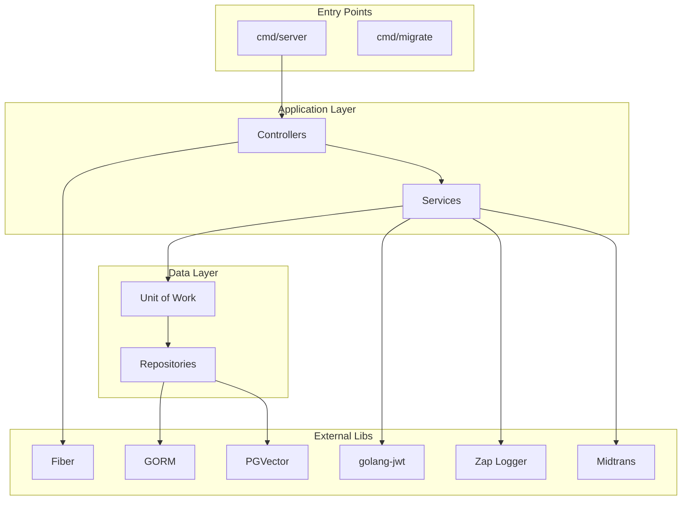

# Dokumentasi: Core Libraries & Foundation (Backend)

> **Fokus Domain:** BACKEND  
> **Konteks:** Library dependencies dan internal packages yang menjadi fondasi project  
> **Scope:** Go modules, external libraries, dan internal pkg structure

---

## Alur Arsitektural (Scope: BACKEND)

```
┌──────────────────────────────────────────────────────────────────┐
│                          APPLICATION                              │
├──────────────────────────────────────────────────────────────────┤
│  cmd/server    │  cmd/migrate   │  cmd/seeder                    │
├──────────────────────────────────────────────────────────────────┤
│                       INTERNAL LAYERS                             │
├─────────────┬─────────────┬─────────────┬────────────────────────┤
│ controller  │  service    │ repository  │ dto/entity/model       │
├─────────────┴─────────────┴─────────────┴────────────────────────┤
│                        INTERNAL PKG                               │
├─────────────┬─────────────┬─────────────┬────────────────────────┤
│ serverutils │   mailer    │   logger    │ config                 │
├─────────────┴─────────────┴─────────────┴────────────────────────┤
│                       EXTERNAL PKG                                │
├─────────────┬─────────────┬─────────────┬────────────────────────┤
│  chatbot    │  embedding  │                                      │
├─────────────┴─────────────┴──────────────────────────────────────┤
│                    EXTERNAL LIBRARIES                             │
├──────────────────────────────────────────────────────────────────┤
│ Fiber │ GORM │ JWT │ PGVector │ Zap │ Midtrans │ OAuth2 │ ...    │
└──────────────────────────────────────────────────────────────────┘
```

---

## A. External Libraries (go.mod)

### 1. Web Framework

| Library | Version | Purpose |
|---------|---------|---------|
| `github.com/gofiber/fiber/v2` | v2.52.8 | **High-performance HTTP framework** |
| `github.com/gofiber/contrib/otelfiber` | v1.0.10 | OpenTelemetry middleware for Fiber |

**Fiber Usage:**
```go
// server/server.go
app := fiber.New(fiber.Config{
    ErrorHandler: customErrorHandler,
})

// Route groups
api := app.Group("/api")
api.Use(serverutils.JwtMiddleware)

// Start server
app.Listen(":3000")
```

---

### 2. Database & ORM

| Library | Version | Purpose |
|---------|---------|---------|
| `gorm.io/gorm` | v1.31.1 | **ORM untuk PostgreSQL** |
| `gorm.io/driver/postgres` | v1.6.0 | PostgreSQL driver untuk GORM |
| `github.com/jackc/pgx/v5` | v5.7.5 | Native PostgreSQL driver |
| `github.com/pgvector/pgvector-go` | v0.3.0 | **PGVector extension untuk vector search** |

**GORM Usage:**
```go
// bootstrap/database.go
db, err := gorm.Open(postgres.Open(dsn), &gorm.Config{})

// Repository pattern
func (r *UserRepositoryImpl) FindOne(ctx context.Context, specs ...specification.Specification) (*entity.User, error) {
    var m model.User
    query := r.applySpecifications(r.db.WithContext(ctx), specs...)
    if err := query.First(&m).Error; err != nil {
        return nil, err
    }
    return r.mapper.ToEntity(&m), nil
}
```

**PGVector Usage:**
```go
// Cosine similarity search
err := r.db.WithContext(ctx).
    Order(gorm.Expr("embedding_value <=> ?", pgvector.NewVector(embedding))).
    Limit(limit).
    Find(&models).Error
```

---

### 3. Authentication & Security

| Library | Version | Purpose |
|---------|---------|---------|
| `github.com/golang-jwt/jwt/v5` | v5.3.0 | **JWT token generation & validation** |
| `golang.org/x/crypto` | v0.44.0 | **bcrypt password hashing** |
| `golang.org/x/oauth2` | v0.33.0 | **OAuth2 client untuk Google auth** |

**JWT Usage:**
```go
// Generate token
claims := jwt.MapClaims{
    "user_id": user.Id.String(),
    "role":    user.Role,
    "exp":     time.Now().Add(24 * time.Hour).Unix(),
}
token := jwt.NewWithClaims(jwt.SigningMethodHS256, claims)
signedToken, _ := token.SignedString([]byte(os.Getenv("JWT_SECRET")))

// Parse token
token, err := jwt.Parse(tokenStr, func(t *jwt.Token) (interface{}, error) {
    return []byte(os.Getenv("JWT_SECRET")), nil
})
```

**Bcrypt Usage:**
```go
// Hash password
hashedPassword, _ := bcrypt.GenerateFromPassword([]byte(password), bcrypt.DefaultCost)

// Verify password
err := bcrypt.CompareHashAndPassword([]byte(*user.PasswordHash), []byte(password))
```

**OAuth2 Usage:**
```go
// Google OAuth config
config := oauth2.Config{
    ClientID:     os.Getenv("GOOGLE_CLIENT_ID"),
    ClientSecret: os.Getenv("GOOGLE_CLIENT_SECRET"),
    RedirectURL:  callbackURL,
    Scopes:       []string{"email", "profile"},
    Endpoint:     google.Endpoint,
}

// Exchange code for token
token, _ := config.Exchange(ctx, code)
```

---

### 4. Logging & Observability

| Library | Version | Purpose |
|---------|---------|---------|
| `go.uber.org/zap` | v1.27.1 | **High-performance structured logging** |
| `gopkg.in/natefinch/lumberjack.v2` | v2.2.1 | **Log file rotation** |
| `go.opentelemetry.io/otel` | v1.39.0 | **Distributed tracing** |
| `go.opentelemetry.io/otel/sdk` | v1.39.0 | OpenTelemetry SDK |
| `go.opentelemetry.io/otel/exporters/otlp/otlptrace/otlptracehttp` | v1.39.0 | OTLP HTTP exporter |

**Zap + Lumberjack Usage:**
```go
// Configure rotation
rotator := &lumberjack.Logger{
    Filename:   "logs/app.log",
    MaxSize:    10,   // MB
    MaxBackups: 5,
    MaxAge:     30,   // Days
    Compress:   true,
}

// Create logger
core := zapcore.NewTee(fileCore, consoleCore)
logger := zap.New(core, zap.AddCaller())

// Usage
logger.Info("message", zap.String("module", "ADMIN"), zap.Any("details", details))
```

---

### 5. Payment Gateway

| Library | Version | Purpose |
|---------|---------|---------|
| `github.com/midtrans/midtrans-go` | v1.3.8 | **Midtrans payment integration** |

**Midtrans Usage:**
```go
// Create Snap transaction
snapReq := &snap.Request{
    TransactionDetails: midtrans.TransactionDetails{
        OrderID:  orderID,
        GrossAmt: int64(plan.Price),
    },
    CustomerDetail: &midtrans.CustomerDetails{
        Email: user.Email,
        FName: user.FullName,
    },
}

snapResp, _ := snap.CreateTransaction(snapReq)
// snapResp.RedirectURL -> Payment page
```

---

### 6. Email Service

| Library | Version | Purpose |
|---------|---------|---------|
| `gopkg.in/gomail.v2` | v2.0.0 | **SMTP email sending** |

**Gomail Usage:**
```go
m := gomail.NewMessage()
m.SetHeader("From", s.from)
m.SetHeader("To", to)
m.SetHeader("Subject", subject)
m.SetBody("text/html", body)

dialer := gomail.NewDialer(s.host, s.port, s.username, s.password)
dialer.DialAndSend(m)
```

---

### 7. Validation

| Library | Version | Purpose |
|---------|---------|---------|
| `github.com/go-playground/validator/v10` | v10.27.0 | **Struct validation** |

**Validator Usage:**
```go
type RegisterRequest struct {
    FullName string `json:"full_name" validate:"required,min=3,max=100"`
    Email    string `json:"email" validate:"required,email"`
    Password string `json:"password" validate:"required,min=8"`
}

// Validation in serverutils
validate := validator.New()
err := validate.Struct(req)
```

---

### 8. Utilities

| Library | Version | Purpose |
|---------|---------|---------|
| `github.com/google/uuid` | v1.6.0 | **UUID generation** |
| `github.com/joho/godotenv` | v1.5.1 | **Environment variable loading** |
| `github.com/stretchr/testify` | v1.11.1 | **Testing assertions** |

**UUID Usage:**
```go
id := uuid.New()
userId, _ := uuid.Parse(idString)
```

---

### 9. Async Processing

| Library | Version | Purpose |
|---------|---------|---------|
| `github.com/ThreeDotsLabs/watermill` | v1.4.7 | **Pub-sub message processing** |

**Watermill Usage:**
```go
// Publisher for async embedding generation
publisher.Publish("note.created", message)

// Subscriber
subscriber.Subscribe(ctx, "note.created", handler)
```

---

## B. Internal Packages (internal/pkg)

### 1. `serverutils`

**Purpose:** HTTP utilities untuk Fiber

```go
// pkg/serverutils/response.go
func SuccessResponse[T any](message string, data T) Response[T] {
    return Response[T]{Success: true, Code: 200, Message: message, Data: data}
}

func ErrorResponse(code int, message string) Response[any] {
    return Response[any]{Success: false, Code: code, Message: message}
}

// pkg/serverutils/jwt_middleware.go
func JwtMiddleware(ctx *fiber.Ctx) error {
    tokenStr := extractToken(ctx)
    claims, err := validateToken(tokenStr)
    ctx.Locals("user_id", claims["user_id"])
    return ctx.Next()
}

// pkg/serverutils/validator.go
func ValidateRequest(req interface{}) error {
    validate := validator.New()
    return validate.Struct(req)
}
```

---

### 2. `mailer`

**Purpose:** Email service abstraction

```go
// pkg/mailer/email_service.go
type IEmailService interface {
    SendOTP(to, otp string) error
    SendPasswordReset(to, token string) error
}

type emailService struct {
    dialer *gomail.Dialer
    from   string
}
```

---

### 3. `logger`

**Purpose:** Logging dengan Zap + file rotation + admin read capability

```go
// pkg/logger/zap_logger.go
type ILogger interface {
    Debug(module, message string, details map[string]interface{})
    Info(module, message string, details map[string]interface{})
    Warn(module, message string, details map[string]interface{})
    Error(module, message string, details map[string]interface{})
    GetLogs(level string, limit, offset int) ([]LogEntry, error)
    GetLogById(id string) (*LogEntry, error)
}
```

---

### 4. `config`

**Purpose:** Application configuration

```go
// pkg/config/config.go
type Config struct {
    DatabaseURL    string
    JWTSecret      string
    Environment    string
    LogFilePath    string
    Port           string
    // ...
}

func LoadConfig() *Config {
    godotenv.Load()
    return &Config{
        DatabaseURL: os.Getenv("DATABASE_URL"),
        // ...
    }
}
```

---

## C. External Packages (pkg/)

### 1. [chatbot](file:///d:/notetaker/notefiber-BE/internal/service/chatbot_service.go#30-33)

**Purpose:** Ollama LLM integration

```go
// pkg/chatbot/ollama.go
func GetOllamaResponse(ctx context.Context, history []*ChatHistory) (string, error)
func DecideToUseRAGWithOllama(ctx context.Context, history []*ChatHistory) (bool, error)
```

---

### 2. `embedding`

**Purpose:** Gemini Embedding API

```go
// pkg/embedding/gemini.go
func GetGeminiEmbedding(apiKey, text, taskType string) (*EmbeddingResponse, error)
// TaskType: "RETRIEVAL_DOCUMENT" or "RETRIEVAL_QUERY"
```

---

## D. Design Patterns

### 1. Repository Pattern

```go
// contract/user_repository.go
type UserRepository interface {
    Create(ctx context.Context, user *entity.User) error
    FindOne(ctx context.Context, specs ...specification.Specification) (*entity.User, error)
    Update(ctx context.Context, user *entity.User) error
    Delete(ctx context.Context, id uuid.UUID) error
}

// implementation/user_repository_impl.go
type UserRepositoryImpl struct {
    db     *gorm.DB
    mapper *mapper.UserMapper
}
```

---

### 2. Unit of Work Pattern

```go
// unitofwork/unit_of_work.go
type UnitOfWork interface {
    Begin(ctx context.Context) error
    Commit() error
    Rollback() error
    
    UserRepository() contract.UserRepository
    NoteRepository() contract.NoteRepository
    SubscriptionRepository() contract.SubscriptionRepository
    // ...
}
```

---

### 3. Specification Pattern

```go
// specification/specification.go
type Specification interface {
    Apply(db *gorm.DB) *gorm.DB
}

// Examples
type ByID struct { ID uuid.UUID }
func (s ByID) Apply(db *gorm.DB) *gorm.DB {
    return db.Where("id = ?", s.ID)
}

type UserOwnedBy struct { UserID uuid.UUID }
func (s UserOwnedBy) Apply(db *gorm.DB) *gorm.DB {
    return db.Where("user_id = ?", s.UserID)
}

type Pagination struct { Limit, Offset int }
func (s Pagination) Apply(db *gorm.DB) *gorm.DB {
    return db.Limit(s.Limit).Offset(s.Offset)
}
```

---

### 4. Mapper Pattern

```go
// mapper/user_mapper.go
type UserMapper struct{}

func (m *UserMapper) ToEntity(model *model.User) *entity.User
func (m *UserMapper) ToModel(entity *entity.User) *model.User
```

---

### 5. Dependency Injection

```go
// bootstrap/container.go
type Container struct {
    AuthController     controller.IAuthController
    NoteController     controller.INoteController
    AdminController    controller.IAdminController
    // ...
}

func NewContainer(db *gorm.DB, cfg *config.Config) *Container {
    uowFactory := unitofwork.NewRepositoryFactory(db)
    logger := logger.NewZapLogger(cfg.LogFilePath, cfg.IsProd())
    
    authService := service.NewAuthService(uowFactory, emailService)
    authController := controller.NewAuthController(authService)
    
    return &Container{AuthController: authController, ...}
}
```

---

## E. Library Dependency Graph



---

## F. Environment Variables

| Variable | Library | Purpose |
|----------|---------|---------|
| `DATABASE_URL` | GORM | PostgreSQL connection string |
| `JWT_SECRET` | golang-jwt | JWT signing key |
| `GOOGLE_CLIENT_ID` | oauth2 | Google OAuth client ID |
| `GOOGLE_CLIENT_SECRET` | oauth2 | Google OAuth client secret |
| `GOOGLE_GEMINI_API_KEY` | pkg/embedding | Gemini API key |
| `MIDTRANS_SERVER_KEY` | midtrans-go | Midtrans API key |
| `MIDTRANS_IS_PRODUCTION` | midtrans-go | Sandbox/Production mode |
| `SMTP_HOST` | gomail | Email server host |
| `SMTP_PORT` | gomail | Email server port |
| `SMTP_USERNAME` | gomail | Email auth username |
| `SMTP_PASSWORD` | gomail | Email auth password |
| `OLLAMA_BASE_URL` | pkg/chatbot | Ollama server URL |
| `FRONTEND_URL` | oauth2, midtrans | Frontend callback URL |

---

## G. Version Requirements

| Requirement | Version |
|-------------|---------|
| Go | 1.24.0+ |
| PostgreSQL | 14+ (with pgvector extension) |
| Ollama | Latest (for AI chat) |

---

*Dokumen ini di-generate dalam mode READ-ONLY tanpa modifikasi terhadap kode sumber.*
