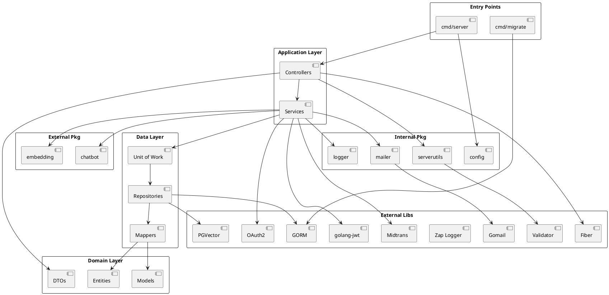

# Dokumentasi: Core Libraries & Foundation (Backend)

> **Fokus Domain:** BACKEND  
> **Konteks:** Library dependencies, internal packages, dan mappers yang menjadi fondasi project  
> **Scope:** Go modules, external libraries, internal pkg structure, dan design patterns

---

## Alur Arsitektural (Scope: BACKEND)

```
┌──────────────────────────────────────────────────────────────────┐
│                          APPLICATION                              │
├──────────────────────────────────────────────────────────────────┤
│  cmd/server    │  cmd/migrate   │  cmd/seeder                    │
├──────────────────────────────────────────────────────────────────┤
│                       INTERNAL LAYERS                             │
├─────────────┬─────────────┬─────────────┬────────────────────────┤
│ controller  │  service    │ repository  │ mapper                 │
├─────────────┼─────────────┼─────────────┼────────────────────────┤
│     dto     │   entity    │   model     │ specification          │
├─────────────┴─────────────┴─────────────┴────────────────────────┤
│                        INTERNAL PKG                               │
├─────────────┬─────────────┬─────────────┬────────────────────────┤
│ serverutils │   mailer    │   logger    │ config                 │
├─────────────┴─────────────┴─────────────┴────────────────────────┤
│                       EXTERNAL PKG                                │
├─────────────┬─────────────┬──────────────────────────────────────┤
│  chatbot    │  embedding  │                                      │
├─────────────┴─────────────┴──────────────────────────────────────┤
│                    EXTERNAL LIBRARIES                             │
├──────────────────────────────────────────────────────────────────┤
│ Fiber │ GORM │ JWT │ PGVector │ Zap │ Midtrans │ OAuth2 │ ...    │
└──────────────────────────────────────────────────────────────────┘
```

---

## A. External Libraries (go.mod)

### 1. Web Framework

| Library | Version | Purpose | Note |
|---------|---------|---------|------|
| `github.com/gofiber/fiber/v2` | v2.52.8 | HTTP framework berbasis fasthttp | âš¡ 10x faster than net/http |
| `github.com/gofiber/contrib/otelfiber` | v1.0.10 | OpenTelemetry middleware | 🔍 Distributed tracing |

---

### 2. Database & ORM

| Library | Version | Purpose | Note |
|---------|---------|---------|------|
| `gorm.io/gorm` | v1.31.1 | ORM untuk PostgreSQL | 🗄️ Auto-migration, hooks, soft delete |
| `gorm.io/driver/postgres` | v1.6.0 | PostgreSQL driver | PostgreSQL-specific features |
| `github.com/jackc/pgx/v5` | v5.7.5 | Native PostgreSQL driver | 🚀 High-performance, pgbouncer support |
| `github.com/pgvector/pgvector-go` | v0.3.0 | Vector similarity search | 🧠 AI semantic search via cosine distance |

---

### 3. Authentication & Security

| Library | Version | Purpose | Note |
|---------|---------|---------|------|
| `github.com/golang-jwt/jwt/v5` | v5.3.0 | JWT generation & validation | 🔐 HS256 signing |
| `golang.org/x/crypto` | v0.44.0 | bcrypt password hashing | 🔒 Cost factor: 10 (default) |
| `golang.org/x/oauth2` | v0.33.0 | OAuth2 client | 🔗 Google Sign-In |

---

### 4. Logging & Observability

| Library | Version | Purpose | Note |
|---------|---------|---------|------|
| `go.uber.org/zap` | v1.27.1 | Structured logging | âš¡ Zero-allocation JSON logging |
| `gopkg.in/natefinch/lumberjack.v2` | v2.2.1 | Log rotation | 📁 Max 10MB, 5 backups, 30 days |
| `go.opentelemetry.io/otel` | v1.39.0 | Distributed tracing | 📊 OTLP HTTP export |

---

### 5. Payment Gateway

| Library | Version | Purpose | Note |
|---------|---------|---------|------|
| `github.com/midtrans/midtrans-go` | v1.3.8 | Midtrans Snap payment | 💳 Snap redirect, webhook handler |

---

### 6. Email Service

| Library | Version | Purpose | Note |
|---------|---------|---------|------|
| `gopkg.in/gomail.v2` | v2.0.0 | SMTP email sending | 📧 HTML templates, attachments |

---

### 7. Validation

| Library | Version | Purpose | Note |
|---------|---------|---------|------|
| `github.com/go-playground/validator/v10` | v10.27.0 | Struct validation | ✅ Tags: required, email, min, max |

---

### 8. Utilities

| Library | Version | Purpose | Note |
|---------|---------|---------|------|
| `github.com/google/uuid` | v1.6.0 | UUID generation | V4 random UUIDs |
| `github.com/joho/godotenv` | v1.5.1 | Environment loading | Load .env files |
| `github.com/stretchr/testify` | v1.11.1 | Testing | assert, require, mock |

---

### 9. Async Processing

| Library | Version | Purpose | Note |
|---------|---------|---------|------|
| `github.com/ThreeDotsLabs/watermill` | v1.4.7 | Pub-sub messaging | 🔄 Async embedding generation |

---

## B. Internal Layers (internal/)

### 1. `internal/bootstrap`

| Component | File | Note |
|-----------|------|------|
| Container | `container.go` | 📦 **Dependency Injection container** - Wiring semua services dan controllers |
| Database | `database.go` | 🗄️ GORM + PostgreSQL connection setup |

```go
// container.go - Wiring dependencies
type Container struct {
    AuthController   controller.IAuthController
    NoteController   controller.INoteController
    AdminController  controller.IAdminController
    // ...
}
```

---

### 2. `internal/server`

| Component | File | Note |
|-----------|------|------|
| Server | `server.go` | 🌐 **Fiber app setup** - Route registration, middleware, error handling |

```go
// Middleware chain
app.Use(cors.New())
app.Use(logger.New())
api := app.Group("/api")
```

---

### 3. `internal/controller`

| Controller | File | Note |
|------------|------|------|
| AuthController | `auth_controller.go` | 🔐 Login, Register, OAuth, Password reset |
| NoteController | `note_controller.go` | 📝 CRUD notes + semantic search |
| NotebookController | `notebook_controller.go` | 📁 CRUD notebooks |
| UserController | `user_controller.go` | 👤 Profile, refund request |
| PaymentController | `payment_controller.go` | 💳 Checkout, webhook |
| AdminController | `admin_controller.go` | ⚙️ Admin dashboard + CRUD management |
| ChatbotController | `chatbot_controller.go` | 🤖 AI chat dengan RAG |
| OAuthController | `oauth_controller.go` | 🔗 Google OAuth flow |
| PlanController | `plan_controller.go` | 📋 Subscription plans |

> **Note:** Setiap controller implements interface dan register routes.

---

### 4. `internal/service`

| Service | File | Note |
|---------|------|------|
| AuthService | `auth_service.go` | 🔐 Auth logic + JWT + bcrypt |
| NoteService | `note_service.go` | 📝 Note CRUD + embedding trigger |
| NotebookService | `notebook_service.go` | 📁 Notebook CRUD |
| UserService | `user_service.go` | 👤 Profile + refund request |
| PaymentService | `payment_service.go` | 💳 Checkout + webhook + subscription |
| AdminService | `admin_service.go` | ⚙️ Admin CRUD + approval |
| ChatbotService | `chatbot_service.go` | 🤖 RAG + Ollama + usage tracking |
| OAuthService | `oauth_service.go` | 🔗 Google OAuth + user creation |
| PlanService | `plan_service.go` | 📋 Limit enforcement |
| PublisherService | `publisher_service.go` | 🔄 Async embedding via Watermill |

> **Note:** Services menggunakan Unit of Work untuk transaction management.

---

### 5. `internal/repository`

| Subdirectory | Note |
|--------------|------|
| `contract/` | 📜 **Interface definitions** - Repository contracts |
| `implementation/` | ⚙️ **GORM implementations** - Database queries |
| `unitofwork/` | 🔄 **Transaction management** - Begin, Commit, Rollback |
| `specification/` | 🔍 **Query builders** - Dynamic WHERE clauses |

---

### 6. `internal/entity`

| Entity | File | Note |
|--------|------|------|
| User | `user_entity.go` | 👤 Domain user dengan Role/Status enum |
| Note | `note_entity.go` | 📝 Domain note |
| Notebook | `notebook_entity.go` | 📁 Domain notebook |
| SubscriptionPlan | `subscription_entity.go` | 📋 Plan dengan limits |
| UserSubscription | `subscription_entity.go` | 🎫 User's active subscription |
| ChatSession | `chat_session_entity.go` | 💬 AI chat session |
| ChatMessage | `chat_message_entity.go` | 💬 Chat messages |
| NoteEmbedding | `note_embedding_entity.go` | 🧠 Vector embeddings |
| Refund | `refund_entity.go` | 💰 Refund requests |

> **Note:** Entities adalah **domain objects** - bersih tanpa GORM tags.

---

### 7. `internal/model`

| Model | File | Note |
|-------|------|------|
| User | `user_model.go` | 🗄️ GORM model dengan tags |
| Note | `note_model.go` | 🗄️ GORM model |
| Notebook | `notebook_model.go` | 🗄️ GORM model |
| SubscriptionPlan | `subscription_model.go` | 🗄️ GORM model |
| NoteEmbedding | `note_embedding_model.go` | 🧠 pgvector.Vector type |
| ... | ... | ... |

> **Note:** Models adalah **persistence objects** - dengan GORM tags untuk DB mapping.

---

### 8. `internal/dto`

| DTO Group | File | Note |
|-----------|------|------|
| Auth | `auth_payment_dto.go` | 🔐 Login, Register, JWT response |
| User | `user_dto.go` | 👤 Profile, subscription info |
| Note | `note_dto.go` | 📝 CRUD request/response |
| Notebook | `notebook_dto.go` | 📁 CRUD request/response |
| Admin | `admin_dto.go` | ⚙️ Admin operations |
| Chatbot | `chatbot_dto.go` | 🤖 Chat request/response |
| Refund | `refund_dto.go` | 💰 Refund request/response |

> **Note:** DTOs adalah **API contracts** - validasi dengan `validate` tags.

---

### 9. `internal/constant`

| Constant | File | Note |
|----------|------|------|
| Chatbot | `chatbot_constant.go` | 🤖 System prompts, Ollama config |

> **Note:** Constants untuk magic values dan configuration.

---

## C. Mapper Layer (internal/mapper)

> **Note:** Mappers bertanggung jawab untuk **konversi bidirectional** antara Entity (domain) dan Model (persistence).

### Complete Mapper List

| Mapper | File | Converts | Note |
|--------|------|----------|------|
| **UserMapper** | `user_mapper.go` | User, PasswordResetToken, UserProvider, EmailVerificationToken, UserRefreshToken | 👤 Handles Role/Status enum conversion |
| **NoteMapper** | `note_mapper.go` | Note | 📝 Handles gorm.DeletedAt ↔ *time.Time |
| **NotebookMapper** | `notebook_mapper.go` | Notebook | 📁 Handles soft delete |
| **ChatMapper** | `chat_mapper.go` | ChatSession, ChatMessage, ChatMessageRaw | 💬 AI chat entities |
| **SubscriptionMapper** | `subscription_mapper.go` | SubscriptionPlan, UserSubscription | 📋 Plan & subscription |
| **BillingMapper** | `billing_mapper.go` | Payment transactions | 💳 Payment records |
| **FeatureMapper** | `feature_mapper.go` | Feature catalog | ✨ Plan features |
| **NoteEmbeddingMapper** | `note_embedding_mapper.go` | NoteEmbedding | 🧠 pgvector.Vector ↔ []float32 |

### Mapper Pattern

```go
// user_mapper.go
type UserMapper struct{}

func NewUserMapper() *UserMapper {
    return &UserMapper{}
}

// Entity → Model (untuk write ke DB)
func (m *UserMapper) ToModel(u *entity.User) *model.User {
    return &model.User{
        Id:           u.Id,
        Email:        u.Email,
        Role:         string(u.Role),    // Enum → string
        Status:       string(u.Status),  // Enum → string
        // ...
    }
}

// Model → Entity (untuk read dari DB)
func (m *UserMapper) ToEntity(u *model.User) *entity.User {
    return &entity.User{
        Id:     u.Id,
        Email:  u.Email,
        Role:   entity.UserRole(u.Role),    // string → Enum
        Status: entity.UserStatus(u.Status), // string → Enum
        // ...
    }
}

// Batch conversions
func (m *UserMapper) ToEntities(users []*model.User) []*entity.User
func (m *UserMapper) ToModels(users []*entity.User) []*model.User
```

### Special Mappings

| Type | Entity | Model | Note |
|------|--------|-------|------|
| Soft Delete | `*time.Time` | `gorm.DeletedAt` | Nullable timestamp |
| Enums | `entity.UserRole` | `string` | Type-safe enum |
| Vectors | `[]float32` | `pgvector.Vector` | PGVector type |

---

## D. Internal Packages (internal/pkg)

### 1. `pkg/serverutils`

| File | Note |
|------|------|
| `response.go` | 📤 **Standard API response** - SuccessResponse, ErrorResponse |
| `jwt_middleware.go` | 🔐 **JWT middleware** - Extract & validate token |
| `validator.go` | ✅ **Request validation** - Struct validation wrapper |

```go
// Usage
ctx.JSON(serverutils.SuccessResponse("Success", data))
ctx.JSON(serverutils.ErrorResponse(400, "Bad request"))
```

---

### 2. `pkg/mailer`

| File | Note |
|------|------|
| `email_service.go` | 📧 **SMTP abstraction** - OTP, password reset emails |

```go
type IEmailService interface {
    SendOTP(to, otp string) error
    SendPasswordReset(to, token string) error
}
```

---

### 3. `pkg/logger`

| File | Note |
|------|------|
| `zap_logger.go` | 📊 **Structured logging** - Zap + Lumberjack + Admin read |

```go
type ILogger interface {
    Debug(module, message string, details map[string]interface{})
    Info(module, message string, details map[string]interface{})
    Warn(module, message string, details map[string]interface{})
    Error(module, message string, details map[string]interface{})
    GetLogs(level string, limit, offset int) ([]LogEntry, error)  // Admin read
    GetLogById(id string) (*LogEntry, error)
}
```

---

### 4. `pkg/config`

| File | Note |
|------|------|
| `config.go` | ⚙️ **App configuration** - Environment variables loader |

---

## E. External Packages (pkg/)

### 1. `pkg/chatbot`

| File | Note |
|------|------|
| `ollama.go` | 🤖 **Ollama LLM client** - Chat completion, RAG decision |

```go
func GetOllamaResponse(ctx context.Context, history []*ChatHistory) (string, error)
func DecideToUseRAGWithOllama(ctx context.Context, history []*ChatHistory) (bool, error)
```

---

### 2. `pkg/embedding`

| File | Note |
|------|------|
| `gemini.go` | 🧠 **Gemini Embedding API** - Vector generation |

```go
func GetGeminiEmbedding(apiKey, text, taskType string) (*EmbeddingResponse, error)
// TaskType: "RETRIEVAL_DOCUMENT" atau "RETRIEVAL_QUERY"
```

---

## F. Library Dependency Graph (PlantUML)



---

## G. Design Patterns Summary

| Pattern | Location | Note |
|---------|----------|------|
| **Repository** | `repository/` | 📜 Abstraksi data access |
| **Unit of Work** | `unitofwork/` | 🔄 Transaction management |
| **Specification** | `specification/` | 🔍 Dynamic query building |
| **Mapper** | `mapper/` | 🔀 Entity ↔ Model conversion |
| **Dependency Injection** | `bootstrap/` | 📦 Wiring via Container |
| **Layered Architecture** | `internal/` | 🏛️ Controller → Service → Repository |

---

## H. Environment Variables

| Variable | Library | Note |
|----------|---------|------|
| `DATABASE_URL` | GORM | PostgreSQL connection |
| `JWT_SECRET` | golang-jwt | Token signing key |
| `GOOGLE_CLIENT_ID` | oauth2 | OAuth client ID |
| `GOOGLE_CLIENT_SECRET` | oauth2 | OAuth client secret |
| `GOOGLE_GEMINI_API_KEY` | pkg/embedding | Gemini API key |
| `MIDTRANS_SERVER_KEY` | midtrans-go | Payment API key |
| `MIDTRANS_IS_PRODUCTION` | midtrans-go | Sandbox/Production |
| `SMTP_HOST` | gomail | Email server |
| `SMTP_PORT` | gomail | Email port |
| `SMTP_USERNAME` | gomail | Email auth |
| `SMTP_PASSWORD` | gomail | Email password |
| `OLLAMA_BASE_URL` | pkg/chatbot | LLM server URL |
| `FRONTEND_URL` | oauth2, midtrans | Callback URL |

---

## I. Version Requirements

| Requirement | Version | Note |
|-------------|---------|------|
| Go | 1.24.0+ | Latest Go version |
| PostgreSQL | 14+ | Required for pgvector |
| pgvector | 0.5.0+ | Vector extension |
| Ollama | Latest | Local LLM server |

---

*Dokumen ini di-generate dalam mode READ-ONLY tanpa modifikasi terhadap kode sumber.*
