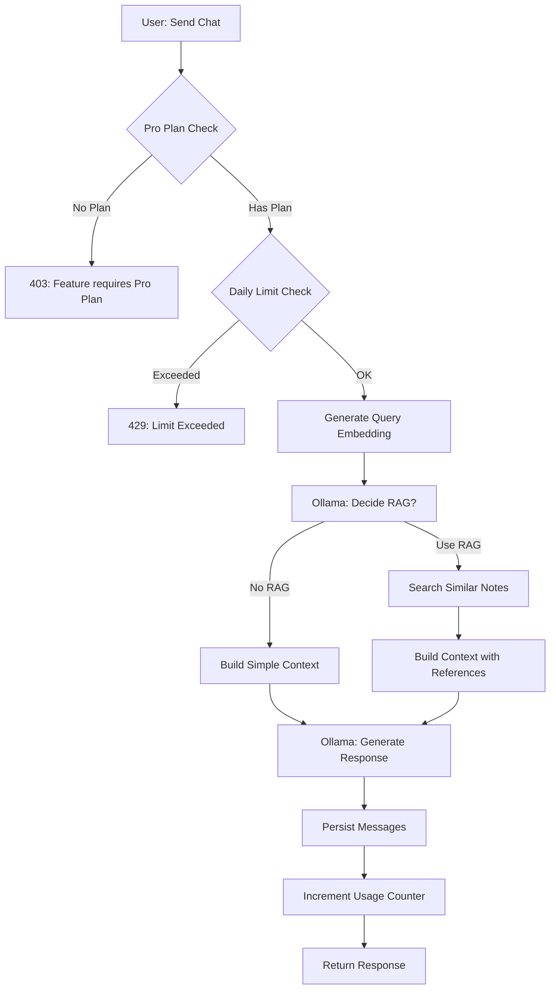

# Dokumentasi Fitur: Chatbot AI (RAG-Enhanced)

> **Fokus Domain:** BACKEND  
> **Konteks:** Trace Upstream ke Downstream secara Semantik  
> **Scope:** AI Chatbot dengan Retrieval-Augmented Generation (RAG) dan Ollama LLM

---

## Alur Data Semantik (Scope: BACKEND)

```
=== CREATE SESSION ===
[HTTP POST /api/chatbot/v1/create-session]  
    -> [JWT Middleware: Extract User ID]  
    -> [Controller: Delegasi ke Service]  
    -> [Service: CreateSession]  
        -> [Transaction Begin]  
        -> [Create: ChatSession + Initial Messages]  
        -> [Create: ChatMessageRaw (System Prompts)]  
        -> [Transaction Commit]  
    -> [HTTP Response dengan Session ID]

=== SEND CHAT (RAG-Enhanced) ===
[HTTP POST /api/chatbot/v1/send-chat]  
    -> [JWT Middleware: Extract User ID]  
    -> [Controller: Parse Request]  
    -> [Service: SendChat]  
        -> [Guard: Check Pro Plan + AiChatEnabled]  
        -> [Guard: Check Daily Usage Limit]  
        -> [Validate: Session Ownership]  
        -> [Gemini API: Generate Embedding for Query]  
        -> [Ollama: Decide if RAG Needed]  
        -> [If RAG: Search Similar Note Embeddings]  
        -> [Build: Context with References]  
        -> [Ollama: Generate Response]  
        -> [Persist: Messages + Raw Messages]  
        -> [Increment: User.AiDailyUsage]  
        -> [Transaction Commit]  
    -> [HTTP Response dengan Sent + Reply]

=== GET CHAT HISTORY ===
[HTTP GET /api/chatbot/v1/chat-history]  
    -> [JWT Middleware: Extract User ID]  
    -> [Controller: Parse Session ID]  
    -> [Service: GetChatHistory]  
        -> [Validate: Session Ownership]  
        -> [Repository: FindAll ChatMessages]  
    -> [HTTP Response dengan Chat List]
```

---

## A. Laporan Implementasi Fitur Chatbot AI

### Deskripsi Fungsional

Fitur ini menyediakan AI chatbot dengan kemampuan **Retrieval-Augmented Generation (RAG)**. Chatbot dapat menjawab pertanyaan berdasarkan notes user yang tersimpan melalui semantic search. Sistem mengimplementasikan:

1. **CreateSession**: Membuat chat session baru dengan system prompts
2. **GetAllSessions**: List semua chat sessions milik user
3. **GetChatHistory**: Fetch semua messages dalam session
4. **SendChat**: Kirim pesan dan terima respons AI dengan RAG
5. **DeleteSession**: Hapus session beserta semua messages

**AI Integration:**
- **Gemini API**: Embedding generation untuk semantic search
- **Ollama LLM**: Response generation dan RAG decision
- **Vector Search**: PGVector untuk similarity search on notes

**Guard Features:**
- Pro Plan check (AiChatEnabled)
- Daily usage limit enforcement
- Usage tracking per user

### Visualisasi

**Send Chat Request:**
```json
{
    "chat_session_id": "550e8400-e29b-41d4-a716-446655440000",
    "chat": "What are my notes about machine learning?"
}
```

**Send Chat Response:**
```json
{
    "chat_session_id": "550e8400-e29b-41d4-a716-446655440000",
    "title": "What are my notes about machine learning?",
    "sent": {
        "id": "660e8400-e29b-41d4-a716-446655440001",
        "chat": "What are my notes about machine learning?",
        "role": "user",
        "created_at": "2024-12-25T02:00:00Z"
    },
    "reply": {
        "id": "770e8400-e29b-41d4-a716-446655440002",
        "chat": "Based on your notes in \"ML Fundamentals\" (Notebook: \"Tech Studies\"), you have notes about...",
        "role": "model",
        "created_at": "2024-12-25T02:00:01Z"
    }
}
```

**Limit Exceeded Response (429):**
```json
{
    "success": false,
    "code": 429,
    "message": "Daily AI usage limit exceeded",
    "error_type": "LIMIT_EXCEEDED",
    "data": {
        "limit": 100,
        "used": 100,
        "reset_after": "2024-12-26T00:00:00Z",
        "show_modal_pricing": true
    }
}
```
*Caption: Gambar 1: Request/Response untuk SendChat dengan RAG.*

---

## B. Bedah Arsitektur & Komponen

Berikut adalah rincian 18 komponen yang menyusun fitur ini di sisi BACKEND.

---

### [internal/server/server.go](file:///d:/notetaker/notefiber-BE/internal/server/server.go)
**Layer Terdeteksi:** `HTTP Server & Route Registration`

**Narasi Operasional:**
Server mendaftarkan [ChatbotController](file:///d:/notetaker/notefiber-BE/internal/controller/chatbot_controller.go#13-21) dengan prefix `/api/chatbot/v1`.

```go
func registerRoutes(app *fiber.App, c *bootstrap.Container) {
	api := app.Group("/api")
	c.ChatbotController.RegisterRoutes(api)
}
```
*Caption: Snippet 1: Registrasi ChatbotController.*

---

### [internal/bootstrap/container.go](file:///d:/notetaker/notefiber-BE/internal/bootstrap/container.go)
**Layer Terdeteksi:** `Dependency Injection Container`

**Narasi Operasional:**
[ChatbotService](file:///d:/notetaker/notefiber-BE/internal/service/chatbot_service.go#22-29) diinisialisasi dengan `uowFactory` untuk akses ke multiple repositories (ChatSession, ChatMessage, ChatMessageRaw, NoteEmbedding, Subscription, User).

```go
func NewContainer(db *gorm.DB, cfg *config.Config) *Container {
	uowFactory := unitofwork.NewRepositoryFactory(db)

	chatbotService := service.NewChatbotService(uowFactory)

	return &Container{
		ChatbotController: controller.NewChatbotController(chatbotService),
	}
}
```
*Caption: Snippet 2: Konstruksi ChatbotService.*

---

### [internal/dto/chatbot_dto.go](file:///d:/notetaker/notefiber-BE/internal/dto/chatbot_dto.go)
**Layer Terdeteksi:** `Data Transfer Object (DTO)`

**Narasi Operasional:**
File ini mendefinisikan kontrak data untuk chatbot operations. [SendChatResponse](file:///d:/notetaker/notefiber-BE/internal/dto/chatbot_dto.go#39-45) menyertakan `sent` (user message) dan `reply` (AI response).

```go
type CreateSessionResponse struct {
	Id uuid.UUID `json:"id"`
}

type GetAllSessionsResponse struct {
	Id        uuid.UUID  `json:"id"`
	Title     string     `json:"title"`
	CreatedAt time.Time  `json:"created_at"`
	UpdatedAt *time.Time `json:"updated_at"`
}

type GetChatHistoryResponse struct {
	Id        uuid.UUID `json:"id"`
	Role      string    `json:"role"`
	Chat      string    `json:"chat"`
	CreatedAt time.Time `json:"created_at"`
}

type SendChatRequest struct {
	ChatSessionId uuid.UUID `json:"chat_session_id" validate:"required"`
	Chat          string    `json:"chat" validate:"required"`
}

type SendChatResponseChat struct {
	Id        uuid.UUID `json:"id"`
	Chat      string    `json:"chat"`
	Role      string    `json:"role"`
	CreatedAt time.Time `json:"created_at"`
}

type SendChatResponse struct {
	ChatSessionId    uuid.UUID             `json:"chat_session_id"`
	ChatSessionTitle string                `json:"title"`
	Sent             *SendChatResponseChat `json:"sent"`
	Reply            *SendChatResponseChat `json:"reply"`
}

type DeleteSessionRequest struct {
	ChatSessionId uuid.UUID `json:"chat_session_id"`
}

// Limit Exceeded Response for 429
type LimitExceededError struct {
	Limit      int       `json:"limit"`
	Used       int       `json:"used"`
	ResetAfter time.Time `json:"reset_after"`
}

type LimitExceededResponse struct {
	Success   bool              `json:"success"`
	Code      int               `json:"code"`
	Message   string            `json:"message"`
	ErrorType string            `json:"error_type"`
	Data      LimitExceededData `json:"data"`
}

type LimitExceededData struct {
	Limit            int       `json:"limit"`
	Used             int       `json:"used"`
	ResetAfter       time.Time `json:"reset_after"`
	ShowModalPricing bool      `json:"show_modal_pricing"`
}
```
*Caption: Snippet 3: DTO untuk Chatbot operations.*

---

### [internal/constant/chatbot_constant.go](file:///d:/notetaker/notefiber-BE/internal/constant/chatbot_constant.go)
**Layer Terdeteksi:** `Constants / System Prompts`

**Narasi Operasional:**
File ini mendefinisikan role constants dan **system prompts** untuk RAG chatbot. Prompts menginstruksikan AI untuk menjawab berdasarkan references dan mengutip sumber (Note Title, Notebook Title).

```go
const (
	ChatMessageRoleUser  = "user"
	ChatMessageRoleModel = "model"

	// System prompts for RAG
	ChatMessageRawInitialUserPromptV1 = `You are a chatbot assistant that will answer your user question based on references provided. You must answer based on user next chat language even the reference is in different language. IMPORTANT: When answering based on provided references, you MUST explicitly mention the source (Note Title and Notebook Title) found in the reference text to support your answer. You must answer don't know if you don't have enough reference.`

	ChatMessageRawInitialModelPromptV1 = `Understood. I will answer your questions based solely on the provided references, and I will indicate if I do not have enough information to answer. I WILL explicitly mention the Note Title and Notebook Title as sources when I use information from them.`

	// RAG Decision prompts
	DecideUseRAGMessageRawInitialUserPromptV1 = `You are a chatbot assistant that will answer your user question based on references provided. In this session, you will provide true or false data. True if you can answer directly without other information, false otherwise.`

	OllamaDefaultBaseURL = "http://localhost:11434"
	OllamaDefaultModel   = "gemma:2b"
	OllamaChatEndpoint   = "/api/chat"

	OllamaRoleAssistant = "assistant"
	OllamaRoleUser      = "user"
)
```
*Caption: Snippet 4: Constants dengan system prompts.*

---

### [internal/controller/chatbot_controller.go](file:///d:/notetaker/notefiber-BE/internal/controller/chatbot_controller.go)
**Layer Terdeteksi:** `Interface / Controller Layer`

**Narasi Operasional:**
Controller menangani semua chatbot endpoints dengan JWT middleware protection. [SendChat](file:///d:/notetaker/notefiber-BE/internal/service/chatbot_service.go#26-27) handler memiliki khusus handling untuk [LimitExceededError](file:///d:/notetaker/notefiber-BE/internal/dto/chatbot_dto.go#53-58) (429) dan Pro Plan errors (403).

```go
func (c *chatbotController) RegisterRoutes(r fiber.Router) {
	h := r.Group("/chatbot/v1")
	h.Use(serverutils.JwtMiddleware) // Protect all chatbot routes
	h.Get("sessions", c.GetAllSessions)
	h.Get("chat-history", c.GetChatHistory)
	h.Post("create-session", c.CreateSession)
	h.Post("send-chat", c.SendChat)
	h.Delete("delete-session", c.DeleteSession)
}

func (c *chatbotController) SendChat(ctx *fiber.Ctx) error {
	var request dto.SendChatRequest
	if err := ctx.BodyParser(&request); err != nil {
		return err
	}

	userIdStr := ctx.Locals("user_id").(string)
	userId, _ := uuid.Parse(userIdStr)

	res, err := c.chatbotService.SendChat(ctx.Context(), userId, &request)
	if err != nil {
		// Handle limit exceeded with 429 response
		var limitErr *dto.LimitExceededError
		if errors.As(err, &limitErr) {
			return ctx.Status(fiber.StatusTooManyRequests).JSON(dto.LimitExceededResponse{
				Success:   false,
				Code:      429,
				Message:   "Daily AI usage limit exceeded",
				ErrorType: "LIMIT_EXCEEDED",
				Data: dto.LimitExceededData{
					Limit:            limitErr.Limit,
					Used:             limitErr.Used,
					ResetAfter:       limitErr.ResetAfter,
					ShowModalPricing: true,
				},
			})
		}
		// Handle Pro Plan requirement
		if err.Error() == "feature requires pro plan" {
			return ctx.Status(fiber.StatusForbidden).JSON(serverutils.ErrorResponse(403, "Feature requires Pro Plan"))
		}
		return ctx.Status(fiber.StatusInternalServerError).JSON(serverutils.ErrorResponse(500, err.Error()))
	}

	return ctx.JSON(serverutils.SuccessResponse("Success send chat", res))
}

func (c *chatbotController) CreateSession(ctx *fiber.Ctx) error {
	userIdStr := ctx.Locals("user_id").(string)
	userId, _ := uuid.Parse(userIdStr)

	res, err := c.chatbotService.CreateSession(ctx.Context(), userId)
	if err != nil {
		return err
	}

	return ctx.JSON(serverutils.SuccessResponse("Success create session", res))
}
```
*Caption: Snippet 5: Controller dengan limit handling.*

---

### [internal/service/chatbot_service.go](file:///d:/notetaker/notefiber-BE/internal/service/chatbot_service.go)
**Layer Terdeteksi:** `Business Logic / Service Layer`

**Narasi Operasional:**
Komponen ini mengenkapsulasi seluruh logika AI chatbot termasuk RAG decision, embedding search, dan response generation.

**CreateSession**: Membuat session dengan initial system prompts di ChatMessageRaw.

**SendChat**: Flow kompleks:
1. Validate Pro Plan + AiChatEnabled
2. Check/Reset daily usage
3. Verify session ownership
4. Generate query embedding (Gemini)
5. Decide if RAG needed (Ollama)
6. If RAG: Search similar notes (PGVector)
7. Build context with references
8. Generate response (Ollama)
9. Persist messages
10. Increment usage counter

```go
func (cs *chatbotService) SendChat(ctx context.Context, userId uuid.UUID, request *dto.SendChatRequest) (*dto.SendChatResponse, error) {
	uow := cs.uowFactory.NewUnitOfWork(ctx)

	// 1. Check Pro Plan / AiChatEnabled
	subs, _ := uow.SubscriptionRepository().FindAllSubscriptions(ctx, specification.UserOwnedBy{UserID: userId})
	var activeSub *entity.UserSubscription
	for _, s := range subs {
		if s.Status == entity.SubscriptionStatusActive {
			activeSub = s
			break
		}
	}

	if activeSub == nil {
		return nil, fmt.Errorf("feature requires pro plan")
	}

	plan, _ := uow.SubscriptionRepository().FindOnePlan(ctx, specification.ByID{ID: activeSub.PlanId})
	if plan == nil || !plan.AiChatEnabled {
		return nil, fmt.Errorf("feature requires pro plan")
	}

	// 2. Token Usage Enforcement
	user, _ := uow.UserRepository().FindOne(ctx, specification.ByID{ID: userId})
	now := time.Now()

	// Reset if new day
	if user.AiDailyUsageLastReset.Before(now.AddDate(0, 0, -1)) {
		user.AiDailyUsage = 0
		user.AiDailyUsageLastReset = now
		uow.UserRepository().Update(ctx, user)
	}

	// Check limit
	if plan.AiChatDailyLimit > 0 && user.AiDailyUsage >= plan.AiChatDailyLimit {
		resetTime := time.Date(now.Year(), now.Month(), now.Day()+1, 0, 0, 0, 0, now.Location())
		return nil, &dto.LimitExceededError{
			Limit: plan.AiChatDailyLimit, Used: user.AiDailyUsage, ResetAfter: resetTime,
		}
	}

	// 3. Transaction for chat logic
	uow.Begin(ctx)
	defer uow.Rollback()

	// 4. Verify session ownership
	chatSession, _ := uow.ChatSessionRepository().FindOne(ctx,
		specification.ByID{ID: request.ChatSessionId},
		specification.UserOwnedBy{UserID: userId},
	)
	if chatSession == nil {
		return nil, fmt.Errorf("session not found or access denied")
	}

	// 5. Get existing raw chats for context
	existingRawChats, _ := uow.ChatMessageRawRepository().FindAll(ctx,
		specification.ByChatSessionID{ChatSessionID: request.ChatSessionId},
		specification.OrderBy{Field: "created_at", Desc: false},
	)

	// 6. Generate embedding for user query
	embeddingRes, _ := embedding.GetGeminiEmbedding(
		os.Getenv("GOOGLE_GEMINI_API_KEY"),
		request.Chat,
		"RETRIEVAL_QUERY",
	)

	// 7. Decide if RAG needed
	useRag, _ := chatbot.DecideToUseRAGWithOllama(ctx, decideUseRAGChatHistories)

	// 8. If RAG: Search similar notes
	strBuilder := strings.Builder{}
	if useRag {
		noteEmbeddings, _ := uow.NoteEmbeddingRepository().SearchSimilar(
			ctx, embeddingRes.Embedding.Values, 5, userId,
		)
		for i, noteEmbedding := range noteEmbeddings {
			strBuilder.WriteString(fmt.Sprintf("Reference %d\n", i+1))
			strBuilder.WriteString(noteEmbedding.Document)
			strBuilder.WriteString("\n\n")
		}
	}

	strBuilder.WriteString("User next question: ")
	strBuilder.WriteString(request.Chat)
	strBuilder.WriteString("\n\nYour answer ?")

	// 9. Generate response with Ollama
	reply, _ := chatbot.GetOllamaResponse(ctx, geminiReq)

	// 10. Persist messages
	chatMessage := entity.ChatMessage{Id: uuid.New(), Chat: request.Chat, Role: constant.ChatMessageRoleUser, ...}
	chatMessageModel := entity.ChatMessage{Id: uuid.New(), Chat: reply, Role: constant.ChatMessageRoleModel, ...}
	
	uow.ChatMessageRepository().Create(ctx, &chatMessage)
	uow.ChatMessageRepository().Create(ctx, &chatMessageModel)
	uow.ChatMessageRawRepository().Create(ctx, &chatMessageRaw)
	uow.ChatMessageRawRepository().Create(ctx, &chatMessageModelRaw)

	// 11. Update session title on first message
	if len(existingRawChats) == 2 {
		chatSession.Title = request.Chat
		uow.ChatSessionRepository().Update(ctx, chatSession)
	}

	// 12. Increment usage
	user.AiDailyUsage++
	uow.UserRepository().Update(ctx, user)

	uow.Commit()

	return &dto.SendChatResponse{
		ChatSessionId: chatSession.Id, ChatSessionTitle: chatSession.Title,
		Sent: &dto.SendChatResponseChat{Id: chatMessage.Id, Chat: chatMessage.Chat, Role: chatMessage.Role},
		Reply: &dto.SendChatResponseChat{Id: chatMessageModel.Id, Chat: reply, Role: chatMessageModel.Role},
	}, nil
}
```
*Caption: Snippet 6: Service dengan RAG dan limit enforcement.*

---

### [internal/entity/chat_session_entity.go](file:///d:/notetaker/notefiber-BE/internal/entity/chat_session_entity.go)
**Layer Terdeteksi:** `Domain Entity - Session`

**Narasi Operasional:**
Entity [ChatSession](file:///d:/notetaker/notefiber-BE/internal/entity/chat_session_entity.go#9-18) menyimpan metadata session termasuk `UserId` untuk ownership isolation.

```go
type ChatSession struct {
	Id        uuid.UUID
	UserId    uuid.UUID  // Session owner
	Title     string     // Auto-set from first message
	CreatedAt time.Time
	UpdatedAt *time.Time
	DeletedAt *time.Time
	IsDeleted bool
}
```
*Caption: Snippet 7: ChatSession entity.*

---

### [internal/entity/chat_message_entity.go](file:///d:/notetaker/notefiber-BE/internal/entity/chat_message_entity.go)
**Layer Terdeteksi:** `Domain Entity - Message`

**Narasi Operasional:**
Entity [ChatMessage](file:///d:/notetaker/notefiber-BE/internal/entity/chat_message_entity.go#9-19) menyimpan pesan yang ditampilkan ke user. [ChatMessageRaw](file:///d:/notetaker/notefiber-BE/internal/repository/unitofwork/unit_of_work_impl.go#83-86) menyimpan versi lengkap dengan context (hidden from user).

```go
type ChatMessage struct {
	Id            uuid.UUID
	Chat          string    // Message content for display
	Role          string    // "user" or "model"
	ChatSessionId uuid.UUID
	CreatedAt     time.Time
}

type ChatMessageRaw struct {
	Id            uuid.UUID
	Chat          string    // Full message with context/references (internal)
	Role          string
	ChatSessionId uuid.UUID
	CreatedAt     time.Time
}
```
*Caption: Snippet 8: ChatMessage entities.*

---

### `pkg/chatbot/*`
**Layer Terdeteksi:** `External Package - Ollama Integration`

**Narasi Operasional:**
Package ini menyediakan wrapper untuk Ollama LLM API: `GetOllamaResponse` untuk chat completion dan `DecideToUseRAGWithOllama` untuk RAG decision.

```go
// pkg/chatbot/ollama.go
type ChatHistory struct {
	Chat string
	Role string
}

func GetOllamaResponse(ctx context.Context, history []*ChatHistory) (string, error) {
	// Call Ollama API dengan conversation history
	// Return model response
}

func DecideToUseRAGWithOllama(ctx context.Context, history []*ChatHistory) (bool, error) {
	// Ask Ollama to decide if RAG is needed
	// Return true if should search documents
}
```
*Caption: Snippet 9: Ollama integration package.*

---

### `pkg/embedding/*`
**Layer Terdeteksi:** `External Package - Gemini Embedding`

**Narasi Operasional:**
Package ini menyediakan wrapper untuk Gemini Embedding API untuk generate vector embeddings.

```go
// pkg/embedding/gemini.go
func GetGeminiEmbedding(apiKey, text, taskType string) (*EmbeddingResponse, error) {
	// Call Gemini API to generate embedding
	// TaskType: "RETRIEVAL_QUERY" for search queries
	// Return embedding vector
}
```
*Caption: Snippet 10: Gemini embedding package.*

---

## C. Ringkasan Layer Arsitektur

| No | Layer | File | Tanggung Jawab |
|----|-------|------|----------------|
| 1 | HTTP Server | [server/server.go](file:///d:/notetaker/notefiber-BE/internal/server/server.go) | Route registration |
| 2 | DI Container | [bootstrap/container.go](file:///d:/notetaker/notefiber-BE/internal/bootstrap/container.go) | Dependency wiring |
| 3 | DTO | [dto/chatbot_dto.go](file:///d:/notetaker/notefiber-BE/internal/dto/chatbot_dto.go) | Chat request/response |
| 4 | Constants | [constant/chatbot_constant.go](file:///d:/notetaker/notefiber-BE/internal/constant/chatbot_constant.go) | System prompts |
| 5 | Controller | [controller/chatbot_controller.go](file:///d:/notetaker/notefiber-BE/internal/controller/chatbot_controller.go) | HTTP handlers |
| 6 | **Service** | [service/chatbot_service.go](file:///d:/notetaker/notefiber-BE/internal/service/chatbot_service.go) | **RAG + AI logic** |
| 7 | Factory | [unitofwork/repository_factory.go](file:///d:/notetaker/notefiber-BE/internal/repository/unitofwork/repository_factory.go) | UoW factory |
| 8 | UoW | [unitofwork/unit_of_work.go](file:///d:/notetaker/notefiber-BE/internal/repository/unitofwork/unit_of_work.go) | Multi-repo access |
| 9 | Session Contract | [contract/chat_session_repository.go](file:///d:/notetaker/notefiber-BE/internal/repository/contract/chat_session_repository.go) | Session CRUD |
| 10 | Message Contract | [contract/chat_message_repository.go](file:///d:/notetaker/notefiber-BE/internal/repository/contract/chat_message_repository.go) | Message CRUD |
| 11 | Raw Contract | [contract/chat_message_raw_repository.go](file:///d:/notetaker/notefiber-BE/internal/repository/contract/chat_message_raw_repository.go) | Raw message CRUD |
| 12 | Embedding Contract | [contract/note_embedding_repository.go](file:///d:/notetaker/notefiber-BE/internal/repository/contract/note_embedding_repository.go) | Vector search |
| 13 | Specifications | [specification/chat_specifications.go](file:///d:/notetaker/notefiber-BE/internal/repository/specification/chat_specifications.go) | Query builders |
| 14 | Session Entity | [entity/chat_session_entity.go](file:///d:/notetaker/notefiber-BE/internal/entity/chat_session_entity.go) | Domain object |
| 15 | Message Entity | [entity/chat_message_entity.go](file:///d:/notetaker/notefiber-BE/internal/entity/chat_message_entity.go) | Domain objects |
| 16 | Models | `model/chat_*.go` | Database mapping |
| 17 | **Ollama** | `pkg/chatbot/ollama.go` | **LLM integration** |
| 18 | **Gemini** | `pkg/embedding/gemini.go` | **Embedding API** |

---

## D. Endpoint API Reference

| Method | Endpoint | Deskripsi | Auth |
|--------|----------|-----------|------|
| `POST` | `/api/chatbot/v1/create-session` | Create new chat session | JWT |
| `GET` | `/api/chatbot/v1/sessions` | List user's sessions | JWT |
| `GET` | `/api/chatbot/v1/chat-history?chat_session_id=xxx` | Get messages in session | JWT |
| `POST` | `/api/chatbot/v1/send-chat` | Send message and get AI response | JWT |
| `DELETE` | `/api/chatbot/v1/delete-session` | Delete session and messages | JWT |

---

## E. RAG Flow Diagram


*Caption: Diagram 1: RAG decision flow dalam SendChat.*

---

## F. Message Types Explanation

| Type | Storage | Purpose |
|------|---------|---------|
| [ChatMessage](file:///d:/notetaker/notefiber-BE/internal/entity/chat_message_entity.go#9-19) | Display messages | Shown to user in chat UI |
| [ChatMessageRaw](file:///d:/notetaker/notefiber-BE/internal/repository/unitofwork/unit_of_work_impl.go#83-86) | Full context | Internal, includes references and system prompts |

**Why Two Tables?**
- [ChatMessage](file:///d:/notetaker/notefiber-BE/internal/entity/chat_message_entity.go#9-19): Clean messages for UI display
- [ChatMessageRaw](file:///d:/notetaker/notefiber-BE/internal/repository/unitofwork/unit_of_work_impl.go#83-86): Full context with RAG references for AI continuity

---

## G. System Prompts

| Prompt | Purpose |
|--------|---------|
| `ChatMessageRawInitialUserPromptV1` | Instruct AI to use references and cite sources |
| `ChatMessageRawInitialModelPromptV1` | AI acknowledgement of instructions |
| `DecideUseRAGMessageRawInitialUserPromptV1` | Setup for RAG decision |
| `OllamaRAGDecisionSystemPrompt` | JSON-format decision prompt |

---

## H. Usage Tracking

| Field | Deskripsi |
|-------|-----------|
| `User.AiDailyUsage` | Counter penggunaan hari ini |
| `User.AiDailyUsageLastReset` | Timestamp terakhir reset |
| `Plan.AiChatDailyLimit` | Limit per plan (-1 = unlimited) |

**Reset Logic:** Jika `AiDailyUsageLastReset` > 24 jam yang lalu, reset counter ke 0.

---

## I. Environment Variables

| Variable | Deskripsi |
|----------|-----------|
| `GOOGLE_GEMINI_API_KEY` | API key untuk Gemini Embedding |
| `OLLAMA_BASE_URL` | Ollama server URL (default: localhost:11434) |
| `OLLAMA_MODEL` | Model to use (default: gemma:2b) |

---

## J. Error Responses

| Status | Error | Condition |
|--------|-------|-----------|
| 403 | `Feature requires Pro Plan` | No active subscription or AiChatEnabled=false |
| 429 | `Daily AI usage limit exceeded` | Usage >= AiChatDailyLimit |
| 404 | `session not found or access denied` | Invalid session ID or not owned by user |

---

*Dokumen ini di-generate dalam mode READ-ONLY tanpa modifikasi terhadap kode sumber.*
