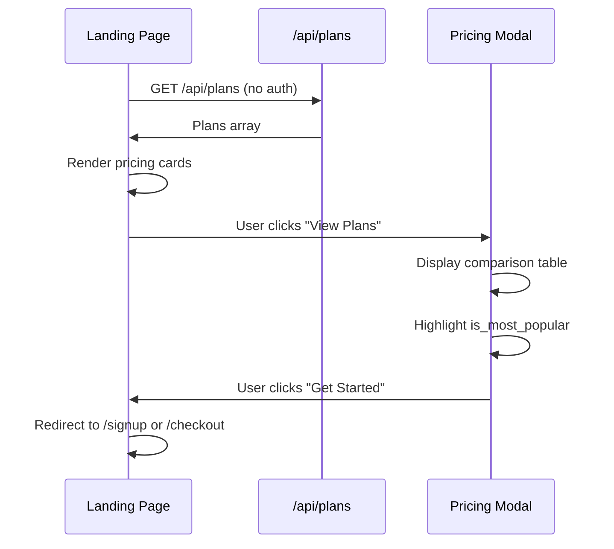

# Dokumentasi Fitur: Landing Page Pricing Plans API

> **Fokus Domain:** BACKEND  
> **Konteks:** Trace Upstream ke Downstream secara Semantik  
> **Scope:** Public endpoint untuk Pricing Modal di Landing Page

---

## Alur Data Semantik (Scope: BACKEND)

```
=== GET PUBLIC PLANS (Landing Page) ===
[HTTP GET /api/plans]  (NO AUTH REQUIRED)
    -> [Controller: GetAllPlans]  
    -> [Service: GetAllActivePlansWithFeatures]  
        -> [Repository: FindAllPlans]  
            -> [GORM: Preload Features]  
        -> [Filter: IsActive = true]  
        -> [Map: Entity -> DTO]  
            -> [Include: Limits (notebooks, notes, AI)]  
            -> [Include: Features list]  
    -> [HTTP Response dengan Active Plans]
```

---

## A. Laporan Implementasi Fitur Landing Page Pricing

### Deskripsi Fungsional

Endpoint **public** ini menyediakan data subscription plans untuk **Pricing Modal** di Landing Page. Tidak memerlukan authentication sehingga dapat diakses oleh visitor yang belum login.

**Key Features:**
1. **Public Access**: Tidak perlu JWT token
2. **Active Only**: Hanya return plans yang `IsActive = true`
3. **With Features**: Include daftar features per plan
4. **With Limits**: Include storage limits (notebooks, notes) dan daily limits (AI, search)
5. **Sorted by Price**: Plans diurutkan untuk pricing comparison

**Frontend Usage:**
- Landing Page Pricing Section
- Pricing Modal (popup)
- Upgrade Plan comparison

### Visualisasi

**Request:**
```
GET /api/plans
(No Authorization header required)
```

**Response:**
```json
{
    "success": true,
    "code": 200,
    "message": "Plans retrieved",
    "data": [
        {
            "id": "550e8400-e29b-41d4-a716-446655440000",
            "name": "Free Plan",
            "slug": "free",
            "tagline": "For personal use",
            "price": 0,
            "billing_period": "monthly",
            "is_most_popular": false,
            "limits": {
                "max_notebooks": 3,
                "max_notes_per_notebook": 10,
                "ai_chat_daily": 0,
                "semantic_search_daily": 0
            },
            "features": [
                {"key": "basic_notes", "text": "Basic note taking", "is_enabled": true},
                {"key": "markdown", "text": "Markdown support", "is_enabled": true}
            ]
        },
        {
            "id": "660e8400-e29b-41d4-a716-446655440001",
            "name": "Pro Plan",
            "slug": "pro",
            "tagline": "For power users",
            "price": 9.99,
            "billing_period": "monthly",
            "is_most_popular": true,
            "limits": {
                "max_notebooks": -1,
                "max_notes_per_notebook": -1,
                "ai_chat_daily": 100,
                "semantic_search_daily": 50
            },
            "features": [
                {"key": "basic_notes", "text": "Basic note taking", "is_enabled": true},
                {"key": "markdown", "text": "Markdown support", "is_enabled": true},
                {"key": "ai_chat", "text": "AI-powered chat", "is_enabled": true},
                {"key": "semantic_search", "text": "Semantic search", "is_enabled": true},
                {"key": "unlimited_storage", "text": "Unlimited notebooks & notes", "is_enabled": true}
            ]
        },
        {
            "id": "770e8400-e29b-41d4-a716-446655440002",
            "name": "Business Plan",
            "slug": "business",
            "tagline": "For teams",
            "price": 29.99,
            "billing_period": "monthly",
            "is_most_popular": false,
            "limits": {
                "max_notebooks": -1,
                "max_notes_per_notebook": -1,
                "ai_chat_daily": -1,
                "semantic_search_daily": -1
            },
            "features": [
                {"key": "basic_notes", "text": "Basic note taking", "is_enabled": true},
                {"key": "markdown", "text": "Markdown support", "is_enabled": true},
                {"key": "ai_chat", "text": "Unlimited AI chat", "is_enabled": true},
                {"key": "semantic_search", "text": "Unlimited semantic search", "is_enabled": true},
                {"key": "unlimited_storage", "text": "Unlimited storage", "is_enabled": true},
                {"key": "priority_support", "text": "Priority support", "is_enabled": true}
            ]
        }
    ]
}
```
*Caption: Gambar 1: Response untuk Pricing Plans dengan limits dan features.*

---

## B. Bedah Arsitektur & Komponen

Berikut adalah rincian 10 komponen yang menyusun fitur ini di sisi BACKEND.

---

### [internal/server/server.go](file:///d:/notetaker/notefiber-BE/internal/server/server.go)
**Layer Terdeteksi:** `HTTP Server & Route Registration`

**Narasi Operasional:**
Server mendaftarkan [PlanController](file:///d:/notetaker/notefiber-BE/internal/controller/plan_controller.go#13-16) tanpa middleware untuk endpoint public.

```go
func registerRoutes(app *fiber.App, c *bootstrap.Container) {
	api := app.Group("/api")
	
	// PlanController registers both public and authenticated routes
	c.PlanController.RegisterRoutes(api, serverutils.JwtMiddleware)
}
```
*Caption: Snippet 1: Registrasi PlanController.*

---

### [internal/bootstrap/container.go](file:///d:/notetaker/notefiber-BE/internal/bootstrap/container.go)
**Layer Terdeteksi:** `Dependency Injection Container`

**Narasi Operasional:**
[PlanService](file:///d:/notetaker/notefiber-BE/internal/service/plan_service.go#17-26) diinisialisasi dengan `uowFactory` untuk akses ke [SubscriptionRepository](file:///d:/notetaker/notefiber-BE/internal/repository/unitofwork/unit_of_work.go#23-24).

```go
func NewContainer(db *gorm.DB, cfg *config.Config) *Container {
	uowFactory := unitofwork.NewRepositoryFactory(db)

	planService := service.NewPlanService(uowFactory)

	return &Container{
		PlanController: controller.NewPlanController(planService),
	}
}
```
*Caption: Snippet 2: Konstruksi PlanService.*

---

### [internal/dto/usage_dto.go](file:///d:/notetaker/notefiber-BE/internal/dto/usage_dto.go)
**Layer Terdeteksi:** `Data Transfer Object (DTO)`

**Narasi Operasional:**
File ini mendefinisikan response structure untuk pricing plans dengan nested objects untuk limits dan features.

```go
// PlanWithFeaturesResponse is returned by GET /api/plans (public)
type PlanWithFeaturesResponse struct {
	Id            uuid.UUID     `json:"id"`
	Name          string        `json:"name"`
	Slug          string        `json:"slug"`
	Tagline       string        `json:"tagline"`
	Price         float64       `json:"price"`
	BillingPeriod string        `json:"billing_period"`
	IsMostPopular bool          `json:"is_most_popular"`
	Limits        PlanLimitsDTO `json:"limits"`
	Features      []FeatureDTO  `json:"features"`
}

type PlanLimitsDTO struct {
	MaxNotebooks        int `json:"max_notebooks"`         // -1 = unlimited
	MaxNotesPerNotebook int `json:"max_notes_per_notebook"` // -1 = unlimited
	AiChatDaily         int `json:"ai_chat_daily"`          // 0 = disabled, -1 = unlimited
	SemanticSearchDaily int `json:"semantic_search_daily"`  // 0 = disabled, -1 = unlimited
}

type FeatureDTO struct {
	Key       string `json:"key"`        // Unique identifier
	Text      string `json:"text"`       // Display text
	IsEnabled bool   `json:"is_enabled"` // Always true for listed features
}
```
*Caption: Snippet 3: DTO untuk Pricing Plans response.*

---

### [internal/controller/plan_controller.go](file:///d:/notetaker/notefiber-BE/internal/controller/plan_controller.go)
**Layer Terdeteksi:** `Interface / Controller Layer`

**Narasi Operasional:**
Controller menangani **public endpoint** tanpa JWT middleware. Route `/plans` dapat diakses tanpa authentication.

```go
type PlanController interface {
	RegisterRoutes(api fiber.Router, jwtMiddleware fiber.Handler)
}

type planController struct {
	planService service.PlanService
}

func NewPlanController(planService service.PlanService) PlanController {
	return &planController{planService: planService}
}

func (c *planController) RegisterRoutes(api fiber.Router, jwtMiddleware fiber.Handler) {
	// PUBLIC endpoint - NO middleware
	api.Get("/plans", c.GetAllPlans)

	// Authenticated endpoints - WITH middleware
	user := api.Group("/user", jwtMiddleware)
	user.Get("/usage-status", c.GetUsageStatus)
}

// GetAllPlans returns all active plans with features for pricing modal
// @Summary Get all subscription plans
// @Description Returns all active plans with their features for the pricing modal
// @Tags Plans
// @Produce json
// @Success 200 {object} []dto.PlanWithFeaturesResponse
// @Router /api/plans [get]
func (c *planController) GetAllPlans(ctx *fiber.Ctx) error {
	plans, err := c.planService.GetAllActivePlansWithFeatures(ctx.Context())
	if err != nil {
		return ctx.Status(fiber.StatusInternalServerError).JSON(serverutils.ErrorResponse(500, err.Error()))
	}

	return ctx.JSON(serverutils.SuccessResponse("Plans retrieved", plans))
}
```
*Caption: Snippet 4: Controller dengan public endpoint.*

---

### [internal/service/plan_service.go](file:///d:/notetaker/notefiber-BE/internal/service/plan_service.go)
**Layer Terdeteksi:** `Business Logic / Service Layer`

**Narasi Operasional:**
[GetAllActivePlansWithFeatures](file:///d:/notetaker/notefiber-BE/internal/service/plan_service.go#37-83) method:
1. Fetch semua plans dari repository (dengan preloaded features)
2. Filter hanya yang `IsActive = true`
3. Map entity ke DTO dengan limits dan features

```go
type PlanService interface {
	// Public
	GetAllActivePlansWithFeatures(ctx context.Context) ([]*dto.PlanWithFeaturesResponse, error)
	
	// User (authenticated)
	GetUserUsageStatus(ctx context.Context, userId uuid.UUID) (*dto.UsageStatusResponse, error)
	CheckCanCreateNotebook(ctx context.Context, userId uuid.UUID) error
	CheckCanCreateNote(ctx context.Context, userId uuid.UUID, notebookId uuid.UUID) error
}

// GetAllActivePlansWithFeatures returns all active plans with their features for pricing modal
func (s *planService) GetAllActivePlansWithFeatures(ctx context.Context) ([]*dto.PlanWithFeaturesResponse, error) {
	uow := s.uowFactory.NewUnitOfWork(ctx)

	// Get all plans (features preloaded by repository)
	plans, err := uow.SubscriptionRepository().FindAllPlans(ctx)
	if err != nil {
		return nil, err
	}

	var result []*dto.PlanWithFeaturesResponse
	for _, plan := range plans {
		// Filter: only active plans
		if !plan.IsActive {
			continue
		}

		// Map features to DTOs
		featureDTOs := make([]dto.FeatureDTO, 0, len(plan.Features))
		for _, f := range plan.Features {
			featureDTOs = append(featureDTOs, dto.FeatureDTO{
				Key:       f.Key,
				Text:      f.Name,     // Name becomes display text
				IsEnabled: true,       // Existence implies enabled
			})
		}

		// Build response with limits
		result = append(result, &dto.PlanWithFeaturesResponse{
			Id:            plan.Id,
			Name:          plan.Name,
			Slug:          plan.Slug,
			Tagline:       plan.Tagline,
			Price:         plan.Price,
			BillingPeriod: string(plan.BillingPeriod),
			IsMostPopular: plan.IsMostPopular,
			Limits: dto.PlanLimitsDTO{
				MaxNotebooks:        plan.MaxNotebooks,
				MaxNotesPerNotebook: plan.MaxNotesPerNotebook,
				AiChatDaily:         plan.AiChatDailyLimit,
				SemanticSearchDaily: plan.SemanticSearchDailyLimit,
			},
			Features: featureDTOs,
		})
	}

	return result, nil
}
```
*Caption: Snippet 5: Service dengan filter dan mapping.*

---

### [internal/repository/contract/subscription_repository.go](file:///d:/notetaker/notefiber-BE/internal/repository/contract/subscription_repository.go)
**Layer Terdeteksi:** `Repository Interface / Contract`

**Narasi Operasional:**
Kontrak ini mendefinisikan [FindAllPlans](file:///d:/notetaker/notefiber-BE/internal/repository/contract/subscription_repository.go#18-19) yang harus preload Features.

```go
type SubscriptionRepository interface {
	// Plan operations
	CreatePlan(ctx context.Context, plan *entity.SubscriptionPlan) error
	FindOnePlan(ctx context.Context, specs ...specification.Specification) (*entity.SubscriptionPlan, error)
	FindAllPlans(ctx context.Context, specs ...specification.Specification) ([]*entity.SubscriptionPlan, error)
	UpdatePlan(ctx context.Context, plan *entity.SubscriptionPlan) error
	DeletePlan(ctx context.Context, id uuid.UUID) error
	// ...
}
```
*Caption: Snippet 6: SubscriptionRepository contract.*

---

### [internal/repository/implementation/subscription_repository_impl.go](file:///d:/notetaker/notefiber-BE/internal/repository/implementation/subscription_repository_impl.go)
**Layer Terdeteksi:** `Repository Implementation`

**Narasi Operasional:**
[FindAllPlans](file:///d:/notetaker/notefiber-BE/internal/repository/contract/subscription_repository.go#18-19) menggunakan GORM `Preload("Features")` untuk eager loading features dari many-to-many relation.

```go
func (r *SubscriptionRepositoryImpl) FindAllPlans(ctx context.Context, specs ...specification.Specification) ([]*entity.SubscriptionPlan, error) {
	var models []*model.SubscriptionPlan
	query := r.applySpecifications(r.db.WithContext(ctx), specs...)
	
	// Preload features via many-to-many relation
	if err := query.
		Preload("Features").
		Order("sort_order ASC, price ASC").
		Find(&models).Error; err != nil {
		return nil, err
	}

	entities := make([]*entity.SubscriptionPlan, len(models))
	for i, m := range models {
		entities[i] = r.mapper.PlanToEntity(m)
	}
	return entities, nil
}
```
*Caption: Snippet 7: Repository dengan Preload Features.*

---

### [internal/entity/subscription_entity.go](file:///d:/notetaker/notefiber-BE/internal/entity/subscription_entity.go)
**Layer Terdeteksi:** `Domain Entity`

**Narasi Operasional:**
Entity [SubscriptionPlan](file:///d:/notetaker/notefiber-BE/internal/entity/subscription_entity.go#27-53) menyimpan limits dan memiliki relasi many-to-many ke [Feature](file:///d:/notetaker/notefiber-BE/internal/entity/feature_entity.go#12-23).

```go
type SubscriptionPlan struct {
	Id            uuid.UUID
	Name          string
	Slug          string
	Tagline       string
	Price         float64
	BillingPeriod BillingPeriod
	TaxRate       float64
	
	// Limits
	MaxNotebooks             int
	MaxNotesPerNotebook      int
	AiChatDailyLimit         int
	SemanticSearchDailyLimit int
	
	// Feature flags
	AiChatEnabled         bool
	SemanticSearchEnabled bool
	
	// Display
	IsMostPopular bool
	IsActive      bool
	SortOrder     int
	
	// Relations
	Features []Feature // Many-to-many via subscription_plan_features
}
```
*Caption: Snippet 8: Entity dengan limits dan features.*

---

## C. Ringkasan Layer Arsitektur

| No | Layer | File | Tanggung Jawab |
|----|-------|------|----------------|
| 1 | HTTP Server | [server/server.go](file:///d:/notetaker/notefiber-BE/internal/server/server.go) | Route registration |
| 2 | DI Container | [bootstrap/container.go](file:///d:/notetaker/notefiber-BE/internal/bootstrap/container.go) | Dependency wiring |
| 3 | DTO | [dto/usage_dto.go](file:///d:/notetaker/notefiber-BE/internal/dto/usage_dto.go) | PlanWithFeaturesResponse |
| 4 | **Controller** | [controller/plan_controller.go](file:///d:/notetaker/notefiber-BE/internal/controller/plan_controller.go) | **Public endpoint handler** |
| 5 | **Service** | [service/plan_service.go](file:///d:/notetaker/notefiber-BE/internal/service/plan_service.go) | **GetAllActivePlansWithFeatures** |
| 6 | Factory | [unitofwork/repository_factory.go](file:///d:/notetaker/notefiber-BE/internal/repository/unitofwork/repository_factory.go) | UoW factory |
| 7 | UoW | [unitofwork/unit_of_work.go](file:///d:/notetaker/notefiber-BE/internal/repository/unitofwork/unit_of_work.go) | Repository access |
| 8 | Contract | [contract/subscription_repository.go](file:///d:/notetaker/notefiber-BE/internal/repository/contract/subscription_repository.go) | FindAllPlans |
| 9 | Implementation | [implementation/subscription_repository_impl.go](file:///d:/notetaker/notefiber-BE/internal/repository/implementation/subscription_repository_impl.go) | Preload Features |
| 10 | Entity | [entity/subscription_entity.go](file:///d:/notetaker/notefiber-BE/internal/entity/subscription_entity.go) | SubscriptionPlan + Features |

---

## D. Endpoint API Reference

| Method | Endpoint | Deskripsi | Auth |
|--------|----------|-----------|------|
| `GET` | `/api/plans` | Get all active plans | **Public** (No Auth) |

### Response Fields

| Field | Type | Deskripsi |
|-------|------|-----------|
| [id](file:///d:/notetaker/notefiber-BE/internal/model/user_model.go#44-52) | UUID | Plan identifier |
| `name` | string | Display name (e.g., "Pro Plan") |
| `slug` | string | URL-friendly name (e.g., "pro") |
| `tagline` | string | Short description |
| `price` | float | Price in currency |
| `billing_period` | string | "monthly" or "yearly" |
| `is_most_popular` | bool | Highlight badge |
| `limits` | object | Storage and daily limits |
| `features` | array | List of features |

### Limits Object

| Field | Type | Special Values |
|-------|------|----------------|
| `max_notebooks` | int | -1 = unlimited |
| `max_notes_per_notebook` | int | -1 = unlimited |
| `ai_chat_daily` | int | 0 = disabled, -1 = unlimited |
| `semantic_search_daily` | int | 0 = disabled, -1 = unlimited |

---

## E. Frontend Integration Flow


*Caption: Diagram 1: Frontend integration flow.*

---

## F. Frontend Usage Example

### React/TypeScript

```typescript
// types/plan.ts
interface Plan {
  id: string;
  name: string;
  slug: string;
  tagline: string;
  price: number;
  billing_period: string;
  is_most_popular: boolean;
  limits: {
    max_notebooks: number;
    max_notes_per_notebook: number;
    ai_chat_daily: number;
    semantic_search_daily: number;
  };
  features: {
    key: string;
    text: string;
    is_enabled: boolean;
  }[];
}

// api/plans.ts
export async function getPlans(): Promise<Plan[]> {
  const res = await fetch('/api/plans');
  const data = await res.json();
  return data.data;
}

// components/PricingSection.tsx
function PricingSection() {
  const [plans, setPlans] = useState<Plan[]>([]);

  useEffect(() => {
    getPlans().then(setPlans);
  }, []);

  return (
    <div className="pricing-grid">
      {plans.map(plan => (
        <PricingCard 
          key={plan.id}
          plan={plan}
          highlighted={plan.is_most_popular}
        />
      ))}
    </div>
  );
}
```
*Caption: Snippet 9: Frontend integration example.*

---

## G. Limit Display Logic

```typescript
// Format limit untuk display
function formatLimit(value: number): string {
  if (value === -1) return "Unlimited";
  if (value === 0) return "Not available";
  return value.toString();
}

// Usage
<span>{formatLimit(plan.limits.max_notebooks)} notebooks</span>
<span>{formatLimit(plan.limits.ai_chat_daily)} AI chats/day</span>
```

---

## H. Caching Recommendations

| Strategy | Implementation | TTL |
|----------|----------------|-----|
| CDN Cache | Cache-Control header | 5 minutes |
| API Cache | Redis/Memory | 1 minute |
| Frontend | React Query / SWR | staleTime: 60s |

> [!TIP]
> Plans jarang berubah, aman untuk di-cache aggressively.

---

## I. Error Responses

| Status | Error | Condition |
|--------|-------|-----------|
| 200 | Success | Plans retrieved |
| 500 | Internal error | Database error |

> [!NOTE]
> Endpoint ini tidak memiliki 401/403 karena public.

---

*Dokumen ini di-generate dalam mode READ-ONLY tanpa modifikasi terhadap kode sumber.*
