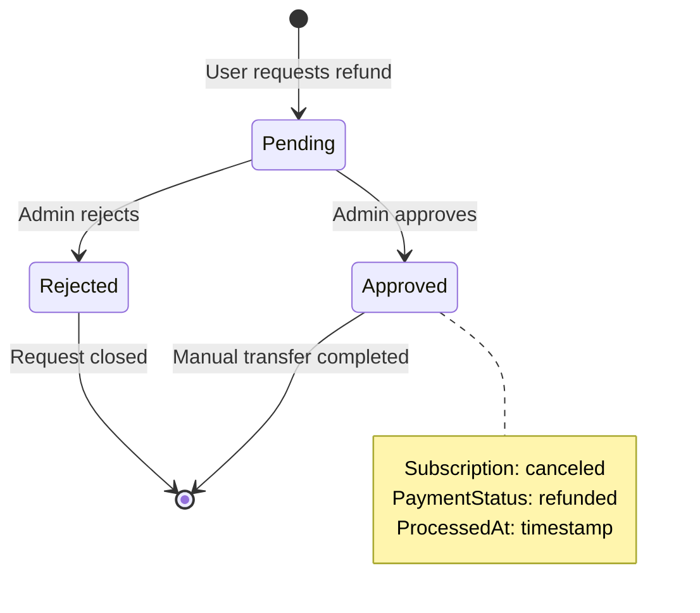

# Dokumentasi Fitur: Refund Management

> **Fokus Domain:** BACKEND  
> **Konteks:** Trace Upstream ke Downstream secara Semantik  
> **Scope:** User refund request + Admin approval workflow

---

## Alur Data Semantik (Scope: BACKEND)

```
=== USER REQUEST REFUND ===
[HTTP POST /api/user/refund]  
    -> [JWT Middleware: Extract User ID]  
    -> [Controller: Parse Request]  
    -> [UserService: RequestRefund]  
        -> [Validate: Subscription ownership]  
        -> [Validate: Status=active, PaymentStatus=paid]  
        -> [Check: No existing refund request]  
        -> [Get: Plan price for refund amount]  
        -> [Create: Refund record (status=pending)]  
    -> [HTTP Response: Pending confirmation]

=== ADMIN GET REFUNDS LIST ===
[HTTP GET /api/admin/refunds]  
    -> [Admin Middleware: Validate JWT + Admin Role]  
    -> [Controller: Parse Query Params]  
    -> [AdminService: GetRefunds]  
        -> [Repository: FindAllWithDetails]  
            -> [Preload: User + Subscription + Plan]  
        -> [Map: Entity -> DTO]  
    -> [HTTP Response: Paginated refund list]

=== ADMIN APPROVE REFUND ===
[HTTP POST /api/admin/refunds/:id/approve]  
    -> [Admin Middleware: Validate JWT + Admin Role]  
    -> [Controller: Parse Refund ID]  
    -> [AdminService: ApproveRefund]  
        -> [Transaction Begin]  
        -> [Update: Refund status → approved]  
        -> [Update: Subscription status → canceled]  
        -> [Update: PaymentStatus → refunded]  
        -> [Logger: Audit trail]  
        -> [Transaction Commit]  
    -> [HTTP Response: Approved confirmation]

=== ADMIN DIRECT REFUND ===
[HTTP POST /api/admin/subscriptions/refund]  
    -> [Admin Middleware: Validate JWT + Admin Role]  
    -> [Controller: Parse Request]  
    -> [AdminService: RefundSubscription]  
        -> [Transaction Begin]  
        -> [Update: Subscription → canceled + refunded]  
        -> [Create: Refund record (status=processed)]  
        -> [Logger: Audit trail]  
        -> [Transaction Commit]  
    -> [HTTP Response: Processed confirmation]
```

---

## A. Laporan Implementasi Fitur Refund Management

### Deskripsi Fungsional

Fitur ini menyediakan sistem refund dua-sisi: **User Request** dan **Admin Approval**. Karena Midtrans tidak mendukung automated refund API, admin harus melakukan transfer manual setelah approval.

**User Side:**
1. **RequestRefund**: User mengajukan refund untuk subscription aktif
2. **GetMyRefunds**: User melihat status refund requests mereka

**Admin Side:**
3. **GetRefunds**: Admin melihat daftar refund requests dengan details
4. **ApproveRefund**: Admin menyetujui refund request
5. **RefundSubscription**: Admin langsung me-refund subscription (bypass request flow)

**Workflow:**
1. User submit refund request → Status: `pending`
2. Admin review → Approve/Reject
3. If approved: Status: `approved`, Subscription: `canceled`, PaymentStatus: `refunded`
4. Admin melakukan transfer manual ke user

### Visualisasi

**User Refund Request:**
```json
{
    "subscription_id": "550e8400-e29b-41d4-a716-446655440000",
    "reason": "I no longer need the service and would like a refund."
}
```

**User Refund Response:**
```json
{
    "success": true,
    "code": 200,
    "message": "Success",
    "data": {
        "refund_id": "660e8400-e29b-41d4-a716-446655440001",
        "status": "pending",
        "message": "Your refund request has been submitted and is awaiting admin review."
    }
}
```

**Admin Refunds List Response:**
```json
{
    "success": true,
    "code": 200,
    "message": "Refund requests",
    "data": [
        {
            "id": "660e8400-e29b-41d4-a716-446655440001",
            "user": {
                "id": "770e8400-e29b-41d4-a716-446655440002",
                "email": "john.doe@example.com",
                "full_name": "John Doe"
            },
            "subscription": {
                "id": "550e8400-e29b-41d4-a716-446655440000",
                "plan_name": "Pro Plan",
                "amount_paid": 9.99,
                "payment_date": "2024-12-20T10:00:00Z"
            },
            "amount": 9.99,
            "reason": "I no longer need the service and would like a refund.",
            "status": "pending",
            "created_at": "2024-12-24T15:30:00Z"
        }
    ]
}
```
*Caption: Gambar 1: Request/Response untuk Refund workflow.*

---

## B. Bedah Arsitektur & Komponen

Berikut adalah rincian 16 komponen yang menyusun fitur ini di sisi BACKEND.

---

### [internal/server/server.go](file:///d:/notetaker/notefiber-BE/internal/server/server.go)
**Layer Terdeteksi:** `HTTP Server & Route Registration`

**Narasi Operasional:**
Server mendaftarkan [UserController](file:///d:/notetaker/notefiber-BE/internal/controller/user_controller.go#13-21) untuk user-side refund dan [AdminController](file:///d:/notetaker/notefiber-BE/internal/controller/admin_controller.go#17-56) untuk admin-side management.

```go
func registerRoutes(app *fiber.App, c *bootstrap.Container) {
	api := app.Group("/api")
	c.UserController.RegisterRoutes(api)
	c.AdminController.RegisterRoutes(api)
}
```
*Caption: Snippet 1: Registrasi User dan Admin Controllers.*

---

### [internal/bootstrap/container.go](file:///d:/notetaker/notefiber-BE/internal/bootstrap/container.go)
**Layer Terdeteksi:** `Dependency Injection Container`

**Narasi Operasional:**
[UserService](file:///d:/notetaker/notefiber-BE/internal/service/user_service.go#21-28) dan [AdminService](file:///d:/notetaker/notefiber-BE/internal/service/admin_service.go#25-72) masing-masing di-inject dengan `uowFactory` yang menyediakan akses ke [RefundRepository](file:///d:/notetaker/notefiber-BE/internal/repository/unitofwork/unit_of_work_impl.go#99-102).

```go
func NewContainer(db *gorm.DB, cfg *config.Config) *Container {
	uowFactory := unitofwork.NewRepositoryFactory(db)
	logger := logger.NewZapLogger(logFilePath, isProd)

	userService := service.NewUserService(uowFactory)
	adminService := service.NewAdminService(uowFactory, logger)

	return &Container{
		UserController:  controller.NewUserController(userService),
		AdminController: controller.NewAdminController(adminService, authService),
	}
}
```
*Caption: Snippet 2: Konstruksi services dengan UoW.*

---

### [internal/dto/refund_dto.go](file:///d:/notetaker/notefiber-BE/internal/dto/refund_dto.go)
**Layer Terdeteksi:** `Data Transfer Object (DTO)`

**Narasi Operasional:**
File ini mendefinisikan DTOs untuk user-side dan admin-side refund operations dengan nested user dan subscription info untuk admin view.

```go
// --- User-Side ---
type UserRefundRequest struct {
	SubscriptionId uuid.UUID `json:"subscription_id" validate:"required"`
	Reason         string    `json:"reason" validate:"required,min=10"`
}

type UserRefundResponse struct {
	RefundId string `json:"refund_id"`
	Status   string `json:"status"`
	Message  string `json:"message"`
}

type UserRefundListResponse struct {
	Id             uuid.UUID `json:"id"`
	SubscriptionId uuid.UUID `json:"subscription_id"`
	PlanName       string    `json:"plan_name"`
	Amount         float64   `json:"amount"`
	Reason         string    `json:"reason"`
	Status         string    `json:"status"`
	CreatedAt      time.Time `json:"created_at"`
}

// --- Admin-Side ---
type AdminRefundListResponse struct {
	Id           uuid.UUID                   `json:"id"`
	User         AdminRefundUserInfo         `json:"user"`
	Subscription AdminRefundSubscriptionInfo `json:"subscription"`
	Amount       float64                     `json:"amount"`
	Reason       string                      `json:"reason"`
	Status       string                      `json:"status"`
	AdminNotes   string                      `json:"admin_notes,omitempty"`
	CreatedAt    time.Time                   `json:"created_at"`
	ProcessedAt  *time.Time                  `json:"processed_at,omitempty"`
}

type AdminRefundUserInfo struct {
	Id       uuid.UUID `json:"id"`
	Email    string    `json:"email"`
	FullName string    `json:"full_name"`
}

type AdminRefundSubscriptionInfo struct {
	Id          uuid.UUID `json:"id"`
	PlanName    string    `json:"plan_name"`
	AmountPaid  float64   `json:"amount_paid"`
	PaymentDate time.Time `json:"payment_date"`
}

type AdminApproveRefundRequest struct {
	AdminNotes string `json:"admin_notes,omitempty"`
}

type AdminApproveRefundResponse struct {
	RefundId       string    `json:"refund_id"`
	Status         string    `json:"status"`
	RefundedAmount float64   `json:"refunded_amount"`
	ProcessedAt    time.Time `json:"processed_at"`
}
```
*Caption: Snippet 3: DTO untuk User dan Admin refund operations.*

---

### [internal/controller/user_controller.go](file:///d:/notetaker/notefiber-BE/internal/controller/user_controller.go)
**Layer Terdeteksi:** `Interface / Controller Layer - User`

**Narasi Operasional:**
Controller menangani user refund request dengan JWT middleware protection.

```go
func (c *userController) RegisterRoutes(r fiber.Router) {
	h := r.Group("/user")
	h.Use(serverutils.JwtMiddleware)
	
	h.Post("/refund", c.RequestRefund)
	h.Get("/refunds", c.GetMyRefunds)
}

func (c *userController) RequestRefund(ctx *fiber.Ctx) error {
	userIdStr := ctx.Locals("user_id").(string)
	userId, _ := uuid.Parse(userIdStr)

	var req dto.UserRefundRequest
	if err := ctx.BodyParser(&req); err != nil {
		return ctx.Status(fiber.StatusBadRequest).JSON(serverutils.ErrorResponse(400, "Invalid request body"))
	}

	res, err := c.userService.RequestRefund(ctx.Context(), userId, req)
	if err != nil {
		return ctx.Status(fiber.StatusBadRequest).JSON(serverutils.ErrorResponse(400, err.Error()))
	}

	return ctx.JSON(serverutils.SuccessResponse("Refund request submitted", res))
}
```
*Caption: Snippet 4: User controller request refund handler.*

---

### [internal/controller/admin_controller.go](file:///d:/notetaker/notefiber-BE/internal/controller/admin_controller.go)
**Layer Terdeteksi:** `Interface / Controller Layer - Admin`

**Narasi Operasional:**
Controller menangani admin refund management dengan admin middleware protection.

```go
func (c *adminController) RegisterRoutes(r fiber.Router) {
	h := r.Group("/admin")
	h.Use(c.adminMiddleware)

	// Refund Management
	h.Get("/refunds", c.GetRefunds)
	h.Post("/refunds/:id/approve", c.ApproveRefund)
	h.Post("/subscriptions/refund", c.RefundSubscription)
}

func (c *adminController) GetRefunds(ctx *fiber.Ctx) error {
	page, _ := strconv.Atoi(ctx.Query("page", "1"))
	limit, _ := strconv.Atoi(ctx.Query("limit", "10"))
	status := ctx.Query("status", "")

	res, err := c.service.GetRefunds(ctx.Context(), page, limit, status)
	if err != nil {
		return ctx.Status(fiber.StatusInternalServerError).JSON(serverutils.ErrorResponse(500, err.Error()))
	}
	return ctx.JSON(serverutils.SuccessResponse("Refund requests", res))
}

func (c *adminController) ApproveRefund(ctx *fiber.Ctx) error {
	refundId, _ := uuid.Parse(ctx.Params("id"))

	var req dto.AdminApproveRefundRequest
	_ = ctx.BodyParser(&req)

	resp, err := c.service.ApproveRefund(ctx.Context(), refundId, req)
	if err != nil {
		if err.Error() == "refund request not found" {
			return ctx.Status(fiber.StatusNotFound).JSON(serverutils.ErrorResponse(404, err.Error()))
		}
		if err.Error() == "refund already processed" {
			return ctx.Status(fiber.StatusBadRequest).JSON(serverutils.ErrorResponse(400, err.Error()))
		}
		return ctx.Status(fiber.StatusInternalServerError).JSON(serverutils.ErrorResponse(500, err.Error()))
	}
	return ctx.JSON(serverutils.SuccessResponse("Refund approved", resp))
}
```
*Caption: Snippet 5: Admin controller refund handlers.*

---

### [internal/service/user_service.go](file:///d:/notetaker/notefiber-BE/internal/service/user_service.go)
**Layer Terdeteksi:** `Business Logic / Service Layer - User`

**Narasi Operasional:**
[RequestRefund](file:///d:/notetaker/notefiber-BE/internal/controller/user_controller.go#101-135) method melakukan validasi comprehensif sebelum create refund record.

```go
func (s *userService) RequestRefund(ctx context.Context, userId uuid.UUID, req dto.UserRefundRequest) (*dto.UserRefundResponse, error) {
	uow := s.uowFactory.NewUnitOfWork(ctx)

	// 1. Validate subscription exists and belongs to user
	sub, err := uow.SubscriptionRepository().FindOneSubscription(ctx,
		specification.ByID{ID: req.SubscriptionId},
		specification.Filter("user_id", userId),
	)
	if sub == nil {
		return nil, fmt.Errorf("subscription not found")
	}

	// 2. Check subscription is active and paid
	if sub.Status != entity.SubscriptionStatusActive {
		return nil, fmt.Errorf("subscription is not active")
	}
	if sub.PaymentStatus != entity.PaymentStatusPaid {
		return nil, fmt.Errorf("subscription is not eligible for refund")
	}

	// 3. Check if refund already requested
	existingRefund, _ := uow.RefundRepository().FindOne(ctx, specification.Filter("subscription_id", req.SubscriptionId))
	if existingRefund != nil {
		return nil, fmt.Errorf("refund already requested for this subscription")
	}

	// 4. Get plan price for refund amount
	plan, _ := uow.SubscriptionRepository().FindOnePlan(ctx, specification.ByID{ID: sub.PlanId})
	refundAmount := 0.0
	if plan != nil {
		refundAmount = plan.Price
	}

	// 5. Create refund record with status pending
	refundId := uuid.New()
	refund := &entity.Refund{
		ID:             refundId,
		SubscriptionID: req.SubscriptionId,
		UserID:         userId,
		Amount:         refundAmount,
		Reason:         req.Reason,
		Status:         string(entity.RefundStatusPending),
		CreatedAt:      time.Now(),
	}

	if err := uow.RefundRepository().Create(ctx, refund); err != nil {
		return nil, err
	}

	return &dto.UserRefundResponse{
		RefundId: refundId.String(),
		Status:   string(entity.RefundStatusPending),
		Message:  "Your refund request has been submitted and is awaiting admin review.",
	}, nil
}
```
*Caption: Snippet 6: User service request refund dengan validations.*

---

### [internal/service/admin_service.go](file:///d:/notetaker/notefiber-BE/internal/service/admin_service.go)
**Layer Terdeteksi:** `Business Logic / Service Layer - Admin`

**Narasi Operasional:**
[ApproveRefund](file:///d:/notetaker/notefiber-BE/internal/controller/admin_controller.go#51-52) method updates refund status, cancels subscription, dan logs action untuk audit trail.

```go
func (s *adminService) ApproveRefund(ctx context.Context, refundId uuid.UUID, req dto.AdminApproveRefundRequest) (*dto.AdminApproveRefundResponse, error) {
	uow := s.uowFactory.NewUnitOfWork(ctx)

	// Find refund
	refund, _ := uow.RefundRepository().FindOne(ctx, specification.ByID{ID: refundId})
	if refund == nil {
		return nil, fmt.Errorf("refund request not found")
	}

	if refund.Status != string(entity.RefundStatusPending) {
		return nil, fmt.Errorf("refund already processed")
	}

	uow.Begin(ctx)
	defer uow.Rollback()

	// 1. Update refund status
	now := time.Now()
	refund.Status = string(entity.RefundStatusApproved)
	refund.AdminNotes = req.AdminNotes
	refund.ProcessedAt = &now
	uow.RefundRepository().Update(ctx, refund)

	// 2. Cancel subscription
	sub, _ := uow.SubscriptionRepository().FindOneSubscription(ctx, specification.ByID{ID: refund.SubscriptionID})
	if sub != nil {
		sub.Status = "canceled"
		sub.PaymentStatus = "refunded"
		sub.CurrentPeriodEnd = now
		uow.SubscriptionRepository().UpdateSubscription(ctx, sub)
	}

	// 3. Audit log
	s.logger.Info("ADMIN", "Approved Refund Request", map[string]interface{}{
		"refundId":       refundId.String(),
		"subscriptionId": refund.SubscriptionID.String(),
		"amount":         refund.Amount,
		"adminNotes":     req.AdminNotes,
	})

	uow.Commit()

	return &dto.AdminApproveRefundResponse{
		RefundId:       refundId.String(),
		Status:         string(entity.RefundStatusApproved),
		RefundedAmount: refund.Amount,
		ProcessedAt:    now,
	}, nil
}

func (s *adminService) RefundSubscription(ctx context.Context, req dto.AdminRefundRequest) (*dto.AdminRefundResponse, error) {
	uow := s.uowFactory.NewUnitOfWork(ctx)

	sub, _ := uow.SubscriptionRepository().FindOneSubscription(ctx, specification.ByID{ID: req.SubscriptionId})
	if sub == nil {
		return nil, fmt.Errorf("subscription not found")
	}

	uow.Begin(ctx)
	defer uow.Rollback()

	// Cancel subscription
	sub.Status = "canceled"
	sub.PaymentStatus = "refunded"
	sub.CurrentPeriodEnd = time.Now()
	uow.SubscriptionRepository().UpdateSubscription(ctx, sub)

	// Calculate refund amount
	refundAmt := 0.0
	if req.Amount != nil {
		refundAmt = *req.Amount
	} else {
		plan, _ := uow.SubscriptionRepository().FindOnePlan(ctx, specification.ByID{ID: sub.PlanId})
		if plan != nil {
			refundAmt = plan.Price
		}
	}

	// Create refund record
	refundId := uuid.New()
	refund := &entity.Refund{
		ID:             refundId,
		SubscriptionID: sub.Id,
		UserID:         sub.UserId,
		Amount:         refundAmt,
		Reason:         req.Reason,
		Status:         "processed",
		CreatedAt:      time.Now(),
	}
	uow.RefundRepository().Create(ctx, refund)

	s.logger.Info("ADMIN", "Refunded Subscription", map[string]interface{}{
		"subscriptionId": sub.Id.String(),
		"refundId":       refundId.String(),
		"amount":         refundAmt,
		"reason":         req.Reason,
	})

	uow.Commit()

	return &dto.AdminRefundResponse{
		RefundId:       refundId.String(),
		RefundedAmount: refundAmt,
		Status:         "processed",
	}, nil
}
```
*Caption: Snippet 7: Admin service approve dan direct refund.*

---

### [internal/entity/refund_entity.go](file:///d:/notetaker/notefiber-BE/internal/entity/refund_entity.go)
**Layer Terdeteksi:** `Domain Entity`

**Narasi Operasional:**
Entity [Refund](file:///d:/notetaker/notefiber-BE/internal/entity/refund_entity.go#19-34) menyimpan refund record dengan status enum dan relasi ke Subscription dan User.

```go
type RefundStatus string

const (
	RefundStatusPending  RefundStatus = "pending"
	RefundStatusApproved RefundStatus = "approved"
	RefundStatusRejected RefundStatus = "rejected"
)

type Refund struct {
	ID             uuid.UUID
	SubscriptionID uuid.UUID
	UserID         uuid.UUID
	Amount         float64
	Reason         string
	Status         string        // pending, approved, rejected
	AdminNotes     string
	ProcessedAt    *time.Time
	CreatedAt      time.Time
	UpdatedAt      time.Time
	DeletedAt      gorm.DeletedAt
	// Relations
	Subscription   UserSubscription `gorm:"foreignKey:SubscriptionID"`
	User           User             `gorm:"foreignKey:UserID"`
}
```
*Caption: Snippet 8: Refund entity dengan status enum.*

---

### [internal/repository/contract/refund_repository.go](file:///d:/notetaker/notefiber-BE/internal/repository/contract/refund_repository.go)
**Layer Terdeteksi:** `Repository Interface / Contract`

**Narasi Operasional:**
Kontrak ini mendefinisikan [FindAllWithDetails](file:///d:/notetaker/notefiber-BE/internal/repository/contract/refund_repository.go#16-17) untuk admin view dengan preloaded relations.

```go
type RefundRepository interface {
	Create(ctx context.Context, refund *entity.Refund) error
	FindOne(ctx context.Context, specs ...specification.Specification) (*entity.Refund, error)
	FindAll(ctx context.Context, specs ...specification.Specification) ([]*entity.Refund, error)
	FindAllWithDetails(ctx context.Context, specs ...specification.Specification) ([]*entity.Refund, error)
	Update(ctx context.Context, refund *entity.Refund) error
	Delete(ctx context.Context, id uuid.UUID) error
}
```
*Caption: Snippet 9: RefundRepository dengan FindAllWithDetails.*

---

## C. Ringkasan Layer Arsitektur

| No | Layer | File | Tanggung Jawab |
|----|-------|------|----------------|
| 1 | HTTP Server | [server/server.go](file:///d:/notetaker/notefiber-BE/internal/server/server.go) | Route registration |
| 2 | DI Container | [bootstrap/container.go](file:///d:/notetaker/notefiber-BE/internal/bootstrap/container.go) | Dependency wiring |
| 3 | Refund DTO | [dto/refund_dto.go](file:///d:/notetaker/notefiber-BE/internal/dto/refund_dto.go) | Request/Response contracts |
| 4 | Admin DTO | [dto/admin_dto.go](file:///d:/notetaker/notefiber-BE/internal/dto/admin_dto.go) | AdminRefundRequest |
| 5 | User Controller | [controller/user_controller.go](file:///d:/notetaker/notefiber-BE/internal/controller/user_controller.go) | User refund handlers |
| 6 | Admin Controller | [controller/admin_controller.go](file:///d:/notetaker/notefiber-BE/internal/controller/admin_controller.go) | Admin refund handlers |
| 7 | **User Service** | [service/user_service.go](file:///d:/notetaker/notefiber-BE/internal/service/user_service.go) | **RequestRefund** |
| 8 | **Admin Service** | [service/admin_service.go](file:///d:/notetaker/notefiber-BE/internal/service/admin_service.go) | **ApproveRefund, RefundSubscription** |
| 9 | Factory | [unitofwork/repository_factory.go](file:///d:/notetaker/notefiber-BE/internal/repository/unitofwork/repository_factory.go) | UoW factory |
| 10 | UoW | [unitofwork/unit_of_work.go](file:///d:/notetaker/notefiber-BE/internal/repository/unitofwork/unit_of_work.go) | Multi-repo access |
| 11 | Refund Contract | [contract/refund_repository.go](file:///d:/notetaker/notefiber-BE/internal/repository/contract/refund_repository.go) | Refund CRUD |
| 12 | Subscription Contract | [contract/subscription_repository.go](file:///d:/notetaker/notefiber-BE/internal/repository/contract/subscription_repository.go) | Subscription update |
| 13 | Refund Impl | [implementation/refund_repository_impl.go](file:///d:/notetaker/notefiber-BE/internal/repository/implementation/refund_repository_impl.go) | GORM + Preload |
| 14 | Entity | [entity/refund_entity.go](file:///d:/notetaker/notefiber-BE/internal/entity/refund_entity.go) | Domain object |
| 15 | Model | [model/refund_model.go](file:///d:/notetaker/notefiber-BE/internal/model/refund_model.go) | DB mapping |
| 16 | Logger | [pkg/logger/zap_logger.go](file:///d:/notetaker/notefiber-BE/internal/pkg/logger/zap_logger.go) | Audit trail |

---

## D. Endpoint API Reference

### User Endpoints

| Method | Endpoint | Deskripsi | Auth |
|--------|----------|-----------|------|
| `POST` | `/api/user/refund` | Request refund | JWT |
| `GET` | `/api/user/refunds` | List my refund requests | JWT |

### Admin Endpoints

| Method | Endpoint | Deskripsi | Auth |
|--------|----------|-----------|------|
| `GET` | `/api/admin/refunds` | List all refund requests | Admin JWT |
| `POST` | `/api/admin/refunds/:id/approve` | Approve refund request | Admin JWT |
| `POST` | `/api/admin/subscriptions/refund` | Direct refund (bypass request flow) | Admin JWT |

---

## E. Refund Status Lifecycle


*Caption: Diagram 1: Refund status lifecycle.*

---

## F. Validation Rules

### User Request Refund

| Validation | Error Message |
|------------|---------------|
| Subscription exists | "subscription not found" |
| Subscription belongs to user | "subscription not found" |
| Status == active | "subscription is not active" |
| PaymentStatus == paid | "subscription is not eligible for refund" |
| No existing refund request | "refund already requested for this subscription" |
| Reason min 10 chars | Validation error |

### Admin Approve Refund

| Validation | Error Message |
|------------|---------------|
| Refund exists | "refund request not found" |
| Status == pending | "refund already processed" |

---

## G. Manual Refund Process

> [!WARNING]
> Midtrans tidak mendukung automated refund API. Admin harus melakukan transfer manual setelah approval.

**Post-Approval Steps:**
1. Admin approves refund in system
2. System updates status and cancels subscription
3. Admin logs into bank/payment portal
4. Admin initiates manual transfer to user's account
5. Admin confirms transfer completed (optional status update)

---

## H. Audit Logging

| Action | Log Module | Log Content |
|--------|------------|-------------|
| Approve Refund | `ADMIN` | refundId, subscriptionId, amount, adminNotes |
| Direct Refund | `ADMIN` | subscriptionId, refundId, amount, reason |

```json
// Example log entry
{
    "level": "INFO",
    "module": "ADMIN",
    "message": "Approved Refund Request",
    "details": {
        "refundId": "660e8400-...",
        "subscriptionId": "550e8400-...",
        "amount": 9.99,
        "adminNotes": "Approved per customer request"
    },
    "timestamp": "2024-12-25T03:00:00Z"
}
```

---

## I. Error Responses

| Status | Error | Condition |
|--------|-------|-----------|
| 400 | `subscription not found` | Invalid subscription ID |
| 400 | `subscription is not active` | Already canceled |
| 400 | `subscription is not eligible for refund` | Not paid |
| 400 | `refund already requested` | Duplicate request |
| 400 | `refund already processed` | Not pending status |
| 404 | `refund request not found` | Invalid refund ID |

---

*Dokumen ini di-generate dalam mode READ-ONLY tanpa modifikasi terhadap kode sumber.*
