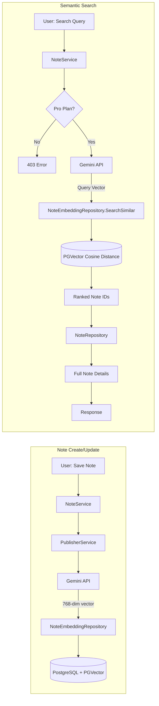

# Dokumentasi Fitur: Semantic Search (Vector-Based)

> **Fokus Domain:** BACKEND  
> **Konteks:** Trace Upstream ke Downstream secara Semantik  
> **Scope:** Vector similarity search menggunakan PGVector dan Gemini Embeddings

---

## Alur Data Semantik (Scope: BACKEND)

```
=== EMBEDDING GENERATION (On Note Create/Update) ===
[User: Create/Update Note]  
    -> [NoteService: Call PublisherService]  
    -> [PublisherService: GetGeminiEmbedding]  
        -> [Gemini API: Generate Vector (768 dimensions)]  
    -> [NoteEmbeddingRepository: Create/Update]  
        -> [PGVector: Store vector in PostgreSQL]

=== SEMANTIC SEARCH ===
[HTTP GET /api/notes/search?q=...]  
    -> [JWT Middleware: Extract User ID]  
    -> [Controller: Parse Query]  
    -> [Service: SemanticSearch]  
        -> [Guard: Check Pro Plan + SemanticSearchEnabled]  
        -> [Gemini API: Generate Query Embedding]  
        -> [NoteEmbeddingRepository: SearchSimilar]  
            -> [PGVector: Cosine Distance Query]  
            -> [JOIN: Filter by User ID]  
        -> [NoteRepository: Fetch Full Note Details]  
        -> [Preserve: Relevance Order]  
    -> [HTTP Response dengan Ranked Notes]
```

---

## A. Laporan Implementasi Fitur Semantic Search

### Deskripsi Fungsional

Fitur ini menyediakan **vector-based semantic search** untuk notes menggunakan **PGVector** extension PostgreSQL. Berbeda dengan text search biasa, semantic search memahami *meaning* dari query, bukan hanya kata-kata yang sama. Sistem mengimplementasikan:

1. **Embedding Generation**: Setiap note di-embed menggunakan Gemini API saat create/update
2. **Vector Storage**: Embeddings disimpan di PostgreSQL dengan PGVector
3. **Semantic Search**: Query di-embed, lalu cari notes terdekat via cosine similarity
4. **User Isolation**: Search hanya mengembalikan notes milik user yang ter-autentikasi
5. **Pro Plan Guard**: Fitur ini hanya tersedia untuk subscriber dengan plan yang enable Semantic Search

**Technology Stack:**
- **Gemini Embedding API**: text-embedding-004 model (768 dimensions)
- **PGVector**: PostgreSQL extension untuk vector operations
- **Cosine Similarity**: Distance metric untuk ranking

### Visualisasi

**Semantic Search Request:**
```
GET /api/notes/search?q=machine learning algorithms
Authorization: Bearer <jwt_token>
```

**Semantic Search Response:**
```json
{
    "success": true,
    "code": 200,
    "message": "Search results",
    "data": [
        {
            "id": "550e8400-e29b-41d4-a716-446655440000",
            "title": "Neural Networks Overview",
            "content": "Deep learning is a subset of machine learning...",
            "notebook_id": "660e8400-e29b-41d4-a716-446655440001",
            "created_at": "2024-12-20T10:00:00Z",
            "updated_at": "2024-12-24T15:30:00Z"
        },
        {
            "id": "770e8400-e29b-41d4-a716-446655440002",
            "title": "Supervised Learning",
            "content": "Classification and regression are types of...",
            "notebook_id": "660e8400-e29b-41d4-a716-446655440001",
            "created_at": "2024-12-18T09:00:00Z",
            "updated_at": null
        }
    ]
}
```
*Caption: Gambar 1: Semantic Search dengan relevance-ordered results.*

---

## B. Bedah Arsitektur & Komponen

Berikut adalah rincian 15 komponen yang menyusun fitur ini di sisi BACKEND.

---

### [internal/server/server.go](file:///d:/notetaker/notefiber-BE/internal/server/server.go)
**Layer Terdeteksi:** `HTTP Server & Route Registration`

**Narasi Operasional:**
Server mendaftarkan [NoteController](file:///d:/notetaker/notefiber-BE/internal/controller/note_controller.go#12-21) yang menangani search endpoint.

```go
func registerRoutes(app *fiber.App, c *bootstrap.Container) {
	api := app.Group("/api")
	c.NoteController.RegisterRoutes(api)
}
```
*Caption: Snippet 1: Registrasi NoteController.*

---

### [internal/bootstrap/container.go](file:///d:/notetaker/notefiber-BE/internal/bootstrap/container.go)
**Layer Terdeteksi:** `Dependency Injection Container`

**Narasi Operasional:**
[NoteService](file:///d:/notetaker/notefiber-BE/internal/service/note_service.go#20-28) diinisialisasi dengan `uowFactory` untuk akses ke multiple repositories termasuk [NoteEmbeddingRepository](file:///d:/notetaker/notefiber-BE/internal/repository/unitofwork/unit_of_work.go#17-18).

```go
func NewContainer(db *gorm.DB, cfg *config.Config) *Container {
	uowFactory := unitofwork.NewRepositoryFactory(db)
	
	publisherService := service.NewPublisherService(uowFactory) // For embedding generation
	noteService := service.NewNoteService(uowFactory, publisherService)

	return &Container{
		NoteController: controller.NewNoteController(noteService),
	}
}
```
*Caption: Snippet 2: Konstruksi NoteService dengan dependencies.*

---

### [internal/dto/note_dto.go](file:///d:/notetaker/notefiber-BE/internal/dto/note_dto.go)
**Layer Terdeteksi:** `Data Transfer Object (DTO)`

**Narasi Operasional:**
[SemanticSearchResponse](file:///d:/notetaker/notefiber-BE/internal/dto/note_dto.go#47-55) mendefinisikan struktur hasil search dengan note details.

```go
type SemanticSearchResponse struct {
	Id         uuid.UUID  `json:"id"`
	Title      string     `json:"title"`
	Content    string     `json:"content"`
	NotebookId uuid.UUID  `json:"notebook_id"`
	CreatedAt  time.Time  `json:"created_at"`
	UpdatedAt  *time.Time `json:"updated_at"`
}

type SearchNotesRequest struct {
	Query string `query:"q" validate:"required,min=1"`
}
```
*Caption: Snippet 3: DTO untuk Semantic Search.*

---

### [internal/controller/note_controller.go](file:///d:/notetaker/notefiber-BE/internal/controller/note_controller.go)
**Layer Terdeteksi:** `Interface / Controller Layer`

**Narasi Operasional:**
Controller menangani search endpoint dengan JWT middleware protection. Query diterima dari URL query params.

```go
func (c *noteController) RegisterRoutes(r fiber.Router) {
	h := r.Group("/notes")
	h.Use(serverutils.JwtMiddleware)
	
	h.Get("/search", c.SemanticSearch)
	// ... other note routes
}

func (c *noteController) SemanticSearch(ctx *fiber.Ctx) error {
	userIdStr := ctx.Locals("user_id").(string)
	userId, _ := uuid.Parse(userIdStr)

	search := ctx.Query("q", "")
	if search == "" {
		return ctx.Status(fiber.StatusBadRequest).JSON(serverutils.ErrorResponse(400, "Search query is required"))
	}

	results, err := c.noteService.SemanticSearch(ctx.Context(), userId, search)
	if err != nil {
		if err.Error() == "feature requires pro plan" {
			return ctx.Status(fiber.StatusForbidden).JSON(serverutils.ErrorResponse(403, err.Error()))
		}
		return ctx.Status(fiber.StatusInternalServerError).JSON(serverutils.ErrorResponse(500, err.Error()))
	}

	return ctx.JSON(serverutils.SuccessResponse("Search results", results))
}
```
*Caption: Snippet 4: Controller dengan search handler.*

---

### [internal/service/note_service.go](file:///d:/notetaker/notefiber-BE/internal/service/note_service.go)
**Layer Terdeteksi:** `Business Logic / Service Layer`

**Narasi Operasional:**
[SemanticSearch](file:///d:/notetaker/notefiber-BE/internal/service/note_service.go#26-27) method mengimplementasikan:
1. **Pro Plan Guard**: Check subscription + SemanticSearchEnabled
2. **Query Embedding**: Generate vector from search query via Gemini API
3. **Vector Search**: Find similar notes via PGVector cosine distance
4. **Note Fetch**: Get full note details for matched IDs
5. **Order Preservation**: Maintain relevance ranking from vector search

```go
func (c *noteService) SemanticSearch(ctx context.Context, userId uuid.UUID, search string) ([]*dto.SemanticSearchResponse, error) {
	uow := c.uowFactory.NewUnitOfWork(ctx)

	// 1. Check Pro Plan
	subs, err := uow.SubscriptionRepository().FindAllSubscriptions(ctx, specification.UserOwnedBy{UserID: userId})
	if err != nil {
		return nil, err
	}

	var activeSub *entity.UserSubscription
	for _, s := range subs {
		if s.Status == entity.SubscriptionStatusActive {
			activeSub = s
			break
		}
	}

	if activeSub == nil {
		return nil, fmt.Errorf("feature requires pro plan")
	}

	plan, err := uow.SubscriptionRepository().FindOnePlan(ctx, specification.ByID{ID: activeSub.PlanId})
	if err != nil || plan == nil || !plan.SemanticSearchEnabled {
		return nil, fmt.Errorf("feature requires pro plan")
	}

	// 2. Generate Query Embedding
	embeddingRes, err := embedding.GetGeminiEmbedding(
		os.Getenv("GOOGLE_GEMINI_API_KEY"),
		search,
		"RETRIEVAL_QUERY", // Task type for search queries
	)
	if err != nil {
		return nil, err
	}

	// 3. Vector Search (PGVector cosine similarity)
	noteEmbeddings, err := uow.NoteEmbeddingRepository().SearchSimilar(ctx, embeddingRes.Embedding.Values, 10, userId)
	if err != nil {
		return nil, err
	}

	// Collect IDs for note fetch
	ids := make([]uuid.UUID, 0)
	for _, ne := range noteEmbeddings {
		ids = append(ids, ne.NoteId)
	}

	if len(ids) == 0 {
		return []*dto.SemanticSearchResponse{}, nil
	}

	// 4. Fetch Full Notes (with user ownership filter)
	notes, err := uow.NoteRepository().FindAll(ctx, 
		specification.ByIDs{IDs: ids}, 
		specification.UserOwnedBy{UserID: userId},
	)
	if err != nil {
		return nil, err
	}

	// 5. Preserve Relevance Order (order of embeddings)
	response := make([]*dto.SemanticSearchResponse, 0)
	for _, ne := range noteEmbeddings {
		for _, note := range notes {
			if ne.NoteId == note.Id {
				response = append(response, &dto.SemanticSearchResponse{
					Id:         note.Id,
					Title:      note.Title,
					Content:    note.Content,
					NotebookId: note.NotebookId,
					CreatedAt:  note.CreatedAt,
					UpdatedAt:  note.UpdatedAt,
				})
				break
			}
		}
	}

	return response, nil
}
```
*Caption: Snippet 5: Service dengan embedding dan vector search.*

---

### [internal/repository/contract/note_embedding_repository.go](file:///d:/notetaker/notefiber-BE/internal/repository/contract/note_embedding_repository.go)
**Layer Terdeteksi:** `Repository Interface / Contract`

**Narasi Operasional:**
Kontrak ini mendefinisikan [SearchSimilar](file:///d:/notetaker/notefiber-BE/internal/repository/contract/note_embedding_repository.go#21-23) untuk vector similarity search dengan user isolation.

```go
type NoteEmbeddingRepository interface {
	Create(ctx context.Context, embedding *entity.NoteEmbedding) error
	Update(ctx context.Context, embedding *entity.NoteEmbedding) error
	Delete(ctx context.Context, id uuid.UUID) error
	DeleteByNoteId(ctx context.Context, noteId uuid.UUID) error
	DeleteByNotebookId(ctx context.Context, notebookId uuid.UUID) error
	FindOne(ctx context.Context, specs ...specification.Specification) (*entity.NoteEmbedding, error)
	FindAll(ctx context.Context, specs ...specification.Specification) ([]*entity.NoteEmbedding, error)
	Count(ctx context.Context, specs ...specification.Specification) (int64, error)
	
	// Vector Search
	SearchSimilar(ctx context.Context, embedding []float32, limit int, userId uuid.UUID) ([]*entity.NoteEmbedding, error)
}
```
*Caption: Snippet 6: NoteEmbeddingRepository dengan SearchSimilar.*

---

### [internal/repository/implementation/note_embedding_repository_impl.go](file:///d:/notetaker/notefiber-BE/internal/repository/implementation/note_embedding_repository_impl.go)
**Layer Terdeteksi:** `Repository Implementation`

**Narasi Operasional:**
[SearchSimilar](file:///d:/notetaker/notefiber-BE/internal/repository/contract/note_embedding_repository.go#21-23) menggunakan **PGVector cosine distance operator** (`<=>`) untuk find nearest vectors. JOIN dengan `notes` table memastikan user isolation.

```go
func (r *NoteEmbeddingRepositoryImpl) SearchSimilar(ctx context.Context, embedding []float32, limit int, userId uuid.UUID) ([]*entity.NoteEmbedding, error) {
	if limit <= 0 {
		limit = 5
	}
	var models []*model.NoteEmbedding

	// Using pgvector cosine distance: embedding_value <=> vector
	// JOIN with 'notes' to filter by user_id (security isolation)
	err := r.db.WithContext(ctx).
		Joins("JOIN notes ON notes.id = note_embeddings.note_id").
		Where("notes.user_id = ?", userId).
		Order(gorm.Expr("embedding_value <=> ?", pgvector.NewVector(embedding))).
		Limit(limit).
		Find(&models).Error

	if err != nil {
		return nil, err
	}

	entities := make([]*entity.NoteEmbedding, len(models))
	for i, m := range models {
		entities[i] = r.mapper.ToEntity(m)
	}
	return entities, nil
}
```
*Caption: Snippet 7: PGVector cosine similarity search.*

---

### [internal/entity/note_embedding_entity.go](file:///d:/notetaker/notefiber-BE/internal/entity/note_embedding_entity.go)
**Layer Terdeteksi:** `Domain Entity`

**Narasi Operasional:**
Entity [NoteEmbedding](file:///d:/notetaker/notefiber-BE/internal/entity/note_embedding_entity.go#9-19) menyimpan vector embedding dengan `[]float32` untuk 768-dimensional vectors.

```go
type NoteEmbedding struct {
	Id             uuid.UUID
	Document       string    // Original text that was embedded
	EmbeddingValue []float32 // 768-dimensional vector
	NoteId         uuid.UUID // Reference to note
	CreatedAt      time.Time
	UpdatedAt      *time.Time
	DeletedAt      *time.Time
	IsDeleted      bool
}
```
*Caption: Snippet 8: NoteEmbedding entity.*

---

### [internal/model/note_embedding_model.go](file:///d:/notetaker/notefiber-BE/internal/model/note_embedding_model.go)
**Layer Terdeteksi:** `Database Model`

**Narasi Operasional:**
Model menggunakan `pgvector.Vector` type untuk database column.

```go
type NoteEmbedding struct {
	Id             uuid.UUID       `gorm:"type:uuid;primaryKey;default:gen_random_uuid()"`
	Document       string          `gorm:"type:text"`
	EmbeddingValue pgvector.Vector `gorm:"type:vector(768)"` // PGVector column
	NoteId         uuid.UUID       `gorm:"type:uuid;index"`
	CreatedAt      time.Time
	UpdatedAt      *time.Time
	DeletedAt      *time.Time `gorm:"index"`
	IsDeleted      bool       `gorm:"default:false"`
}
```
*Caption: Snippet 9: Model dengan PGVector type.*

---

### `pkg/embedding/gemini.go`
**Layer Terdeteksi:** `External Package - Gemini Embedding`

**Narasi Operasional:**
Package ini menyediakan wrapper untuk Gemini Embedding API. `TaskType` membedakan antara document embedding dan query embedding.

```go
type EmbeddingResponse struct {
	Embedding struct {
		Values []float32 `json:"values"`
	} `json:"embedding"`
}

// TaskType options:
// - "RETRIEVAL_DOCUMENT": For indexing documents/notes
// - "RETRIEVAL_QUERY": For search queries

func GetGeminiEmbedding(apiKey, text, taskType string) (*EmbeddingResponse, error) {
	// POST to Gemini API
	// Model: text-embedding-004
	// Returns 768-dimensional vector
}
```
*Caption: Snippet 10: Gemini Embedding wrapper.*

---

## C. Ringkasan Layer Arsitektur

| No | Layer | File | Tanggung Jawab |
|----|-------|------|----------------|
| 1 | HTTP Server | [server/server.go](file:///d:/notetaker/notefiber-BE/internal/server/server.go) | Route registration |
| 2 | DI Container | [bootstrap/container.go](file:///d:/notetaker/notefiber-BE/internal/bootstrap/container.go) | Dependency wiring |
| 3 | DTO | [dto/note_dto.go](file:///d:/notetaker/notefiber-BE/internal/dto/note_dto.go) | SemanticSearchResponse |
| 4 | Controller | [controller/note_controller.go](file:///d:/notetaker/notefiber-BE/internal/controller/note_controller.go) | Search handler |
| 5 | **Note Service** | [service/note_service.go](file:///d:/notetaker/notefiber-BE/internal/service/note_service.go) | **Search logic + Guard** |
| 6 | Publisher Service | [service/publisher_service.go](file:///d:/notetaker/notefiber-BE/internal/service/publisher_service.go) | Embedding generation |
| 7 | Factory | [unitofwork/repository_factory.go](file:///d:/notetaker/notefiber-BE/internal/repository/unitofwork/repository_factory.go) | UoW factory |
| 8 | UoW | [unitofwork/unit_of_work.go](file:///d:/notetaker/notefiber-BE/internal/repository/unitofwork/unit_of_work.go) | Multi-repo access |
| 9 | Subscription Contract | [contract/subscription_repository.go](file:///d:/notetaker/notefiber-BE/internal/repository/contract/subscription_repository.go) | Plan check |
| 10 | **Embedding Contract** | [contract/note_embedding_repository.go](file:///d:/notetaker/notefiber-BE/internal/repository/contract/note_embedding_repository.go) | **SearchSimilar** |
| 11 | Note Contract | [contract/note_repository.go](file:///d:/notetaker/notefiber-BE/internal/repository/contract/note_repository.go) | Find notes |
| 12 | **Embedding Impl** | [implementation/note_embedding_repository_impl.go](file:///d:/notetaker/notefiber-BE/internal/repository/implementation/note_embedding_repository_impl.go) | **PGVector query** |
| 13 | Entity | [entity/note_embedding_entity.go](file:///d:/notetaker/notefiber-BE/internal/entity/note_embedding_entity.go) | Domain object |
| 14 | Model | [model/note_embedding_model.go](file:///d:/notetaker/notefiber-BE/internal/model/note_embedding_model.go) | pgvector.Vector |
| 15 | **Gemini API** | `pkg/embedding/gemini.go` | **Embedding generation** |

---

## D. Endpoint API Reference

| Method | Endpoint | Deskripsi | Auth |
|--------|----------|-----------|------|
| `GET` | `/api/notes/search?q=...` | Semantic search on notes | JWT (Pro Plan) |

### Query Parameters

| Parameter | Type | Required | Deskripsi |
|-----------|------|----------|-----------|
| `q` | string | Yes | Search query |

### Response Codes

| Status | Deskripsi |
|--------|-----------|
| 200 | Search results (ordered by relevance) |
| 400 | Missing search query |
| 403 | Feature requires Pro Plan |
| 500 | Internal error |

---

## E. Embedding Pipeline


*Caption: Diagram 1: Embedding pipeline untuk index dan search.*

---

## F. PGVector Query Explanation

```sql
-- SQL equivalent of SearchSimilar
SELECT ne.* 
FROM note_embeddings ne
JOIN notes n ON n.id = ne.note_id
WHERE n.user_id = $1              -- User isolation
ORDER BY ne.embedding_value <=> $2 -- Cosine distance (smaller = more similar)
LIMIT $3;
```

**Cosine Distance Operator (`<=>`):**
- Returns distance between 0 (identical) and 2 (opposite)
- Smaller distance = higher relevance
- PGVector indexes optimize this query

---

## G. Task Type Comparison

| Task Type | Purpose | Used For |
|-----------|---------|----------|
| `RETRIEVAL_DOCUMENT` | Embedding documents for indexing | Note create/update |
| `RETRIEVAL_QUERY` | Embedding search queries | Semantic search |

> [!NOTE]
> Gemini recommends using different task types for documents and queries to optimize retrieval performance.

---

## H. Vector Dimensions

| Model | Dimensions | Size per Note |
|-------|------------|---------------|
| text-embedding-004 | 768 | ~3KB |

**Storage Calculation:**
- 768 floats × 4 bytes = 3,072 bytes per embedding
- 10,000 notes ≈ 30MB of vector data

---

## I. Environment Variables

| Variable | Deskripsi |
|----------|-----------|
| `GOOGLE_GEMINI_API_KEY` | API key untuk Gemini Embedding |

---

## J. Performance Considerations

| Aspect | Implementation |
|--------|----------------|
| **Index Type** | HNSW or IVFFlat (configured in PostgreSQL) |
| **Search Limit** | Default 10 results |
| **User Isolation** | JOIN filter, no cross-user leakage |
| **Relevance Order** | Preserved in response |

---

## K. Embedding on Note CRUD

| Action | Embedding Behavior |
|--------|-------------------|
| Create Note | Generate new embedding |
| Update Note | Regenerate embedding |
| Delete Note | Delete associated embedding |
| Delete Notebook | Cascade delete all note embeddings |

```go
// In NoteEmbeddingRepository
func (r *NoteEmbeddingRepositoryImpl) DeleteByNoteId(ctx context.Context, noteId uuid.UUID) error {
	return r.db.WithContext(ctx).Where("note_id = ?", noteId).Delete(&model.NoteEmbedding{}).Error
}

func (r *NoteEmbeddingRepositoryImpl) DeleteByNotebookId(ctx context.Context, notebookId uuid.UUID) error {
	subQuery := r.db.Table("notes").Select("id").Where("notebook_id = ?", notebookId)
	return r.db.WithContext(ctx).Where("note_id IN (?)", subQuery).Delete(&model.NoteEmbedding{}).Error
}
```
*Caption: Snippet 11: Cascade delete untuk embeddings.*

---

*Dokumen ini di-generate dalam mode READ-ONLY tanpa modifikasi terhadap kode sumber.*
